<!-- [IBM's Intermediate Web and Front-End Development by Coursera](https://www.coursera.org/learn/intermediate-web-and-front-end-development/lecture/k0fxN/course-introduction) -->

<!-- https://www.coursera.org/learn/intermediate-web-and-front-end-development/lecture/k0fxN/course-introduction -->

<!--~~~~~~~~~~~~~~~~~~~~~~~~~~~~~~~~~~~~~~~~~~~~~~~~~~~~~~~~~~~~~~~~~~~~~~~~~~~~~~~~~~~~~~~~~~~~-->

  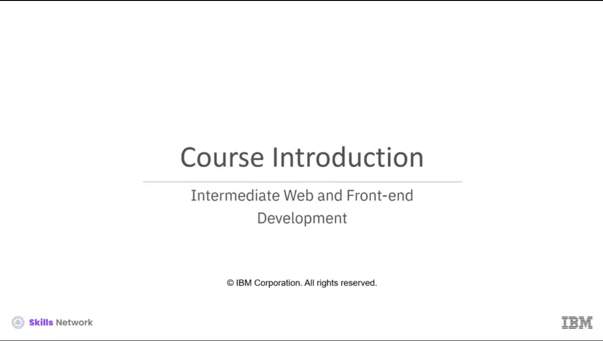
<!--  style="box-shadow: 3px 3px 3px gray;"> -->
<!--  style="drop-shadow: 0 3px 5px rgba(0, 0, 0, 0.4);" -->
<!-- {width="5.0in" height="2.8327996500437447in"}  -->

<h2><a href="#table-of-contents">Table of Contents</a></h2>

## [**Week 1: Content Management Systems (CMS)**](#ch1)
>### 1.01 [**Introduction to Intermediate Web &amp; Front-end Development**](#ch1-01)
>### 1.02 [**Introduction to Content Management Systems (CMS)**](#ch1-02)
>### 1.03 [**Features of Web CMS**](#ch1-03)
>### 1.04 [**Popular CMS Platforms/Tools**](#ch1-04)
>### 1.05 [**Web Development with CMS**](#ch1-05)
>### 1.06 [**Getting Started with WordPress**](#ch1-06)
>### 1.07 [**Adding E-Commerce to your Website**](#ch1-07)

## [**Week 2: Search Engine Optimization (SEO)**](#ch2)
>### 2.08 [**Introduction to Search Engine Optimization (SEO)**](#ch2-08)
>### 2.09 [**Popular SEO Tools**](#ch2-09)
>### 2.10 [**SEO Strategies**](#ch2-10)
>### 2.11 [**Mobile Friendly SEO**](#ch2-11)
>### 2.12 [**Page Optimization for SEO**](#ch2-12)
>### 2.13 [**Running Campaigns and Tracking Results**](#ch2-13)
>### 2.14 [**Do's and Don'ts of Search Engine Optimization**](#ch2-14)

## [**Week 3: WebPack**](#ch3)
>### 3.15 [**Introduction to Web Build and Automated Tools**](#ch3-15)
>### 3.16 [**Introduction to Webpack 5**](#ch3-16)
>### 3.17 [**Essential Concepts of Webpack**](#ch3-17)
>### 3.18 [**Working with Webpack**](#ch3-18)
>### 3.19 [**Setting up Production with Webpack**](#ch3-19)
>### 3.20 [**Using Webpack Tools**](#ch3-20)
>### 3.21 [**Using Webpack with Frontend Frameworks**](#ch3-21)
>### 3.22 [**Webpack Best Practices**](#ch3-22)
>### 3.23 [**HTTPS &amp; SSL Certificates**](#ch3-23)

## [**Week 4: Optimization &amp; Testing**](#ch4)
>### 4.24 [**JavaScript Ootimization**](#ch4-24)
>### 4.25 [**Popular Optimization Tools**](#ch4-25)
>### 4.26 [**Testing Frameworks**](#ch4-26)
>### 4.27 [**Testing Tools – Mocha and Jasmine**](#ch4-27)
>### 4.28 [**Using Jasmine**](#ch4-28)
>### 4.29 [**Front-end Testing Best Practices**](#ch4-29)

## [**Week 5: Debugging &amp; Troubleshooting**](#ch5)
>### 5.30 [**JavaScript Debugging**](#ch5-30)
>### 5.31 [**Basic Debugging Concepts**](#ch5-31)
>### 5.32 [**Introduction to Debugging Tools**](#ch5-32)
>### 5.33 [**Troubleshooting with Chrome DevTools**](#ch5-33)
>### 5.34 [**Monitoring your Website**](#ch5-34)
>### 5.35 [**Popular Monitoring Tools**](#ch5-35)

## [**Week 6: Interest Rate Calculator**](#ch6)
>### 6.36 [**Interest Rate Calculator**](#ch6-36)

  <b><a href="#table-of-contents">↥ Back To Top</a></b>

# WEEK 1

## 01. Course Introduction

https://www.coursera.org/learn/intermediate-web-and-front-end-development/lecture/k0fxN/course-introduction

<!-- # [Week 1:]{.mark} -->

# 01. Introduction to Intermediate Web & Front-End Development

Hello and welcome to this course on Intermediate Web and Front-end
Development. Are you interested in learning how to optimize your website
for search engines? Or do you want to learn how to increase the
visibility of your website? You will need to be familiar with the
various tools and technologies available on the market for this. You
will also need to learn about testing and the tools needed to conduct
tests while staying within your budget. There are numerous options
available to you in this field, but you need to have a solid foundation
in web development fundamentals.

Search engines are constantly changing their algorithms and implementing
modifications for website ranking. You can evaluate and interpret user
experiences using web optimization based on website runtime and load
time.

Learning about automated build tools and bundlers can help you build
your website successfully.

Tools like these broaden your opportunities to focus on better
development. Coding errors may cause your website to crash or lag. To
understand why debugging is such a crucial part of the software
development process, you'll require testing frameworks with automated
testing.

These improve testing speed and efficiency, test accuracy, and reduce
test maintenance costs and risks. Learning the fundamentals presented
here is the first step towards a long and rewarding career as a web
developer.
<!--~~~~~~~~~~~~~~~~~~~~~~~~~~~~~~~~~~~~~~~~~~~~~~~~~~~~~~~~~~~~~~~~~~~~~~~~~~~~~~~~~~~~~~~~~~~~-->

  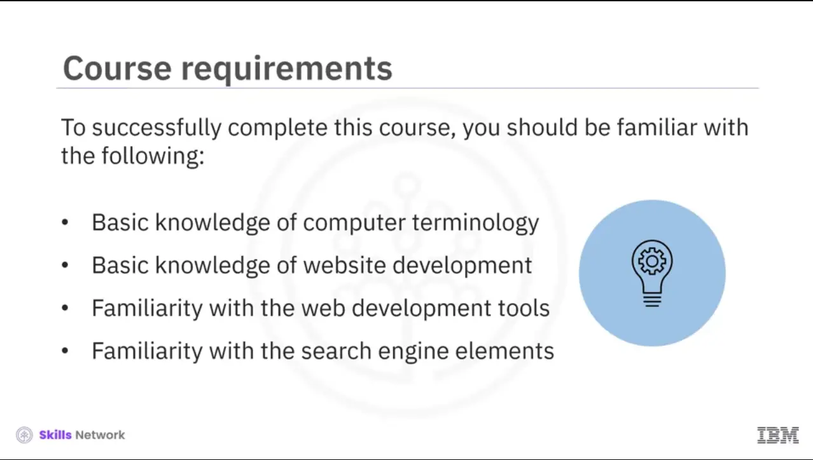

<!-- height="2.8327996500437447in"} -->

To successfully complete this course, you should be familiar with the
following:

-   Basic knowledge of computer terminology,

-   Basic knowledge of website development,

-   Have a familiarity with the web development tools, and

-   Have a familiarity with the search engine elements.

This course is part of a series of IBM courses designed to help you
improve your skills as a front-end developer and understand the
technical aspect of web and front-end application development.

<!--~~~~~~~~~~~~~~~~~~~~~~~~~~~~~~~~~~~~~~~~~~~~~~~~~~~~~~~~~~~~~~~~~~~~~~~~~~~~~~~~~~~~~~~~~~~~-->

  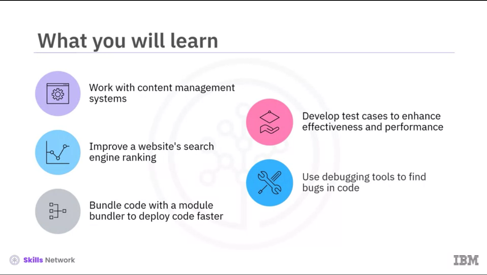

<!-- {width="5.0in" height="2.8327996500437447in"} -->

When you complete this course, you will be able to:

-   Identify how to work with content management systems (CMSs)

-   Identify how to improve a website\'s search engine ranking,

-   Discuss the importance of bundling code with a module bundler to
    deploy code faster,

-   Describe how automated testing frameworks assist in developing test
    cases that enhance a website\'s effectiveness and performance
    (efficacy), and

-   Demonstrate best practices for using debugging tools to find bugs in
    code by increasing visibility, analysis, and testing.

This course is designed specifically for beginners, with guided
instructional videos that walk you through key concepts and essential
need-to-know facts.

It includes interactive activities to reinforce what you\'ve learned in
videos and virtual hands-on labs to help you apply what you\'ve learned
as you go.

The forums connect you with others so you can introduce yourself,
provide feedback, and get support. And the practice assessments help you
assess your knowledge, while the graded assessments prove what you\'ve
learned, leading to a shareable badge and certificate that you can show
prospective employers. We're here to support your success and are
excited you're here. Let's get started!

<!--~~~~~~~~~~~~~~~~~~~~~~~~~~~~~~~~~~~~~~~~~~~~~~~~~~~~~~~~~~~~~~~~~~~~~~~~~~~~~~~~~~~~~~~~~~~~-->
# 02. Introduction to Content Management System (CMS)
<!--~~~~~~~~~~~~~~~~~~~~~~~~~~~~~~~~~~~~~~~~~~~~~~~~~~~~~~~~~~~~~~~~~~~~~~~~~~~~~~~~~~~~~~~~~~~~-->

  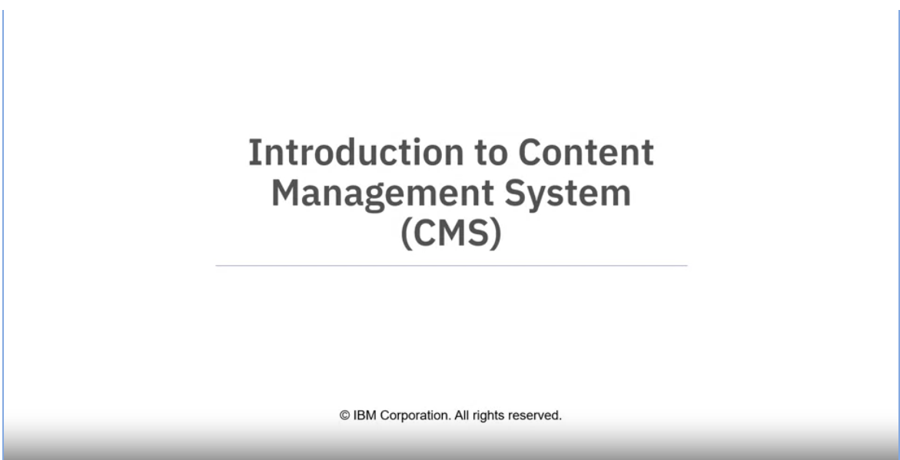

<!-- {width="5.0in" height="2.557691382327209in"} -->

<!-- <https://www.coursera.org/learn/intermediate-web-and-front-end-development/lecture/zjLwk/introduction-to-content-management-system-cms> -->

Welcome to "Introduction to Content Management System (CMS)"

<!--~~~~~~~~~~~~~~~~~~~~~~~~~~~~~~~~~~~~~~~~~~~~~~~~~~~~~~~~~~~~~~~~~~~~~~~~~~~~~~~~~~~~~~~~~~~~-->

  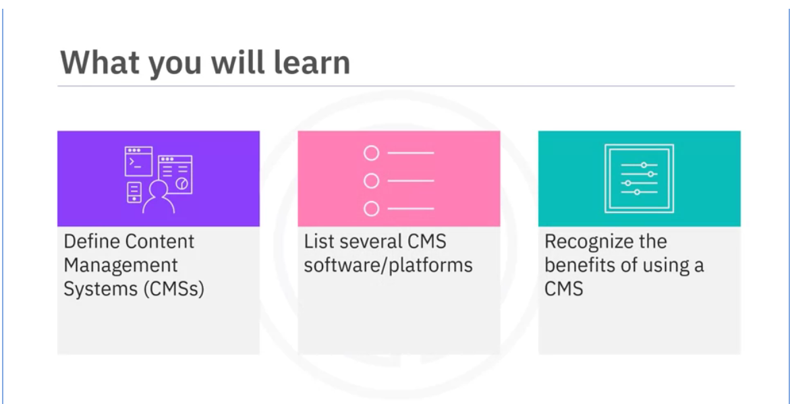

<!-- {width="5.0in" height="2.5576924759405073in"} -->

After reading this module (02), you will be able to:

-   Define Content Management Systems (CMSs),

-   List several CMS software/platforms, and

-   Recognize the benefits of using a CMS.

<!--~~~~~~~~~~~~~~~~~~~~~~~~~~~~~~~~~~~~~~~~~~~~~~~~~~~~~~~~~~~~~~~~~~~~~~~~~~~~~~~~~~~~~~~~~~~~-->

  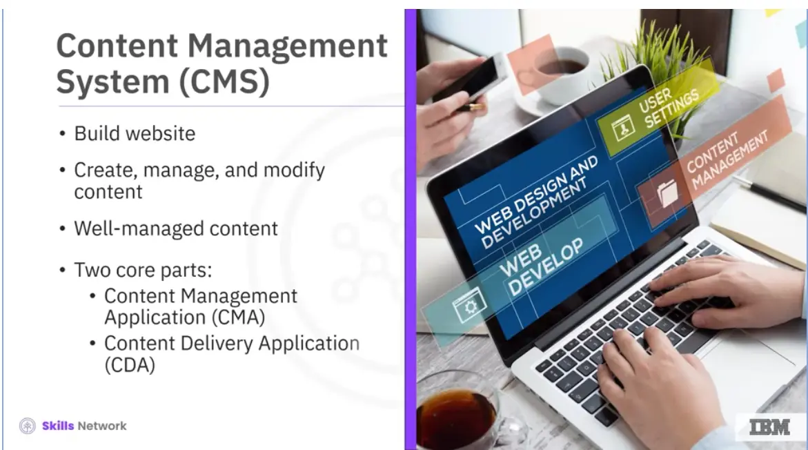

<!-- {width="5.0in" height="2.7841885389326335in"} -->

What is a Content Management System (or CMS)? A CMS is a tool that helps
developers build websites. It is software that allows developers to
create, manage, and modify content on a website without requiring users
to have specialized technical knowledge. CMS is a general term for the
processes involved in developing a large-scale website. Well-managed
content makes a website more useful to visitors and valuable to the
person or organization who owns the website.

A CMS has two core parts: The Content Management Application (CMA) is a
software tool that enables developers to add and manage content on a
website. And the Content Delivery Application (CDA) is the back-end
process that takes the content you put into the CMA, stores it properly,
and makes it visible to website visitors.

<!--~~~~~~~~~~~~~~~~~~~~~~~~~~~~~~~~~~~~~~~~~~~~~~~~~~~~~~~~~~~~~~~~~~~~~~~~~~~~~~~~~~~~~~~~~~~~-->

  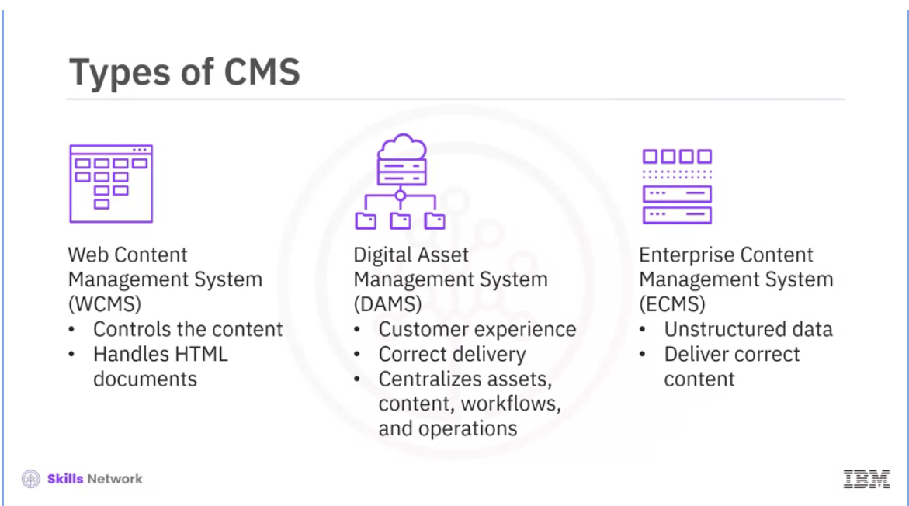

<!-- {width="5.0in" height="2.7841885389326335in"} -->

There are three common types of content management systems. A Web
Content Management System (WCMS) controls the content on many digital
channels. It also manages and handles HTML documents and associated
images. A WCMS enables developers to maintain an extensive collection of
web documents and materials. A Digital Asset Management System (DAMS)
focuses on the customer experience (CX). It enables the correct delivery
of content to the users and centralizes assets, content, workflows, and
operations. And an Enterprise Content Management System (ECMS) collects,
stores, delivers, and manages unstructured data, enables delivery of the
correct content to targeted audiences, and archives files after a set
time.

<!--~~~~~~~~~~~~~~~~~~~~~~~~~~~~~~~~~~~~~~~~~~~~~~~~~~~~~~~~~~~~~~~~~~~~~~~~~~~~~~~~~~~~~~~~~~~~-->

  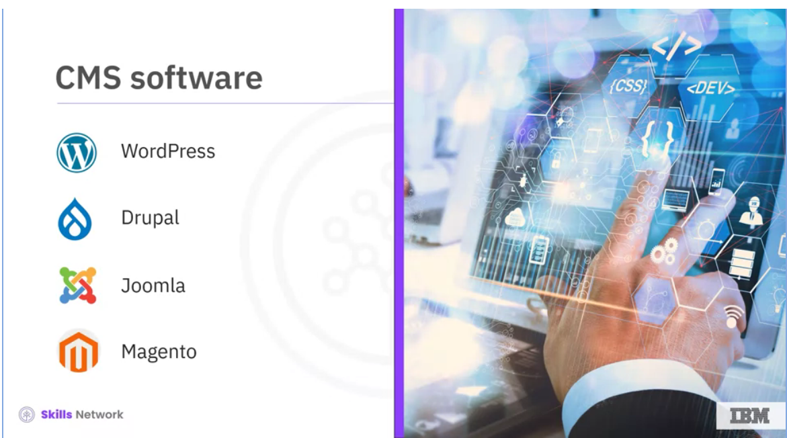
  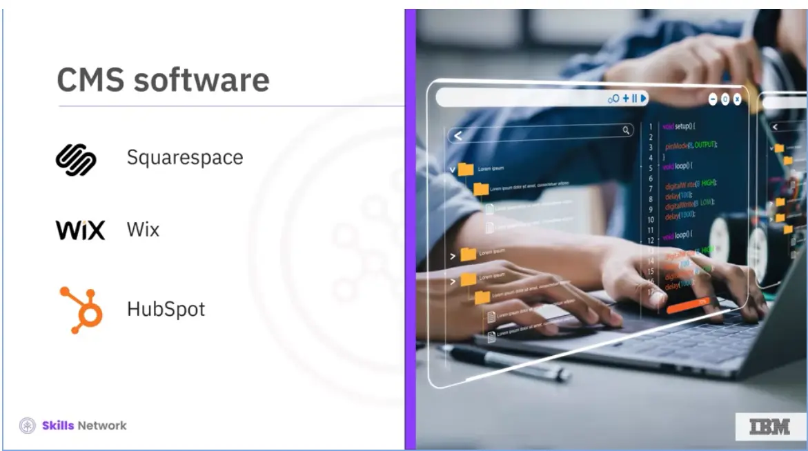

<!-- {width="3.0in" -->
<!-- height="1.6705129046369205in"}{width="3.0in" -->
<!-- height="1.6756408573928259in"} -->

There is both proprietary and open-source CMS software. Some examples
are WordPress, Drupal, Joomla, Magento, Squarespace, Wix, and HubSpot.
Some of these are software you can install on your website host, for
example, Wordpress.org, Drupal, and Joomla. Others are available as
hosted services like WordPress.com, HubSpot, and Wix. Many kinds of CMS
software are available, depending on how developers want to use them.

<!--~~~~~~~~~~~~~~~~~~~~~~~~~~~~~~~~~~~~~~~~~~~~~~~~~~~~~~~~~~~~~~~~~~~~~~~~~~~~~~~~~~~~~~~~~~~~-->

  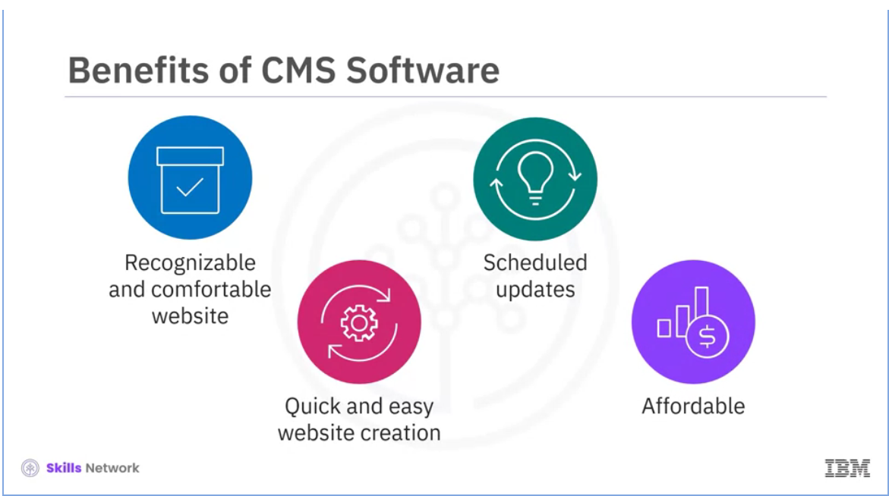

<!-- {width="5.0in" height="2.7927351268591427in"} -->

So why use a CMS? Instead of creating a new web page or designing a new
website, many solutions exist that can function how designers want.

A CMS makes a recognizable and comfortable website and is quick and easy
for developers and organizations to manage. Some people use content
management systems to create content for many reasons, like creating and
managing. Static websites, membership sites, blogs, forums, social
networking sites, e-commerce stores, online courses, and portfolios.

One of the biggest benefits is that users can create websites quickly
and easily because they need little to no programming language
background. Another benefit is scheduled updates. Updates to content and
the website are easy to make. Some CMS software also prepares for
publishing and updates. Affordability is a huge benefit of using CMS
software. Instead of using a large web development team, websites can be
managed by a smaller group or by a person, reducing the website\'s cost.

<!--~~~~~~~~~~~~~~~~~~~~~~~~~~~~~~~~~~~~~~~~~~~~~~~~~~~~~~~~~~~~~~~~~~~~~~~~~~~~~~~~~~~~~~~~~~~~-->

  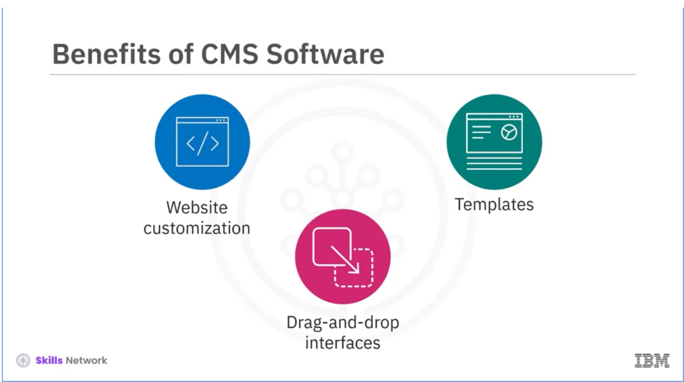

CMS software also provides tools to allow users to customize their
website, regardless of the company size or the user's needs. Many CMSs
include drag-and-drop interfaces and visual editors for building
websites rather than coding them.

CMSs have templates and third-party extensions that make it easy to
customize the website and extend its capabilities.

<!--~~~~~~~~~~~~~~~~~~~~~~~~~~~~~~~~~~~~~~~~~~~~~~~~~~~~~~~~~~~~~~~~~~~~~~~~~~~~~~~~~~~~~~~~~~~~-->

  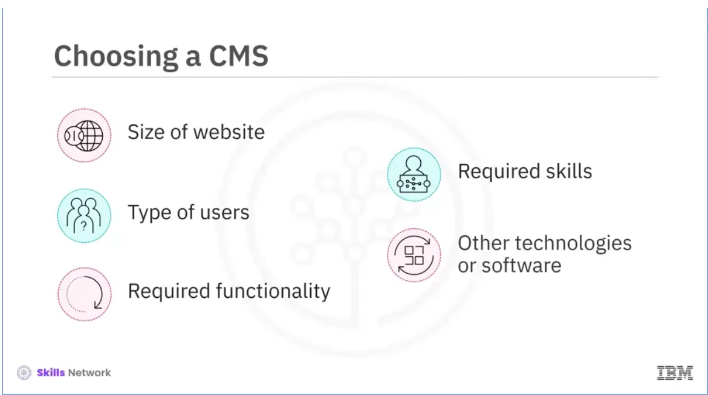

So how do you choose a CMS? In the planning stage of the software
development cycle, you\'ll consider what you need to help you create and
manage a website. You\'ll ask:

-   How big does your website need to be to meet your organization\'s
    needs?

-   Who will be using your website?

-   What functionality do you and your users need to have?

-   What skills do you need to have to develop the website? And,

-   Does your CMS need other technologies or software to work with it?

Once you\'ve answered these questions, you're ready to choose the best
CMS for you and your website!

<!--~~~~~~~~~~~~~~~~~~~~~~~~~~~~~~~~~~~~~~~~~~~~~~~~~~~~~~~~~~~~~~~~~~~~~~~~~~~~~~~~~~~~~~~~~~~~-->

  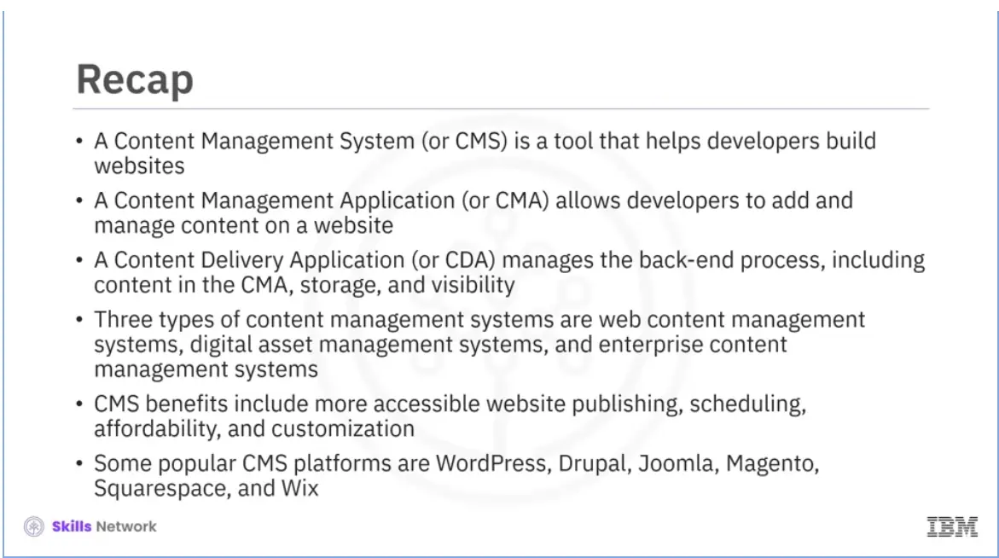

In this module (02), you learned that:

-   A Content Management System (or CMS) is a tool that helps developers
    build websites,

-   A Content Management Application (or CMA) allows developers to add
    and manage content on a website,

-   A Content Delivery Application (or CDA) manages the back-end
    process, including content in the CMA, storage, and visibility,

-   Three types of content management systems are;

  1.  Web content management systems,

  2.  Digital asset management systems, and

  3.  Enterprise content management systems.

-   CMS benefits include more accessible website publishing, scheduling,
    affordability, and customization,

-   Some popular CMS platforms are WordPress, Drupal, Joomla, Magento,
    Squarespace, and Wix.

# 03. Features of Web CMS

<!-- <https://www.coursera.org/learn/intermediate-web-and-front-end-development/lecture/BWeid/features-of-web-cms> -->

<!--~~~~~~~~~~~~~~~~~~~~~~~~~~~~~~~~~~~~~~~~~~~~~~~~~~~~~~~~~~~~~~~~~~~~~~~~~~~~~~~~~~~~~~~~~~~~-->

  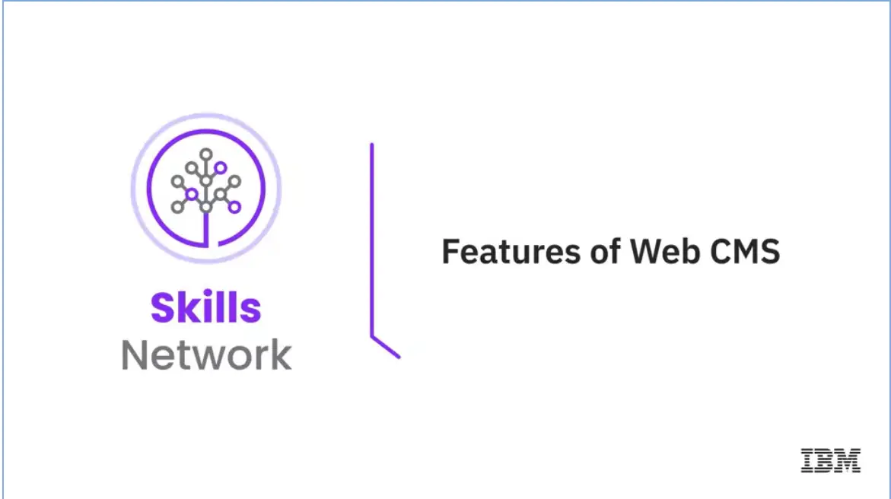

Welcome to "Features of Web CMS."

<!--~~~~~~~~~~~~~~~~~~~~~~~~~~~~~~~~~~~~~~~~~~~~~~~~~~~~~~~~~~~~~~~~~~~~~~~~~~~~~~~~~~~~~~~~~~~~-->

  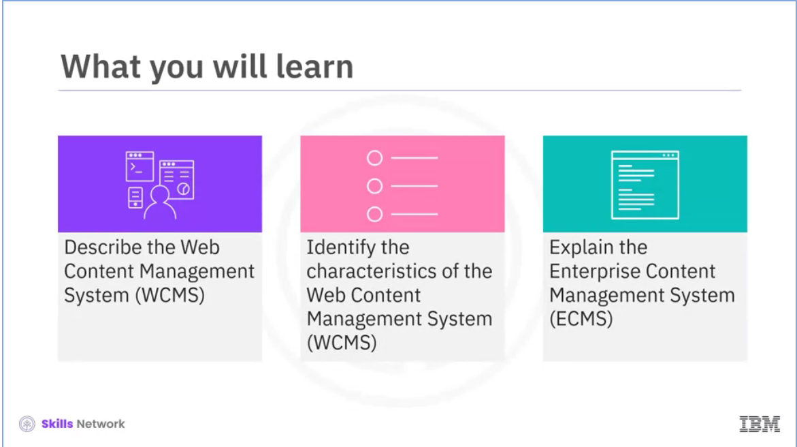

After reading this module (03), you will be able to:

-   Describe a Web Content Management System (WCMS) and its types,

-   Identify the characteristics of the Web Content Management System,
    and

-   Explain Enterprise Content Management System (ECMS).

In today's digital world, an organization must manage and update its
official website regularly. An organization needs to enable technical
and non-technical end users to create and manage the content on its
website.

<!--~~~~~~~~~~~~~~~~~~~~~~~~~~~~~~~~~~~~~~~~~~~~~~~~~~~~~~~~~~~~~~~~~~~~~~~~~~~~~~~~~~~~~~~~~~~~-->

  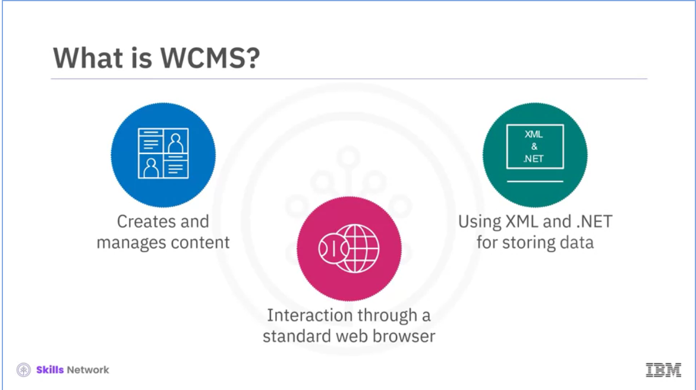

This is made possible by Web Content Management System (WCMS). It is a
program that helps users create, manage, modify, and publish content on
a web page. A user interacts with a Web Content Management System
through a standard web browser. Users store the content in a database
using programming languages like XML and .Net.

<!--~~~~~~~~~~~~~~~~~~~~~~~~~~~~~~~~~~~~~~~~~~~~~~~~~~~~~~~~~~~~~~~~~~~~~~~~~~~~~~~~~~~~~~~~~~~~-->

  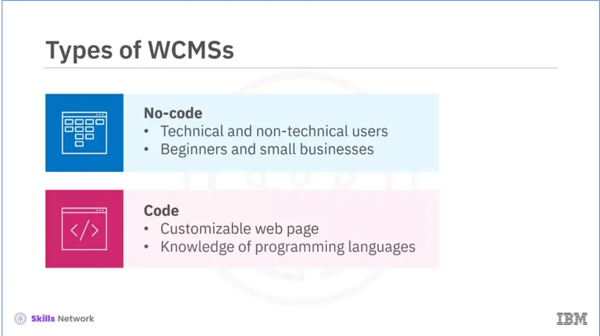

Let's discuss the two kinds of WCMSs: no-code and code. You can choose
between the two based on your requirements, technical skills, and the
time needed to create a web page. Technical and non-technical users
adopt the no-code approach to develop a web page using a graphical user
interface. Note that users do not have to write code for the
development.

The no-code approach allows the user to review the page before it is
published. No-code is easier, quicker, cheaper, and ideal for beginners
and small businesses.

The other type of development, code, enables a user to create a fully
customizable web page with unique features. In this case, the user needs
basic knowledge of programming languages, such as HTML, CSS, and PHP, to
create, customize, and host web pages. We will now talk about the
essential characteristics of WCMS.

<!--~~~~~~~~~~~~~~~~~~~~~~~~~~~~~~~~~~~~~~~~~~~~~~~~~~~~~~~~~~~~~~~~~~~~~~~~~~~~~~~~~~~~~~~~~~~~-->

  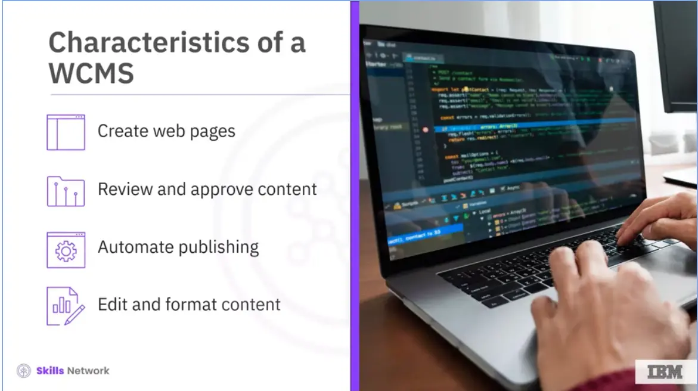
  

A WCMS enables a user to accomplish specific tasks. Some of these
include:

-   Creating web pages quickly with pre-set page layouts and content
    blocks.

-   Reviewing and approving the content before

-   it is published. Automating the publishing process.

-   Editing and formatting the content using simple drag-and-drop tools.

-   Collaborating with different users to create and modify the content,
    and

-   Scaling and implementing change to multiple domains easily and
    quickly.

<!--~~~~~~~~~~~~~~~~~~~~~~~~~~~~~~~~~~~~~~~~~~~~~~~~~~~~~~~~~~~~~~~~~~~~~~~~~~~~~~~~~~~~~~~~~~~~-->

  
  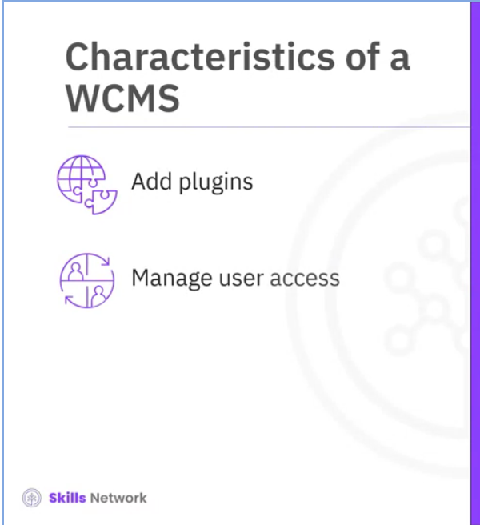

Here are the additional tasks that a WCMS enables a user to accomplish:

-   Managing the life cycle of a document, including creation,
    revisions, publication, archive, and removal.

-   Translating and publishing content in different languages easily.

-   Saving and retrieving different versions of a web page.

-   Updating a web page as per the latest web standards quickly.

-   Adding plugins to enhance the functionality of a web page, and

-   Managing user access to a particular page on a website.

<!--~~~~~~~~~~~~~~~~~~~~~~~~~~~~~~~~~~~~~~~~~~~~~~~~~~~~~~~~~~~~~~~~~~~~~~~~~~~~~~~~~~~~~~~~~~~~-->

  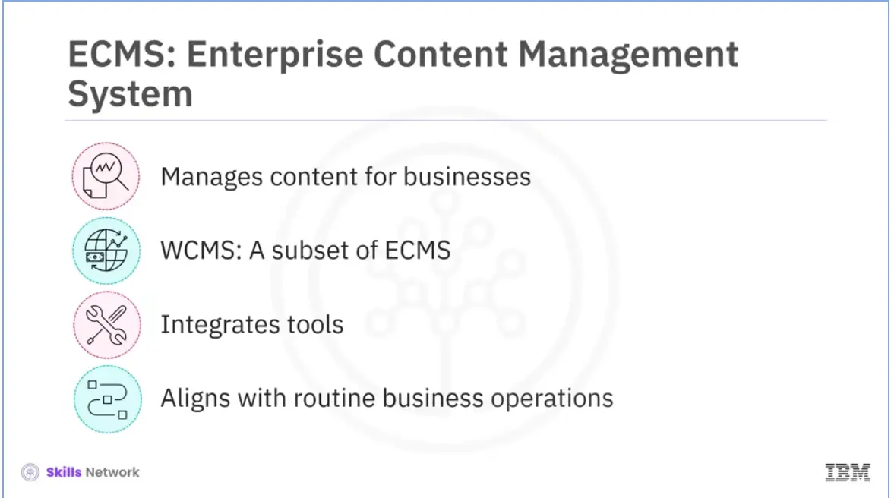

Enterprise Content Management System (ECM) allows businesses to manage
content throughout their lifecycle intelligently. A Web Content
Management System is a subset of an Enterprise Content Management
System. It primarily focuses on web content. An Enterprise Content
Management System integrates software tools with an organization's
strategy and aligns with its routine business operations.

<!--~~~~~~~~~~~~~~~~~~~~~~~~~~~~~~~~~~~~~~~~~~~~~~~~~~~~~~~~~~~~~~~~~~~~~~~~~~~~~~~~~~~~~~~~~~~~-->

  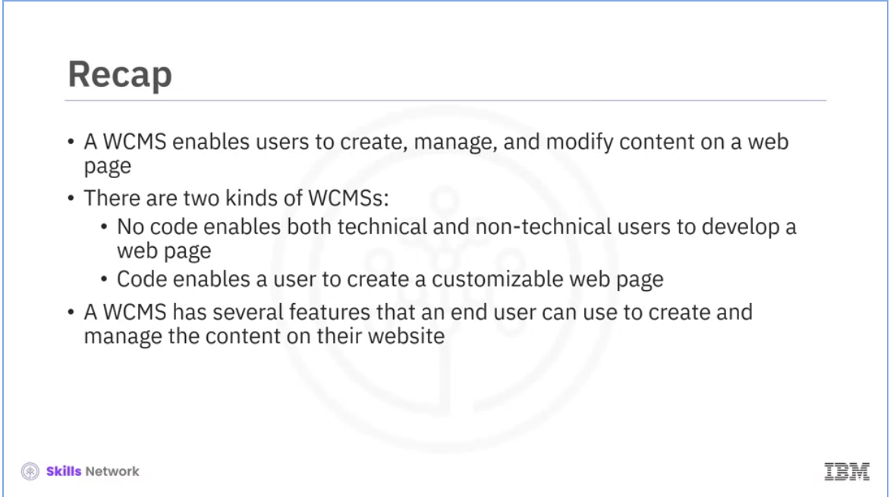

In this module (03), you learned that:

-   A WCMS enables users to create, manage, and modify content on a web
    page,

-   There are two kinds of WCMSs:

    -   No code enables both technical and non-technical users to
        develop a website, and

    -   Code enables a user to create customizable web pages.

-   A WCMS has several features that an end user can use to create and
    manage the content on their website.

# 04. Popular CMS Platforms/Tools

<!--~~~~~~~~~~~~~~~~~~~~~~~~~~~~~~~~~~~~~~~~~~~~~~~~~~~~~~~~~~~~~~~~~~~~~~~~~~~~~~~~~~~~~~~~~~~~-->

  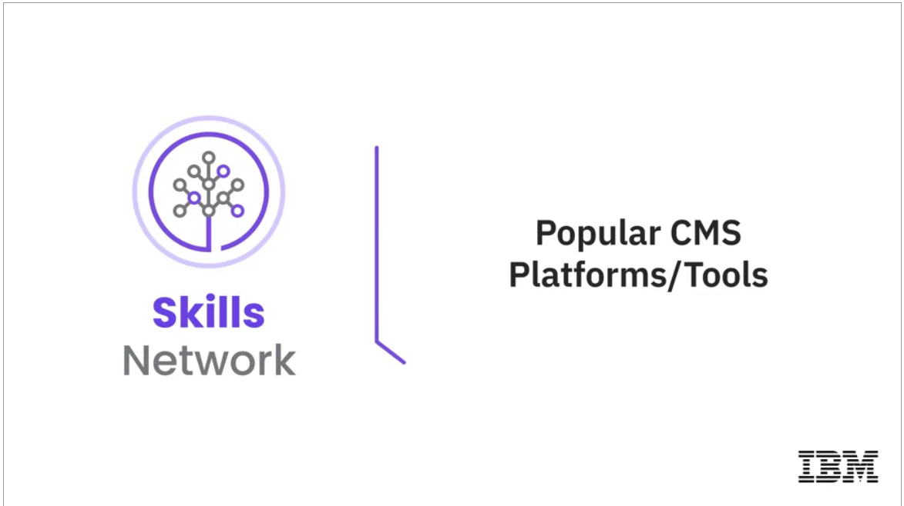

Welcome to "Popular CMS platforms/tools."

<!--~~~~~~~~~~~~~~~~~~~~~~~~~~~~~~~~~~~~~~~~~~~~~~~~~~~~~~~~~~~~~~~~~~~~~~~~~~~~~~~~~~~~~~~~~~~~-->

  

After reading this module (04), you will be able to:

-   Explain Headless Content Management System (CMS), and

-   Identify popular CMS platforms and tools.

<!--~~~~~~~~~~~~~~~~~~~~~~~~~~~~~~~~~~~~~~~~~~~~~~~~~~~~~~~~~~~~~~~~~~~~~~~~~~~~~~~~~~~~~~~~~~~~-->

  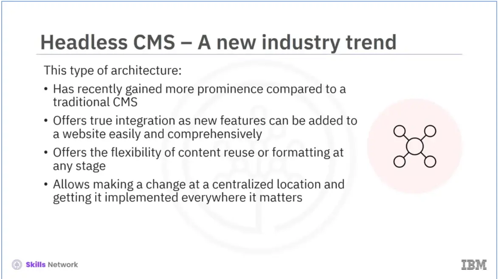

Headless content management systems (CMSs) have gained popularity
recently and are set to replace traditional CMSs. A conventional CMS
needs more flexibility for content reuse or formatting. Once published,
a content asset is in its final state and can be neither reused nor
formatted. If a user wants to customize a traditional CMS, the best they
can do is add a plugin, which is more like a Band-Aid. On the other
hand, a "headless" CMS offers true integration as new functionalities or
features can be added to a website easily and comprehensively. Today, we
live in a world that is Omni channel. Unlike in the past, users now
consume data on different channels. Hence, from an organizational
perspective, the content developed for the organization's website must
also be uploaded on other channels such as apps or newsletters. Any
change made at a centralized location is implemented everywhere where it
matters. This is the power that a headless CMS has.

<!--~~~~~~~~~~~~~~~~~~~~~~~~~~~~~~~~~~~~~~~~~~~~~~~~~~~~~~~~~~~~~~~~~~~~~~~~~~~~~~~~~~~~~~~~~~~~-->

  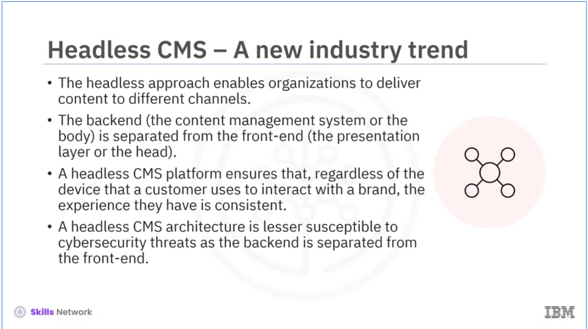

The headless approach enables organizations to deliver content to
different channels, such as mobile applications or JavaScript
applications running on a browser, email blasts, and social media
campaigns. In this type of architecture, the backend, the CMS, or the
body, is separated from the front end, the presentation layer, or the
head. Therefore, it is called a headless CMS. A headless CMS platform
ensures that, regardless of the device a customer uses to interact with
a brand, their experience is consistent. A headless CMS architecture is
less susceptible to cyber security threats as the back end is separated
from the front end.

<!--~~~~~~~~~~~~~~~~~~~~~~~~~~~~~~~~~~~~~~~~~~~~~~~~~~~~~~~~~~~~~~~~~~~~~~~~~~~~~~~~~~~~~~~~~~~~-->

  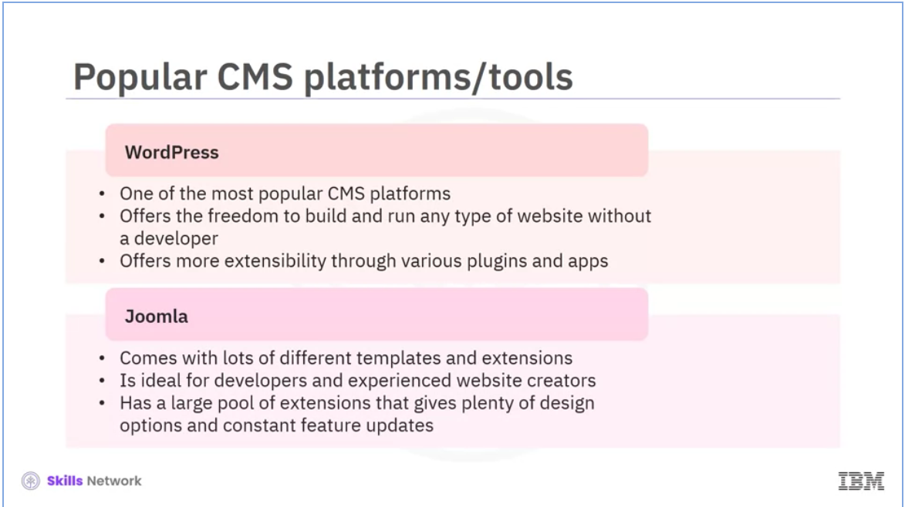

WordPress is one of the most popular CMS platforms. It accounts for more
than 60% of the CMS market. It offers the flexibility and freedom to
build and run any type of website without a developer. It has a hugely
supportive community and offers more extensibility through different
plugins and apps. It supports SEO, and you can control how to earn
online from the website you own.

Another popular CMS is Joomla, which comes with many different templates
and extensions. Joomla is ideal for developers and experienced website
creators. It has a large pool of extensions that gives plenty of design
options and constant feature updates.

<!--~~~~~~~~~~~~~~~~~~~~~~~~~~~~~~~~~~~~~~~~~~~~~~~~~~~~~~~~~~~~~~~~~~~~~~~~~~~~~~~~~~~~~~~~~~~~-->

  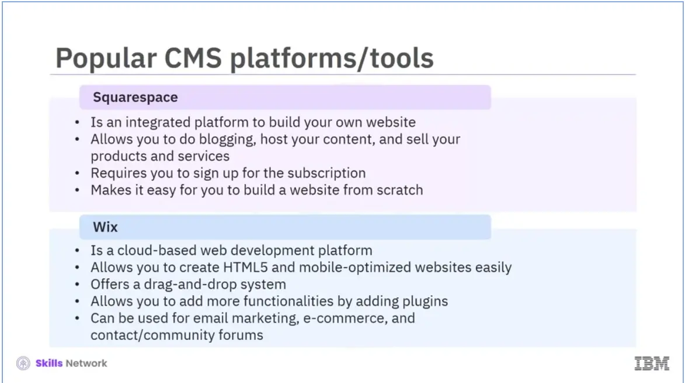

The next popular CMS that we are going to discuss is Squarespace. It's
an integrated platform where you can build your website and blog, host
content, and sell your products and services. You need to sign up for
the subscription, and Squarespace will make it easy for you to build a
website from scratch, which is handy if you don't have web development
experience or need to get a website up and running in a short time.

We will now explore another functional CMS, which is Wix. It is a
cloud-based web development platform that lets you create HTML5 and
mobile-optimized websites easily. The platform offers a drag-and-drop
system and you can add more functionalities by adding plugins. One can
use Wix for various purposes, such as email marketing, e-commerce,
contact forms, and community forums. You can choose from different plans
based on your requirement.

<!--~~~~~~~~~~~~~~~~~~~~~~~~~~~~~~~~~~~~~~~~~~~~~~~~~~~~~~~~~~~~~~~~~~~~~~~~~~~~~~~~~~~~~~~~~~~~-->

  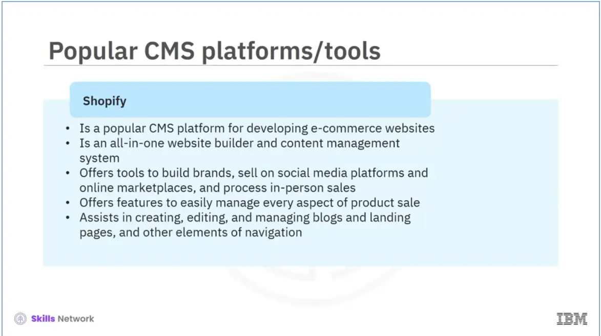

Shopify is a popular CMS platform for developing e-commerce websites.
It's an all-in-one website builder and content management system with
built-in payment processing for selling online. The software offers
tools to build a brand, sell on social media platforms and online
marketplaces, and process in-person sales with Shopify POS. Shopify
makes it easy for you to manage every aspect of product sales. You can
set variants, allow inventory tracking, adjust pricing, add weights,
change the order of your products, and do more. You can create, edit,
and manage blogs, landing pages, and other navigation elements besides
managing products.

<!--~~~~~~~~~~~~~~~~~~~~~~~~~~~~~~~~~~~~~~~~~~~~~~~~~~~~~~~~~~~~~~~~~~~~~~~~~~~~~~~~~~~~~~~~~~~~-->
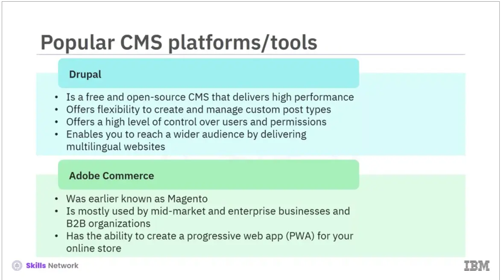{width="5.0in"
height="2.8050218722659666in"}

Drupal is a free and open-source CMS. It's not as popular as WordPress
and Joomla in terms of market share but is impressive in delivering
higher performance. It offers the flexibility to create and manage
custom post types. You'll also benefit from the high level of control
that it offers users and permissions. Drupal also can deliver
multilingual websites right out of the box, enabling your business to
reach a wider audience.

Adobe Commerce, earlier known as Magento, targets companies that want to
take their customers' online shopping experience to the next level. This
software is not meant for beginners. It's mostly used mainly by
mid-market and enterprise businesses and B2B organizations that need
complete customization at a scale. Another highlight of this software is
its ability to create a progressive web app (PWA) for your online store.

<!--~~~~~~~~~~~~~~~~~~~~~~~~~~~~~~~~~~~~~~~~~~~~~~~~~~~~~~~~~~~~~~~~~~~~~~~~~~~~~~~~~~~~~~~~~~~~-->
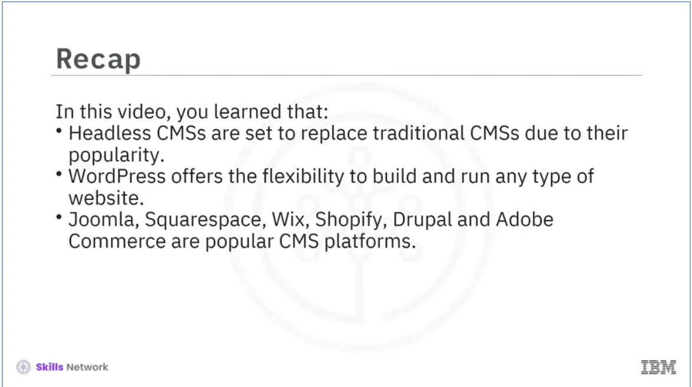{width="5.0in"
height="2.8050218722659666in"}

In this section (04), you learned that:

-   Headless CMSs have become increasingly popular and are set to
    replace traditional CMSs,

-   WordPress offers the flexibility to build and run any type website,
    and

-   Joomla, Squarespace, Wix, Shopify, Drupal, and Adobe Commerce are
    all popular CMS platforms.

# 05a. Web Development with CMS - Part 1

<!--~~~~~~~~~~~~~~~~~~~~~~~~~~~~~~~~~~~~~~~~~~~~~~~~~~~~~~~~~~~~~~~~~~~~~~~~~~~~~~~~~~~~~~~~~~~~-->
{width="5.0in"
height="2.813033683289589in"}

Welcome to "Web development with CMS - Part 1."

<!--~~~~~~~~~~~~~~~~~~~~~~~~~~~~~~~~~~~~~~~~~~~~~~~~~~~~~~~~~~~~~~~~~~~~~~~~~~~~~~~~~~~~~~~~~~~~-->
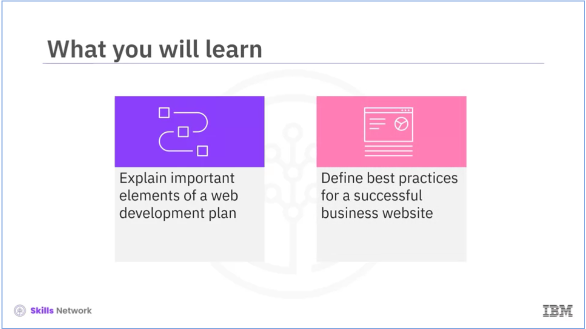{width="5.0in"
height="2.813034776902887in"}

After reading this module (05a), you will be able to:

-   Explain important elements of a web development plan, and

-   Define best practices for a successful business website.

<!--~~~~~~~~~~~~~~~~~~~~~~~~~~~~~~~~~~~~~~~~~~~~~~~~~~~~~~~~~~~~~~~~~~~~~~~~~~~~~~~~~~~~~~~~~~~~-->
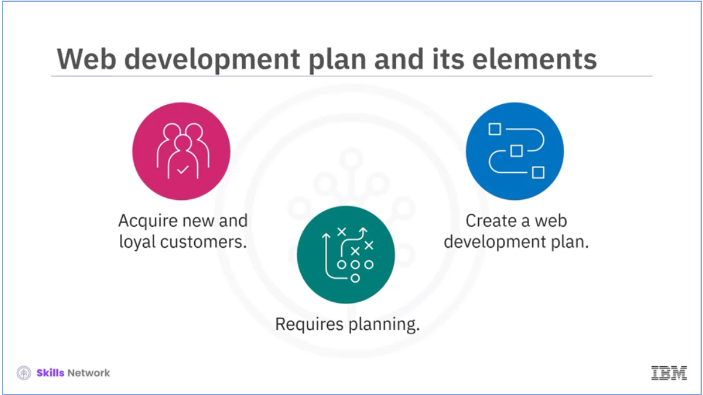{width="5.0in"
height="2.813033683289589in"}

In today's competitive world, a website is essential for a business
owner to acquire new and loyal customers. However, before the website
launch, planning is necessary. A lot is done before the actual coding
for the website starts. A web development plan needs to be in place.

<!--~~~~~~~~~~~~~~~~~~~~~~~~~~~~~~~~~~~~~~~~~~~~~~~~~~~~~~~~~~~~~~~~~~~~~~~~~~~~~~~~~~~~~~~~~~~~-->
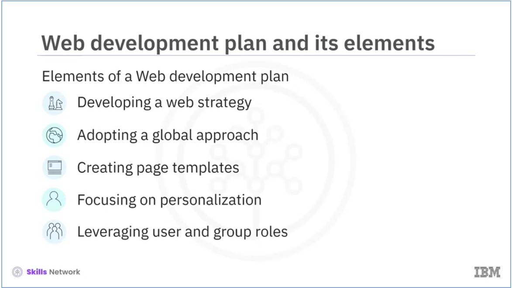{width="5.0in"
height="2.813033683289589in"}

Let's discuss the five important elements of this plan.

These include:

-   Developing a web strategy,

-   Adopting a global approach,

-   Creating page templates,

-   Focusing on personalization,

-   Leveraging user and group roles.

<!--~~~~~~~~~~~~~~~~~~~~~~~~~~~~~~~~~~~~~~~~~~~~~~~~~~~~~~~~~~~~~~~~~~~~~~~~~~~~~~~~~~~~~~~~~~~~-->
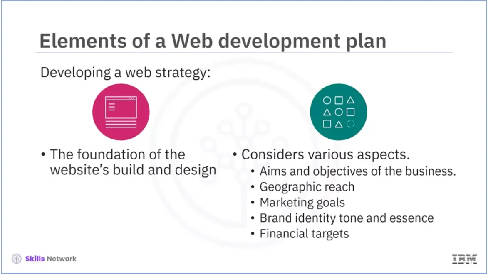{width="5.0in"
height="2.813033683289589in"}

Let's discuss each of them in detail.

An important element of a web development plan is developing a web
strategy. A web strategy lays the foundation for a website's build and
design. It's a comprehensive plan that takes into account various
aspects.

Some of these include:

-   Aims and objectives of the business,

-   Geographic reach,

-   Marketing goals,

-   Brand identity tone and essence, and

-   Financial targets.

Having a web strategy ensures that:

Your web design is in line with your web goals, and yhe website that the
designers and developers create functions as per your business goals.

<!--~~~~~~~~~~~~~~~~~~~~~~~~~~~~~~~~~~~~~~~~~~~~~~~~~~~~~~~~~~~~~~~~~~~~~~~~~~~~~~~~~~~~~~~~~~~~-->
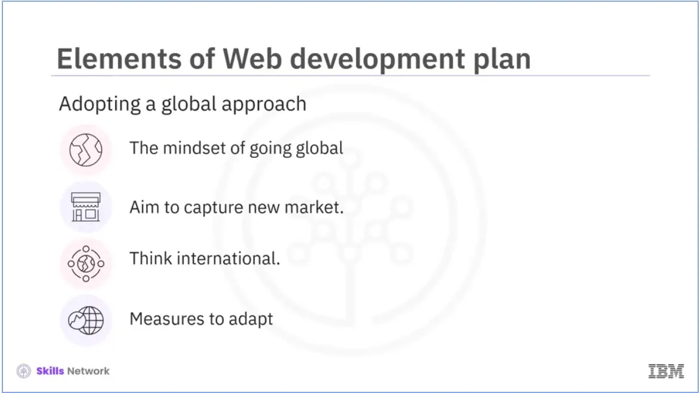{width="5.0in"
height="2.813033683289589in"}

Adopting a global approach is the next important element of a web
development plan. In the 21st century, the growth of the internet has
created a mindset of "going global." Businesses, regardless of their
size, are aiming to capture new markets. As a result, developers have to
ensure their websites are valuable and accessible to a wide and diverse
range of international customers. They need to adopt a global
modular approach. Measures need to be put in place at the outset so that
adaptation later is as easy as possible. You will not have to edit every
page if your website needs an update.

<!--~~~~~~~~~~~~~~~~~~~~~~~~~~~~~~~~~~~~~~~~~~~~~~~~~~~~~~~~~~~~~~~~~~~~~~~~~~~~~~~~~~~~~~~~~~~~-->
{width="5.0in"
height="2.813033683289589in"}

The other important element of a web development plan is the creation of
page templates. A website template is a pre-defined layout that enables
a developer to arrange a website's content to make it appealing to
users. If you plan to develop a website using a template, you don't need
coding experience. You need to select a template based on the nature and
purpose of your website. You can customize the template according to
your business's goals. This will help you save time, money, and effort.
A website developed using a template can be updated easily and
regularly.

<!--~~~~~~~~~~~~~~~~~~~~~~~~~~~~~~~~~~~~~~~~~~~~~~~~~~~~~~~~~~~~~~~~~~~~~~~~~~~~~~~~~~~~~~~~~~~~-->
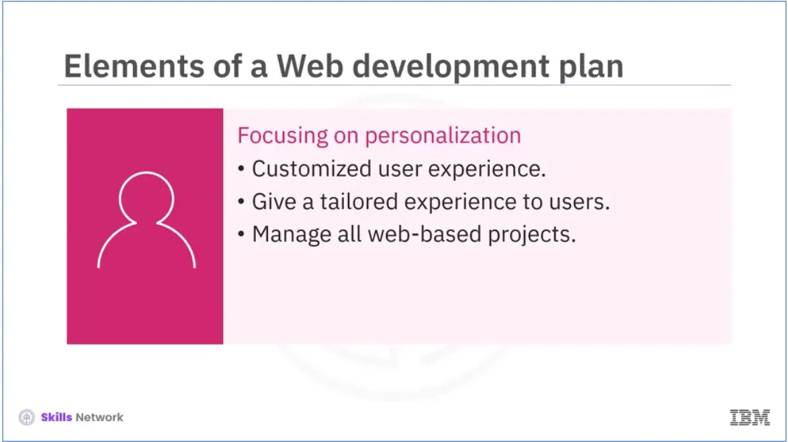{width="5.0in"
height="2.813033683289589in"}

Today, every visitor to a website expects a customized user experience.
This is why focusing on personalization is an important element of a web
development plan. With customization, you can target your audience and
give them a tailored experience across all platforms. Additionally, you
can manage all web-based projects online, regardless of where you deploy
them, and give autonomy to marketing. As an API works seamlessly across
all channels, personalized information appears for each visitor,
regardless of how they access the website or what device they use. By
providing content tailored to each visitor's taste, content
recommendations personalize every visitor's digital experience.

<!--~~~~~~~~~~~~~~~~~~~~~~~~~~~~~~~~~~~~~~~~~~~~~~~~~~~~~~~~~~~~~~~~~~~~~~~~~~~~~~~~~~~~~~~~~~~~-->
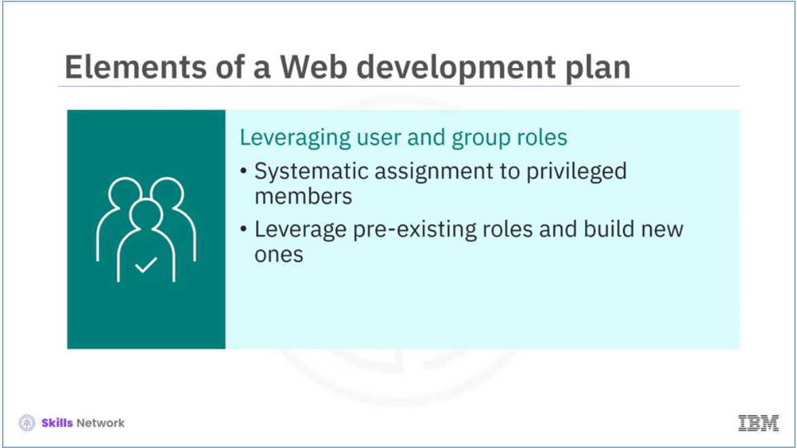{width="5.0in"
height="2.813033683289589in"}

The last element of a web development plan that we are going to be
discussing is leveraging user and group roles. Member roles are
systematic assignments of privileges to members. These include general
rights for groups, system preferences, content, analysis tools, and
sharing. A group with more rights than the general group is given
administrative privileges. Administrators can leverage pre-existing
roles and build new ones to suit their user base.

<!--~~~~~~~~~~~~~~~~~~~~~~~~~~~~~~~~~~~~~~~~~~~~~~~~~~~~~~~~~~~~~~~~~~~~~~~~~~~~~~~~~~~~~~~~~~~~-->
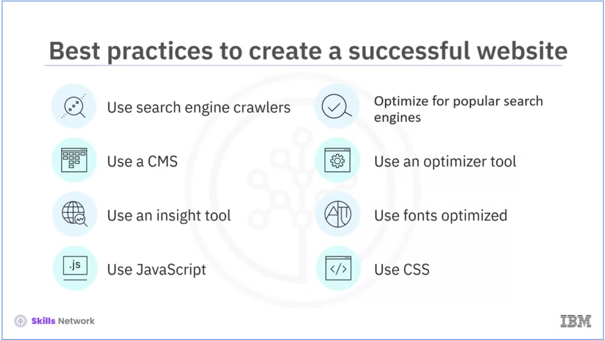{width="5.0in"
height="2.813033683289589in"}

Now, we will explore some best practices for creating a successful
business website. Ensure that your website makes the best use of search
engine crawlers. Ensure Google and other popular search engines can
easily find your website. Use a CMS to manage your website\'s content.
Use an optimizer tool or an image optimization service to optimize
images for SEO. Use an insights tool or an online speed testing service
to optimize text for SEO. Use fonts optimized for website readability
rather than typefaces that might be too small or too big for some
devices or browsers. Use JavaScript to enhance your website's
functionality. Use CSS to style the graphics and text on your website.

<!--~~~~~~~~~~~~~~~~~~~~~~~~~~~~~~~~~~~~~~~~~~~~~~~~~~~~~~~~~~~~~~~~~~~~~~~~~~~~~~~~~~~~~~~~~~~~-->
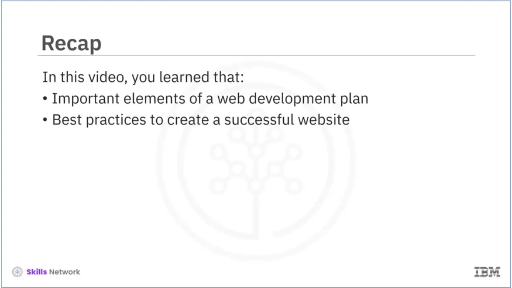{width="5.0in"
height="2.813033683289589in"}

In this module (05a), you learned about:

-   The important elements of a web development plan, and

-   Best practices to create a successful website.

# 05b. Web Development with CMS - Part 2

<!--~~~~~~~~~~~~~~~~~~~~~~~~~~~~~~~~~~~~~~~~~~~~~~~~~~~~~~~~~~~~~~~~~~~~~~~~~~~~~~~~~~~~~~~~~~~~-->
{width="5.0in"
height="2.813033683289589in"}

Welcome to "Web development with CMS -- Part 2."

<!--~~~~~~~~~~~~~~~~~~~~~~~~~~~~~~~~~~~~~~~~~~~~~~~~~~~~~~~~~~~~~~~~~~~~~~~~~~~~~~~~~~~~~~~~~~~~-->
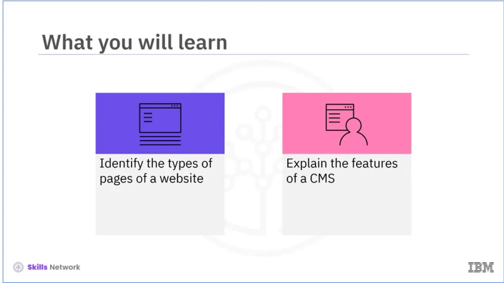{width="5.0in"
height="2.813033683289589in"}

After reading this module (05b), you will be able to:

-   Identify the types of pages of a website, and

-   Explain the features of a CMS.

<!--~~~~~~~~~~~~~~~~~~~~~~~~~~~~~~~~~~~~~~~~~~~~~~~~~~~~~~~~~~~~~~~~~~~~~~~~~~~~~~~~~~~~~~~~~~~~-->
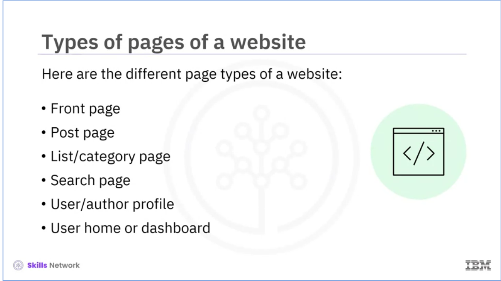{width="5.0in"
height="2.813033683289589in"}

Each page of a website plays a vital role in its functioning. For users
to easily navigate and access content, it is crucial that each page
functions effectively and meets the user's needs. In this video, we will
explore different types of pages of a website developed using a CMS.
These include:

-   Front page,

-   Post page,

-   List or category page,

-   Search page,

-   User or author profile, and

-   User home or dashboard.

<!--~~~~~~~~~~~~~~~~~~~~~~~~~~~~~~~~~~~~~~~~~~~~~~~~~~~~~~~~~~~~~~~~~~~~~~~~~~~~~~~~~~~~~~~~~~~~-->
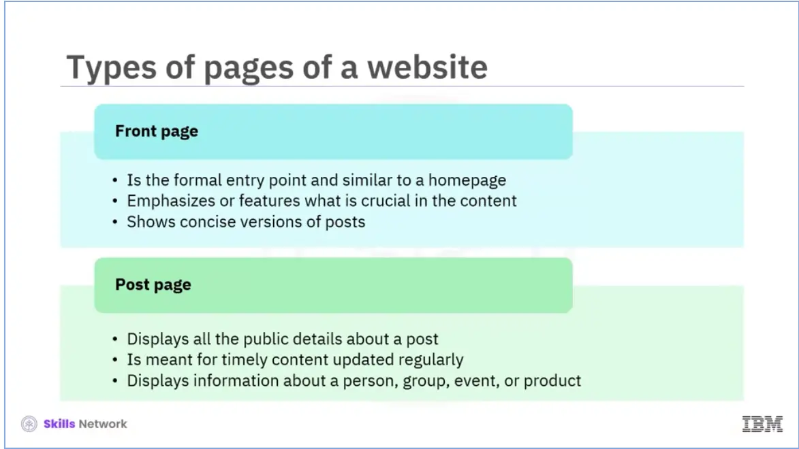{width="5.0in"
height="2.813033683289589in"}

Let's discuss each page in detail. The first type of page that we are
going to talk about is the front page. This page is the formal entry
point and is like a homepage. It helps highlight what is crucial,
especially when there is a vast amount of content to access. It
typically shows concise versions of posts.

The next type of page is the posting page. A "post" is the central
component of a CMS-driven application. The posting page displays all of
the public information about a post. The purpose of this type of page is
to display timely and regularly updated content. It could be an
informational page about a person, group, event, product, and so on.

<!--~~~~~~~~~~~~~~~~~~~~~~~~~~~~~~~~~~~~~~~~~~~~~~~~~~~~~~~~~~~~~~~~~~~~~~~~~~~~~~~~~~~~~~~~~~~~-->
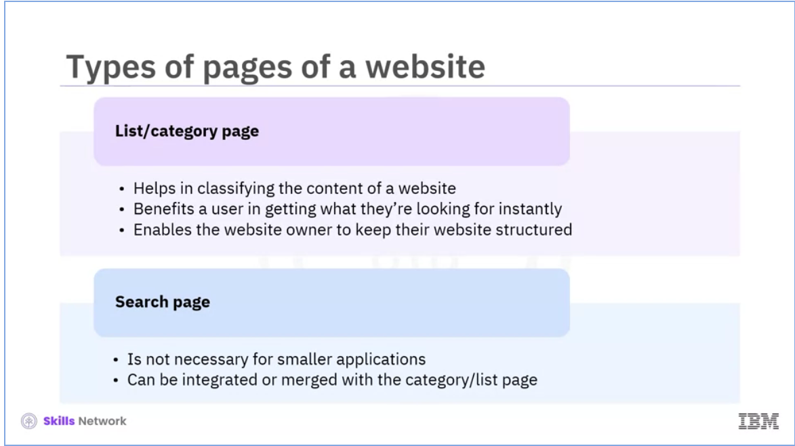{width="5.0in"
height="2.813033683289589in"}

Now, we will talk about the list or category page. Well-organized
website content improves user experience. A developer, therefore, needs
to use lists and categories effectively. A category helps classify your
content, create a logical structure for your website, and enhance the
users\' reading experience. Users can browse through posts on a list or
category page and filter them according to categories, attributes, or
other criteria. A "sort" option is often available on this page when
there is a significant volume of content to scroll through. A category
page benefits a user in getting what they're looking for instantly and
enables the website owner to keep their website structured.

Another type of page of a website is the search page. A dedicated search
page is unnecessary for smaller applications but can be beneficial. It
can be integrated or merged with the list or category page.

<!--~~~~~~~~~~~~~~~~~~~~~~~~~~~~~~~~~~~~~~~~~~~~~~~~~~~~~~~~~~~~~~~~~~~~~~~~~~~~~~~~~~~~~~~~~~~~-->
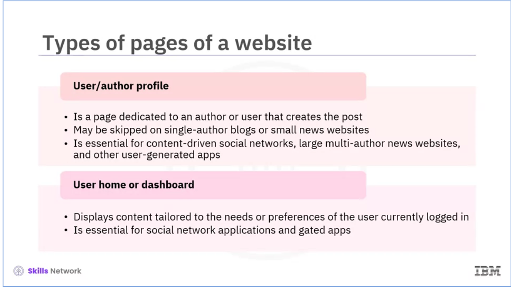{width="5.0in"
height="2.813033683289589in"}

The next type of page is the user or author profile. Any author or user
that creates one or multiple posts has a dedicated page. Blogs with a
single author and small news sites occasionally skip this page. However,
this page is essential for content-driven social networks, sizeable
multi-author news websites, and other user-generated apps. Listing all
the user's posts on this page is a customary and practical practice.

The last type of page we will explore in this session is the user's home
or dashboard. This page displays content tailored to the needs or
preferences of the user currently logged in, such as status updates,
personal newsfeeds, recent activities, and recommended content. A
dashboard is essential for social networks and gated applications but
optional or irrelevant for others.

<!--~~~~~~~~~~~~~~~~~~~~~~~~~~~~~~~~~~~~~~~~~~~~~~~~~~~~~~~~~~~~~~~~~~~~~~~~~~~~~~~~~~~~~~~~~~~~-->
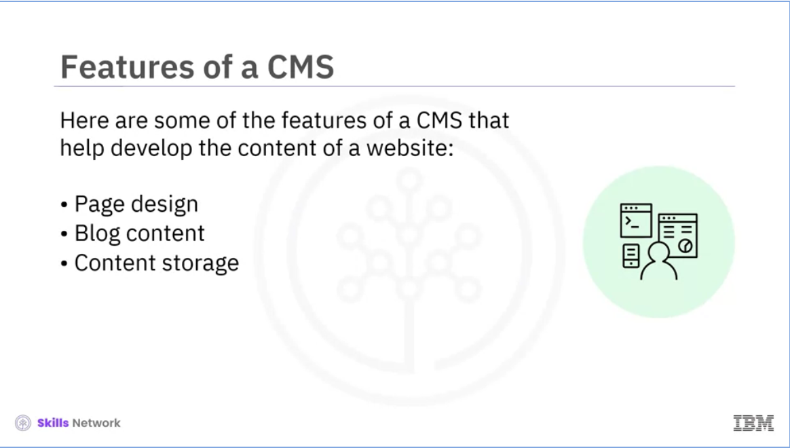{width="5.0in"
height="2.834935476815398in"}

Now, we are going to discuss the features of a CMS. Despite slight
variations in design, every CMS has the same fundamental features. You
can create the content of your website using different CMS features.
Some of these include: Page design, Blog content, and Content storage.

<!--~~~~~~~~~~~~~~~~~~~~~~~~~~~~~~~~~~~~~~~~~~~~~~~~~~~~~~~~~~~~~~~~~~~~~~~~~~~~~~~~~~~~~~~~~~~~-->
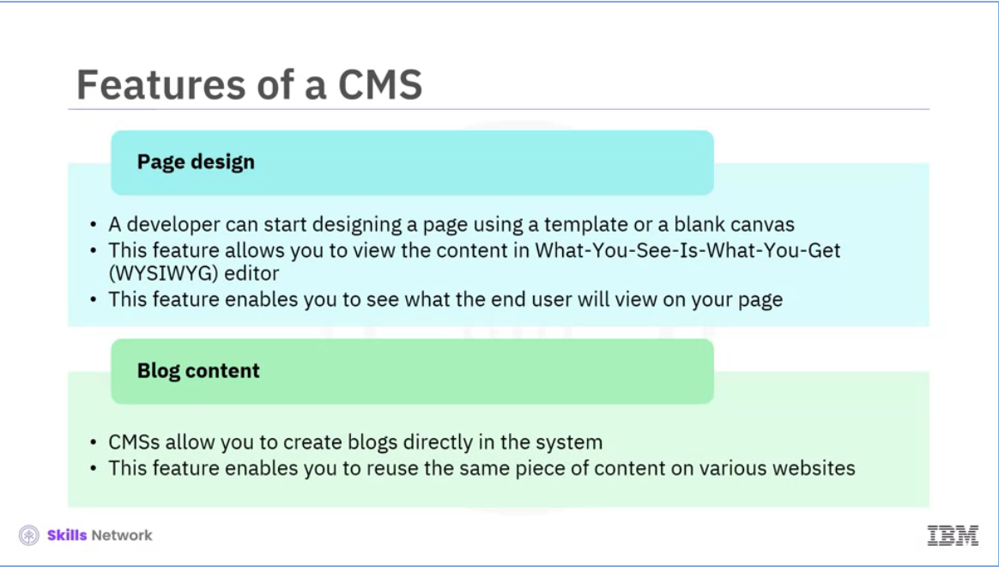{width="5.0in"
height="2.834935476815398in"}

The most important feature of a CMS is designing a page. A developer can
start designing a page using a template or a blank canvas. The selection
depends on the type of CMS you use. Using a template, you can start
adding content to a page immediately. If you do not use a template, you
must arrange the page elements and place them where you want. This
feature lets you view the content in the What-You-See-Is-What-You-Get
(WYSIWYG) editor. This editor displays your content as if you were
looking at a word processor. As a result, you can see what the end user
will view on your page. You can even switch to an HTML view to edit the
code.

Another valuable feature of a CMS is developing blog content. CMSs also
allow you to create blogs in the system directly. To create a blog,
first, you must create a container page and link the blog page to other
blogs. Even though it might appear complicated, this feature enables you
to reuse the same content on various websites. Businesses that rely
significantly on digital marketing can save time as they can produce
content and use it across different parts of a website and advertising
channels.

<!--~~~~~~~~~~~~~~~~~~~~~~~~~~~~~~~~~~~~~~~~~~~~~~~~~~~~~~~~~~~~~~~~~~~~~~~~~~~~~~~~~~~~~~~~~~~~-->
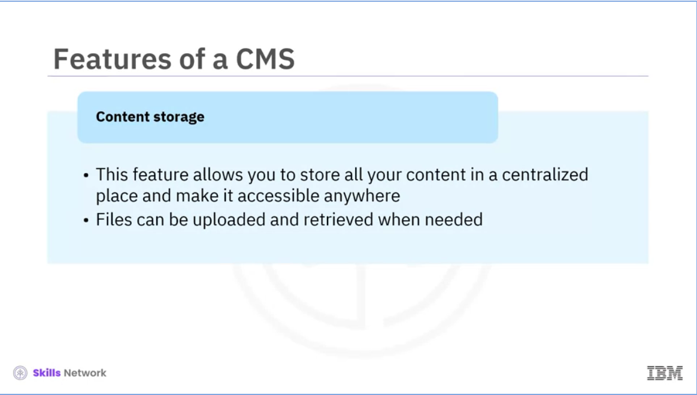{width="5.0in"
height="2.834935476815398in"}

The last feature of a CMS that we will discuss in this session is
content storage. This feature of a CMS allows you to store all your
content in a centralized place and make it accessible anywhere. Almost
all CMSs will have some content repository. You can upload an image or
file to your CMS. Or, pull it from your content library when you want to
place it on a specific site. CMSs also allow you to review and approve
the content before publication.

<!--~~~~~~~~~~~~~~~~~~~~~~~~~~~~~~~~~~~~~~~~~~~~~~~~~~~~~~~~~~~~~~~~~~~~~~~~~~~~~~~~~~~~~~~~~~~~-->
{width="5.0in"
height="2.834935476815398in"}

In this module (05b), you learned that:

-   A CMS helps in developing several types of pages on a website. The
    types of pages include the:

    -   Front Page,

    -   Post Page,

    -   List or Category Page,

    -   Search Page,

    -   User or Author Profile, and

    -   User Home or Dashboard, among others.

-   Some of the features of a CMS include page design, blog content, and
    content storage.

# 06a. Getting Started with WordPress - Part 1

<!--~~~~~~~~~~~~~~~~~~~~~~~~~~~~~~~~~~~~~~~~~~~~~~~~~~~~~~~~~~~~~~~~~~~~~~~~~~~~~~~~~~~~~~~~~~~~-->
{width="5.0in"
height="2.827457349081365in"}

Welcome to "Getting started with WordPress - Part 1."

<!--~~~~~~~~~~~~~~~~~~~~~~~~~~~~~~~~~~~~~~~~~~~~~~~~~~~~~~~~~~~~~~~~~~~~~~~~~~~~~~~~~~~~~~~~~~~~-->
{width="5.0in"
height="2.8173075240594927in"}

After reading this module (06a), you will be able to:

-   Define WordPress as a Content Management System (CMS) and

-   Describe key concepts related to WordPress.

<!--~~~~~~~~~~~~~~~~~~~~~~~~~~~~~~~~~~~~~~~~~~~~~~~~~~~~~~~~~~~~~~~~~~~~~~~~~~~~~~~~~~~~~~~~~~~~-->
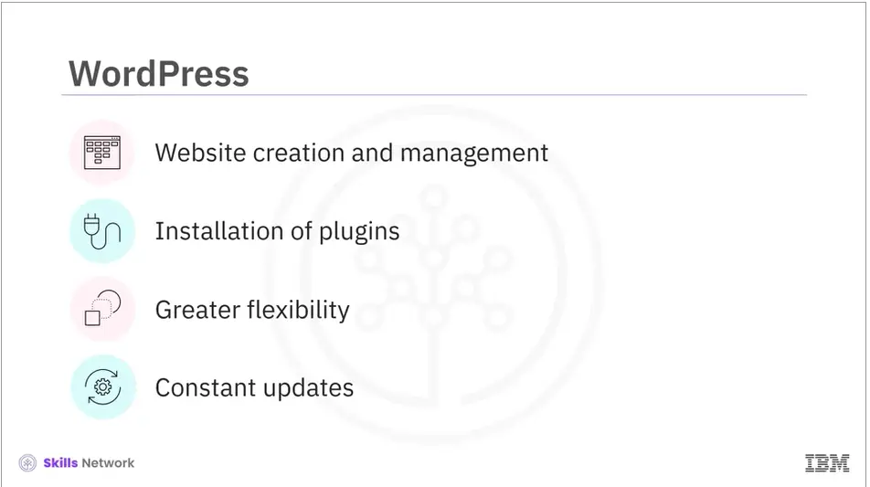{width="5.0in"
height="2.7991447944007in"}

WordPress is a CMS that helps you build and manage your website. It
serves as a foundation for your content and allows you to install
plugins that enhance your website\'s functionality and design. WordPress
CMS gives you greater flexibility and control over your website and
content than What-You-See-Is-What-You-Get (WYSIWYG) website builders.
You may want to use WYSIWYG website builders for their ease of use.
However, they are frequently feature-limited and require you to host
with a specific company. WordPress allows you to constantly update your
website\'s design, content, and functionality.

<!--~~~~~~~~~~~~~~~~~~~~~~~~~~~~~~~~~~~~~~~~~~~~~~~~~~~~~~~~~~~~~~~~~~~~~~~~~~~~~~~~~~~~~~~~~~~~-->
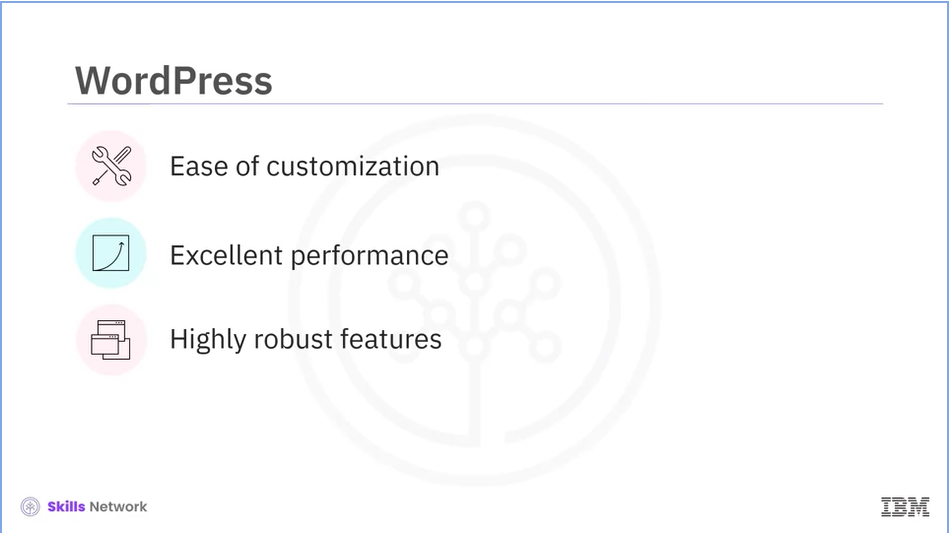{width="5.0in"
height="2.7991447944007in"}

WordPress is a good fit for your projects and websites due to several
factors. These include the ease of customization, excellent performance,
and highly robust features that allow a CMS to run a wide range of
websites, including blogs, business, and e-commerce sites.

<!--~~~~~~~~~~~~~~~~~~~~~~~~~~~~~~~~~~~~~~~~~~~~~~~~~~~~~~~~~~~~~~~~~~~~~~~~~~~~~~~~~~~~~~~~~~~~-->
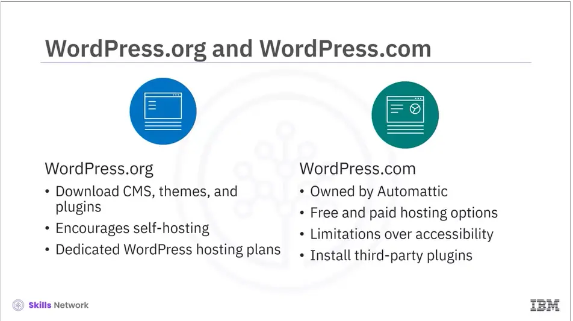{width="5.0in"
height="2.7991447944007in"}

There are two common platforms: WordPress.org and WordPress.com.

WordPress.org is a platform where you can download CMS, themes, and
plugins. Wordpress.org does not provide web hosting packages, so it
encourages you to self-host a WebPress installation by directing you to
third-party hosts. Some of these services also offer dedicated WordPress
hosting plans. A2, Bluehost, and WP Engine are some options to consider.

A self-hosted WordPress installation allows you to install any theme or
plugin.

Wordpress.com is a blogging platform owned by Automattic, co-founded by
WordPress developer Matt Mullenweg.

Wordpress.com differs from Wordpress.org as it offers free and paid
hosting options. It, however, does have a few limitations. For example,
none of WordPress. com\'s offerings allow you to access your server via
Secure Shell (SSH) or edit code via File Transfer Protocol (FTP).
However, you can do so with Wordpress.org, as you must use it with a
third-party host. You can install third-party plugins with
WordPress.com\'s top-tier business plan.

<!--~~~~~~~~~~~~~~~~~~~~~~~~~~~~~~~~~~~~~~~~~~~~~~~~~~~~~~~~~~~~~~~~~~~~~~~~~~~~~~~~~~~~~~~~~~~~-->
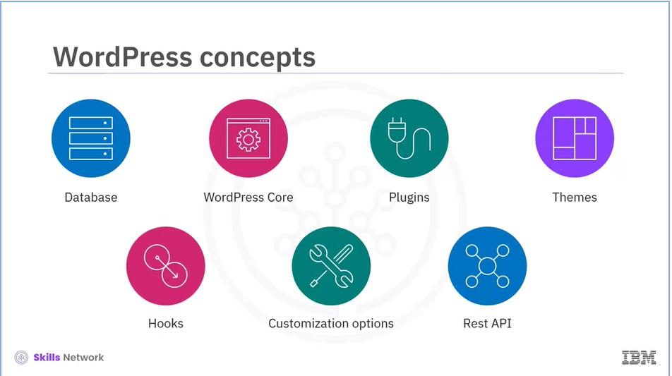{width="5.0in"
height="2.7991447944007in"}

Users, developers, or both should know certain concepts and
terminologies related to WordPress. These include the following terms:
Database, WordPress Core, plugins, themes, hooks, customization options,
and Rest API.

<!--~~~~~~~~~~~~~~~~~~~~~~~~~~~~~~~~~~~~~~~~~~~~~~~~~~~~~~~~~~~~~~~~~~~~~~~~~~~~~~~~~~~~~~~~~~~~-->
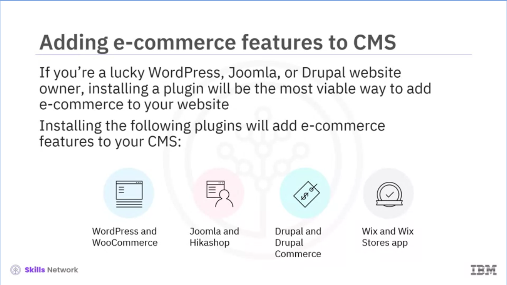{width="5.0in"
height="2.7991447944007in"}

Let's discuss each of these in detail now.

A database contains all your website\'s content, settings, and dynamic
information. WordPress officially supports the database engines MySQL
and MariaDB.

WordPress includes every essential file needed for a WordPress website
to function. This is available for download from Wordpress.org or as
part of your hosting package.

<!--~~~~~~~~~~~~~~~~~~~~~~~~~~~~~~~~~~~~~~~~~~~~~~~~~~~~~~~~~~~~~~~~~~~~~~~~~~~~~~~~~~~~~~~~~~~~-->
{width="5.0in"
height="2.7991447944007in"}

Plugins are pieces of code you can write yourself or download from
places like the WordPress Plugin repository. Plugins can add new
features and behaviors to your website.

Themes enable you to personalize and control the visual aspects of your
website. They determine the look and feel of the public-facing website.
Themes, like plugins, are created from scratch or pre-made. There are
two types of Themes. Classic themes allow users to make minor
adjustments, such as adding custom logos or colors. It is an older style
of theming. Block themes are more modular. They provide users with more
customization options and require less coding. The Block Theme system is
the future of WordPress theming.

<!--~~~~~~~~~~~~~~~~~~~~~~~~~~~~~~~~~~~~~~~~~~~~~~~~~~~~~~~~~~~~~~~~~~~~~~~~~~~~~~~~~~~~~~~~~~~~-->
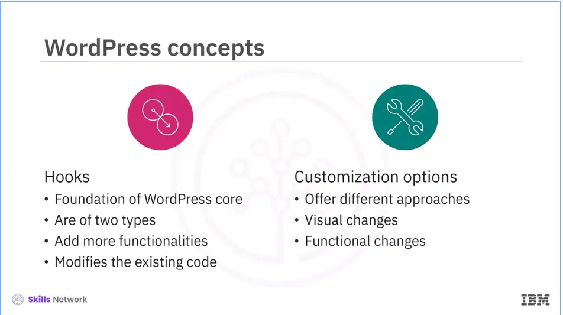{width="5.0in"
height="2.7991447944007in"}

Hooks are the foundation of the WordPress core, themes, and plugins.
There are two types of hooks: actions and filters. Action hooks allow
you to add more functionalities to the website. Filter hooks allow you
to modify the function's existing code. They intercept the data being
processed, let you change it, and then pass it back.

Customization options offer different approaches depending on the type
of customization and functionality you want to add to your website.
There are two types: visual changes facilitated by themes and functional
changes implemented by plugins.

<!--~~~~~~~~~~~~~~~~~~~~~~~~~~~~~~~~~~~~~~~~~~~~~~~~~~~~~~~~~~~~~~~~~~~~~~~~~~~~~~~~~~~~~~~~~~~~-->
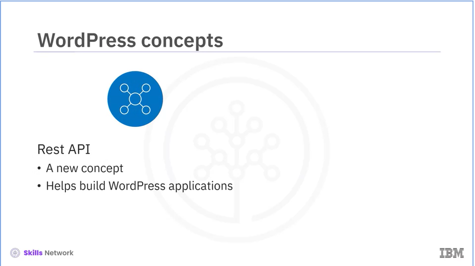{width="5.0in"
height="2.7991447944007in"}

The Rest API is new and allows you to build true WordPress applications.
These include iPhone, Android, and TV apps if you are familiar with
other programming languages.

<!--~~~~~~~~~~~~~~~~~~~~~~~~~~~~~~~~~~~~~~~~~~~~~~~~~~~~~~~~~~~~~~~~~~~~~~~~~~~~~~~~~~~~~~~~~~~~-->
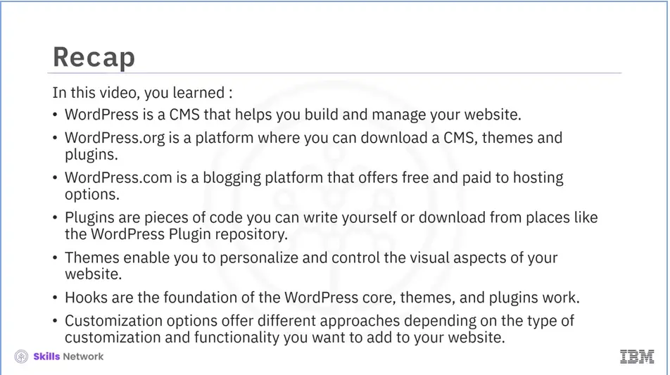{width="5.0in"
height="2.7991447944007in"}

In this module (06a), you learned:

-   WordPress is a CMS that helps you build and manage your website,

-   Wordpress.org is a platform where you can download CMS, themes, and
    plugins,

-   Wordpress.com is a blogging platform that offers free and paid
    hosting options,

-   Plugins are pieces of code you can write yourself or download from
    places like the WordPress Plugin repository,

-   Themes enable you to personalize and control the visual aspects of
    your website,

-   Hooks are the foundation of how the WordPress core, themes, and
    plugins work, and lastly,

-   Customization options offer different approaches depending on the
    type of customization and functionality you want to add to your
    website.

# 06b. Getting Started with WordPress - Part 2

<!--~~~~~~~~~~~~~~~~~~~~~~~~~~~~~~~~~~~~~~~~~~~~~~~~~~~~~~~~~~~~~~~~~~~~~~~~~~~~~~~~~~~~~~~~~~~~-->
{width="5.0in"
height="2.8258552055993in"}

Welcome to "Getting started with WordPress -- Part 2."

<!--~~~~~~~~~~~~~~~~~~~~~~~~~~~~~~~~~~~~~~~~~~~~~~~~~~~~~~~~~~~~~~~~~~~~~~~~~~~~~~~~~~~~~~~~~~~~-->
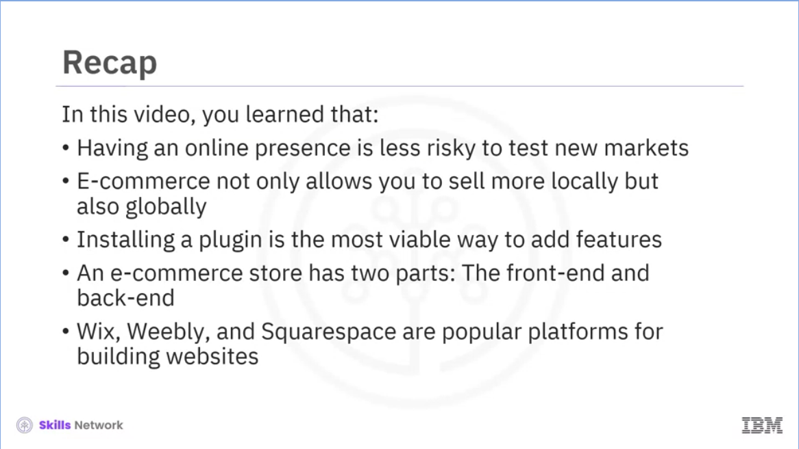{width="5.0in"
height="2.8258552055993in"}

After reading this module (06b), you will be able to:

-   Describe the popular website builder, WordPress,

-   Identify the steps to create a website using WordPress, and

-   Identify the skills required to enhance WordPress.

WordPress is a user-friendly platform that enables you to develop a
professional website without coding knowledge. This module will teach
you how to create a website using WordPress.

<!--~~~~~~~~~~~~~~~~~~~~~~~~~~~~~~~~~~~~~~~~~~~~~~~~~~~~~~~~~~~~~~~~~~~~~~~~~~~~~~~~~~~~~~~~~~~~-->
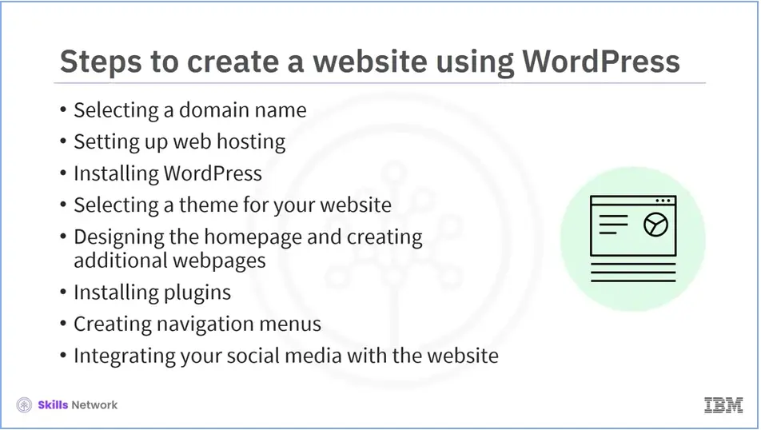{width="5.0in"
height="2.8258552055993in"}

The steps to create a website using WordPress include the following:

-   Selecting a domain name,

-   Setting up web hosting Installing WordPress,

-   Selecting a theme for your website,

-   Designing the homepage and creating additional web pages,

-   Installing plugins,

-   Creating navigation menus, and finally,

-   Integrating your social media with the website.

<!--~~~~~~~~~~~~~~~~~~~~~~~~~~~~~~~~~~~~~~~~~~~~~~~~~~~~~~~~~~~~~~~~~~~~~~~~~~~~~~~~~~~~~~~~~~~~-->
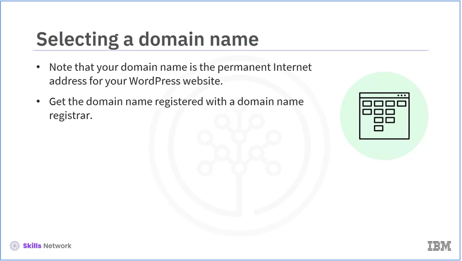{width="5.0in"
height="2.8258552055993in"}

Let's discuss each of these steps in detail.

The first step of creating a website using WordPress is selecting a
domain name. Your domain name is the permanent Internet address for your
WordPress website and plays a crucial role in branding, so give it some
thought. After you\'ve found the perfect domain name, get that
registered with a domain name registrar. Some popular registrars include
GoDaddy and Google Domains.

<!--~~~~~~~~~~~~~~~~~~~~~~~~~~~~~~~~~~~~~~~~~~~~~~~~~~~~~~~~~~~~~~~~~~~~~~~~~~~~~~~~~~~~~~~~~~~~-->
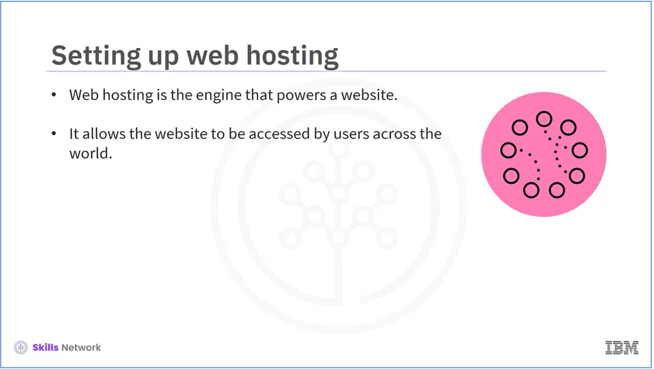{width="5.0in"
height="2.8258552055993in"}

The next step in creating a website using WordPress is setting up web
hosting. Web hosting is the \"engine\" that powers your WordPress
website and allows visitors from all over the world to access it. Web
hosting means renting computer space to power your website. Hosting is
available at all price points, ranging from a few dollars to hundreds
per month.

<!--~~~~~~~~~~~~~~~~~~~~~~~~~~~~~~~~~~~~~~~~~~~~~~~~~~~~~~~~~~~~~~~~~~~~~~~~~~~~~~~~~~~~~~~~~~~~-->
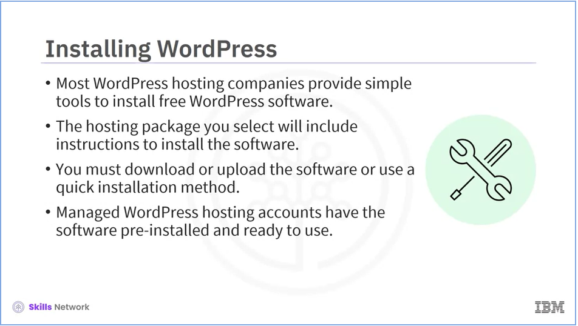{width="5.0in"
height="2.8258552055993in"}

Next, you need to install the WordPress software. Most WordPress hosting
companies provide simple tools to install free WordPress software. The
hosting package you select will typically include instructions on
installing the software, which will require downloading and uploading
the software or using a quick installation method. Using a managed
WordPress hosting account, you\'ll be able to install and use the
software immediately.

<!--~~~~~~~~~~~~~~~~~~~~~~~~~~~~~~~~~~~~~~~~~~~~~~~~~~~~~~~~~~~~~~~~~~~~~~~~~~~~~~~~~~~~~~~~~~~~-->
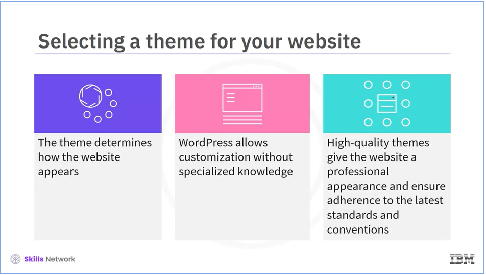{width="5.0in"
height="2.8258552055993in"}

After you've installed the WordPress software, you need to select a
theme for your website. Your WordPress theme determines how your website
appears.

WordPress allows you to customize your website without any specialized
knowledge. Using a high-quality theme gives your website a professional
appearance while adhering to the latest web standards and conventions. A
free theme will suffice if you want to post a simple blog. Premium
themes typically have advanced functionalities and no branding from the
creator. Look for frequently updated themes to ensure that your website
stays current.

<!--~~~~~~~~~~~~~~~~~~~~~~~~~~~~~~~~~~~~~~~~~~~~~~~~~~~~~~~~~~~~~~~~~~~~~~~~~~~~~~~~~~~~~~~~~~~~-->
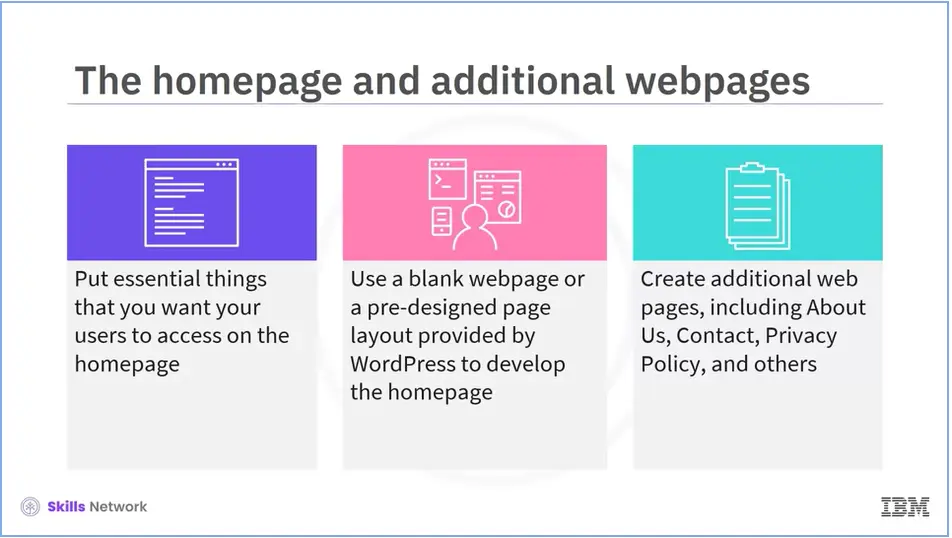{width="5.0in"
height="2.8258552055993in"}

After selecting the theme of your website, you need to design the
homepage and the additional pages of your website. To create an
excellent first impression, you must identify the essential things you
want your users to access when visiting your website. You can use either
a blank webpage or a pre-designed page layout provided by WordPress to
develop that impressive homepage quickly. Next, you need to create
additional web pages for your website. These may include the About Us
page, the Contact page, the Privacy Policy page, the custom landing
page, and so on.

<!--~~~~~~~~~~~~~~~~~~~~~~~~~~~~~~~~~~~~~~~~~~~~~~~~~~~~~~~~~~~~~~~~~~~~~~~~~~~~~~~~~~~~~~~~~~~~-->
{width="5.0in"
height="2.8258552055993in"}

Now, to boost the functionality of your website, you can install
plugins. Note that this step is optional. While themes are concerned
with appearance, plugins are concerned with adding new functionality to
your website.

WordPress offers tools to improve search engine optimization (SEO),
create user forums, and manage comments. One important consideration is
that coding errors from a plugin developer may leave your website
vulnerable to cyberattacks. Hence, research before you install one.

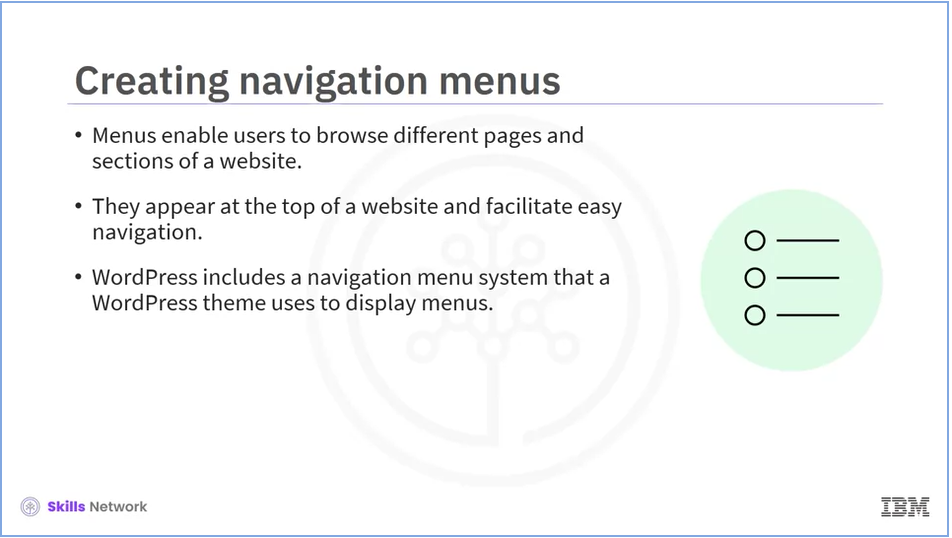{width="5.0in"
height="2.8258552055993in"}

The next step is creating navigation menus. Users can browse different
pages or sections of your website using navigation menus. Menus are
links at the top of a web page that users can click to navigate your
website. WordPress includes a robust navigation menu system, which your
WordPress theme uses to display menus.

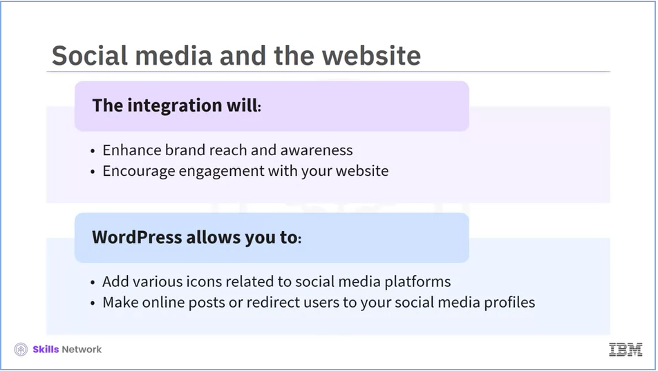{width="5.0in"
height="2.8258552055993in"}

The last and optional step is integrating your social media with your
website. This helps you to enhance brand reach and awareness, encourage
engagement, and enable you to reach a wider audience, boosting traffic
to your website. WordPress allows you to add various icons related to
social media platforms. These include Facebook, Twitter, Instagram,
YouTube, and others. It also allows you to post online or redirect users
to your social media profiles. You must be familiar with specific tools
to begin working with WordPress development and website design.

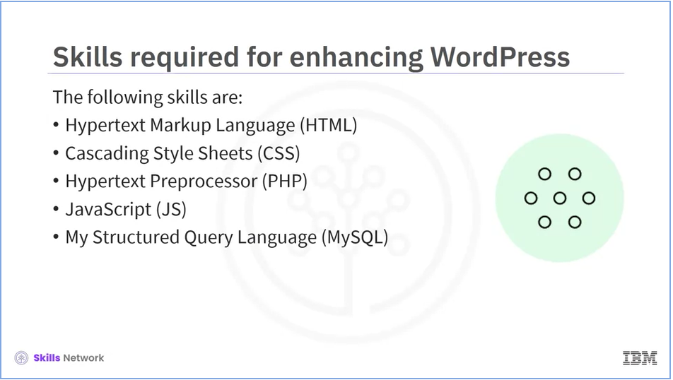{width="5.0in"
height="2.8258552055993in"}

Let us understand the skills required for enhancing WordPress. The
following skills are:

-   Hypertext Markup Language (HTML),

-   Cascading Style Sheets (CSS),

-   Hypertext Preprocessor (PHP),

-   JavaScript (JS), and

-   My structured Query Language (MySQL).

HTML and CSS are the first two languages you should learn. No matter
what code you write or the language you use, it all comes down to HTML
and CSS.

<!--~~~~~~~~~~~~~~~~~~~~~~~~~~~~~~~~~~~~~~~~~~~~~~~~~~~~~~~~~~~~~~~~~~~~~~~~~~~~~~~~~~~~~~~~~~~~-->
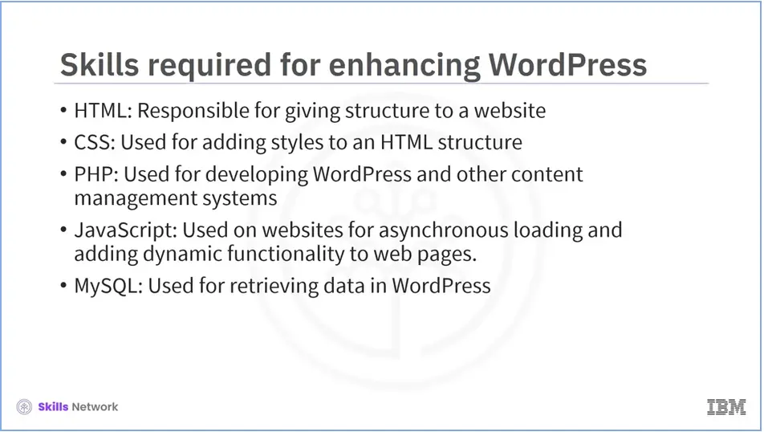{width="5.0in"
height="2.8258552055993in"}

HTML is responsible for giving a website its structure. This implies
deciding what text should be a heading, what should be a list, what goes
in the sidebar, and what goes in the header and footer.

CSS is used for adding styles to the HTML structure. You can define the
color of text, image alignment, paragraph spacing, border colors, border
thickness, float properties, and other elements.

WordPress development requires a solid understanding of PHP as WordPress
and other content management systems are developed using the PHP
programming language.

JavaScript is commonly used on websites for asynchronous loading and
adding dynamic functionality to web pages.

MySQL is a database-access and data-management language. WordPress
relies on it to retrieve all its data.

<!--~~~~~~~~~~~~~~~~~~~~~~~~~~~~~~~~~~~~~~~~~~~~~~~~~~~~~~~~~~~~~~~~~~~~~~~~~~~~~~~~~~~~~~~~~~~~-->
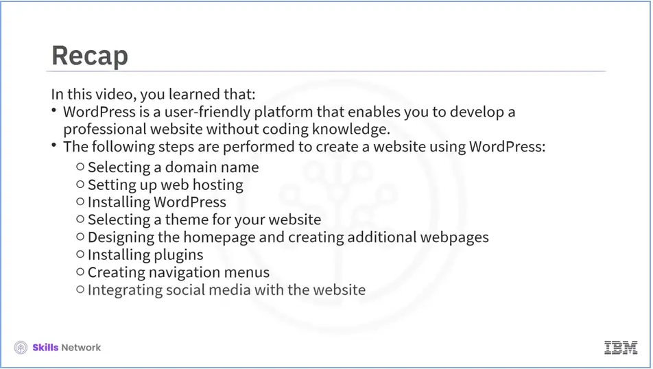{width="5.0in"
height="2.8258552055993in"}

In this module (06), you learned that:

-   WordPress is a user-friendly platform that enables you to develop a
    professional website without the knowledge of coding, and

-   The steps to create a website using WordPress include:

    -   Selecting a domain name,

    -   Setting up web hosting,

    -   Installing WordPress,

    -   Selecting a theme for your website,

    -   Designing the homepage and

    -   Creating additional webpages,

    -   Installing plugins,

    -   Creating navigation menus, and

    -   Integrating your social media with the website.

# 07. Adding E-commerce to Your Website

<!--~~~~~~~~~~~~~~~~~~~~~~~~~~~~~~~~~~~~~~~~~~~~~~~~~~~~~~~~~~~~~~~~~~~~~~~~~~~~~~~~~~~~~~~~~~~~-->
{width="5.0in"
height="2.6330129046369204in"}

Welcome to "Adding E-commerce to Your Website."

<!--~~~~~~~~~~~~~~~~~~~~~~~~~~~~~~~~~~~~~~~~~~~~~~~~~~~~~~~~~~~~~~~~~~~~~~~~~~~~~~~~~~~~~~~~~~~~-->
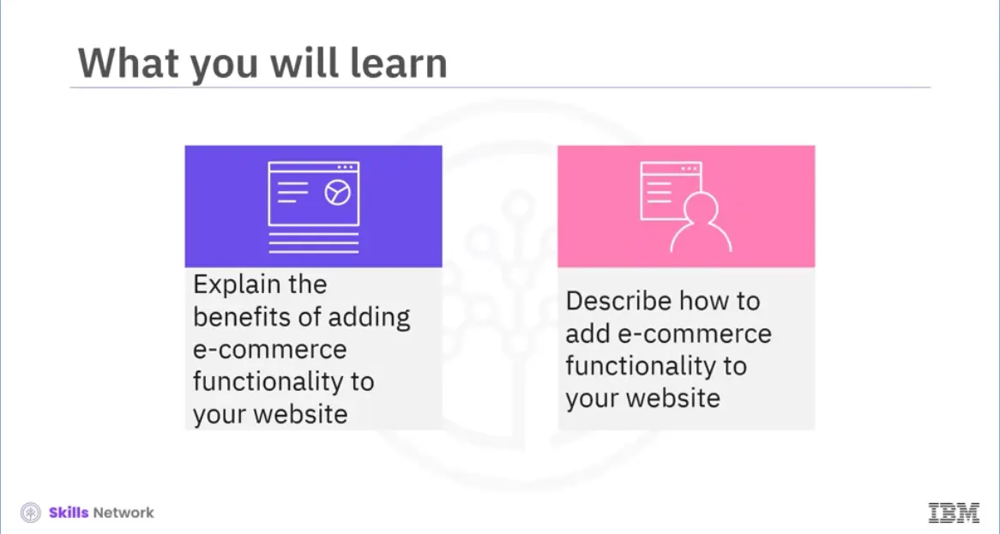{width="5.0in"
height="2.671474190726159in"}

After reading this module (07), you will be able to:

-   Explain the benefits of adding e-commerce functionality to your
    website,

-   Describe how to add e-commerce functionality to your website.

<!--~~~~~~~~~~~~~~~~~~~~~~~~~~~~~~~~~~~~~~~~~~~~~~~~~~~~~~~~~~~~~~~~~~~~~~~~~~~~~~~~~~~~~~~~~~~~-->
> 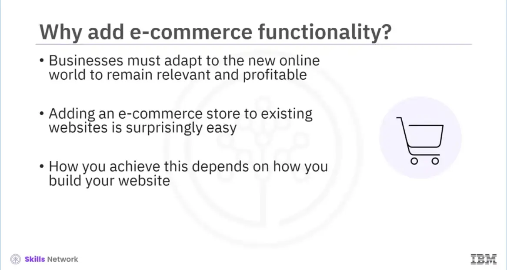{width="5.0in"
> height="2.671474190726159in"}

Businesses must adapt to the new online world to remain relevant and
profitable. Those who depend on customers visiting a storefront must
shift to an entirely new business model to survive. Suppose you run a
business that sells physical products. In that case, it is possible to
transition to an e-commerce business to keep things afloat in the coming
months. And, for most businesses, adding an e-commerce store to its
existing website is surprisingly easy. How you achieve this depends on
how you build your website. However, like most businesses, if you\'re
either using WordPress website or a website builder to create your
website, adding e-commerce functionality is simple.

<!--~~~~~~~~~~~~~~~~~~~~~~~~~~~~~~~~~~~~~~~~~~~~~~~~~~~~~~~~~~~~~~~~~~~~~~~~~~~~~~~~~~~~~~~~~~~~-->
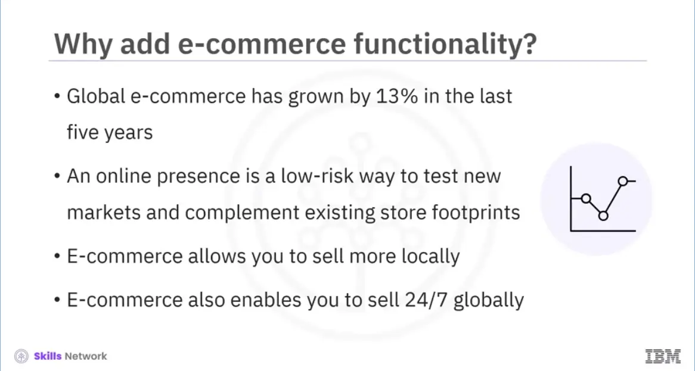{width="5.0in"
height="2.671474190726159in"}

The global consultancy firm AT Kearney stated, \"e-commerce is the next
frontier in global expansion. Global e-commerce has grown by thirteen
percent over the last five years. As online sales skyrocket in
developing markets, an online presence is a low-risk way to test new
markets and complement existing store footprints." E-commerce is easy
and affordable. It allows you to sell locally and globally every hour of
every day.

<!--~~~~~~~~~~~~~~~~~~~~~~~~~~~~~~~~~~~~~~~~~~~~~~~~~~~~~~~~~~~~~~~~~~~~~~~~~~~~~~~~~~~~~~~~~~~~-->
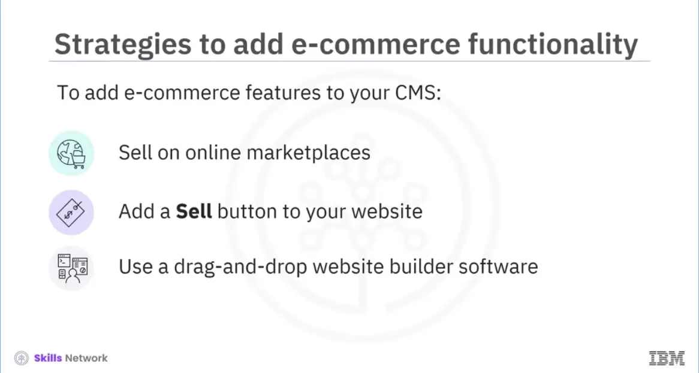{width="5.0in"
height="2.671474190726159in"}

Adding e-commerce features to a website requires a certain degree of
technical knowledge. Here are some ways to add e-commerce to your
website, depending on your platform's complexity level, business needs,
and the available budget. Start selling products online. For new
sellers, marketplaces are accessible, affordable options. Add a "Sell"
button to your website. You can create buttons online or quickly add a
shopping basket to your website. Using drag-and-drop website builder
software will help you easily create high-converting landing pages, web
pages, and blog posts.

<!--~~~~~~~~~~~~~~~~~~~~~~~~~~~~~~~~~~~~~~~~~~~~~~~~~~~~~~~~~~~~~~~~~~~~~~~~~~~~~~~~~~~~~~~~~~~~-->
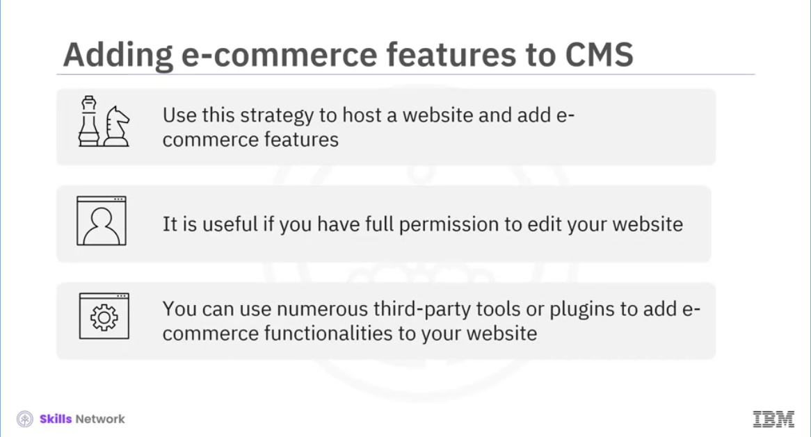{width="5.0in"
height="2.697115048118985in"}

The first option is to add a store to your website. This option is great
if you have full permission to edit your website. You can add payment
gateways and shopping carts to make your website e-commerce capable. To
add e-commerce functionalities, you can use numerous third-party tools
or plugins. These plugins are software that add various functionalities
to a website, including web form builders, analytics, SEO meta tags,
payment gateways, and shopping carts.

<!--~~~~~~~~~~~~~~~~~~~~~~~~~~~~~~~~~~~~~~~~~~~~~~~~~~~~~~~~~~~~~~~~~~~~~~~~~~~~~~~~~~~~~~~~~~~~-->
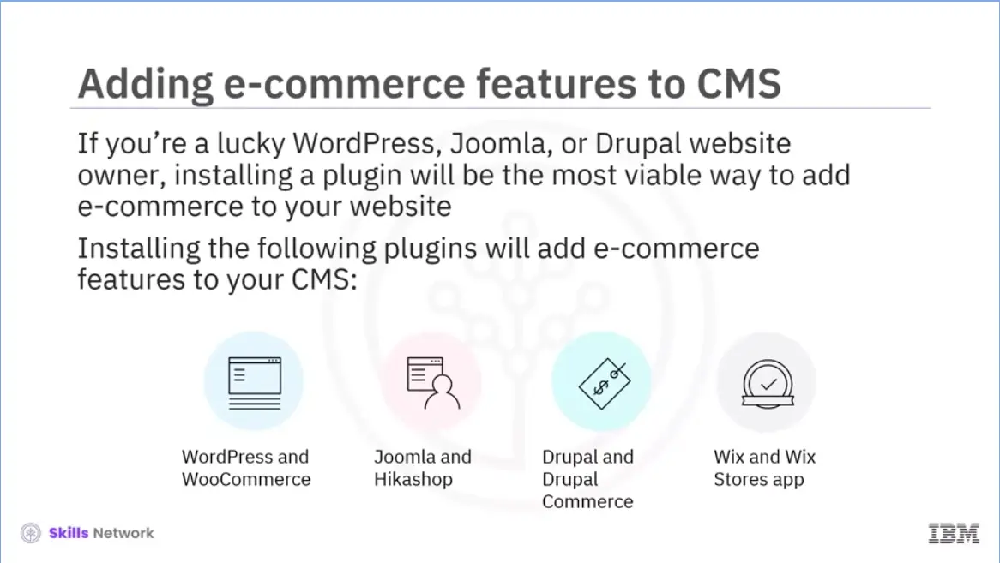{width="5.0in"
height="2.8173075240594927in"}

If you're a lucky owner of WordPress, Joomla, or Drupal websites,
installing a plugin will be the most viable way to add e-commerce
features to your website. The process of adding a plugin to your
e-commerce platform is easy. Go to Plugins in the admin dashboard,
select the one compatible with your website version, and click
"Install." Installing the following plugins will add e-commerce features
to your CMS: WordPress and WooCommerce, Joomla and Hikashop, Drupal and
Drupal Commerce, and Wix and Wix Stores.

<!--~~~~~~~~~~~~~~~~~~~~~~~~~~~~~~~~~~~~~~~~~~~~~~~~~~~~~~~~~~~~~~~~~~~~~~~~~~~~~~~~~~~~~~~~~~~~-->
{width="5.0in"
height="2.8173075240594927in"}

Online marketplaces are beneficial to all. The buyer finds e-commerce
platforms convenient and secure places to purchase goods immediately.
The seller is attracted to marketplaces by potential customers.

<!--~~~~~~~~~~~~~~~~~~~~~~~~~~~~~~~~~~~~~~~~~~~~~~~~~~~~~~~~~~~~~~~~~~~~~~~~~~~~~~~~~~~~~~~~~~~~-->
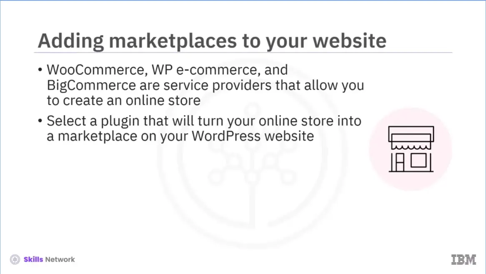{width="5.0in"
height="2.8173075240594927in"}

Let's discuss some easy ways to include marketplaces on your website.
WooCommerce, WP e-commerce, and BigCommerce are service providers that
allow you to create an online store. If you have WordPress installed,
enter the "marketplace" query on the official WordPress repository.
Select a plugin that will turn your online store into a marketplace.
WooCommerce allows you to sell the products of only one seller. Magento
Open Source is suited for medium- to large-scale enterprises but offers
an open-source edition for small businesses.

Shopify has a \"Buy\" button to add to a custom or template website. It
shows users product images, descriptions, and prices. It allows them to
stay on your website while making a purchase. You can customize this
button to make it a part of your website. The solution costs a few
dollars monthly and requires little effort to integrate into the
existing website.

<!--~~~~~~~~~~~~~~~~~~~~~~~~~~~~~~~~~~~~~~~~~~~~~~~~~~~~~~~~~~~~~~~~~~~~~~~~~~~~~~~~~~~~~~~~~~~~-->
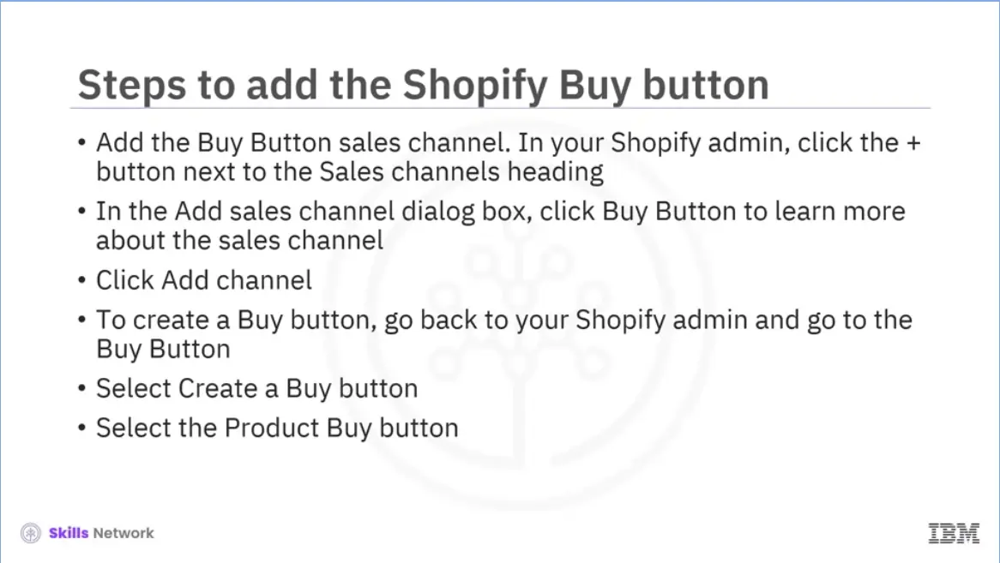{width="5.0in"
height="2.8173075240594927in"}

Here are the steps to add the Shopify Buy button to your website. Add
the Buy Button sales channel. Select the plus button next to the Sales
channels heading in your Shopify admin. In the Add sales channel dialog
box, select the Buy Button to learn more about the Sales channel. Select
Add channel. To create a Buy button, go back to your Shopify admin and
go to the Buy Button. Select Create a Buy Button. Select the Product Buy
Button.

<!--~~~~~~~~~~~~~~~~~~~~~~~~~~~~~~~~~~~~~~~~~~~~~~~~~~~~~~~~~~~~~~~~~~~~~~~~~~~~~~~~~~~~~~~~~~~~-->
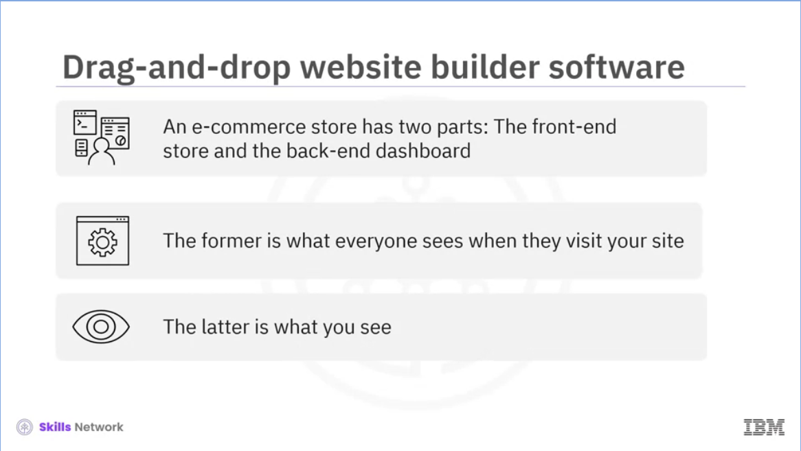{width="5.0in"
height="2.8173075240594927in"}

An e-commerce store has two parts: the front-end store and the back-end
dashboard. The former is what everyone sees when they visit your site,
including your inventory, deals, shopping cart, checkout system, and so
on. You see the latter, including sales, inventory, and other things.
You need to find an e-commerce partner that enables you to have an
attractive e-commerce store and an intuitive back-end dashboard.

<!--~~~~~~~~~~~~~~~~~~~~~~~~~~~~~~~~~~~~~~~~~~~~~~~~~~~~~~~~~~~~~~~~~~~~~~~~~~~~~~~~~~~~~~~~~~~~-->
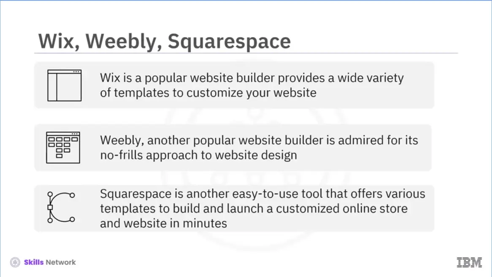{width="5.0in"
height="2.8173075240594927in"}

There are various options available for website builders. This session
will discuss the popular platforms: Wix, Weebly, and Squarespace. Wix is
one of the most popular website builders that cater to a wide range of
users. You do not need programming skills to create a website on Wix. It
provides various templates to customize your website. Weebly is a
popular platform that has over forty million users. It has a no-frills
approach to website design. You can create a mobile-responsive website
using their templates. Moreover, you can study your progress using their
back-end metrics. Squarespace is another easy-to-use tool that offers
various templates to build and launch a customized online store and
website in minutes.

<!--~~~~~~~~~~~~~~~~~~~~~~~~~~~~~~~~~~~~~~~~~~~~~~~~~~~~~~~~~~~~~~~~~~~~~~~~~~~~~~~~~~~~~~~~~~~~-->
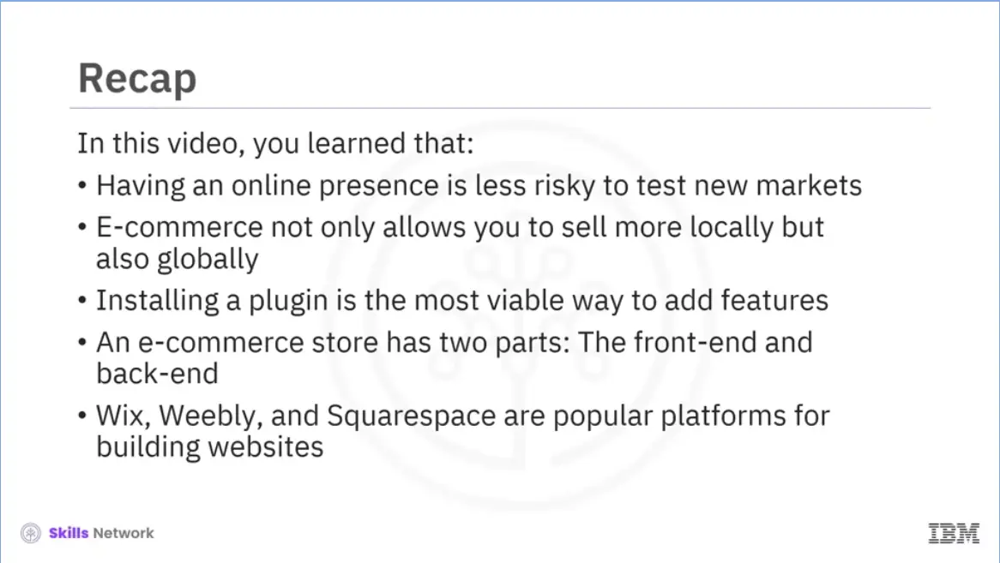{width="5.0in"
height="2.8173075240594927in"}

In this module (07), you learned that:

-   Having an online presence makes testing new markets and
    complementing existing store footprints less risky.

-   E-commerce allows you to sell more not only locally but also
    globally.

-   Installing a plugin is the most viable way to add e-commerce
    features to a website.

-   An e-commerce store has two parts: the front-end store and the
    back-end dashboard.

-   Wix, Weebly, and Squarespace are popular platforms for website
    building.

# Practice Quiz: CMS & eCommerce

# Week 1 Summary: Content Management Systems (CMS)

## **Content Management Systems (CMSs)**

In this week (01), you learned that:

-   A content management system (CMS) aids developers in the creation of
    websites.

-   A CMS\'s features include page design, blog content, and content
    storage.

-   Web content management systems (WCMS), digital asset management
    systems (DAMS), and enterprise content management systems are the
    three types of content management systems (ECMS).

-   A WCMS allows users to create, manage, and modify web page content.

-   A successful website is built with CMS, the optimizer tool, the
    insights tool, fonts, JavaScript, and CSS.

-   CMS platforms that are popular include Joomla, Squarespace, Wix,
    Shopify, Drupal, and Adobe Commerce.

-   WordPress is a user-friendly platform that allows web developers to
    create a professional website without any coding knowledge.

-   E-commerce enables businesses to sell more locally and globally.

# Graded Quiz: CMS & eCommerce

# [Week 2:]{.mark}

# 08. Introduction to Search Engine Optimization (SEO)

<!--~~~~~~~~~~~~~~~~~~~~~~~~~~~~~~~~~~~~~~~~~~~~~~~~~~~~~~~~~~~~~~~~~~~~~~~~~~~~~~~~~~~~~~~~~~~~-->
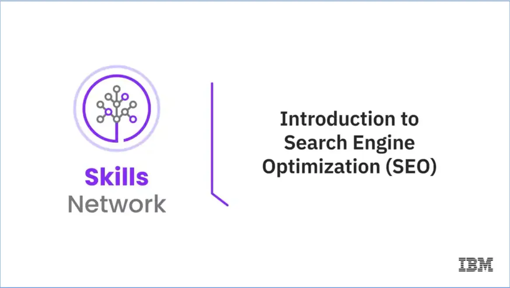{width="5.0in"
height="2.8301279527559053in"}

Welcome to "Introduction to Search Engine Optimization (SEO)."

<!--~~~~~~~~~~~~~~~~~~~~~~~~~~~~~~~~~~~~~~~~~~~~~~~~~~~~~~~~~~~~~~~~~~~~~~~~~~~~~~~~~~~~~~~~~~~~-->
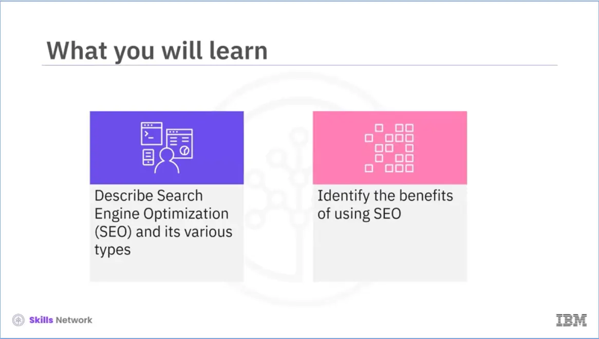{width="5.0in"
height="2.8301279527559053in"}

After reading this module (08), you will be able to:

-   Describe search engine optimization (SEO) and its types, and

-   Identify the benefits of using SEO.

<!--~~~~~~~~~~~~~~~~~~~~~~~~~~~~~~~~~~~~~~~~~~~~~~~~~~~~~~~~~~~~~~~~~~~~~~~~~~~~~~~~~~~~~~~~~~~~-->
{width="5.0in"
height="2.8301279527559053in"}

Search engine optimization (SEO) refers to techniques that help a
website rank higher in organic search results, making it more visible to
people looking for the product or service online. Search engines scan
the Internet for text that matches certain criteria. This text, a
crucial website element, is called a keyword. The titles, headings, and
links that form the content of a webpage are also important factors that
a search engine considers when ranking a website. SEO is a subset of
Search Engine Marketing (SEM), a broad term that contains all search
marketing strategies. Organic and paid searches are both included in
SEM. Paid search requires you to pay to have your website listed on a
search engine so that it appears when someone types a specific keyword
or phrase.

<!--~~~~~~~~~~~~~~~~~~~~~~~~~~~~~~~~~~~~~~~~~~~~~~~~~~~~~~~~~~~~~~~~~~~~~~~~~~~~~~~~~~~~~~~~~~~~-->
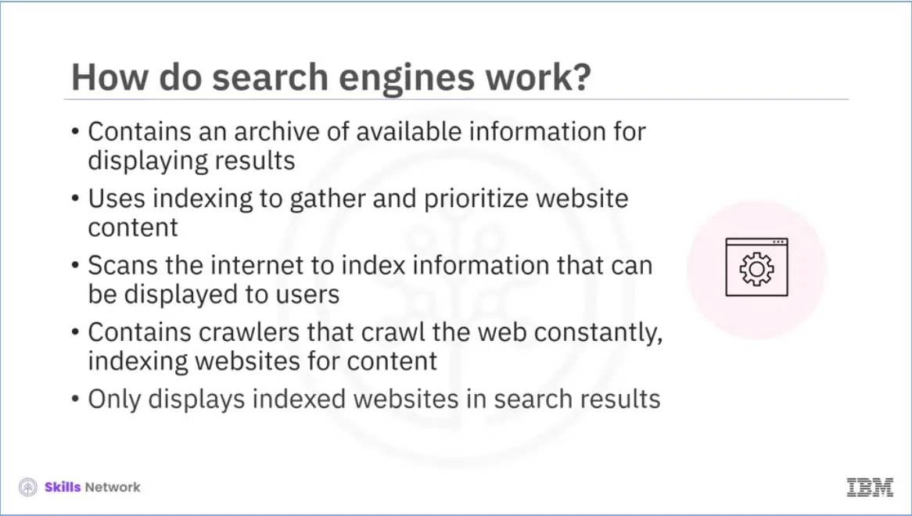{width="5.0in"
height="2.8301279527559053in"}

Let's describe how a search engine works. A search engine needs an
archive of available information to choose from to display results when
someone types a query. Every search engine has proprietary methods to
gather and prioritize website content, known as indexing. A search
engine index is a data collection used to generate the final search
result. Search engines scan the Internet and index all the information
displayed to users when they enter a search query. Every search engine
has bots, or crawlers, that crawl the web constantly, indexing websites
for content and following links on each webpage to other web pages.
Indexing your website is essential as it will only appear in search
results if it is done.

<!--~~~~~~~~~~~~~~~~~~~~~~~~~~~~~~~~~~~~~~~~~~~~~~~~~~~~~~~~~~~~~~~~~~~~~~~~~~~~~~~~~~~~~~~~~~~~-->
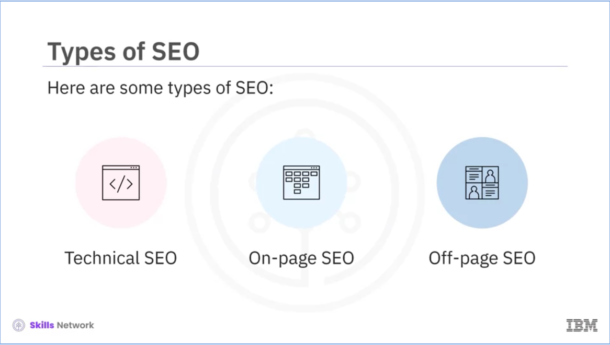{width="5.0in"
height="2.8344017935258092in"}

Now that you know how search engines work, let's explore the types of
SEO. Some of these include technical SEO, on-page SEO, and off-page SEO.
Let's discuss each of them in detail.

<!--~~~~~~~~~~~~~~~~~~~~~~~~~~~~~~~~~~~~~~~~~~~~~~~~~~~~~~~~~~~~~~~~~~~~~~~~~~~~~~~~~~~~~~~~~~~~-->
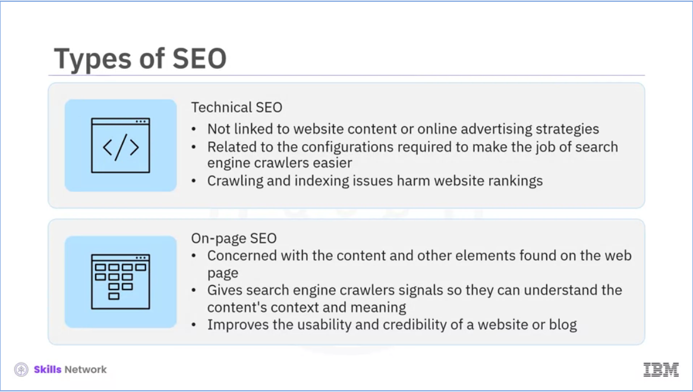{width="5.0in"
height="2.8344017935258092in"}

Technical SEO, as the name suggests, relates to the settings that need
to be set up to facilitate the task of search engine crawlers. Note that
crawling and indexing issues can harm your rankings. Another type of SEO
is on-page SEO, which is primarily concerned with the content and other
elements found on a page. Unlike technical SEO, on-page SEO primarily
aims to provide enough signals to search engine crawlers so that they
can understand the meaning and context of the content. This is done
using website structure, SEO keywords, title optimizations, headings,
internal links, image SEO, structured data markup, and other techniques.
When done correctly, on-page SEO will improve a website\'s or blog\'s
usability and credibility.

<!--~~~~~~~~~~~~~~~~~~~~~~~~~~~~~~~~~~~~~~~~~~~~~~~~~~~~~~~~~~~~~~~~~~~~~~~~~~~~~~~~~~~~~~~~~~~~-->
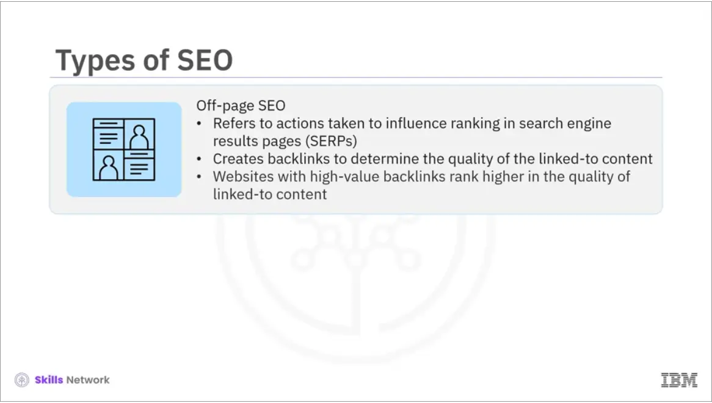{width="5.0in"
height="2.8344017935258092in"}

The last type of SEO we will discuss is off-page SEO. It refers to
actions taken away from the website to influence the rankings on Search
Engine Result Pages or (SERPs). Off-page SEO is commonly associated with
the creation of backlinks. Search engines use backlinks to determine the
quality of the connected content. Hence, a website with many high-value
backlinks usually ranks higher than an otherwise equal website with
fewer backlinks.

<!--~~~~~~~~~~~~~~~~~~~~~~~~~~~~~~~~~~~~~~~~~~~~~~~~~~~~~~~~~~~~~~~~~~~~~~~~~~~~~~~~~~~~~~~~~~~~-->
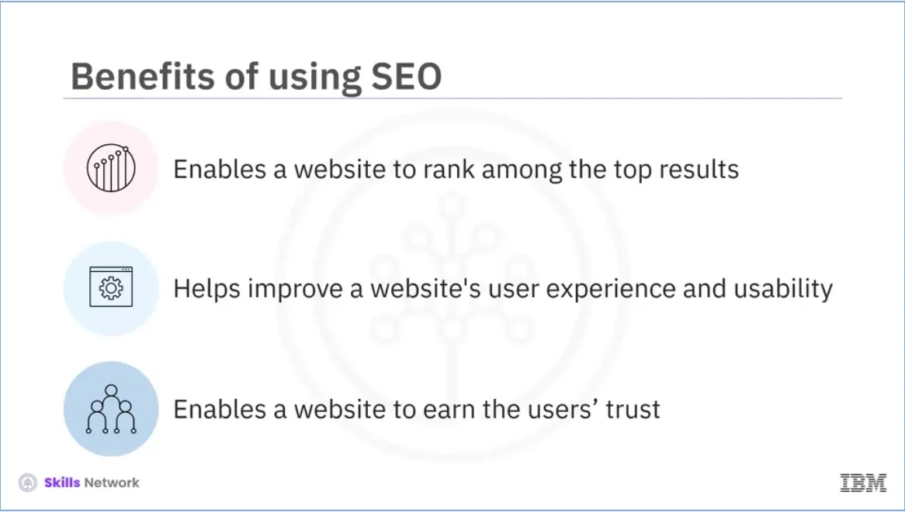{width="5.0in"
height="2.8344017935258092in"}

Now, we will talk about the benefits of using SEO. Most users click one
of the top five SERP suggestions. The website must rank among the top
results to capitalize on this and attract visitors. SEO is about search
engines and good SEO practices, which help improve a website\'s user
experience and usability. Users trust search engines. Having a presence
in the top positions for the keywords the user searches for enables the
website to earn the users' trust.

<!--~~~~~~~~~~~~~~~~~~~~~~~~~~~~~~~~~~~~~~~~~~~~~~~~~~~~~~~~~~~~~~~~~~~~~~~~~~~~~~~~~~~~~~~~~~~~-->
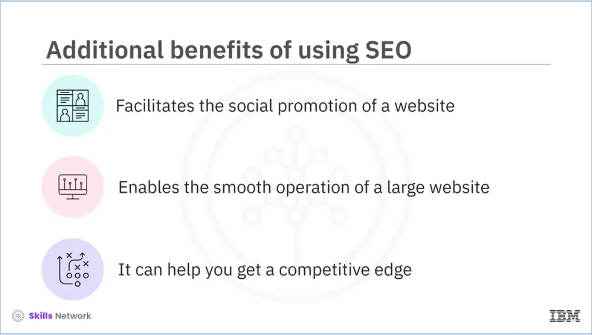{width="5.0in"
height="2.8344017935258092in"}

There are additional benefits of using SEO. SEO is essential for the
social promotion of a website. People who find a website through a
Google or Bing search are more likely to share it on Facebook, Twitter,
or other social media platforms. SEO enables the smooth operation of a
large website. Websites with multiple authors can benefit from SEO
directly and indirectly. The direct benefit is increased organic
traffic, and the indirect benefit is a common structure or checklist to
utilize before publishing content on the website. SEO can help get a
competitive edge. If two websites sell the same product, the
search-engine-optimized website will have more customers and make more
sales.

<!--~~~~~~~~~~~~~~~~~~~~~~~~~~~~~~~~~~~~~~~~~~~~~~~~~~~~~~~~~~~~~~~~~~~~~~~~~~~~~~~~~~~~~~~~~~~~-->
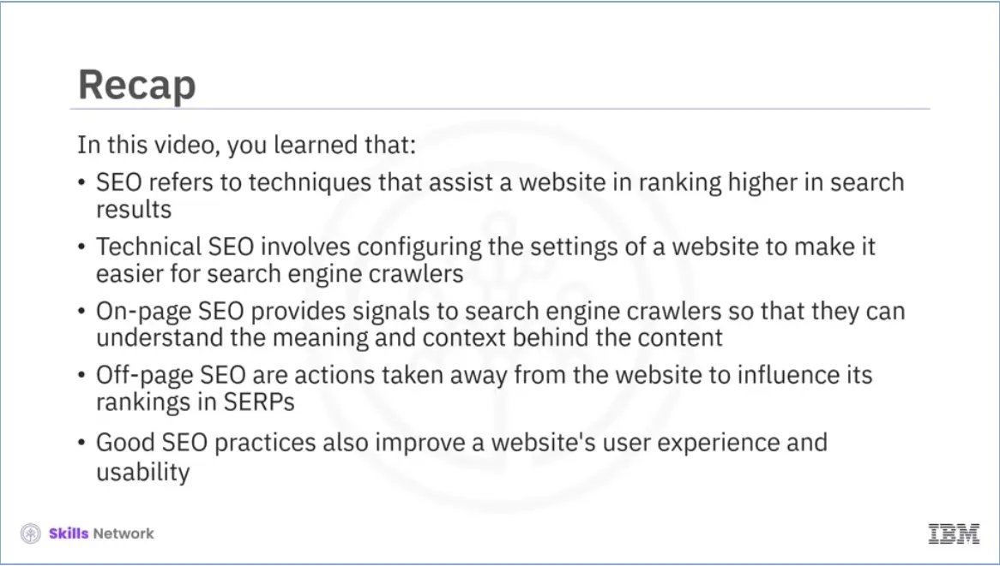{width="5.0in"
height="2.8344017935258092in"}

In this module (08), you learned that:

-   SEO refers to techniques that assist a website in ranking higher in
    search results,

-   Technical SEO involves configuring the settings of a website to make
    it easier for search engine crawlers,

-   On-page SEO provides signals to search engine crawlers so that they
    can understand the meaning and context behind the content,

-   Off-page SEO are actions taken away from the website to influence
    its rankings in SERPs, and

-   Good SEO practices also improve a website\'s user experience and
    usability.

# 09. Popular SEO Tools

<!--~~~~~~~~~~~~~~~~~~~~~~~~~~~~~~~~~~~~~~~~~~~~~~~~~~~~~~~~~~~~~~~~~~~~~~~~~~~~~~~~~~~~~~~~~~~~-->
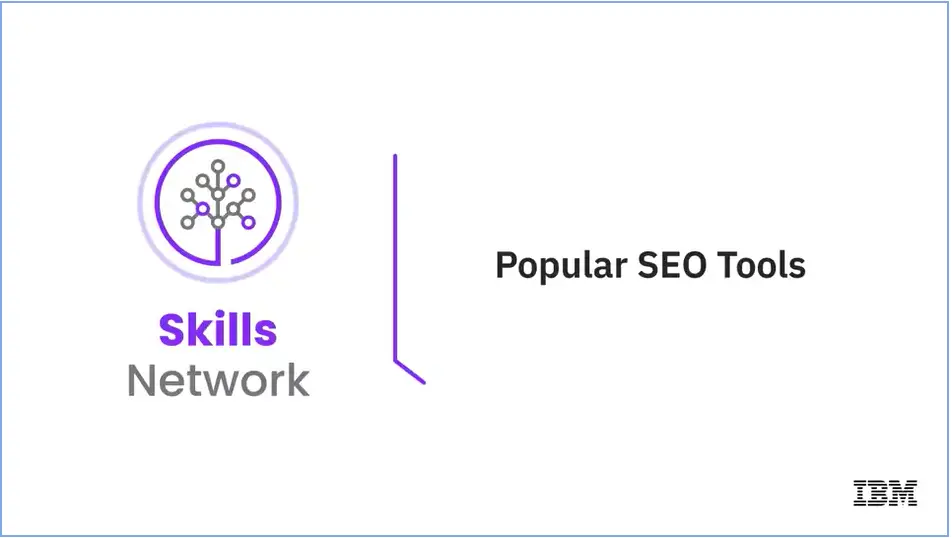{width="5.0in"
height="2.8258552055993in"}

Welcome to "Popular SEO Tools."

<!--~~~~~~~~~~~~~~~~~~~~~~~~~~~~~~~~~~~~~~~~~~~~~~~~~~~~~~~~~~~~~~~~~~~~~~~~~~~~~~~~~~~~~~~~~~~~-->
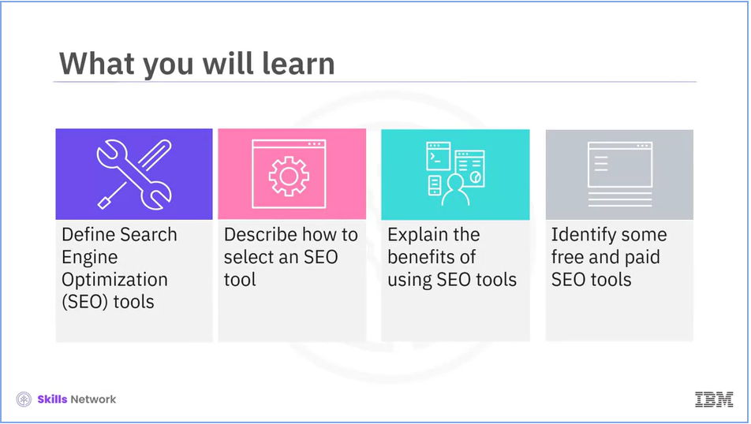{width="5.0in"
height="2.8258552055993in"}

After reading this module (09), you will be able to:

-   Define Search Engine Optimization (SEO) tools,

-   Describe how to select an SEO tool,

-   Explain the benefits of using SEO tools, and

-   Identify some free and paid SEO tools.

<!--~~~~~~~~~~~~~~~~~~~~~~~~~~~~~~~~~~~~~~~~~~~~~~~~~~~~~~~~~~~~~~~~~~~~~~~~~~~~~~~~~~~~~~~~~~~~-->
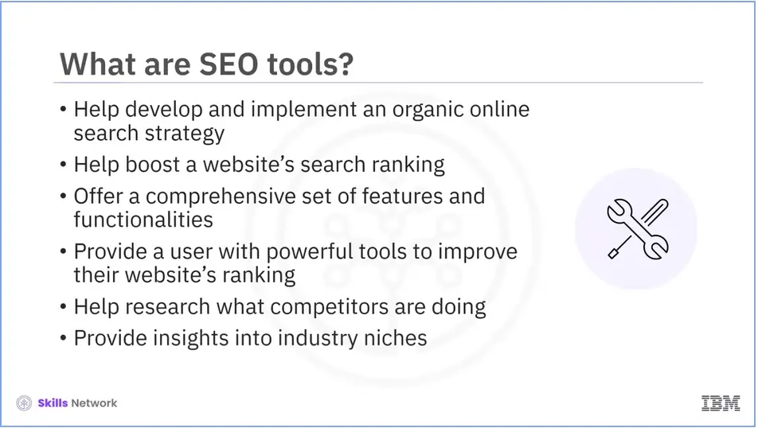{width="5.0in"
height="2.8258552055993in"}

SEO tools enable business owners to know their websites\' overall health
and success. They: Help develop and implement an organic online search
strategy Assist in boosting a website's search ranking. Offer customers
a comprehensive set of features and functionalities. Provide users with
powerful keyword research tools, backlink assistance, rank tracking
tools, and reports, among other things. Enable you to research what your
competitors are doing, and Provide insights into industry niches,
allowing you to identify what works and what doesn\'t.

<!--~~~~~~~~~~~~~~~~~~~~~~~~~~~~~~~~~~~~~~~~~~~~~~~~~~~~~~~~~~~~~~~~~~~~~~~~~~~~~~~~~~~~~~~~~~~~-->
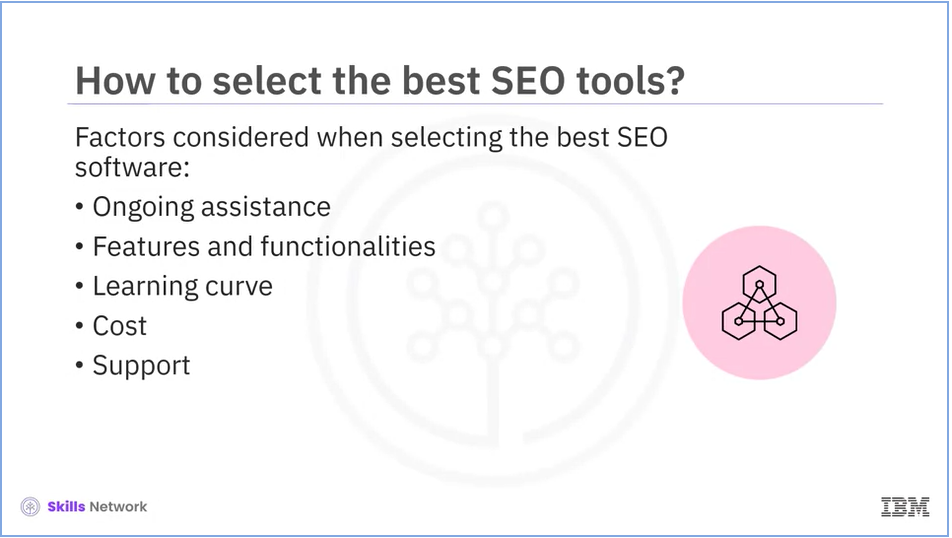{width="5.0in"
height="2.8258552055993in"}

You need to consider a few factors when selecting the best SEO software.
They are: Ongoing assistance Features and functionalities. Learning
curve Cost, and Support.

<!--~~~~~~~~~~~~~~~~~~~~~~~~~~~~~~~~~~~~~~~~~~~~~~~~~~~~~~~~~~~~~~~~~~~~~~~~~~~~~~~~~~~~~~~~~~~~-->
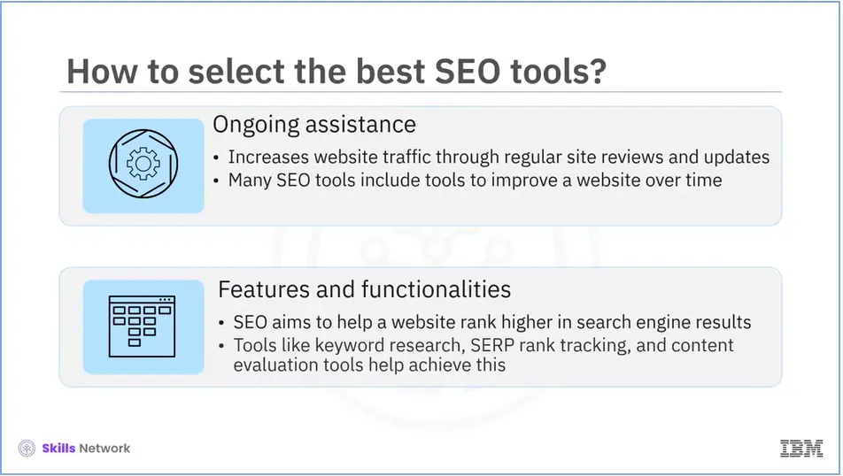{width="5.0in"
height="2.8258552055993in"}

Let's explore each in detail. The main factor to consider is whether you
require ongoing SEO assistance. It is an effective method of increasing
relevant traffic to your website through regular site reviews and
updates. Many of the best SEOs include tools to help you improve your
site over time with ongoing optimizations, site audits, and reports.
Another important factor is features and functionalities. As SEO aims to
help a website rank higher in search engine results, tools like keyword
research, SERP rank tracking, content evaluation tools, competitor
analysis, backlink monitoring, and website audit functionality play an
important role.

<!--~~~~~~~~~~~~~~~~~~~~~~~~~~~~~~~~~~~~~~~~~~~~~~~~~~~~~~~~~~~~~~~~~~~~~~~~~~~~~~~~~~~~~~~~~~~~-->
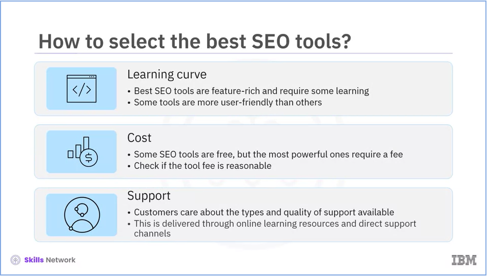{width="5.0in"
height="2.8258552055993in"}

The learning curve is another crucial factor to consider. The best SEO
tools are usually so feature-rich that they require some learning. Some
tools, however, are more user-friendly than others and should be
considered when developing a website as a beginner. You also need to
consider cost when selecting the best SEO tool. While some SEO tools are
free, the most powerful ones require a fee. It is necessary to check if
the tool fee is reasonable compared to the value of the tool. The last
important consideration is support. Customers care about the types and
quality of support available through online learning resources and
direct support channels such as email, chat, and phone.

<!--~~~~~~~~~~~~~~~~~~~~~~~~~~~~~~~~~~~~~~~~~~~~~~~~~~~~~~~~~~~~~~~~~~~~~~~~~~~~~~~~~~~~~~~~~~~~-->
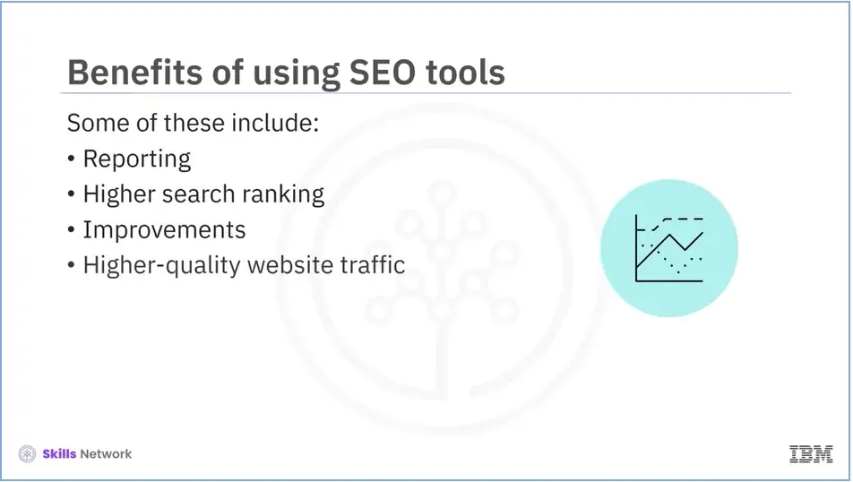{width="5.0in"
height="2.8258552055993in"}

We will now discuss the benefits of using the best SEO tools online.
These include reporting, higher search ranking, improvements, and
higher-quality website traffic.

<!--~~~~~~~~~~~~~~~~~~~~~~~~~~~~~~~~~~~~~~~~~~~~~~~~~~~~~~~~~~~~~~~~~~~~~~~~~~~~~~~~~~~~~~~~~~~~-->
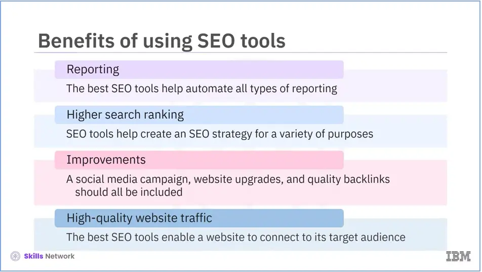{width="5.0in"
height="2.8258552055993in"}

Let's explore each in detail.

Reporting: The best SEO tools help automate all types of reporting by
automatically retrieving data points. They help create custom reports
and can view almost any type of data.

Higher Search Rankings: Many believe that SEO tools are only good for
one thing---higher search rankings. In contrast, they enable you to
create an SEO strategy for various purposes.

Improvements: In addition to the main keyword research tools, it should
also include a social media campaign, website updates, and high-quality
backlinks.

Higher-Quality Website Traffic: The best SEO tools enable a website to
connect to its target audience. This involves focusing on the right
leads, which results in higher-quality website traffic.

<!--~~~~~~~~~~~~~~~~~~~~~~~~~~~~~~~~~~~~~~~~~~~~~~~~~~~~~~~~~~~~~~~~~~~~~~~~~~~~~~~~~~~~~~~~~~~~-->
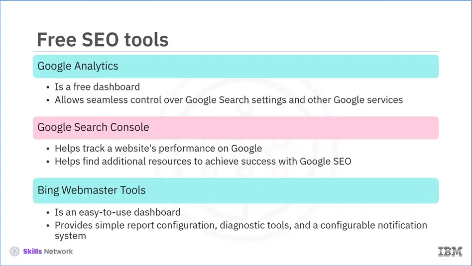{width="5.0in"
height="2.821581364829396in"}

Now, we\'ll discuss some of the best free SEO tools available.

Google Analytics is a free dashboard that allows seamless control over
Google Search settings and other services such as Search Console and
Data Studio.

Google Search Console is a tool to track a website\'s performance on
Google and find additional resources to achieve success with Google SEO.

Bing Webmaster Tools provides an easy-to-use dashboard, simple report
configuration to track SEO results over time, diagnostic tools to
address SEO strategy flaws, and a configurable notification system to
track your Bing account in real time.

<!--~~~~~~~~~~~~~~~~~~~~~~~~~~~~~~~~~~~~~~~~~~~~~~~~~~~~~~~~~~~~~~~~~~~~~~~~~~~~~~~~~~~~~~~~~~~~-->
{width="5.0in"
height="2.821581364829396in"}

PageSpeed Insights is another useful tool that shows how your website
performs on various devices. It is based on Google technology and easily
integrates with other daily SEO tools.

Users who are SEO experts and frequently purchase Google ads should use
Google Keyword Planner. You can improve your keyword settings using this
free tool as it integrates seamlessly into your Google suite of
applications.

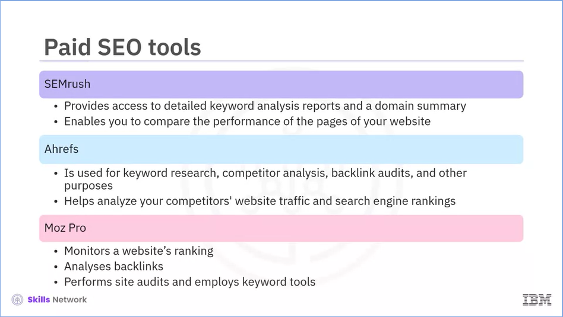{width="5.0in"
height="2.821581364829396in"}

Let's now explore some of the best paid SEO tools available.

The Semrush SEO toolkit provides access to detailed keyword analysis
reports and a domain summary for any domain you manage. It enables you
to compare the performance of your pages to see where you stand compared
to the competition.

Ahrefs is a popular tool for keyword research, competitor analysis,
backlink audits, and other purposes. Using the site audit feature, you
can analyze your competitors\' website traffic and search engine
rankings and use this information to improve your SEO strategies.

Moz Pro monitors a website's ranking, analyses backlinks, performs site
audits, and employs keyword tools.

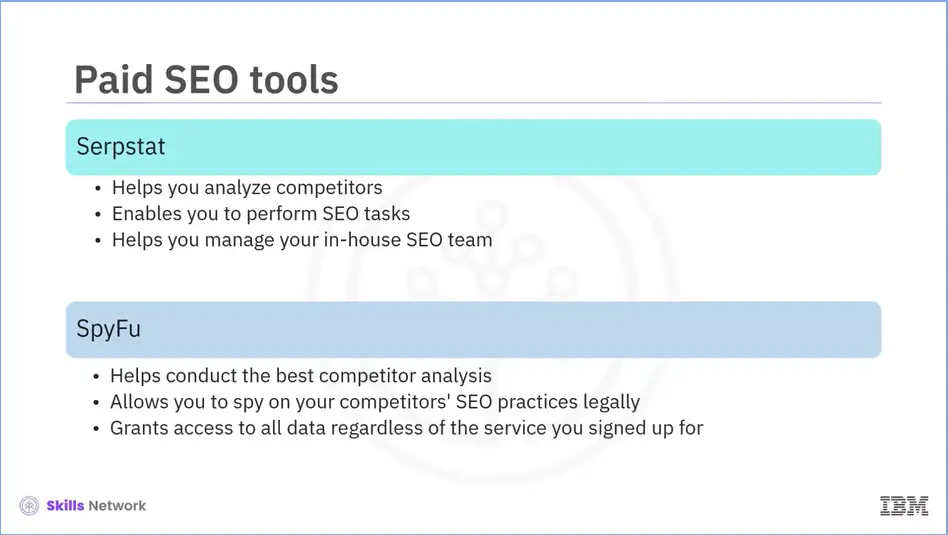{width="5.0in"
height="2.821581364829396in"}

Serpstat is a comprehensive tool that can help you analyze competitors
perform SEO tasks, and manage your in-house SEO team.

SpyFu helps conduct the best competitor analysis. It allows you to
legally spy on your competitors\' SEO practices. Regardless of what kind
of services you sign up for, you will have access to all the data they
uncover.

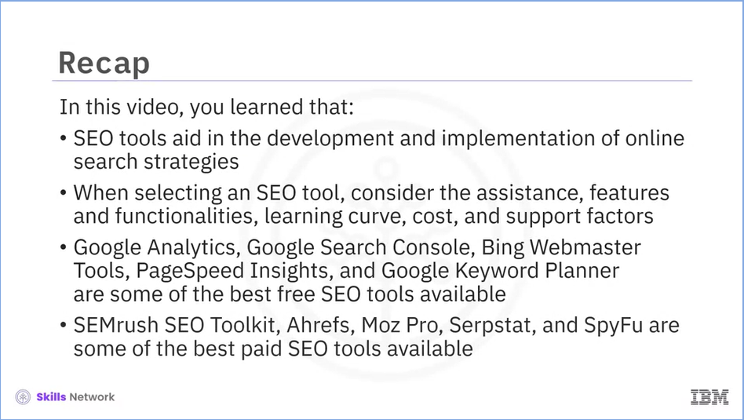{width="5.0in"
height="2.821581364829396in"}

In this module (09), you learned that:

-   SEO tools aid in the development and implementation of online search
    strategies,

-   When selecting an SEO tool, consider the assistance, features and
    functionalities, learning curve, cost, and support factors,

-   Google Analytics, Google Search Console, Bing Webmaster Tools,
    PageSpeed Insights, and Google Keyword Planner are some of the best
    free SEO tools available, and

-   SEMrush SEO Toolkit, Ahrefs, Moz Pro, Serpstat, and SpyFu are some
    of the best-paid SEO tools available.

# 10. SEO Strategies

{width="5.0in"
height="2.8322648731408573in"}

Welcome to SEO Strategies.

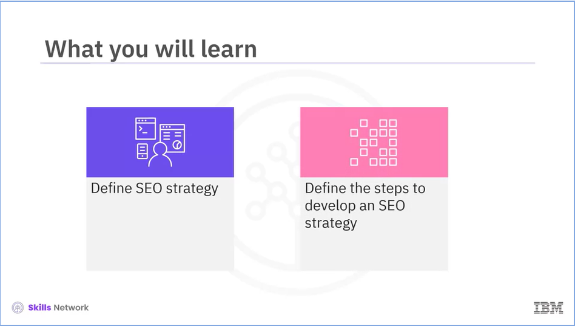{width="5.0in"
height="2.8322648731408573in"}

After reading this module (10), you will be able to:

-   Define an SEO strategy, and

-   Define the steps to develop an SEO strategy.

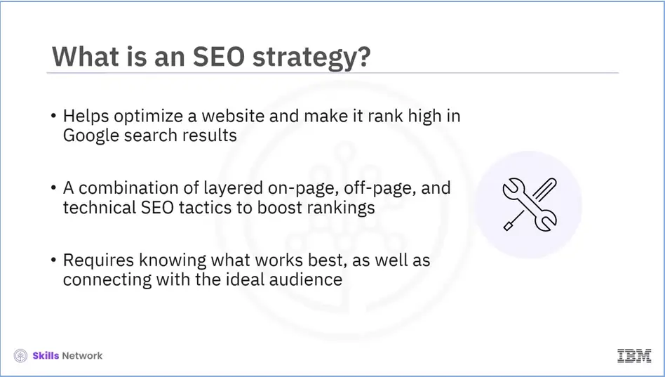{width="5.0in"
height="2.8322648731408573in"}

An SEO strategy is a plan of action for a company to optimize its
website and rank high in Google search results. It\'s a combination of
layered on-page, off-page, and technical SEO tactics designed to boost
rankings for primary and secondary keywords, pages, and websites.
Knowing what works best for you and your business, as well as connecting
with your ideal audience, is an important part of developing an SEO
strategy.

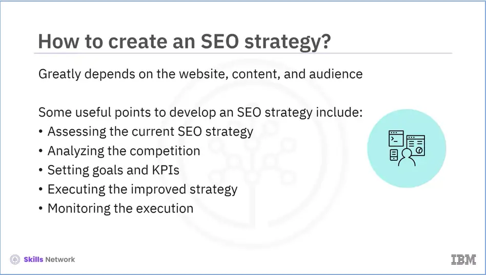{width="5.0in"
height="2.8322648731408573in"}

There is no one-size-fits-all approach to developing an SEO strategy, as
it greatly depends on the website, content, and audience. However, some
useful points should be considered before developing an SEO strategy to
make your website more searchable online. These include: Assessing the
current SEO strategy, Analyzing the competition, Setting goals and KPIs,
Executing the improved strategy, and Monitoring the execution.

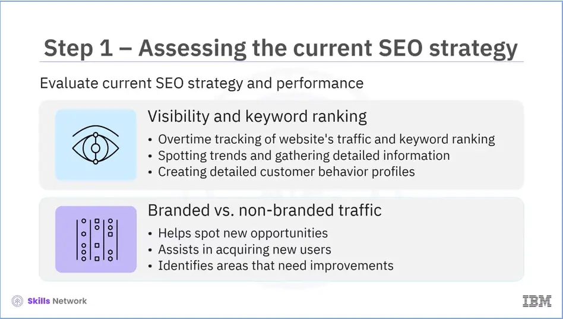{width="5.0in"
height="2.8322648731408573in"}

The first step is to evaluate your current SEO strategy and its
performance. You should assess your website\'s organic visibility,
keyword rankings, and branded vs. non-branded traffic split.

There are several tools available online to show you this information.
You can use them to track the performance of your website's organic
traffic and keyword rankings over time. You can also easily spot trends
and gather detailed information on all aspects of the business to
maximize sales and profits by conducting business research. Customer
research will reveal how current customers perceive your company and
will allow you to create detailed purchasing behavior profiles.
Understanding the difference between branded and non-branded traffic on
your website will help you identify opportunities. Increasing
non-branded traffic allows you to acquire new users who may not have
previously heard of you. You\'ll also be able to identify areas that
need improvement for your next SEO strategy.

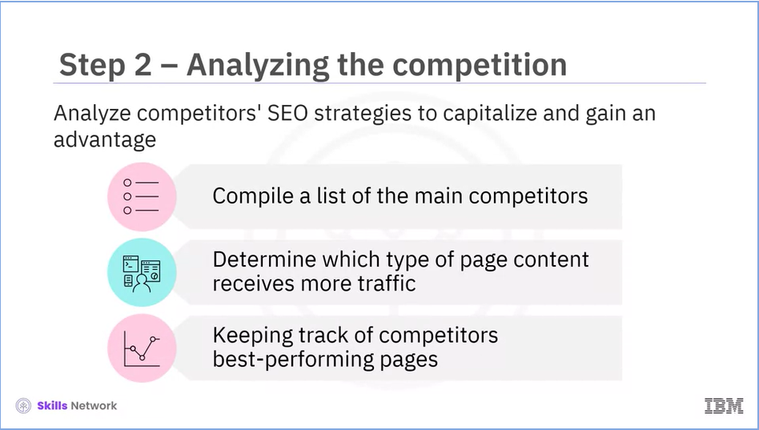{width="5.0in"
height="2.8322648731408573in"}

After you\'ve assessed your current SEO strategy, you should analyze the
competitors\' SEO strategies. This will give you a sense of what is and
isn\'t working for them, as well as areas where you can capitalize to
gain an advantage. Begin by compiling a list of your main competitors,
which should include those in your service area and the ones who
consistently rank high in the SERPs for your main keywords. Next, you
need to determine which of their pages receive the most traffic. This
can help you decide what type of content should be added to your website
to improve your ranking. Keep track of whether the competitors'
best-performing pages are blogs, product pages, or other pages.

Then, you need to identify how well their keywords rank. Analyzing their
keyword rankings will tell you if your competitors are ranked for
keywords that you are not. This will help you identify opportunities to
boost your keyword rankings.

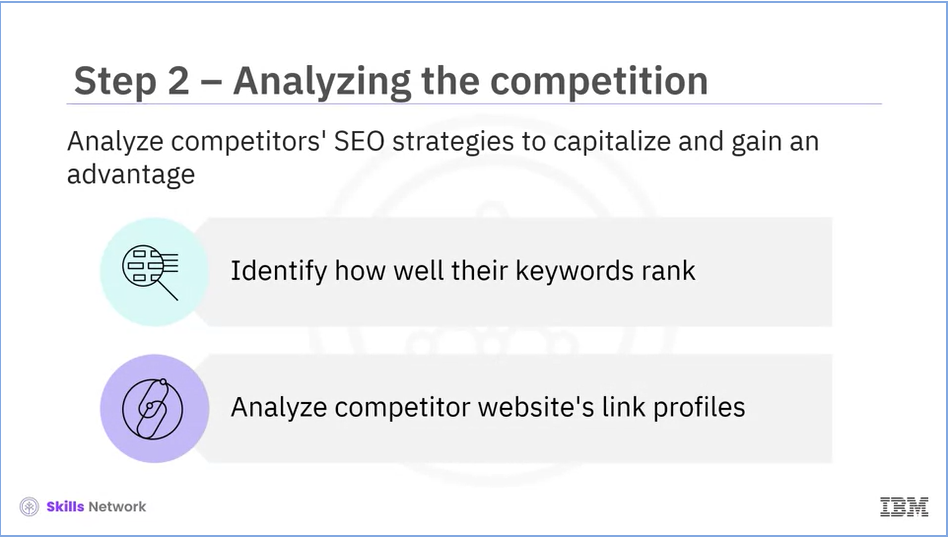{width="5.0in"
height="2.8322648731408573in"}

Finally, you need to analyze the link profiles of your competitors\'
websites. This will help you understand where their backlinks are coming
from and identify the link gap between their website and yours. This
will enable you to develop your link-building strategy to build a strong
backlink profile.

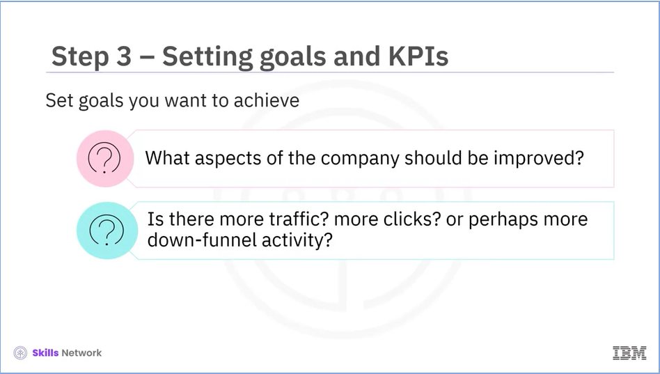{width="5.0in"
height="2.8322648731408573in"}

After your strategy is developed, you need to set goals you want to
achieve. Like: What aspects of the company do you want to improve? and
Is there more traffic? How about more clicks or perhaps more down-funnel
activity?

{width="5.0in"
height="2.8322648731408573in"}

Addressing these questions will help you consider what readers might be
looking for that would persuade them to visit or interact with your
website.

Keeping these metrics in mind throughout the development of your
business strategy will allow you to track your progress in real-time.
Each goal should be mapped to a unique tactic that you can employ to
help optimize your strategy, which is why knowing your goals ahead of
time is crucial.

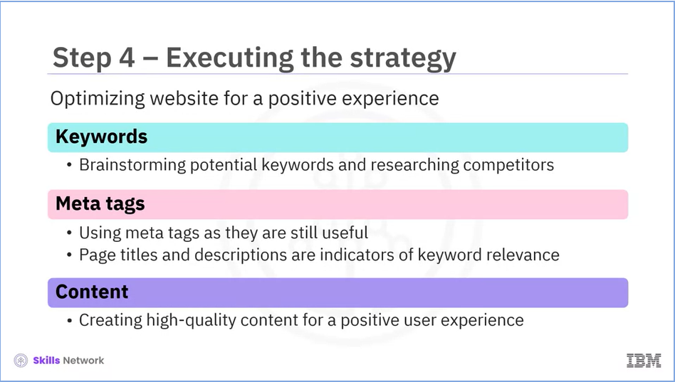{width="5.0in"
height="2.8322648731408573in"}

After your goals are set, you should begin optimizing your website for
positive page experience. Begin by brainstorming potential keywords and
researching competitors using the Google AdWords keyword tool. Remember
that meta tags are still useful in SEO.

Google considers the title and description of your page to be an
indication of keyword relevance. You will be able to effectively rank
your keywords while also providing a positive user experience if you
create high-quality content.

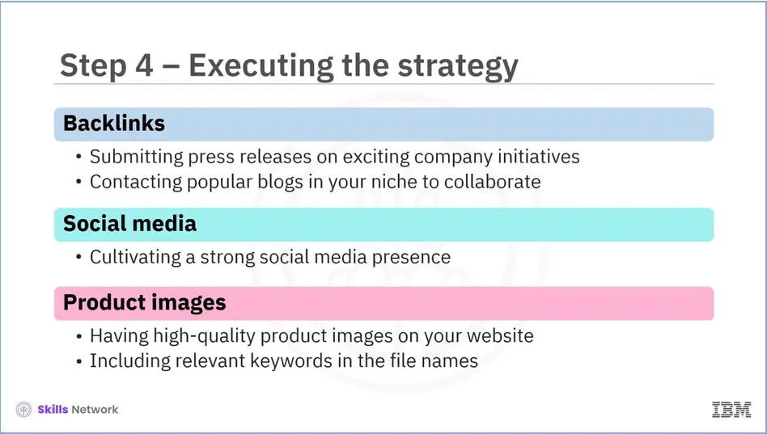{width="5.0in"
height="2.8322648731408573in"}

Next, on a monthly or bimonthly basis, you should submit press releases
on any company initiatives and contact popular blogs in your niche to
see how you can collaborate to get a backlink from their website.

Many content websites are focused primarily on community. As a result,
you should cultivate a strong social media presence that sends signals
of authority and influence to search engines. Finally, note that when
customers search for products online, they frequently look at both web
and image results. If you have high-quality product images on your
website and include relevant keywords in the file names, the images will
rank higher in search engines.

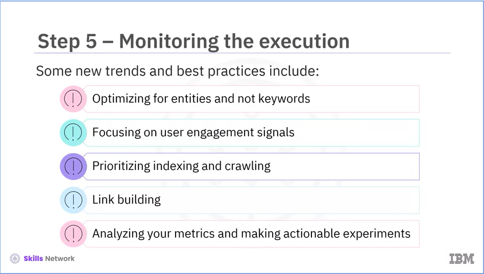{width="5.0in"
height="2.8322648731408573in"}

Finally, you need to be on the lookout for new trends and best
practices. Some of these include:

Optimizing for entities (not keywords) -- Focus on building pages around
topics and including topic variants. Focusing on user engagement
signals, particularly speed. Prioritizing indexing and crawling -- The
number of pages indexed is increasing exponentially, and Google is
shifting from indexing everything to indexing quality content. Link
building -- Focus on gaining authoritative links that your competitors
do not already have. Analyzing your metrics and making actionable
experiments based on your findings.

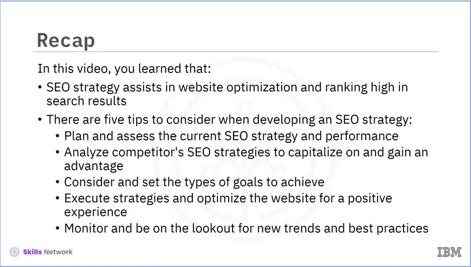{width="5.0in"
height="2.8322648731408573in"}

In this module (10), you learned that:

-   SEO strategy assists in website optimization and ranking high in
    search results, and

-   There are five tips to consider when developing an SEO strategy:

    -   Plan and assess the current SEO strategy and performance,

    -   Analyze competitor's SEO strategies to capitalize on and gain an
        advantage,

    -   Consider and set the types of goals to achieve,

    -   Execute strategies and optimize the website for a positive
        experience, and

    -   Monitor and be on the lookout for new trends and best practices.

# 11. Mobile Friendly SEO

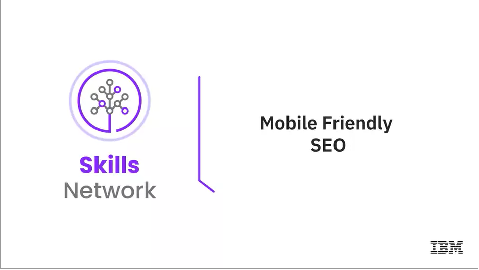{width="5.0in"
height="2.821581364829396in"}

Welcome to "Mobile friendly SEO."

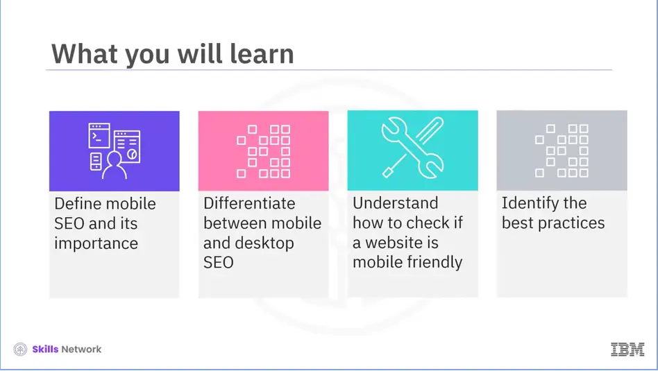{width="5.0in"
height="2.821581364829396in"}

After reading this module (11), you will be able to:

-   Define mobile SEO and its importance,

-   Differentiate between mobile and desktop SEO,

-   Describe how to check if a website is mobile friendly, and

-   Identify the best practices.

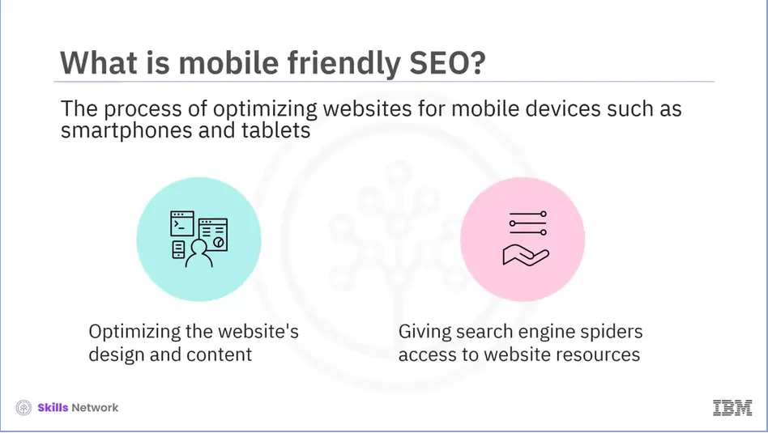{width="5.0in"
height="2.821581364829396in"}

Mobile SEO is the process of optimizing websites for mobile devices such
as smartphones and tablets. This includes optimizing the
website\'s design and content, as well as making the website resources
available to search engine spiders.

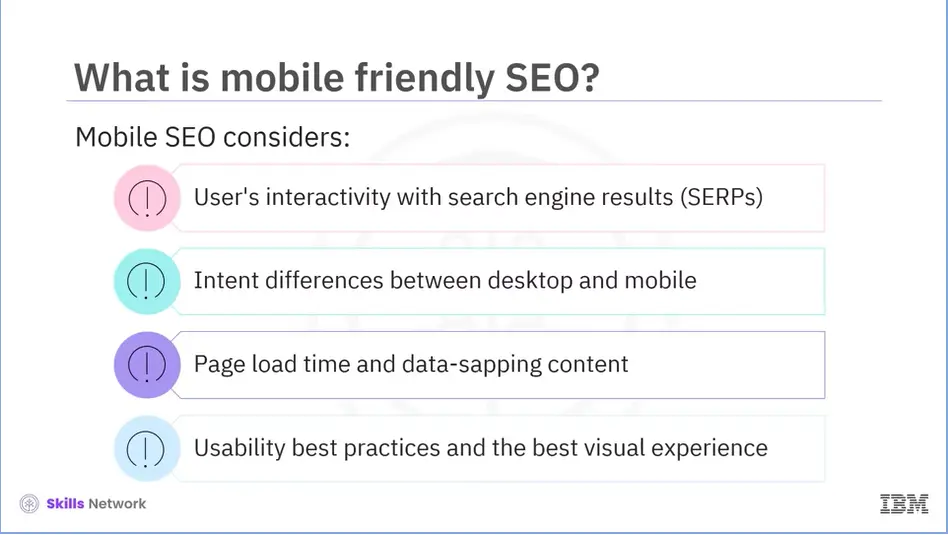{width="5.0in"
height="2.821581364829396in"}

Mobile SEO considers:

How a user interacts with search engine results (SERPs) on a mobile
device versus a desktop computer.

The differences in intent between desktop and mobile for the same query.

If the pages load quickly and do not contain data-sapping resources,
such as bloated images and extra script,

and How to include usability best practices for mobile content access
and provide the best visual experience

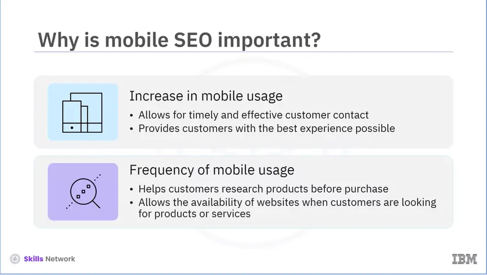{width="5.0in"
height="2.821581364829396in"}

Due to significant increase in mobile usage, most users access a
website through a mobile device rather than a desktop. This makes mobile
SEO important because it allows you to reach your customers at the right
time and provide them with the best possible experience. According to
studies, people frequently use the nearest device to look something up
quickly, which is usually their smartphone. They use it to research
products before making purchases. According to Google research,
smartphone users are more likely to purchase than desktop users. It is
your responsibility to be available when they are looking for your
products or services.

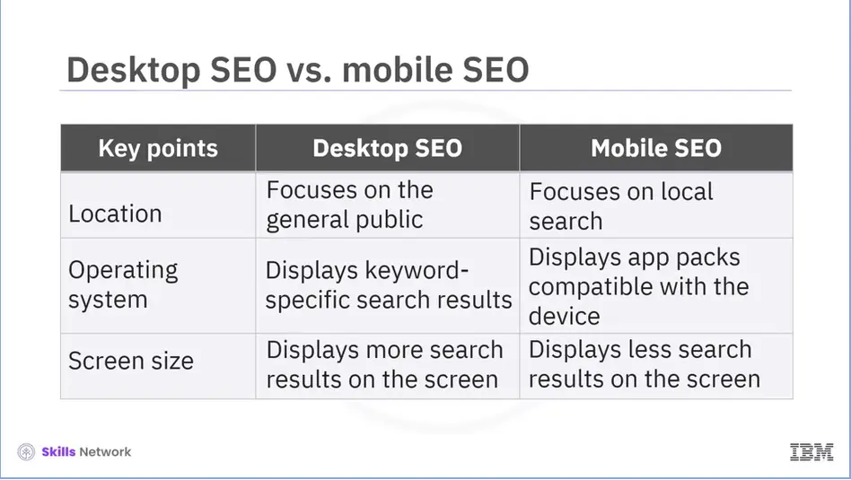{width="5.0in"
height="2.821581364829396in"}

Let's now discuss the significant differences between desktop and mobile
SEO.

Location - Desktop SEO focuses on the general public, with no geographic
restrictions. While most mobile users are looking for local results,
mobile SEO is typically focused on local searches.

Operating system - Depending on the device you are using; different
results may appear for the same search query. This is because Google
considers the mobile device\'s operating system when displaying the most
relevant search results. When the keyword has a strong app-oriented
intent, search engines display app packs that are compatible with the
device.

Screen size - The differences in search layout for desktop and mobile
due to screen space can also affect how people view your website.
Because mobile device screens are vertical and much smaller than desktop
screens, search results have a fraction of the search space that a
desktop screen has.

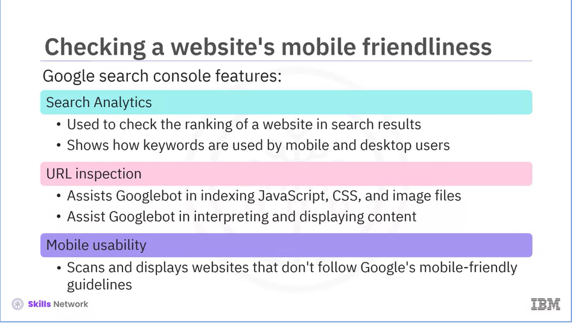{width="5.0in"
height="2.821581364829396in"}

The best tool to use to determine whether your website is
mobile-friendly is Google Search Console. Its search tools are extremely
useful if you want to know how your website ranks in search results. For
example, you can see how mobile and desktop users use keywords to find
what they need by using the Search Analytics feature. Googlebot must be
able to crawl your JavaScript, CSS, and image files in order to properly
index them. URL Inspection is a useful tool in Search Console for this.
By using this tool, you can see how Googlebot interprets and displays
your content. The Mobile Usability tool is another Google Search Console
feature that scans your site and displays a list of posts and pages that
do not adhere to Google\'s mobile-friendly guidelines.

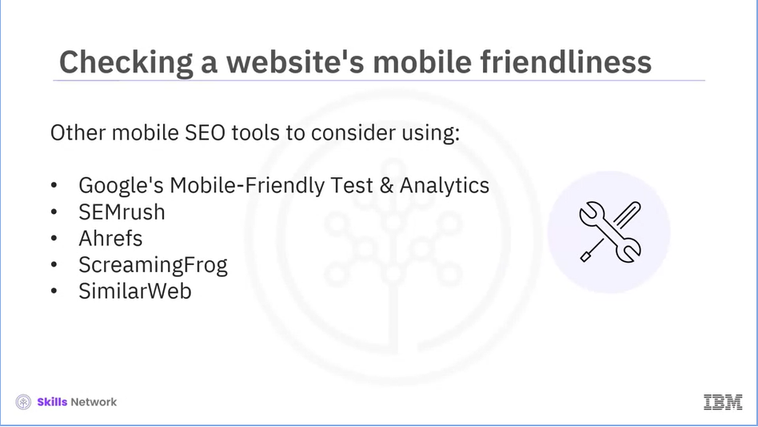{width="5.0in"
height="2.821581364829396in"}

Other excellent mobile SEO tools include Google\'s Mobile-Friendly Test
& Analytics, SEMrush, Ahrefs, ScreamingFrog, and SimilarWeb.

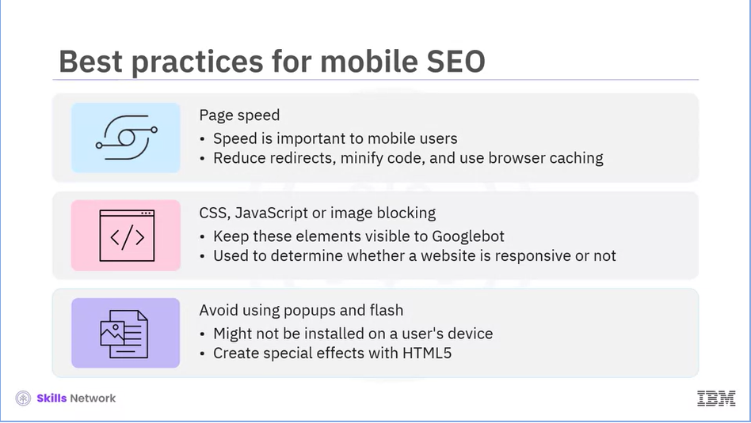{width="5.0in"
height="2.821581364829396in"}

If your site is already well optimized for search engines, there are
only a few things to consider when optimizing for mobile devices. They
are as follows:

Page speed - Because of hardware and connectivity issues, mobile users
value page speed even more than desktop users. Aside from optimizing
images, you should also minify code, use browser caching, and reduce
redirects.

CSS, JavaScript, or image blocking - The Smartphone Googlebot wishes to
be able to see and categorize the same content as humans. So don\'t try
to hide these elements. They are also important in determining whether
you have a responsive site or a different mobile solution.

Avoid Popups and Flash - The plugin may not be available on your user\'s
phone, causing them to miss out on all the fun. Use HTML5 instead if you
want to create special effects.

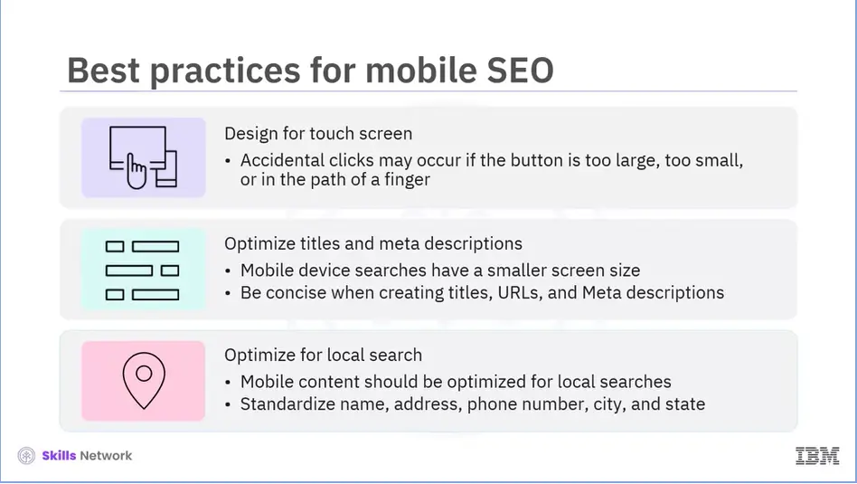{width="5.0in"
height="2.821581364829396in"}

Design for Touch screen - Touch screen navigation can result in
accidental clicks if your buttons are too big, too small, or in the path
of a finger attempting to scroll the page. Optimize titles and meta
descriptions - Keep in mind that when a user searches on a mobile
device, you have less screen space to work with. Be concise when
creating titles, URLs, and Meta descriptions to showcase your best work
in SERPS. Optimize for local search - If your business has a local
element, make sure your mobile content is optimized for local search.
This includes standardizing your name, address, and phone number, as
well as including your city and state name in the metadata of your
website.

{width="5.0in"
height="2.821581364829396in"}

Mobile site configuration - Choosing whether to use a responsive,
dynamic serving, or separate site configuration is an important decision
when setting up a site. Google prefers responsive design, but all three
options are acceptable as long as they are properly configured. Finally,
create a separate mobile URL - Another option is to create a separate
site for mobile users. This enables you to create entirely unique
content for mobile visitors.

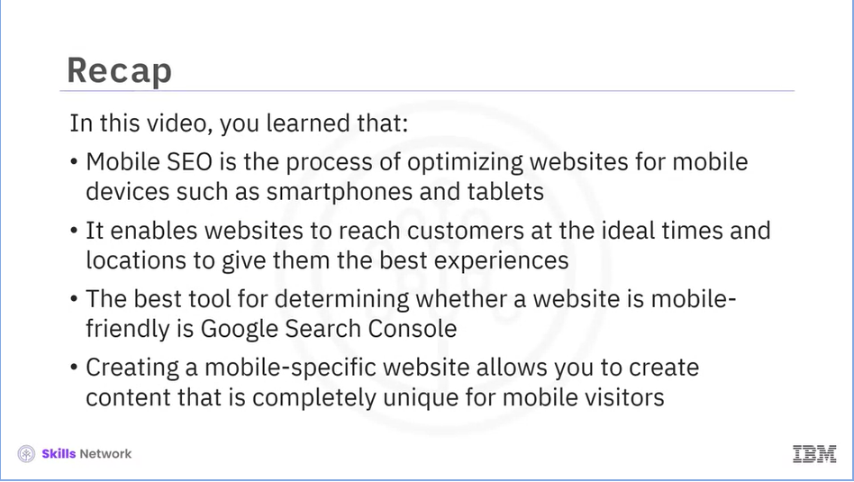{width="5.0in"
height="2.821581364829396in"}

In this module (11), you learned that:

-   Mobile SEO is the process of optimizing websites for mobile devices
    such as smartphones and tablets,

-   SEO enables websites to reach customers at the ideal times and
    locations to give them the best experiences,

-   Best tool for determining whether a website is mobile-friendly is
    Google Search Console,

-   Creating a mobile-specific website allows you to create content that
    is completely unique for mobile viewers.

# 12. Page Optimization for SEO

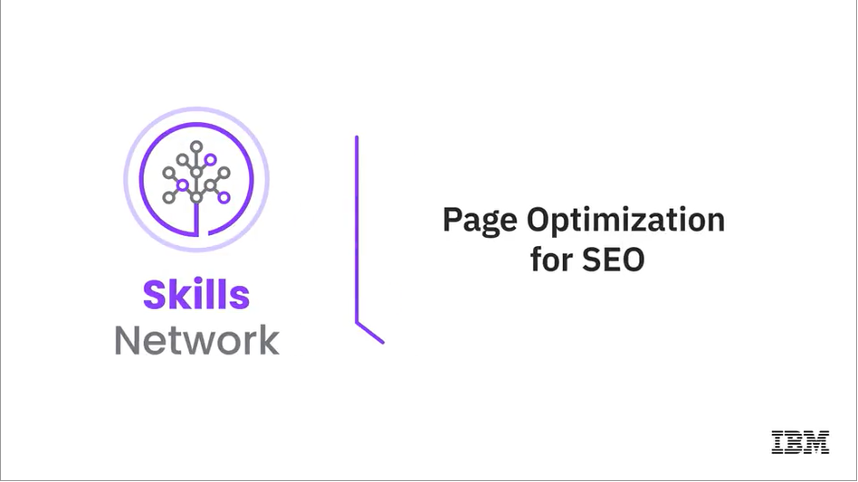{width="5.0in"
height="2.8114315398075242in"}

Welcome to "Page optimization for SEO."

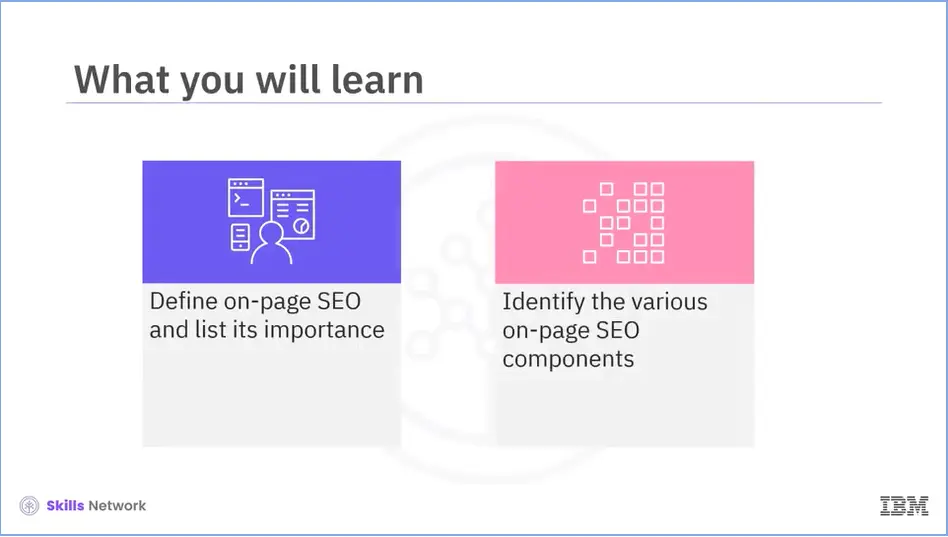{width="5.0in"
height="2.8322648731408573in"}

After finishing this module (12), you will be able to:

-   Define on-page SEO and list its importance, and

-   Identify the various on-page SEO components.

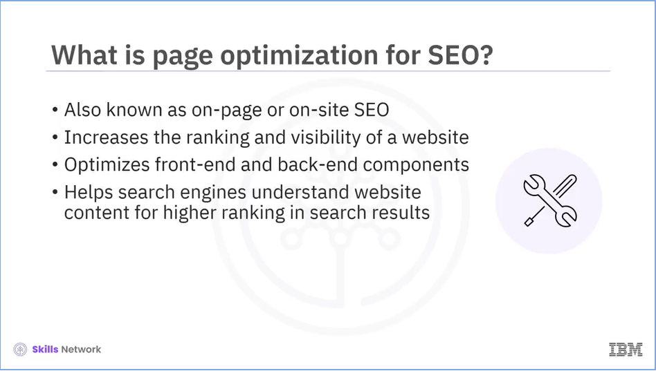{width="5.0in"
height="2.8322648731408573in"}

Page Optimization for SEO, also known as on-page SEO or on-site SEO, is
the process of improving a website\'s ranking and visibility in search
engines by optimizing various front-end and back-end components such as
page speed, keyword density, and external backlinks. Search engines like
Google use keywords and other on-page SEO cues to determine whether a
page matches a user\'s search intent. The better a search engine
understands a website\'s content, the higher it will rank in the search
results, resulting in a more organic traffic, conversions, and revenue.

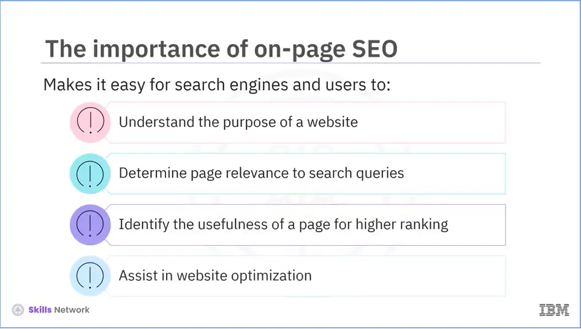{width="5.0in"
height="2.8322648731408573in"}

On-page SEO aims to make it easy for both search engines and users to:
Understand the purpose of a website. Determine whether the page is
relevant to one or more search queries. Identify whether the page is
useful enough to rank higher on a SERP, and Assist in website
optimization by informing Google about how the website adds value to
visitors and customers.

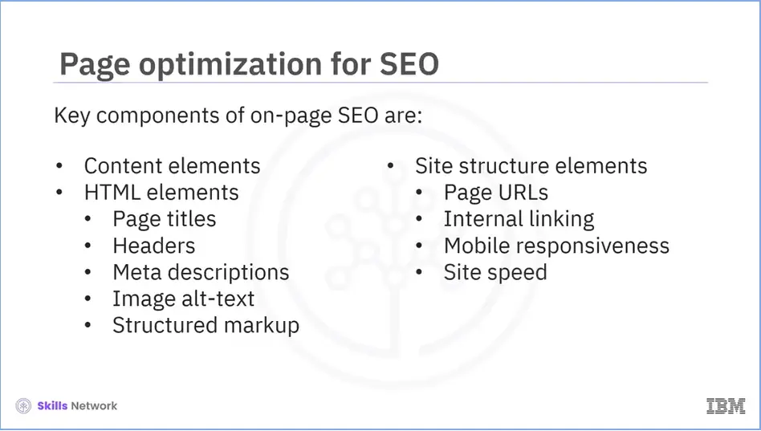{width="5.0in"
height="2.8322648731408573in"}

Text and HTML changes are required to optimize a website page fully. The
following are the key components of on-page SEO. Content elements, HTML
elements which include: Page Titles, Headers, Meta Descriptions, Image
Alt-text, and Structured Markup. And Site structure elements which
include: Page URLs, Internal Linking, Mobile Responsiveness, and Site
Speed.

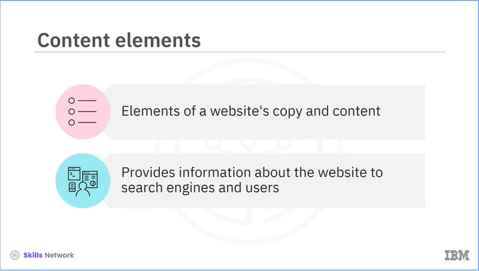{width="5.0in"
height="2.8322648731408573in"}

Let's explore each in detail. The first type of on-page SEO component
that we are going to discuss is Content elements. Content elements are
the elements of your website\'s copy and content. It provides
information about your website and business to both search engines and
readers.

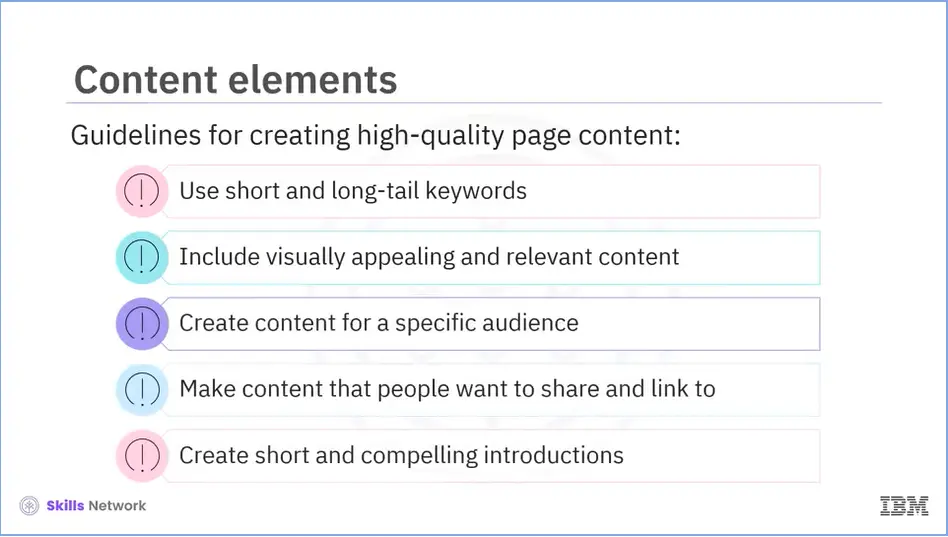{width="5.0in"
height="2.8322648731408573in"}

Let\'s consider some guidelines for creating high-quality page content.
Use short and long-tail keywords naturally Include visually appealing
and relevant content. Create content for your specific buyer persona(s).
Make content that people will want to share and link to. Create brief,
compelling introductions. Clearly articulate both the problem and your
solution.

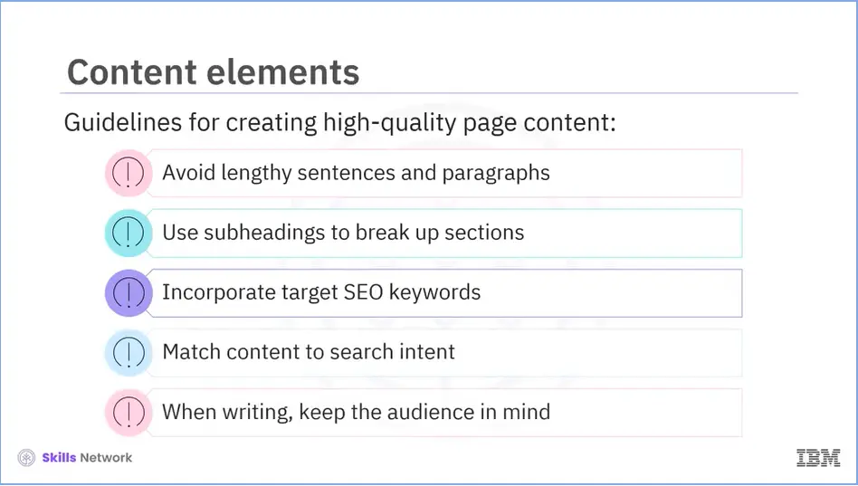{width="5.0in"
height="2.8322648731408573in"}

Avoid using lengthy sentences and paragraphs. However, if you eliminate
paragraphs entirely, your content will not flow properly. Break up
sections that are longer than 300 words using subheadings. Naturally
incorporate the target SEO keyword throughout the page copy. Match
content to search intent, and always write with your readers in mind.

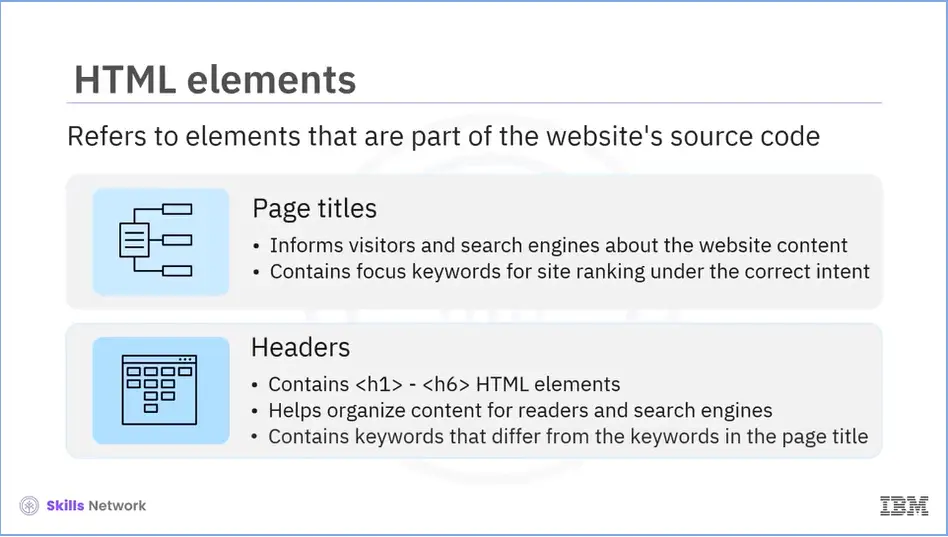{width="5.0in"
height="2.8322648731408573in"}

Another type of on-page SEO component is HTML elements. It refers to the
elements in your source code. Let's discuss each of them in detail. One
of the most important SEO elements are your web page titles, also known
as title tags.

Titles inform both visitors and search engines about what is available
on the corresponding pages. Make sure to include the focus keyword for
each page in the title to ensure your site pages rank for the correct
intent.

The HTML elements h1, h2, till h6 are referred to as headers, also known
as body tags. These tags help web developers organize content for
readers, and search engines determine which parts of your content are
the most important and relevant based on search intent. Include
important keywords in your headers, but not the same ones as in your
page title. In your h1 and h2 headers, include your most important
keywords.

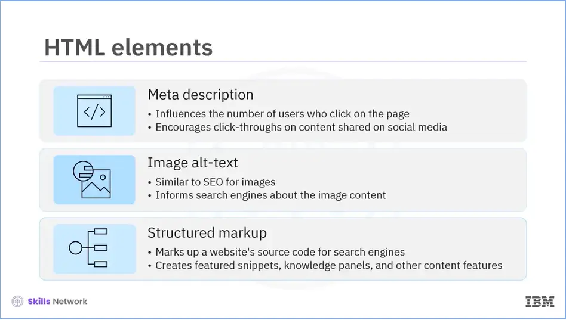{width="5.0in"
height="2.8322648731408573in"}

Meta descriptions are the short page descriptions that appear beneath
the title in search results. It can influence whether or not users click
on your page. When your content is shared on social media, meta
descriptions can be copied over to encourage click-throughs from there
as well.

Image alt-text is similar to SEO for images. It informs Google and other
search engines about the content of the images, which is important
because Google now delivers nearly as many image-based results as
text-based results.

Structured markup, also known as structured data, is the process of
\"marking up\" a website's source code so that Google can easily find
and understand different elements of the content. Structured markup is
responsible for the featured snippets, knowledge panels, and other
content features that appear when you search for something on Google.

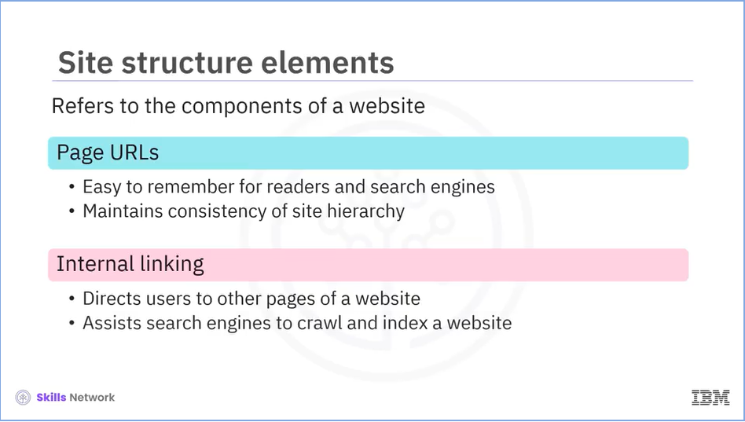{width="5.0in"
height="2.8322648731408573in"}

The last type of on-page SEO component is Site structure elements. It
refers to the components of your website and site pages. Let's discuss
each of them in detail.

Your page URLs should be easy to remember for both readers and search
engines. They are also important for maintaining the consistency of your
site hierarchy as you create subpages, blog posts, and other types of
internal pages.

The process of hyperlinking to other useful pages on your website is
known as internal linking. Internal linking is important for on-page SEO
because it directs readers to other pages on your website, which keeps
them on your site longer and tells Google that your site is valuable and
helpful. Besides that, the more time visitors spend on your website, the
more time Google has to crawl and index your site pages. This allows
Google to learn more about your website and potentially rank it higher
in search engine results pages.

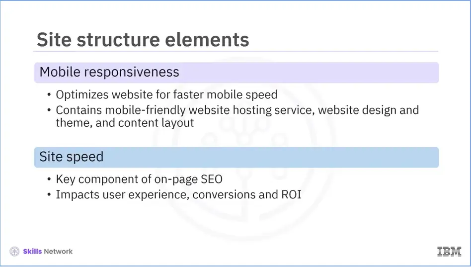{width="5.0in"
height="2.8322648731408573in"}

Mobile responsiveness is important. Sites that are optimized for faster
mobile speeds are now given preference by Google. It is critical to
select a mobile-friendly website hosting service, website design and
theme, and content layout.

Your site must load quickly, whether viewed on a mobile device or a
desktop computer. On-page SEO relies heavily on page speed. Google is
concerned with the user experience first and foremost. Visitors are
unlikely to stick around if your site loads slowly or haphazardly.
Moreover, site speed has an impact on conversions and ROI.

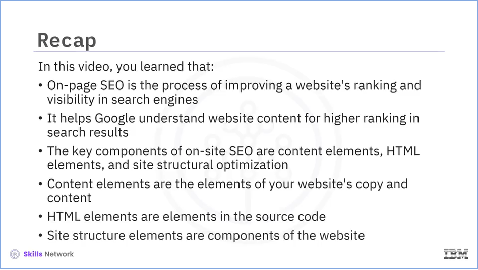{width="5.0in"
height="2.8322648731408573in"}

In this module (12), you learned that:

-   On-page SEO is the process of improving a website\'s ranking and
    visibility in search engines,

-   It helps Google understand website content for higher ranking in
    search results,

-   The key components of on-site SEO are: Content Elements, HTML
    Elements, and Site Structural Optimization,

-   Content elements are the elements of your website\'s copy and
    content,

-   HTML elements are the elements of your source code, and

-   Site structure elements are components of the website.

# 13. Running Campaigns and Tracking Results

{width="5.0in"
height="2.848290682414698in"}

Welcome to "Running Campaigns and Tracking Results."

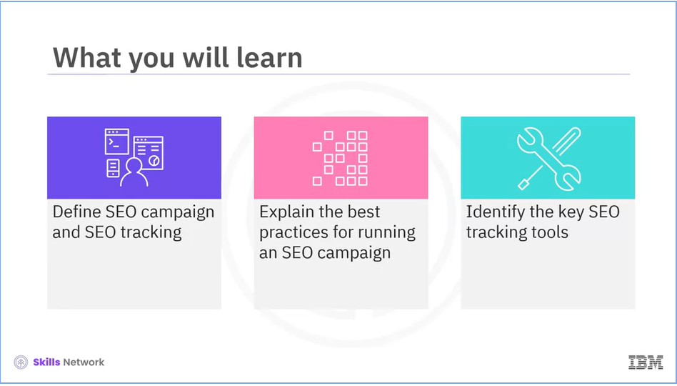{width="5.0in"
height="2.848290682414698in"}

After reading this module (13), you will be able to:

-   Define SEO campaign and SEO tracking,

-   Explain the best practices for running an SEO campaign, and

-   Identify the key SEO tracking tools.

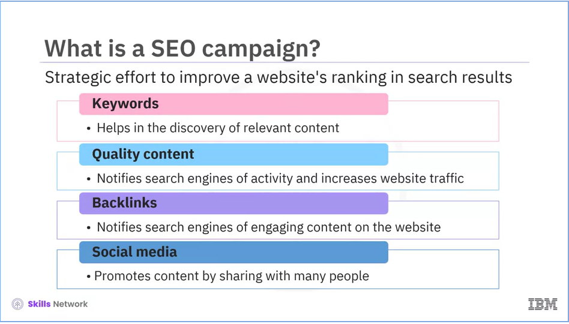{width="5.0in"
height="2.848290682414698in"}

An SEO campaign is a planned effort to raise a website\'s ranking in
search results. This includes optimizing webpages for specific keywords,
creating quality content, building backlinks, and promoting the site via
social media. Keywords help in the discovery of relevant content on your
website and are used to predict how much traffic you will receive from
search engines. Regularly updating your website informs search engines
that you are active and helps boost your website. Backlinks are external
links that direct to your website. When someone shares a link to your
website, search engines learn that you have interesting content. Social
media platforms are excellent for promoting your content. People enjoy
sharing interesting articles and videos, so this is a great way to reach
many people.

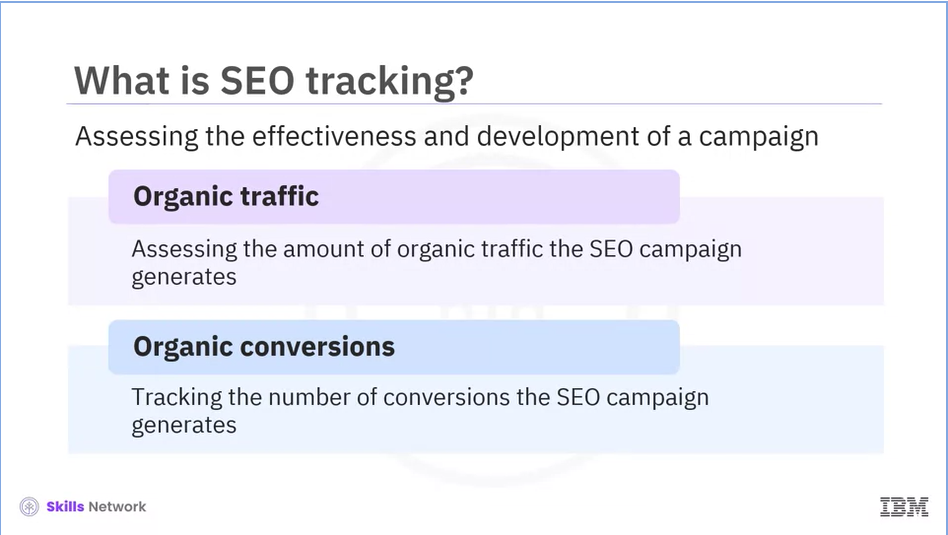{width="5.0in"
height="2.821581364829396in"}

SEO tracking is the process of assessing the effectiveness and
development of a campaign. This step is used to establish specific and
measurable campaign goals. Here are some of the key metrics.

Organic Traffic: One of the best indicators of an SEO campaign\'s
effectiveness is the amount of organic traffic it generates for a
website.

Organic Conversions: One of the most effective ways to assess the
quality of organic traffic is to track the number of conversions it
generates. To track conversions and the conversion rate from organic
traffic, create a relevant \"Goal\" in Google Analytics.

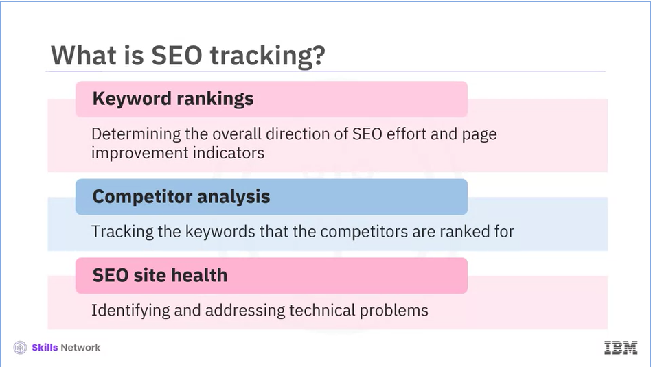{width="5.0in"
height="2.821581364829396in"}

Keyword Rankings: Daily keyword tracking is an excellent way to stay on
top of the overall direction of the SEO efforts and also provides a
clear snapshot of which pages can be improved.

Competitor Analysis: You can identify new opportunities to rank your own
website by tracking the keywords your competitors are ranking for, their
domain authority, and other SEO metrics.

SEO Site Health: One important ranking factor is the site\'s SEO
friendliness, which includes having a way to identify and address common
technical problems.

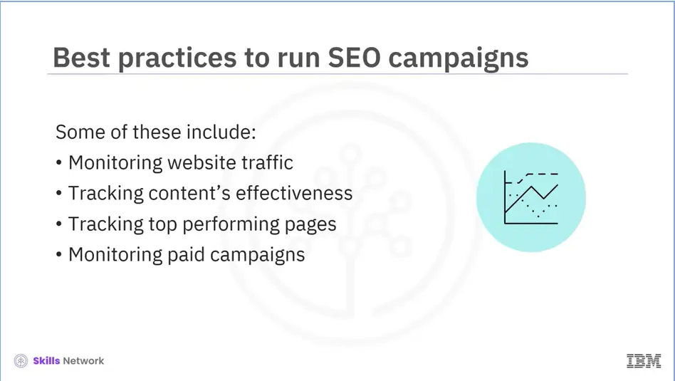{width="5.0in"
height="2.821581364829396in"}

When you use SEO in your content, you can increase organic traffic to
your website. There are a few best practices that can assist you in
running an SEO campaign smoothly. They are as follows:

Monitoring website traffic, Tracking content's effectiveness, Tracking
top-performing pages, and Monitoring paid campaigns.

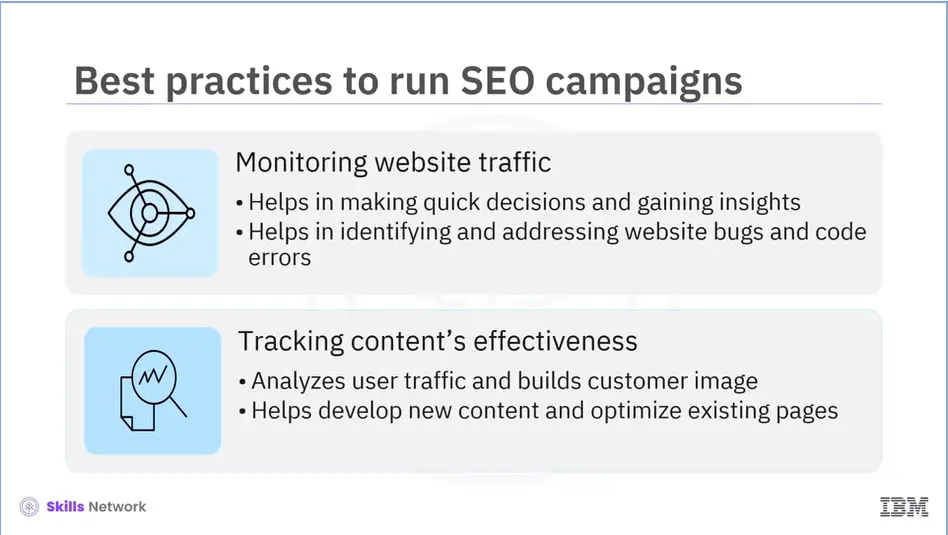{width="5.0in"
height="2.821581364829396in"}

Monitoring website traffic can help you make quick decisions and gain
immediate insights. Unusual spikes or drops, for example, can be caused
by website bugs or changes to the code in a recent update. Keeping an
eye on these numbers daily allows you to quickly identify and address
such issues. SEO\'s primary function is to increase visibility in search
results and direct visitors to the website. Analyzing search engines as
a traffic source can provide the data required to build an image of a
customer\'s behavior and intent. Knowing your overall traffic and which
pages are being visited will assist you in developing new content and
optimizing what you already have.

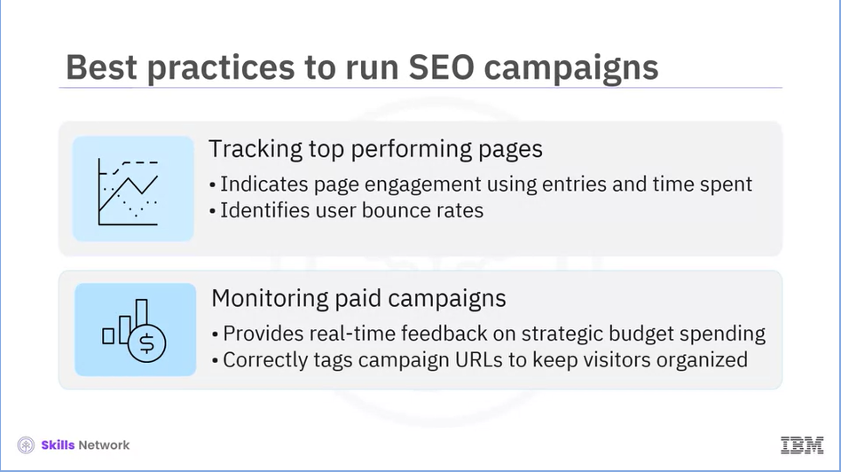{width="5.0in"
height="2.806089238845144in"}

It\'s handy to have all of the data about individual page performance in
one place. Entries and time on a page indicate how engaging your content
is, while bounce rate indicates whether users continue browsing your
site or leave. When it comes to paid campaigns, ensuring that your
budget is spent strategically requires real-time feedback that provides
clear results and insights. Tagging campaign URLs correctly is a sure
way to avoid cluttered reports and keep incoming visitors organized.

{width="5.0in"
height="2.806089238845144in"}

Now that you know the best practices for running an SEO campaign, here
are two key SEO tracking tools to help you manage and track the results
of your website. They are: Google Analytics and Google Search Console.

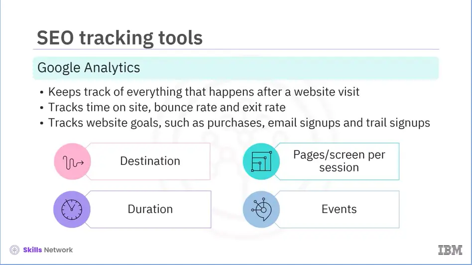{width="5.0in"
height="2.806089238845144in"}

Google Analytics can be viewed as an SEO tracking tool for everything
that happens after someone visits your website. This includes SEO
metrics such as time on site, bounce rate, and exit rate, among others.
Setting up Goals in Google Analytics allows you to track important
website events such as purchases, email signups, trial signups, and any
other event you want to track. There are four types of custom goals to
consider when creating one: Destination: This goal considers a page view
or screen view to be a conversion. Duration: This metric measures user
engagement by considering a conversion to be the minimum session
duration. Pages/screens per session: This metric assesses user
engagement by identifying conversions as users who view more than a set
number of pages or screens per session. Event: This classifies a
specific user interaction with your website or app as a conversion.

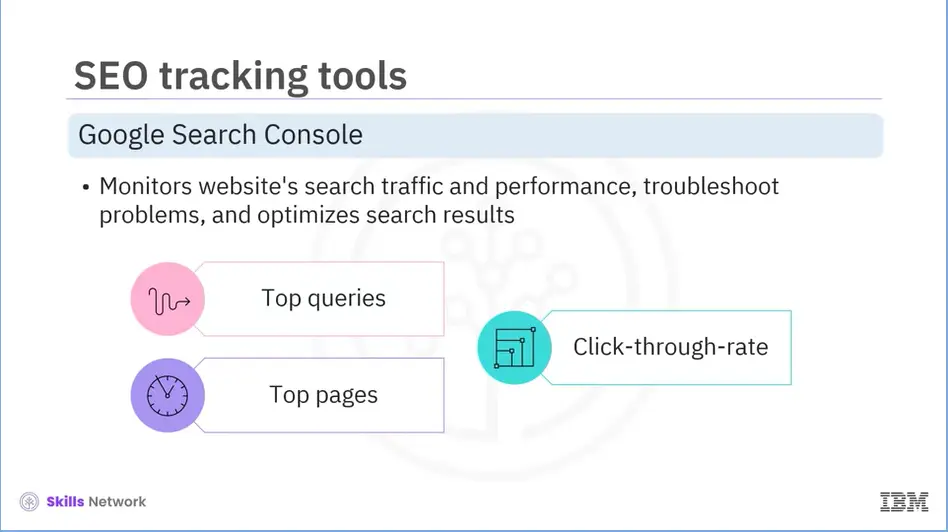{width="5.0in"
height="2.806089238845144in"}

Google Search Console (GSC) is another free tool that lets you monitor
your site\'s search traffic and performance, troubleshoot problems, and
optimize it for search results. The platform monitors SEO metrics such
as:

Top Queries: It consists of the most popular search terms that drive
traffic to a website. Top Pages: It lists the pages with the highest
impressions and clicks so that you know which ones to prioritize when it
comes to optimizing the user experience. CTR (Click-Through-Rate):
Another useful metric to track over time because it frequently allows
you to identify \"quick wins\" by simply changing the title or meta
description, resulting in a significant increase in traffic.

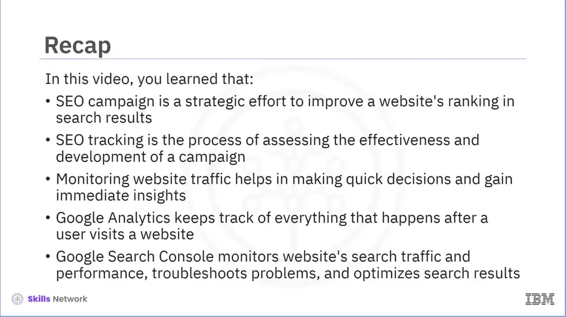{width="5.0in"
height="2.806089238845144in"}

In this section (13), you learned that:

-   SEO campaign is a strategic effort to improve a website\'s ranking
    in search results.

-   SEO tracking is the process of assessing the effectiveness and
    development of a campaign.

-   Monitoring website traffic helps in making quick decisions and
    gaining immediate insights,

-   Google Analytics keeps track of everything that happens after a user
    visits a website, and

-   Google Search Console monitors website\'s search traffic and
    performance, troubleshoots problems, and optimizes search results.

# 14. Do's and Don'ts of Search Engine Optimization

## Introduction

While SEO is a component of Internet marketing, it affects almost every
aspect of a website and has an impact on user experience (UX). There are
many details to keep in mind, and the internet provides a wealth of
information on the subject. Unfortunately, because SEO is ever-changing,
some practices become obsolete or even unacceptable over time. The
following are some of the most important and current SEO \"do\'s and
don\'ts\" to keep in mind when developing your online strategy.

+---------------------------------+------------------------------------+
| **Do's**                        | **Don'ts**                         |
+=================================+====================================+
| **Do include meta descriptions  | **Don't use all of your keywords   |
| and title tags.**               | on the same page.**                |
|                                 |                                    |
| Meta descriptions and title     | Instead, make sure that each page  |
| tags are critical components of | contains specific, relevant        |
| your website\'s content. Title  | keywords. This keeps your own      |
| tags are important because they | pages from competing for rankings  |
| are the primary factor in       | and communicates to search engines |
| determining whether a user      | and visitors what each page is     |
| clicks on your content in the   | about.                             |
| search results. Use titles that |                                    |
| pique users\' interest.         |                                    |
+---------------------------------+------------------------------------+
| **Do include keywords that are  | **Don't overuse keywords.**        |
| pertinent to the page.**        |                                    |
|                                 | Search engines do prefer content   |
| The keywords in your content    | with a clear theme, but overusing  |
| should be related to the title  | a keyword tends to put off         |
| of your page. Search engines    | customers and reduces conversions. |
| look for consistency.           | Although Google does not directly  |
|                                 | penalize this, when repetitive     |
|                                 | content leads to a poor user       |
|                                 | experience, it may result in your  |
|                                 | website being ranked lower.        |
+---------------------------------+------------------------------------+
| **Do allow other websites to    | **Don\'t copy large amounts of     |
| link to your website, but do    | outside content.**                 |
| not link back to them.**        |                                    |
|                                 | Duplicating your own content does  |
| Google dislikes link exchanges. | not harm your SEO but copying      |
| Search engines want to see      | someone else\'s content almost     |
| websites get links because      | always leads to your website being |
| their content is useful to      | pushed down the rankings by search |
| searchers, not because the      | engines. Try to come up with a new |
| webmaster has a link trading    | way to present your content in a   |
| network.                        | way that is more engaging to your  |
|                                 | buyer.                             |
+---------------------------------+------------------------------------+
| **Do have a presence on         | **Don't ignore bad reviews. **     |
| relevant social media           |                                    |
| platforms. **                   | Responding to every comment,       |
|                                 | whether positive or negative, is   |
| It is critical to update        | crucial, even if it seems outdated |
| profiles on a regular basis,    | or untrue to you. While searchers  |
| interact with other users, and  | are unaware of the context, they   |
| post new content. When used     | will watch you interact with both  |
| correctly, social media can be  | happy and unhappy customers.       |
| an extremely effective business |                                    |
| tool.                           |                                    |
+---------------------------------+------------------------------------+
| **Do monitor site metrics.**    | **Don\'t be alarmed if your        |
|                                 | rankings appear to drop            |
| None of the other SEO do\'s and | suddenly. **                       |
| don\'ts will be much use unless |                                    |
| you verify that they are        | Any change in rankings can always  |
| working for you. Once           | be explained, and it might be as   |
| everything else is in place,    | easy as Google experimenting with  |
| monitor site metrics that can   | a new algorithm.                   |
| help you see where you can      |                                    |
| improve, such as the following: |                                    |
|                                 |                                    |
| -   Traffic flow                |                                    |
|                                 |                                    |
| -   Conversion rate             |                                    |
|                                 |                                    |
| -   Bounce rate                 |                                    |
|                                 |                                    |
| -   Click-through rate          |                                    |
|                                 |                                    |
| The most convenient way to      |                                    |
| track your metrics is to use a  |                                    |
| tool like Google Analytics.     |                                    |
+---------------------------------+------------------------------------+
|                                 | **Don\'t skip user search          |
|                                 | intention.**                       |
|                                 |                                    |
|                                 | Google\'s ultimate goal with       |
|                                 | search results is to serve a       |
|                                 | user\'s search intent.             |
|                                 |                                    |
|                                 | -   If the user wants information, |
|                                 |     create content that provides   |
|                                 |     it.                            |
|                                 |                                    |
|                                 | -   If they want to buy something, |
|                                 |     direct them to your            |
|                                 |     product/service page.          |
|                                 |                                    |
|                                 | -   If they want to navigate to a  |
|                                 |     specific page via a search     |
|                                 |     query, make sure you own the   |
|                                 |     navigational query for your    |
|                                 |     own brand.                     |
+---------------------------------+------------------------------------+
|                                 | **Don\'t link to external websites |
|                                 | too frequently.**                  |
|                                 |                                    |
|                                 | The only drawback of having too    |
|                                 | many outbound links today is that  |
|                                 | it makes your content more         |
|                                 | difficult to read. This leads to   |
|                                 | higher bounce rates, which search  |
|                                 | engines will notice.               |
+---------------------------------+------------------------------------+

## Conclusion 

These \"do\'s and don\'ts\" are a good starting point for SEO reviews.
Google\'s ranking algorithm considers over 200 factors, but these
guidelines will help you stay on top of the basics.

# Hands-on Lab: Optimizing a Website for Search Ranking

Welcome to the **Optimizing a Website for Search Ranking** lab!

In this lab, you will learn how to add elements to your HTML page to
optimize it for search engines.

The lab starts with a sample application, which is a fresh fruit
marketplace on our ecommerce website.

You will then be guided through six simple steps to implement those
changes.

Skills Network Labs (SN Labs) is a virtual lab environment used in this
course. Upon clicking \"Open Tool\" in accordance with IBM Skills
Network Privacy policy your Username and Email will be passed to Skills
Network Labs and will only be used for communicating important
information to enhance your learning experience.

In case you need to download the lab instructions click
[HERE](https://cf-courses-data.s3.us.cloud-object-storage.appdomain.cloud/IBMSkillsNetwork-WD0231EN-SkillsNetwork/labs/lab.md.html)
to open in a new tab.

This course uses a third-party app, Hands-on Lab: Optimizing a Website
for Search Ranking, to enhance your learning experience. The app will
reference basic information like your name, email, and Coursera ID.

# Practice Quiz: Search Engine Optimization (SEO)

# Week 2 Summary: Search Engine Optimization (SEO)

## **Search Engine Optimization (SEO)**

In this module, you learned that:

-   Search engine optimization (SEO) refers to techniques that help a
    website rank higher in search results.

-   A search engine index is a collection of data used to generate a
    search result.

-   SEO tools aid in the creation and execution of an online search
    strategy.

-   SEO strategy aids in website optimization and achieving high
    rankings in search results.

-   The process of optimizing websites for mobile devices such as
    smartphones and tablets is known as mobile SEO.

-   On-page SEO is the process of increasing a website\'s visibility and
    ranking in search engines.

-   An SEO campaign is a planned effort to boost a website\'s ranking in
    search results.

-   SEO tracking is the process of evaluating a campaign\'s
    effectiveness and development.

## Graded Quiz: Search Engine Optimization (SEO)

# [Week 3:]{.mark}

# 15. Introduction to Web Build and Automated Tools

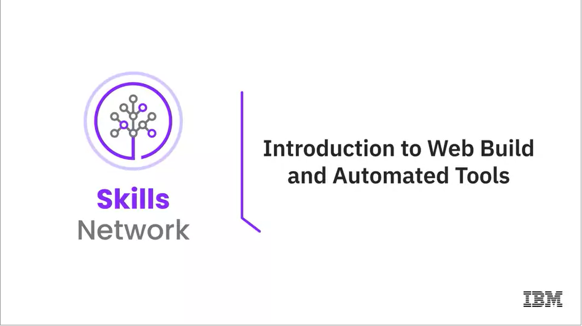{width="5.0in"
height="2.806089238845144in"}

Welcome to \"Introduction to Web Build and Automated Tools."

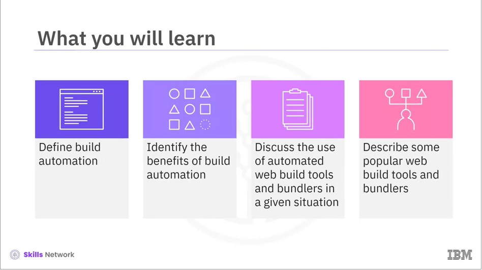{width="5.0in"
height="2.806089238845144in"}

After reading this module (15), you will be able to:

-   Define build automation,

-   Identify the benefits of build automation,

-   Discuss the use of automated web build tools and bundlers in a given
    situation, and

-   Describe some popular web build tools and bundlers.

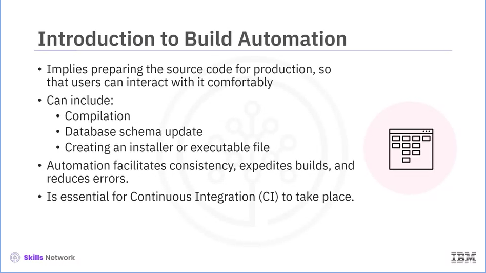{width="5.0in"
height="2.806089238845144in"}

Build automation is the process of preparing the source code for
production so that users can interact with it comfortably. It could
include compilation, database schema updates, creating an installer or
executable file, etc. Automation helps to standardize builds, speed them
up, and minimize mistakes done manually. It is a process where
retrieving the source code is automated, the code is compiled into
binary code, automated tests are executed, and the code is published
into a shared, centralized repository. Build automation is essential for
Continuous Integration (CI) to take place. Continuous Integration is a
practice that a developer follows to integrate code into a shared
repository multiple times in a period. The integration is then verified
by an automated build and automated tests. Due to this regular
integration, errors are identified quickly and easily.

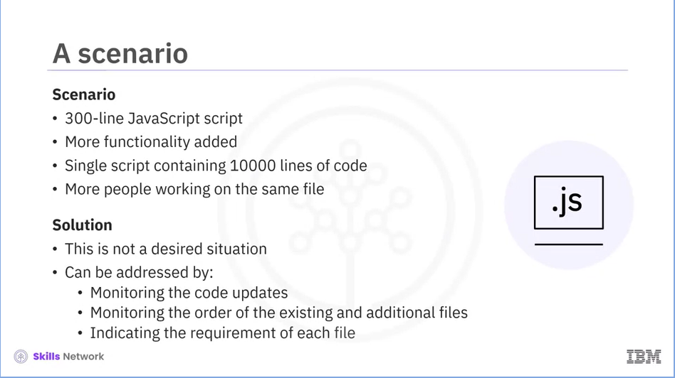{width="5.0in"
height="2.806089238845144in"}

Suppose you have a 300-line JavaScript script. You simply insert the old
script tag into your page. We start adding more functionality to the
page, and before you know it, your single script file contains 10000
lines of code. It becomes difficult to manage all that amount of code
with multiple people working on the same file. A natural solution is
that you split the code in multiple scripts with different script tags.
You have to put the smaller files in a particular order to ensure that
the utility function is available. This is not an ideal situation if you
need to keep making changes in the same file to ensure that the order
remains unchanged. We can link all our files in a single script tag but
will still need to monitor the code updates and the order of the
existing and additional files. Simply concatenating all the files in the
right order would not be enough. A better strategy would be each file to
indicate which other file it needs (its dependencies), which is a point
at which we could incorporate that mapping into our previous
concatenation strategy. At this point, the functionality of an automated
build tool and bundler comes into prominence.

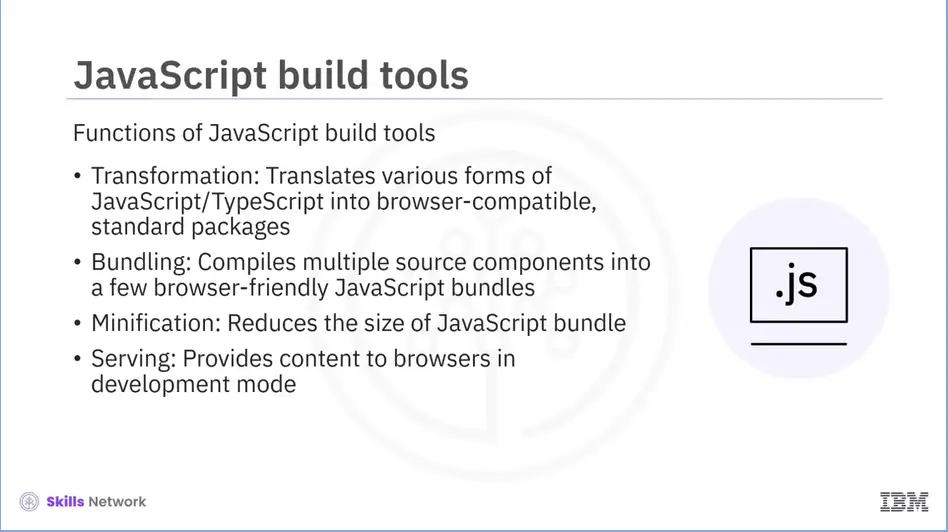{width="5.0in"
height="2.806089238845144in"}

Let\'s quickly go through the functions of JavaScript tools. Using these
build tools, your JavaScript and dependencies are prepared for use in a
browser. Some of the functions include transformation, bundling,
minification, and serving.

Transformation translates various forms of JavaScript/TypeScript (and
additional assets like HTML, CSS, and images) into browser-compatible,
standard packages.

Bundling implies compiling multiple source components into a few
browser-friendly JavaScript bundles. Certain build tools launched
recently can avoid this step to enhance performance.

Minification reduces the size of the JavaScript bundle by eliminating
redundant code, renaming variables, and adopting a variety of other
optimization approaches.

Serving provides the content to browsers in development mode, including
the feature like "hot" reloading. Note that not all tools do all these
steps or do them in exactly the same way. However, these are some of the
core problems that most build tools address in one way or another.

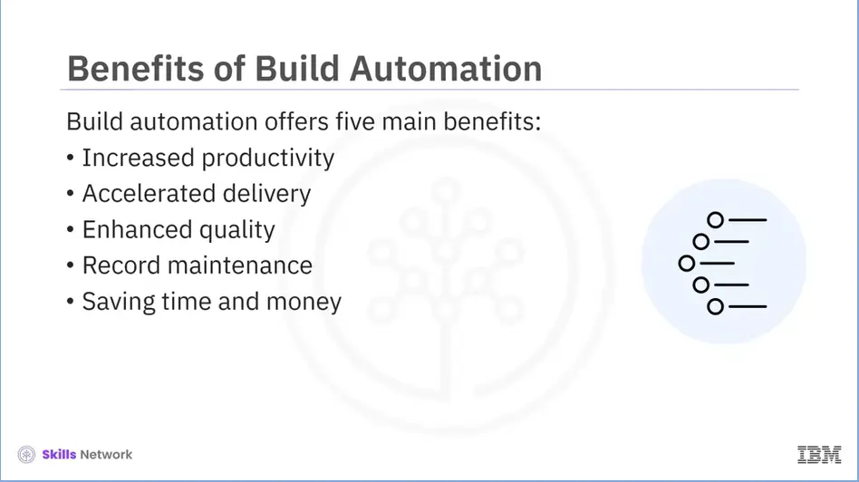{width="5.0in"
height="2.806089238845144in"}

Build automation offers five main benefits. These include increased
productivity, accelerated delivery, enhanced quality, record
maintenance, and saving time and money.

Let's discuss each of these benefits in detail.

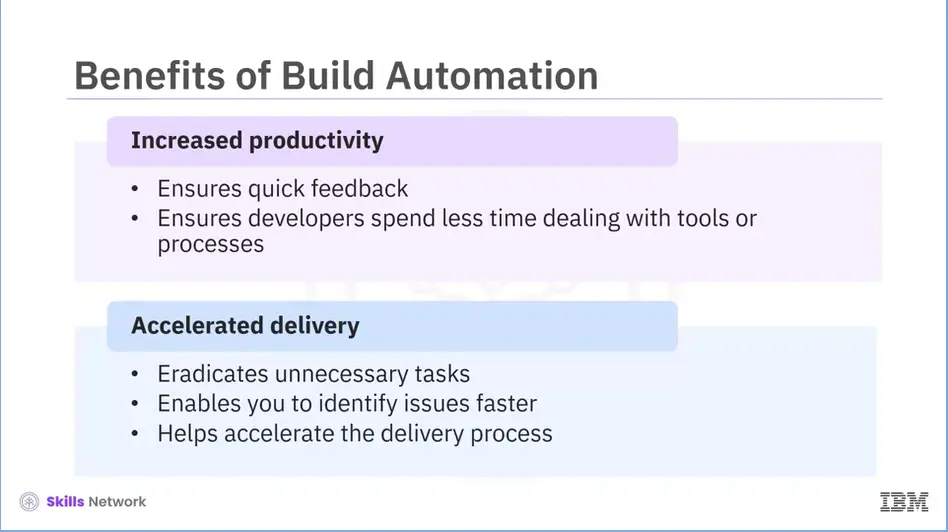{width="5.0in"
height="2.806089238845144in"}

One of the major benefits of build automation is increased productivity.
Build automation leads to quick feedback. This means that developers
spend less time dealing with tools or processes and invest more time in
delivering value.

Another benefit of build automation is accelerated delivery. Build
automation eradicates unnecessary tasks and enables you to identify
issues faster, which helps expedite the delivery process.

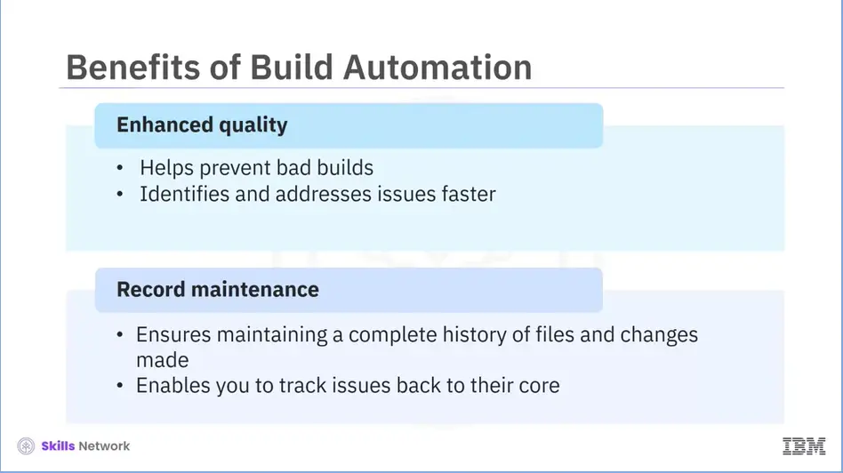{width="5.0in"
height="2.806089238845144in"}

Enhanced quality is another important benefit of build automation. Build
automation helps prevent bad builds by enabling you to identify and
address issues faster. This results in enhanced quality of your product.

Furthermore, it records maintenance. Build automation enables you to
maintain a complete history of files and changes made. Maintaining a
complete history enables you to track issues back to their core.

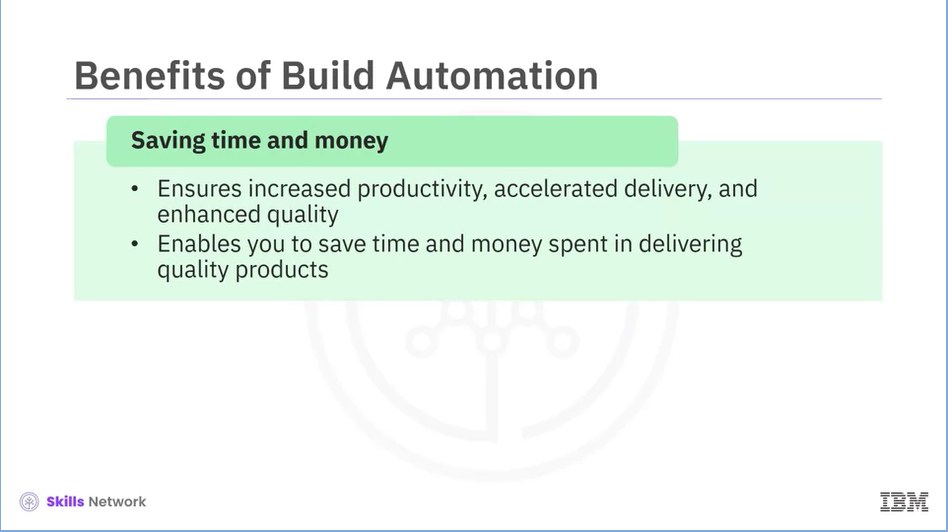{width="5.0in"
height="2.806089238845144in"}

The last benefit we will discuss in this session is saving time and
money. As build automation ensures increased productivity, accelerated
delivery, and enhanced quality, it enables you to save time and money
spent in delivering quality products and services.

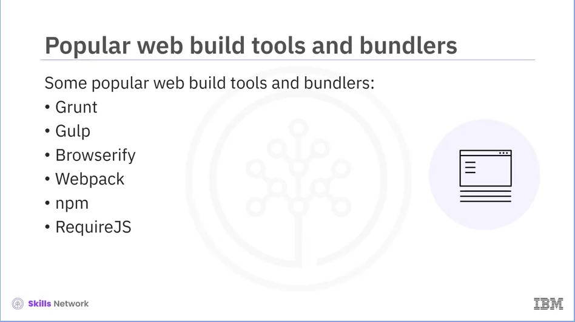{width="5.0in"
height="2.806089238845144in"}

Now, we will explore some popular web build tools and bundlers. These
include: Grunt, Gulp, Browserify, Webpack, npm, and RequireJS.

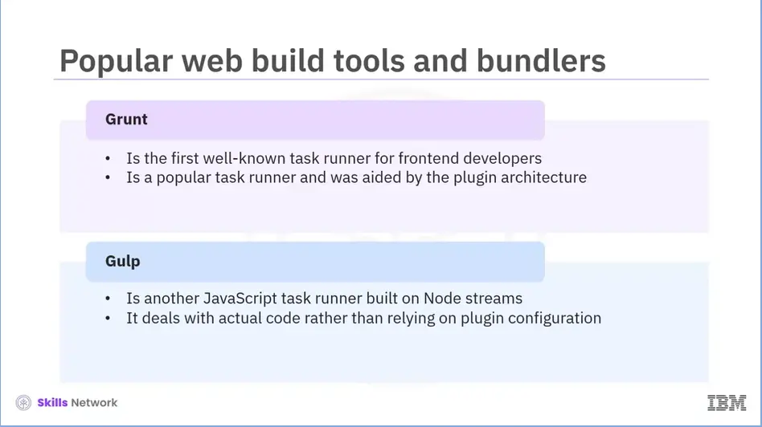{width="5.0in"
height="2.806089238845144in"}

Let's take a brief look at each of these tools.

Grunt is the first well-known task runner for front-end developers. Its
popularity was aided by the plugin architecture. As plugins are often
complex, it might be challenging to comprehend what is happening
whenever configuration increases.

Gulp is another JavaScript task runner built on Node streams. What
differentiates Gulp from others is that the former uses Node streams,
which means piping the output derived from one task as an input for the
next. Unlike Grunt, it deals with actual code rather than relying on
plugin configuration.

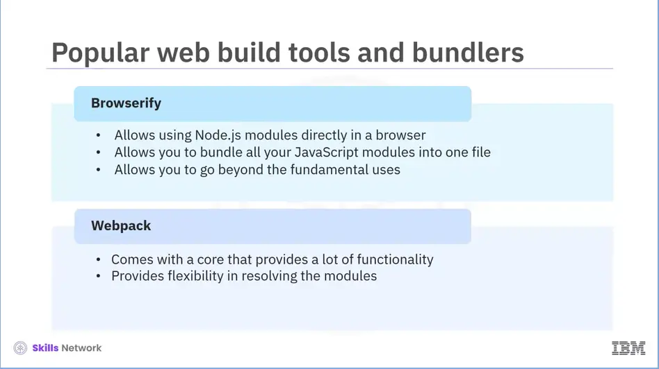{width="5.0in"
height="2.806089238845144in"}

Browserify is a build tool that allows using Node.js modules directly in
a browser. It allows you to bundle all your JavaScript modules into one
file that can be referenced within a script tag. It can be connected to
Gulp, and there are smaller transformation tools available that let you
go beyond the fundamental uses. The Browserify ecosystem is composed of
a lot of small modules.

Webpack offers a core that provides more functionalities straight out of
the box compared to Browserify\'s collection of several little tools.
Therefore, it is claimed that Webpack offers a clearer strategy compared
to Browserify. Webpack core can also be extended using specific loaders
and plugins. It provides flexibility in resolving modules and enables
you to modify your build to suit certain circumstances and get around
packages that don\'t function properly in difficult situations.

{width="5.0in"
height="2.806089238845144in"}

Node package manager (npm) functions as a package manager for
JavaScript. It serves as the default package manager for the JavaScript
runtime environment, also called node.js. It consists of a command line
client and an online database of both free and paid private packages.
Users can use this tool to download and share JavaScript modules stored
in the registry. Packages are kept in the common JS format and have
JSON-formatted metadata files in the npm registry. Both the packages
installed globally and the local dependencies of specific objects can be
managed by npm.

RequireJS is a JavaScript library and file loader that manages the
dependencies between JavaScript files and modular programming. It
enhances both the speed and quality. RequireJS offers asynchronous
module loading and the ability to load layered dependencies. For a
better user experience, it merges and minifies modules into a single
script. It can compile JavaScript files from many modules and
load several JavaScript files.

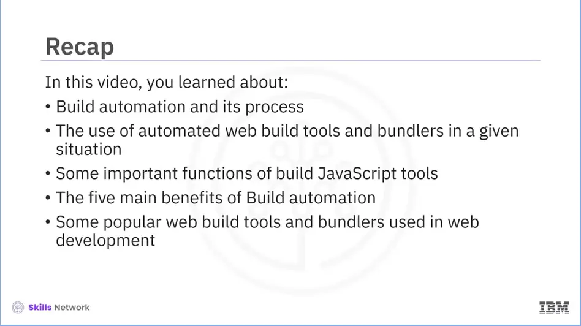{width="5.0in"
height="2.806089238845144in"}

In this module (15), you learned about:

-   Build automation and its process,

-   The use of automated web build tools and bundlers in a given
    situation,

-   Some important functions of build JavaScript tools,

-   The five main benefits of Build automation, and

-   Some popular web build tools and bundlers used in web development.

# 16. Introduction to Webpack 5

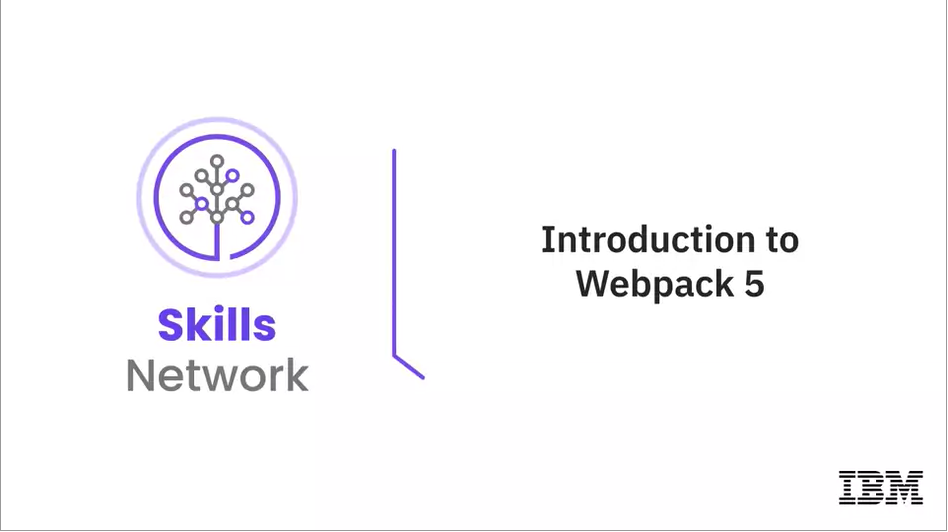{width="5.0in"
height="2.806089238845144in"}

Welcome to the "Introduction to Webpack 5."

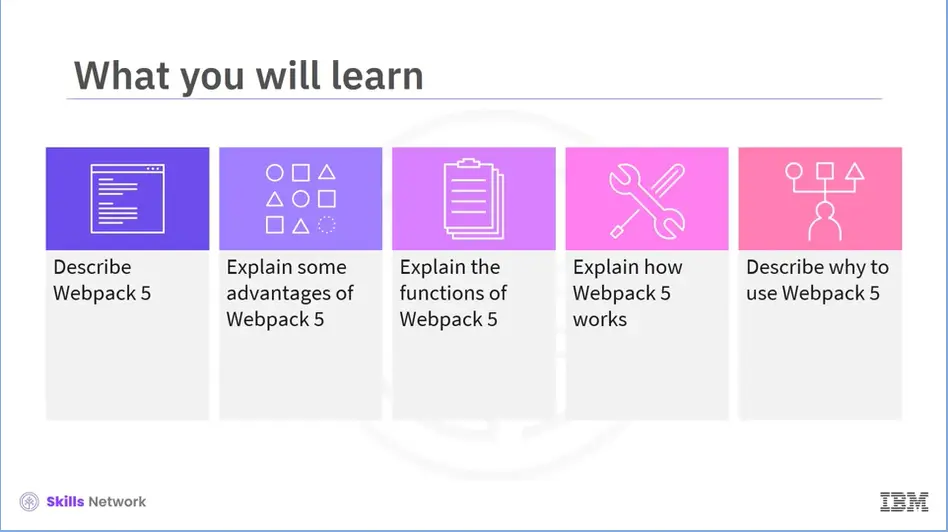{width="5.0in"
height="2.806089238845144in"}

After reading this module (16), you will be able to:

-   Describe Webpack 5,

-   Explain some advantages of Webpack 5,

-   Explain the functions of Webpack 5,

-   Explain how Webpack 5 works, and

-   Describe why to use Webpack 5.

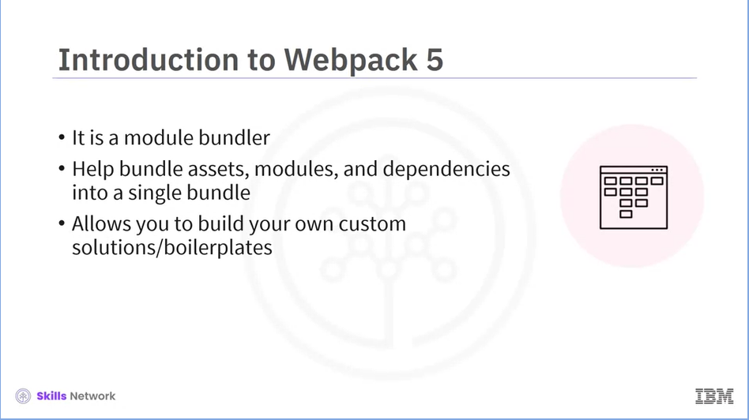{width="5.0in"
height="2.806089238845144in"}

Webpack 5 is a module bundler that assists, in handling the bundling of
assets, modules, and dependencies into a single bundle while allowing
developers to concentrate on the development. Instead of being dependent
on online solutions, you can use Webpack 5 to build your own custom
solutions or boilerplates.

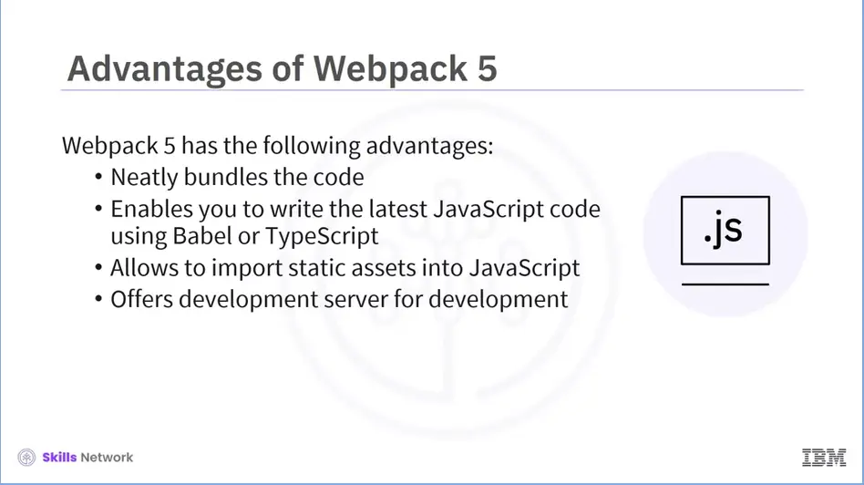{width="5.0in"
height="2.806089238845144in"}

Now that you understand what Webpack 5 is, let us see some of its
advantages. Webpack 5 has the following advantages:

It neatly bundles your code. It enables you to write the most recent
JavaScript code using Babel or TypeScript and compiles it for
cross-browser compatibility, and then cleanly minifies it.

It allows the import of static assets into your JavaScript, and Also
offers a development server for development, which can instantly update
modules and styles as you save.

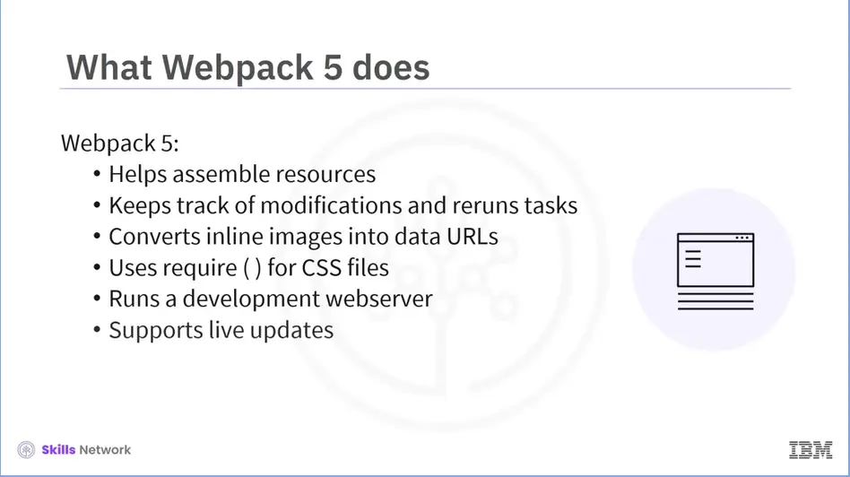{width="5.0in"
height="2.806089238845144in"}

Now that you understand what Webpack 5 is and its advantages, let us
discuss what it does.

Webpack 5:

-   Helps assemble your resources,

-   Keeps track of modifications and reruns tasks,

-   Converts inline images into data URIs,

-   Uses require () for CSS files,

-   Runs a development web server,

-   Supports live updates or hot module replacement during development.

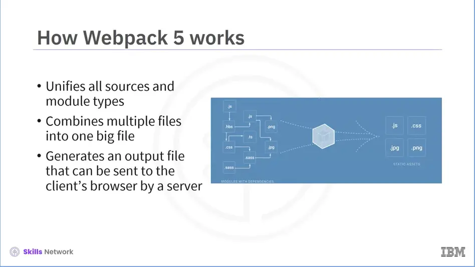{width="5.0in"
height="2.806089238845144in"}

Webpack 5 is a command line tool and essentially a module bundler that
unifies all sources and module types to import everything in the
JavaScript code, resulting in a transferable output. It does so by
taking multiple files and combining them into one big file, as shown
here. The output file that Webpack generates can be sent to the client's
browser by a server.

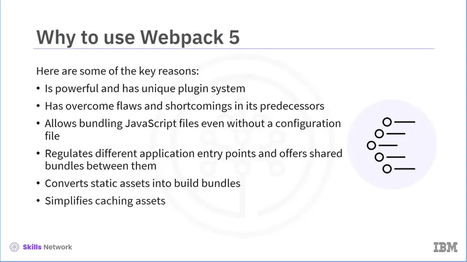{width="5.0in"
height="2.806089238845144in"}

We will now explore the benefits of using Webpack 5. Webpack 5 is
powerful and has unique plugin system. Its latest features have overcome
flaws and shortcomings evident in its predecessors. It allows you to
bundle JavaScript files even without a configuration file.

Webpack 5 regulates different application entry points or parts and
offers shared bundles between them. Additional distinct bundle for each
portion can be loaded. Webpack 5 converts static assets into build
bundles and generates them for development and consistency. It is simple
to cache assets as Webpack 5 allows each file\'s assets to have their
own version.

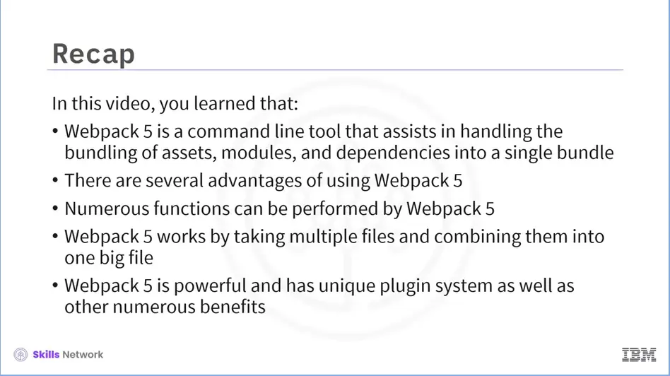{width="5.0in"
height="2.806089238845144in"}

In this module (16), you learned that:

-   Webpack 5 is a command line tool that assists in handling the
    bundling of assets, modules, and dependencies into a single bundle,

-   There are several advantages of using Webpack 5,

-   Numerous functions can be performed by Webpack 5,

-   Webpack 5 works by taking multiple files and combining them into one
    big file, and

-   Webpack 5 is powerful and has a unique plugin system as well as
    numerous other benefits.

# 17. Essential Concepts of Webpack

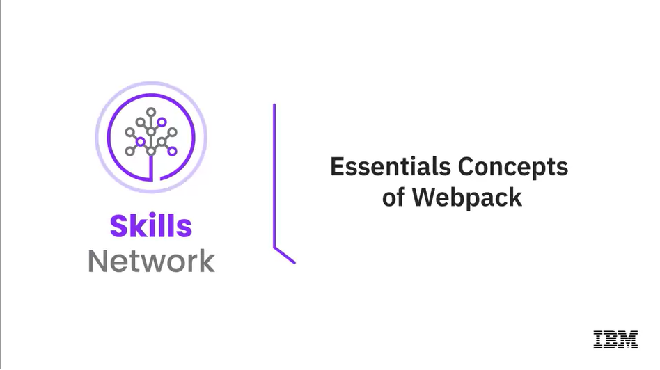{width="5.0in"
height="2.806089238845144in"}

Welcome to "Essentials Concepts of Webpack"

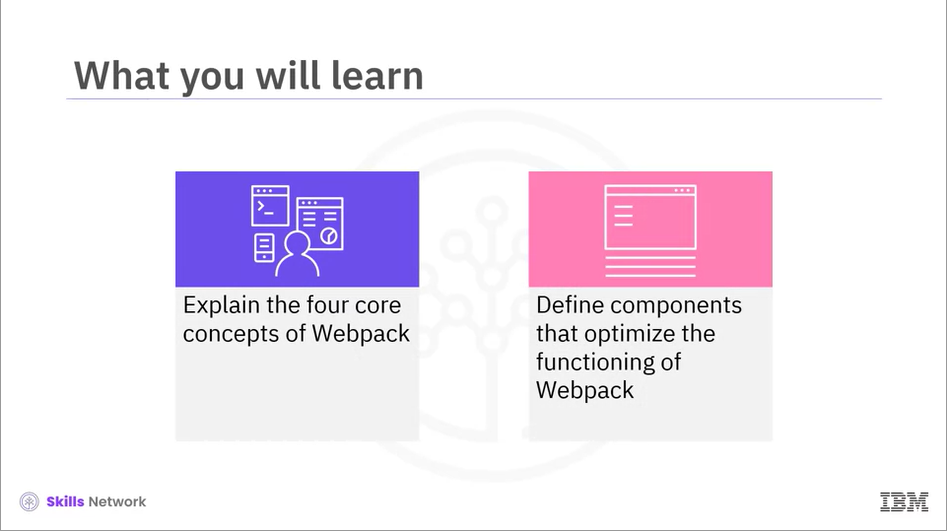{width="5.0in"
height="2.806089238845144in"}

After reading this module (17), you will be able to:

-   Explain the four core concepts of Webpack,

-   Define components that optimize the functioning of Webpack.

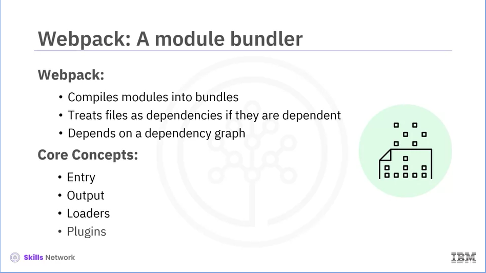{width="5.0in"
height="2.806089238845144in"}

Let us start by discussing Webpack's role in combining modules into
bundles. Webpack is a module bundler and allows you to create codes in
modules. If one file is dependent on another, it is treated as a
dependency by Webpack. The initial configuration starts from a single
module. It then processes all its dependencies, which can be either
direct or indirect. This gives shape to a dependency graph on which it
will bundle all the webpack modules. Considering this, we will learn the
core concepts in detail. They are: Entry Output Loaders and Plugins In
addition, we will touch upon some components related to Webpack.

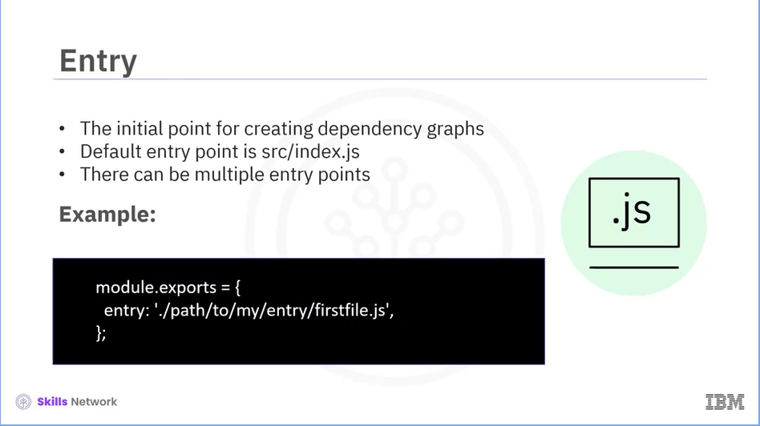{width="5.0in"
height="2.806089238845144in"}

The first concept is Entry. The initial point from which the frontend
project\'s dependencies are gathered is known as an entry point. This is
a basic JavaScript file. These dependencies then create a dependency
graph. The default entry point for Webpack is src/index.js, and it is
configurable. Webpack can have multiple entry points that produce
modules through each dependency, and it repeats this procedure
throughout the application. See example (above).

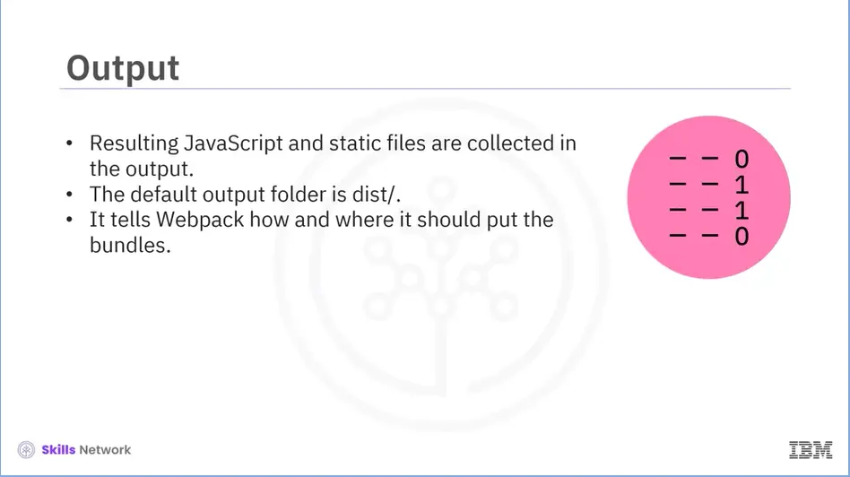{width="5.0in"
height="2.806089238845144in"}

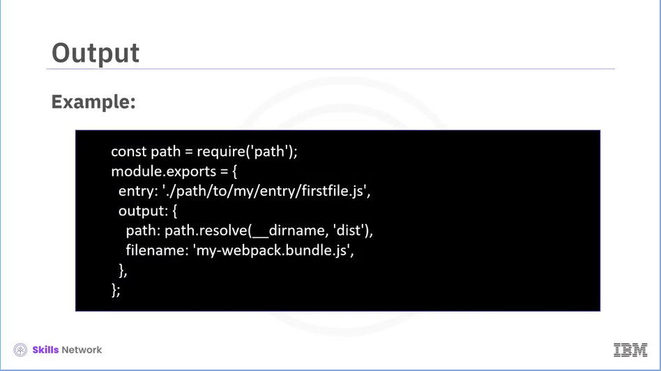{width="5.0in"
height="2.806089238845144in"}

The second concept is Output. The static and JavaScript files produced
by the build process are gathered in Output. The default output folder
for Webpack is webpack dist/. and it can also be customized. The output
configuration tells Webpack how and where it should put the bundles. In
this example (above), you are instructing Webpack to place the bundles
in a JavaScript file called My-Webpack.bundle.js in the same directory
as Webpack.config.js.

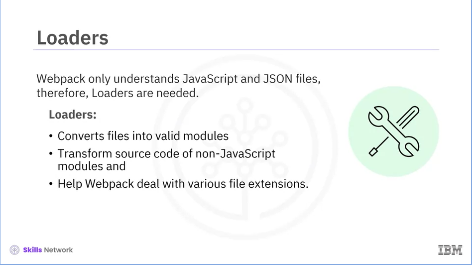{width="5.0in"
height="2.806089238845144in"}

Let us now understand the third concept, Loader. As Webpack only
understands JavaScript and JSON files, Loaders are used to process other
types of files and convert them into valid modules. They transform the
source code of non-JavaScript modules, allowing us to preprocess those
files before they're added to the dependency graph. They help Webpack
deal with various file extensions.

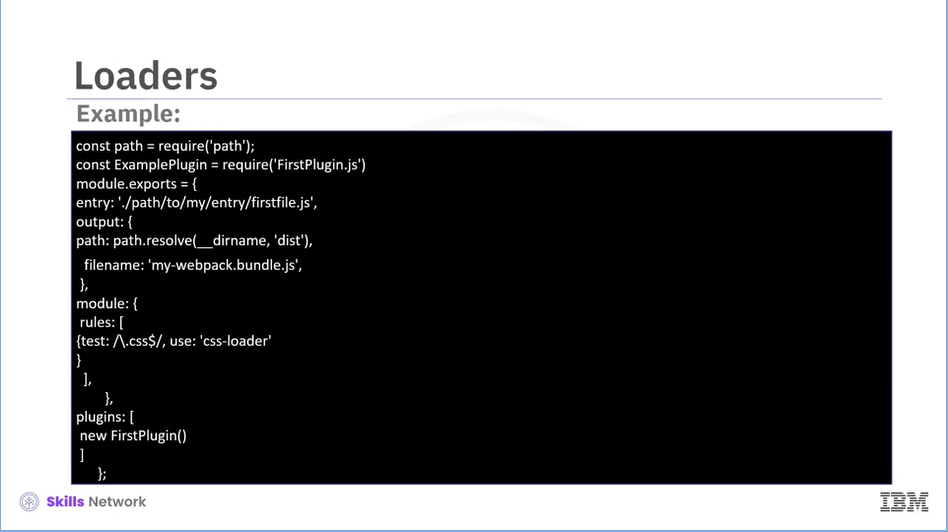{width="5.0in"
height="2.806089238845144in"}

Let us look at an example (above).

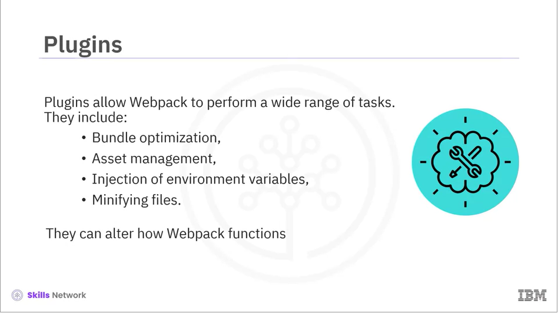{width="5.0in"
height="2.806089238845144in"}

The last concept is Plugins. It allows Webpack to perform a wide range
of tasks like bundle optimization, asset management, injection of
environment variables, and minifying files. They are third-party
extensions that can alter how Webpack functions.

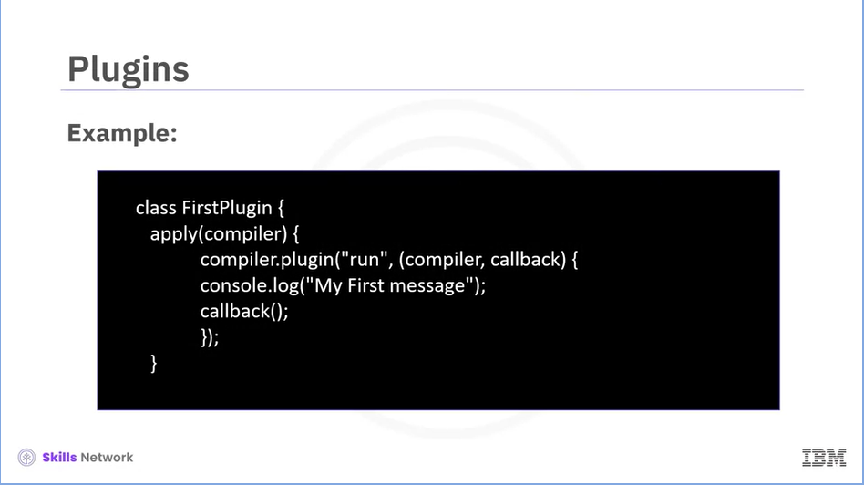{width="5.0in"
height="2.806089238845144in"}

For example, there are plugins for extracting HTML and CSS or setting up
environment variables.

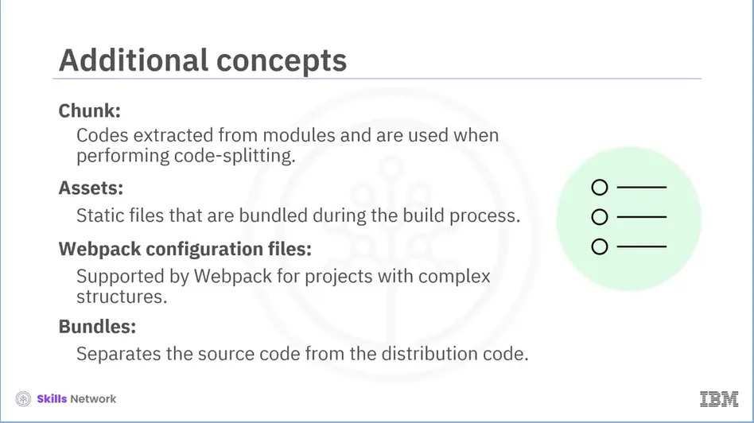{width="5.0in"
height="2.806089238845144in"}

Along with these, there are some additional concepts that optimize the
functioning of Webpack. Let us briefly touch upon them.

Chunk refers to the code extracted from modules. They are commonly used
when performing code-splitting with Webpack.

Assets refer to the static files bundled during the build process. These
can be in the form of images, fonts, or even videos.

Webpack supports a configuration file for projects with complex
structures. This is more efficient than having to type in a lot of
commands in the terminal manually.

Bundles separate the source code from the distribution code. The source
code is what we write and edit, whereas the distribution code is the
optimized output that is finally loaded in the browser.

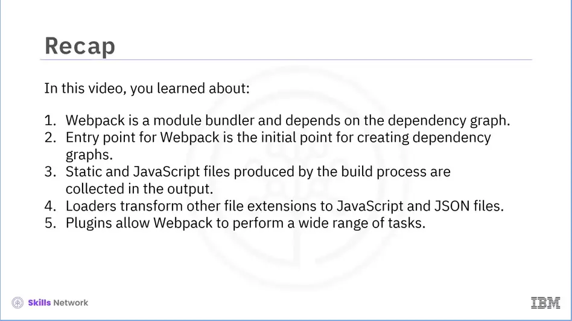{width="5.0in"
height="2.806089238845144in"}

In this module (17), you learned that:

-   Webpack is a module bundler and depends on the dependency graph.

-   Entry point for Webpack is the initial point for creating dependency
    graphs.

-   Static and JavaScript files produced by the build process are
    collected in the output.

-   Loaders transform other file extensions to JavaScript and JSON
    files.

-   Plugins allow Webpack to perform a wide range of tasks.

# 18. Working with Webpack

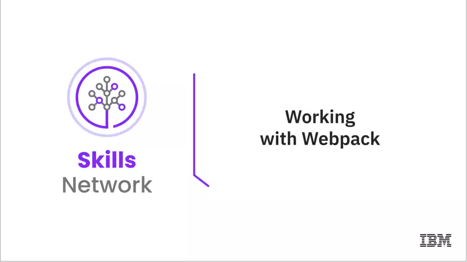{width="5.0in"
height="2.806089238845144in"}

Welcome to "Working with Webpack."

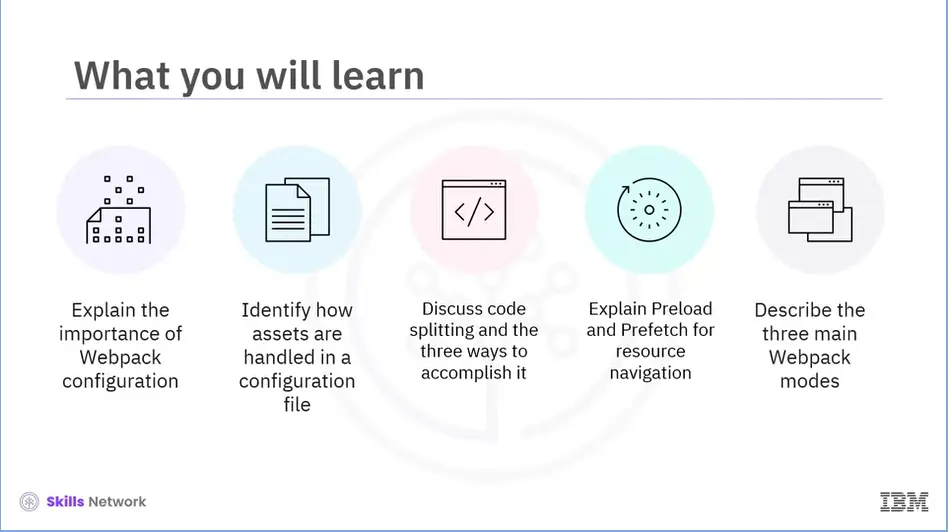{width="5.0in"
height="2.806089238845144in"}

After reading this module (18), you will be able to:

-   Explain the importance of Webpack configuration,

-   Identify how assets are handled in a configuration file,

-   Discuss code splitting and the three ways to accomplish it,

-   Explain Preload and Prefetch for resource navigation, and

-   Describe the three main Webpack modes.

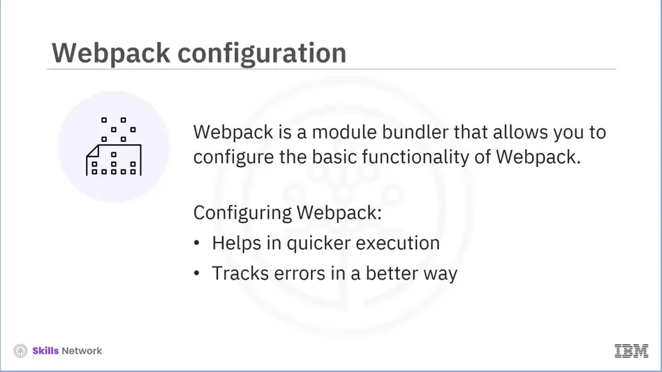{width="5.0in"
height="2.806089238845144in"}

Let's first understand the functions of Webpack and why we need
configuration. Webpack is a module bundler for web applications that
bundles, minifies, and transpiles JavaScript code to a browser-friendly
code. Webpack assumes that your code begins at src/index.js and will be
bundled to dist/main.js by default. Configuration helps to determine
whether code should be compressed for quicker execution or packed with
source maps for better error tracking.

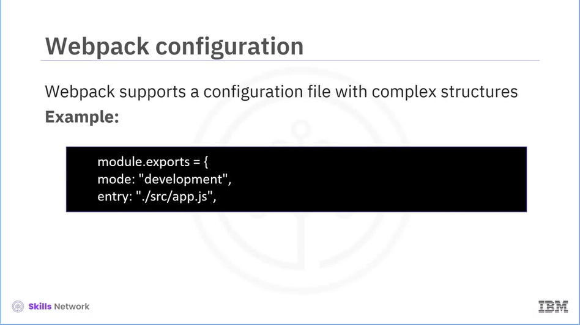{width="5.0in"
height="2.806089238845144in"}

Webpack supports a configuration file for projects with complex
structures. This is more efficient than manually typing numerous
commands in the terminal. You can see a sample config file on the
screen.

The configuration JavaScript module belongs to CommonJS. Output from
this file is an object that Webpack will consider.

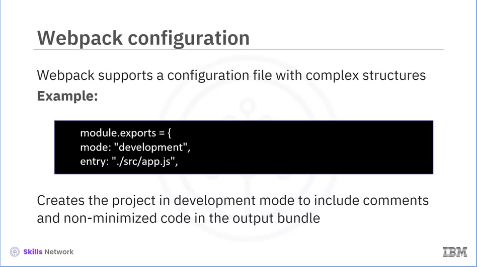{width="5.0in"
height="2.806089238845144in"}

The configuration mentioned above instructs Webpack to create the
project in development mode to include comments and non-minimized code
in the output bundle while it is running.

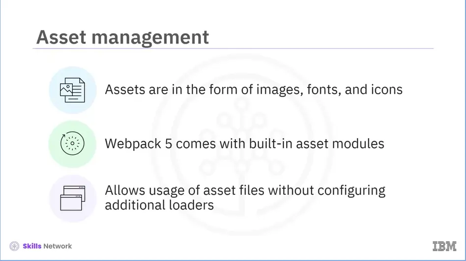{width="5.0in"
height="2.806089238845144in"}

Let's learn how assets can be easily managed using Webpack Your project
will often contain assets such as images, fonts, icons, and other
assets. In Webpack 4, we had to install one or more loaders to work with
assets. This is not needed in Webpack 5 because the new version comes
with built-in asset modules. They allow you to use asset files without
configuring additional loaders.

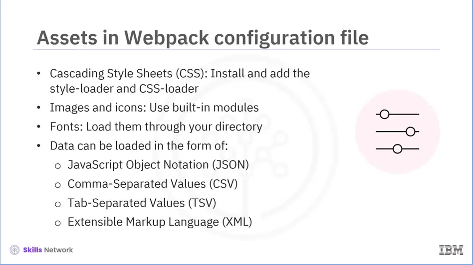{width="5.0in"
height="2.806089238845144in"}

Let's now explore how each asset type is handled in the Webpack
configuration file. A CSS file can be imported by installing and adding
the style-loader and CSS loader to your module configuration. Images and
icons can be incorporated using built-in asset modules. The asset
modules can incorporate any font through your build directory. Data can
be incorporated in the form of JSON files, CSVs, TSVs, and XML.

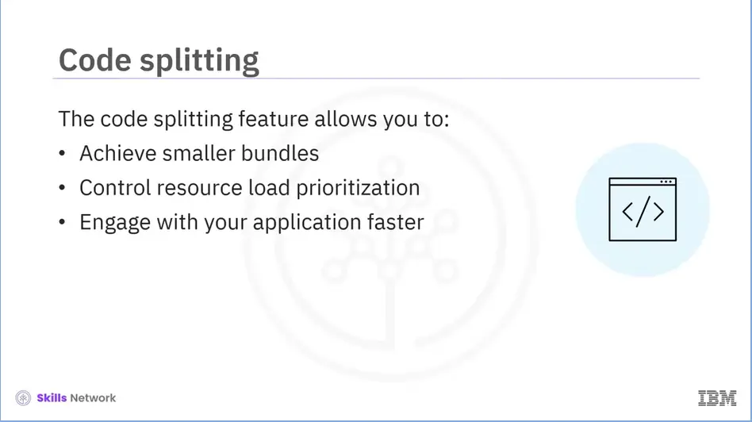{width="5.0in"
height="2.806089238845144in"}

Now that you have learned about asset management, let's understand code
splitting. The code splitting feature in Webpack is used to achieve
smaller bundles and control resource load prioritization. The reduced
main bundle size will speed up the initial load time and enable the
users to engage with your application more quickly.

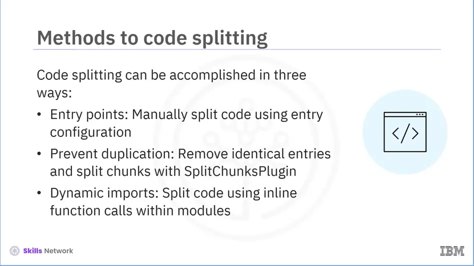{width="5.0in"
height="2.806089238845144in"}

Code Splitting in Webpack 5 can be accomplished in three ways:

1.  Entry points: Manually split code using entry configuration,

2.  Prevent duplication: Remove identical entries and split chunks with
    SplitChunksPlugin,

3.  Dynamic imports: Split code using inline function calls within
    modules.

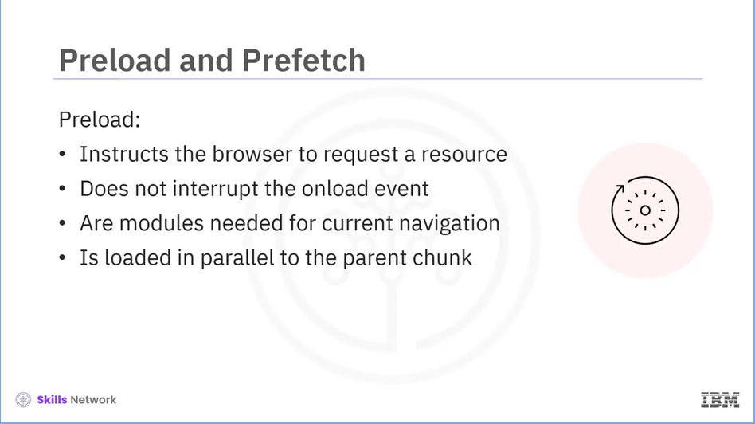{width="5.0in"
height="2.806089238845144in"}

Now that you have a clear understanding of code splitting let's learn
about Preload and Prefetch.

Preload is a declarative request that enables you to instruct the
browser to request a resource without interrupting the document's onload
event. These are the modules needed for current navigation and are
loaded in parallel to the parent chunk.

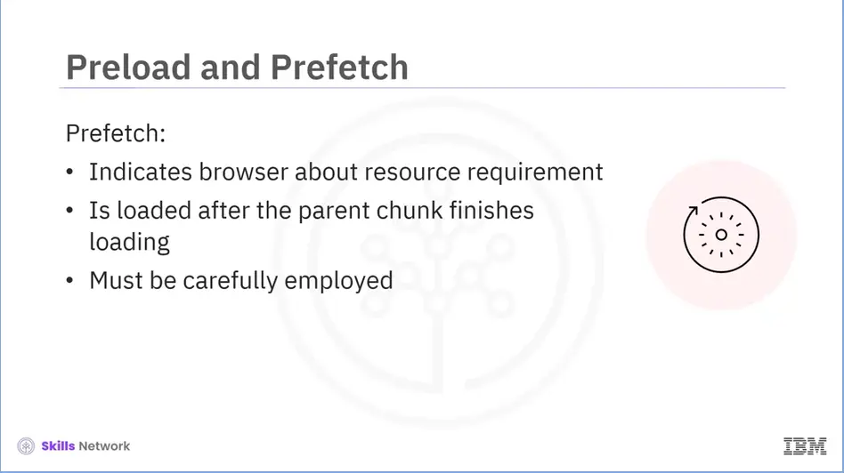{width="5.0in"
height="2.806089238845144in"}

Prefetch serves as an indication to the browser that a resource may be
required, but it leaves it to the browser to determine if it is to be
loaded or not. These are the modules needed for future navigation. They
start loading after the parent chunk finishes loading. Developers must
be careful when employing it since improper configuration might result
in poor performance.

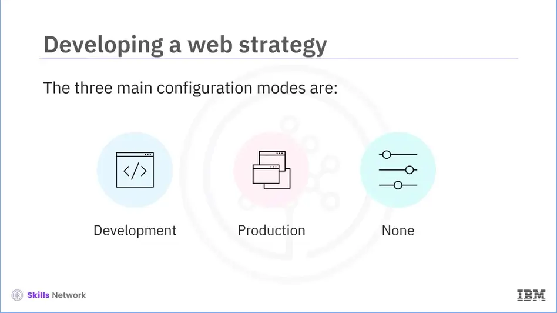{width="5.0in"
height="2.806089238845144in"}

Lastly, let's identify the three main configuration modes for Webpack. A
mode configuration option instructs Webpack to make appropriate use of
its built-in optimizations. The three main configuration modes are:
Development Production And none.

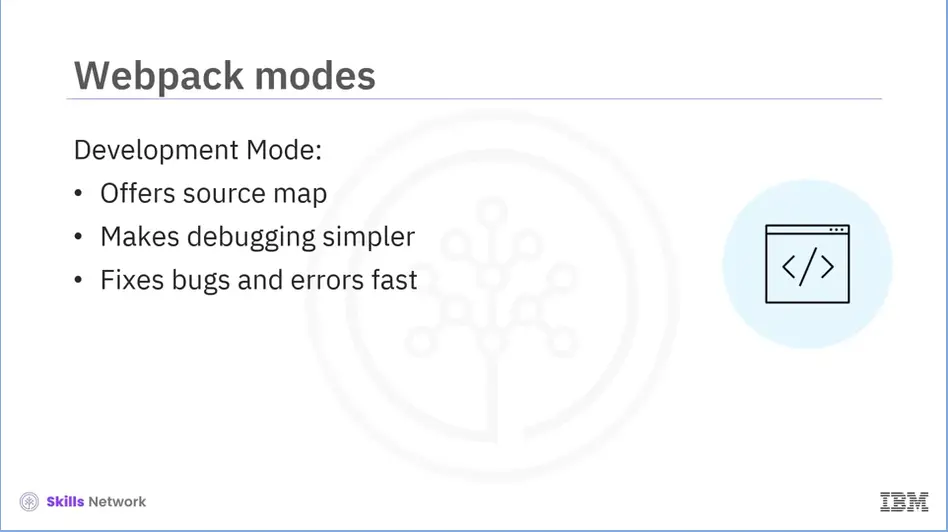{width="5.0in"
height="2.806089238845144in"}

Development mode is used specifically in the development phase of an
application. Webpack offers source maps in the development code that
link your produced code to the original source code. This makes
debugging simpler and speeds up the process of fixing bugs and errors in
your code.

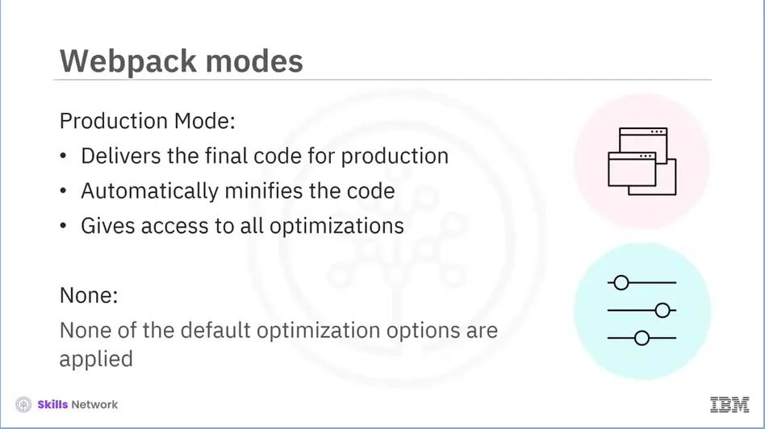{width="5.0in"
height="2.806089238845144in"}

Production is the default mode value and is used to deliver the final
code for production. Webpack, in production mode, tries its best to
optimize the build by automatically minifying the code with the help of
TerserPlugin. It encourages Webpack to give you access to all the
optimizations possible, such as tree shaking, performance hints, or
minification with the TerserWebpackPlugin. It is helpful at the time of
building an application. In this mode, none of the default optimization
options are applied.

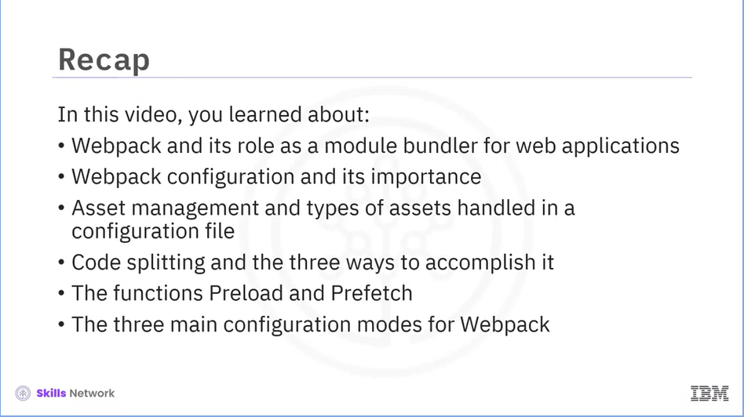{width="5.0in"
height="2.806089238845144in"}

In this module (18), you learned about:

-   Webpack and its role as a module bundler for web applications,

-   Webpack configuration and its importance,

-   Asset management and how assets are handled in a configuration file,

-   Code splitting and the three ways to accomplish it,

-   The functions of Preload and Prefetch, and

-   The three main configuration modes for Webpack.

# 19. Setting up Production with Webpack

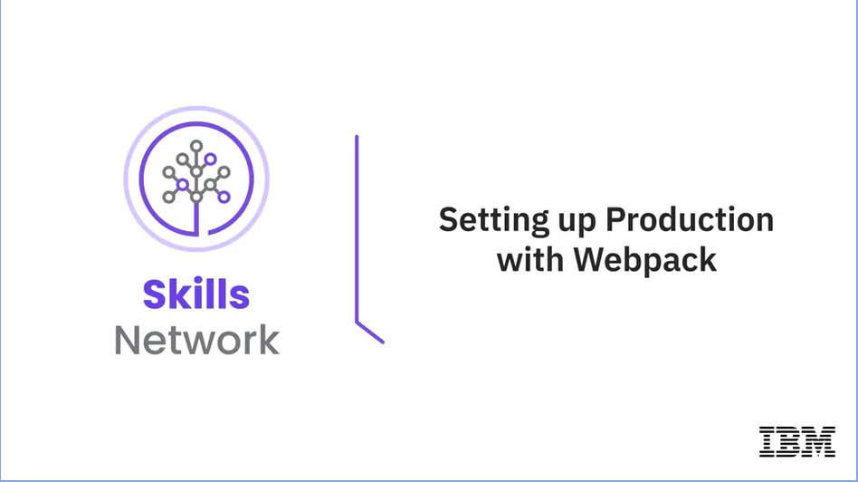{width="5.0in"
height="2.806089238845144in"}

Welcome to "Setting up Production with Webpack."

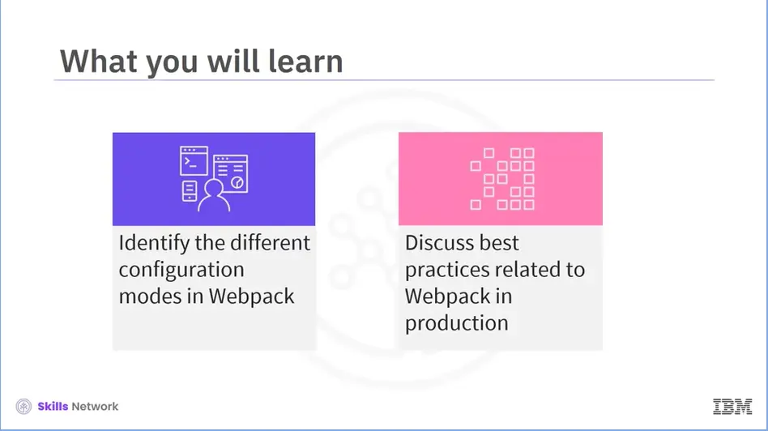{width="5.0in"
height="2.806089238845144in"}

After reading this module (19), you will be able to:

-   Identify the different configuration modes in Webpack, and

-   Discuss the best practices related to Webpack in production.

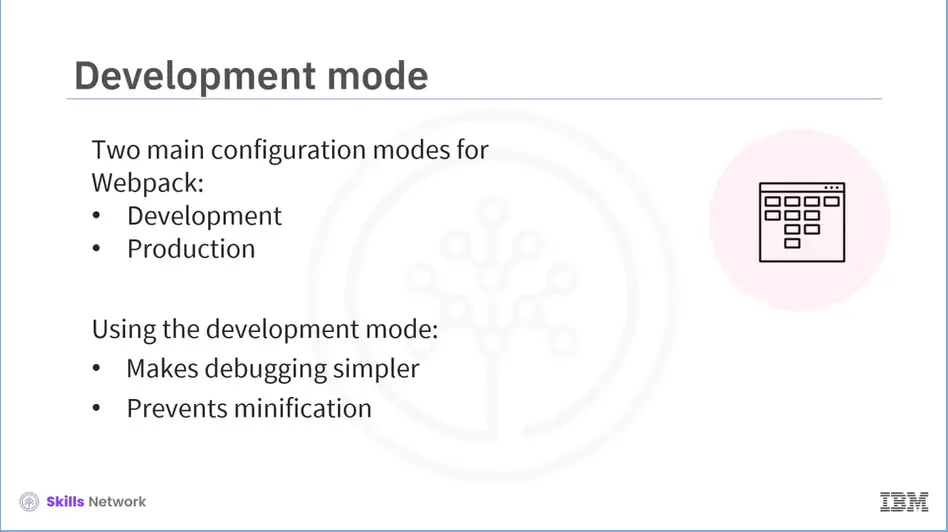{width="5.0in"
height="2.806089238845144in"}

A mode configuration option instructs Webpack to make appropriate use of
its built-in optimizations. You can set it to \"none\" to disable any
default behavior.

There are two main configuration options for Webpack: the development
and production modes.

The development mode simplifies debugging by activating
NamedChunksPlugin and preventing minification, among other things. In
development mode, the bundle will be descriptive and will include more
comments. As a result of Webpack\'s adoption of the software engineering
paradigm convention over configuration, you can basically acquire a
useful configuration by simply setting the mode to production.

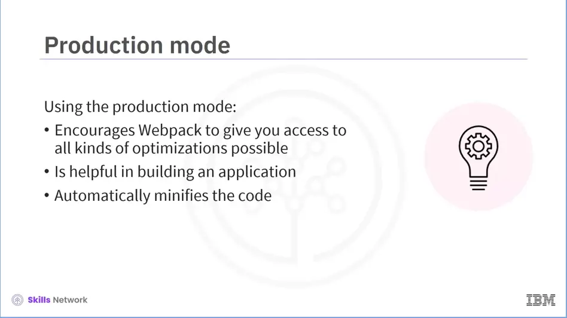{width="5.0in"
height="2.806089238845144in"}

Production is the default mode value. It encourages Webpack to give you
access to all the optimizations possible, such as tree shaking,
performance hints, or minification with the TerserWebpackPlugin. It is
really helpful at the time of building an application. Webpack, in
production mode, tries its best to optimize the build by automatically
minifying the code. It is recommended to create distinct Webpack
settings for each scenario.

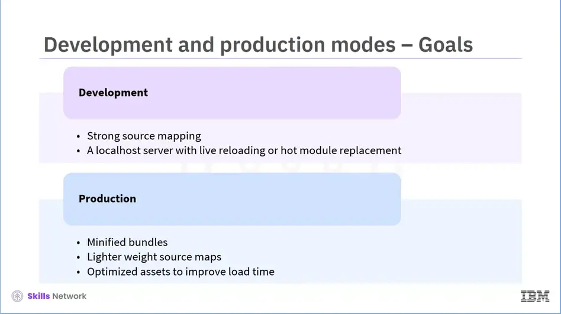{width="5.0in"
height="2.806089238845144in"}

Development and production builds have numerous different objectives. In
the case of development, the goal is to have strong source mapping and a
local host server with live reloading or hot module replacement. In the
case of production, the goal shifts to minified bundles, lighter-weight
source maps, and optimized assets to improve the load time. We still
prefer a "common" configuration to make things uniform.

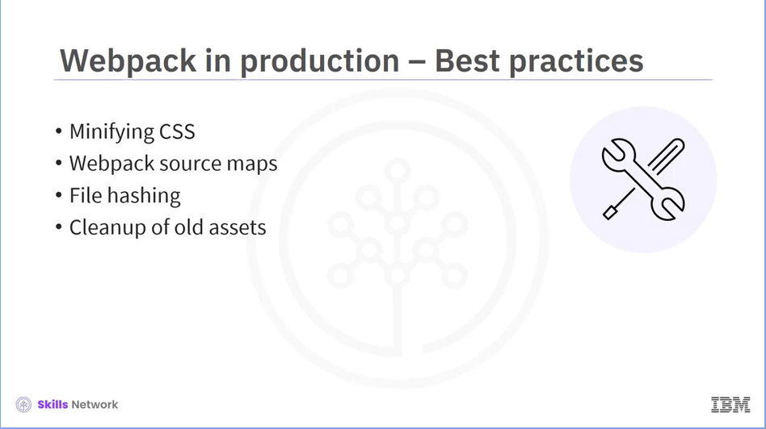{width="5.0in"
height="2.806089238845144in"}

We will now discuss the best practices related to Webpack in production.
Webpack, in the production mode, tries its best to optimize the build by
automatically minifying the code. Some of the best production practices
to improve a website's performance include: Minifying CSS, Webpack
source maps, File hashing, and Cleanup of old assets. Let's discuss each
of these practices in detail.

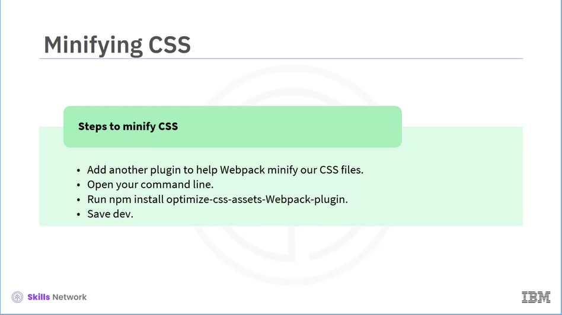{width="5.0in"
height="2.806089238845144in"}

Minifying CSS means to remove unnecessary characters, such as comments,
whitespaces, and indentation. Minifying your assets in production is a
good practice as it can drastically improve the website's load time.
Here are the steps to minify CSS: Add another plugin to help Webpack
minify your CSS files. Open your command line. Run npm install
optimize-css-assets-Webpack-plugin. Finally, save dev.

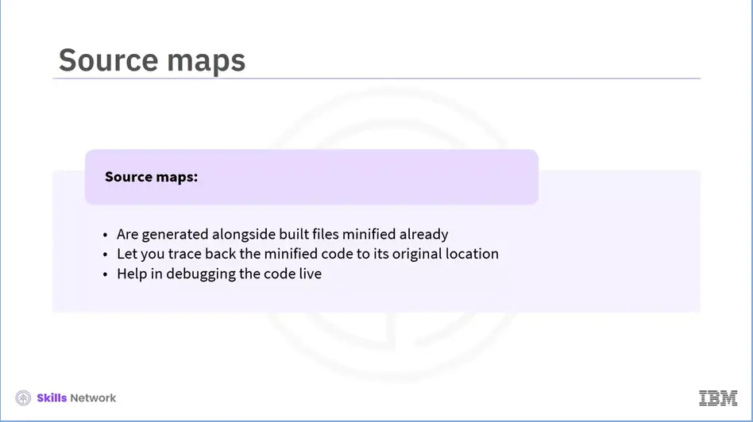{width="5.0in"
height="2.806089238845144in"}

Source maps are generated alongside built files, which are minified
already. These maps let you trace back the minified code to its original
location and help in debugging the code live. Webpack has built-in
support for source map generation via the devtool property.

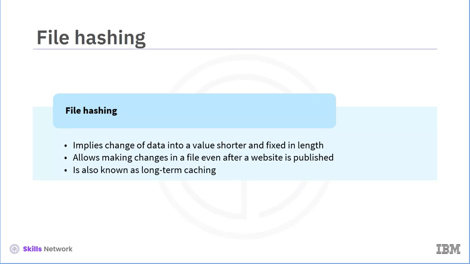{width="5.0in"
height="2.806089238845144in"}

Files essentially consist of data chunks. This data is changed via
hashing into a key or value that is much shorter and fixed in length. It
is called file hashing. It is important as it allows making changes in a
file even after the website is published. Adding hashing or content
hashing is known as long-term caching, as the files could be cached
forever.

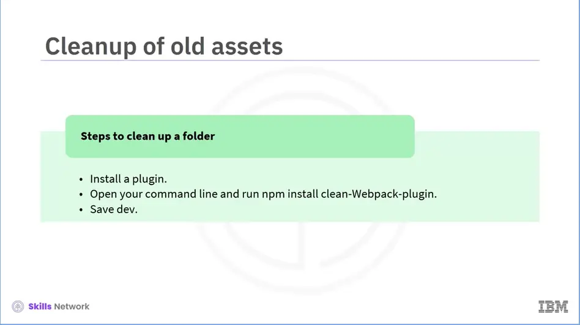{width="5.0in"
height="2.806089238845144in"}

One of the best practices related to production is to install a plugin
to create a build folder and to clean that folder every time it runs.
This is done to avoid the minification of all the files in the public
folder. To install a cleanup plugin, follow these steps: Install a
plugin. Open your command line and run npm install clean-Webpack-plugin.
Finally, save dev.

{width="5.0in"
height="2.806089238845144in"}

In this module (19), you learned that:

-   Webpack in production mode allows many practices that are helpful at
    the time of building an application. These include:

    -   Minifying CSS to remove unnecessary characters, such as
        comments, whitespaces, and indentation,

    -   Generating source maps to trace back the minified code to its
        original location,

    -   File hashing to make changes in a file even after a website is
        published,

    -   Clean up old assets to avoid the minification of all the files
        in the public folder.

# 20. Using Webpack Tools

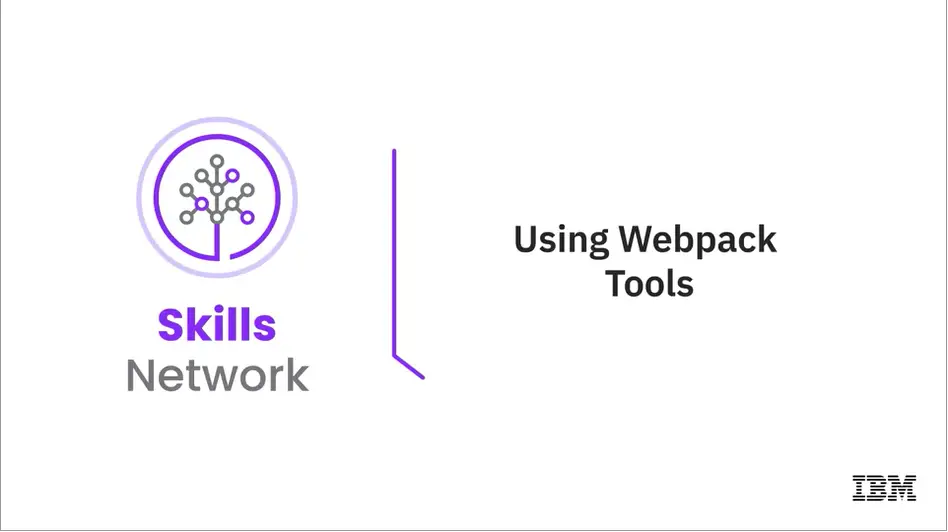{width="5.0in"
height="2.806089238845144in"}

Welcome to "Using Webpack Tools."

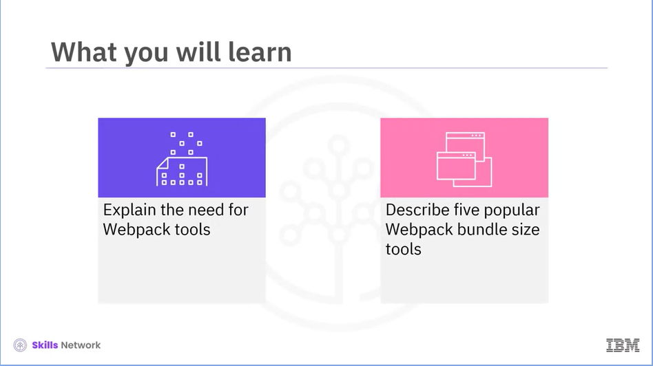{width="5.0in"
height="2.806089238845144in"}

After reading this module (20), you will be able to:

-   Explain the need for Webpack tools, and

-   Describe five popular Webpack bundle size tools.

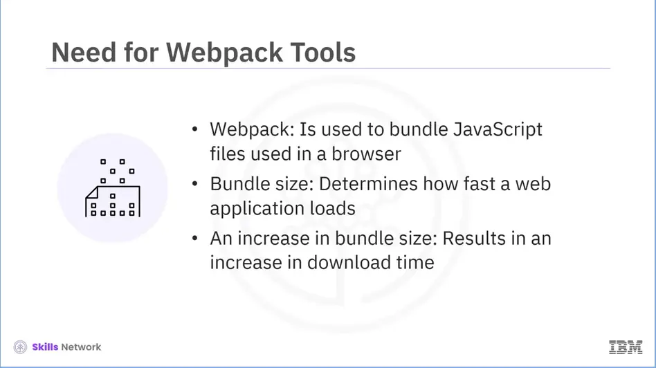{width="5.0in"
height="2.806089238845144in"}

Webpack is a module bundler used to bundle JavaScript files to be used
in a browser. Bundle size is an important metric determining how fast a
web application will load. Growth in applications results in large
bundle sizes, creating a problem for the developers. An increase in
bundle size results in an increase in download time and a bigger
overhead in execution time during initialization.

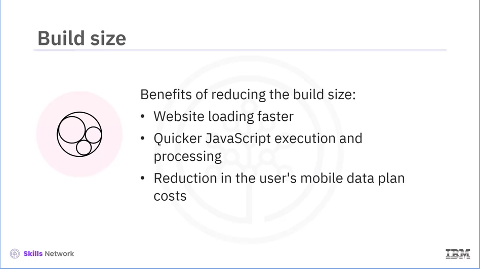{width="5.0in"
height="2.806089238845144in"}

Let's now discuss the benefits of reducing the build size. Reduced build
size leads to the website loading quickly. JavaScript execution and
processing   will be quicker, which is essential in the case of mobile
applications. Ultimately, the user\'s mobile data plan cost is reduced.
Developers use different Webpack tools to reduce the bundle size. Let's
explore five such tools.

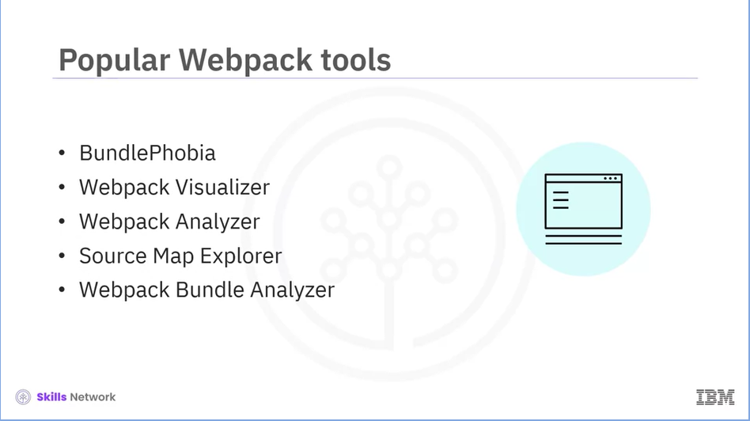{width="5.0in"
height="2.806089238845144in"}

The five popular Webpack tools that we are going to explore in this
session include:

Bundlephobia, Webpack Visualizer, Webpack Analyzer, Source Map Explorer,
and Webpack Bundle Analyzer.

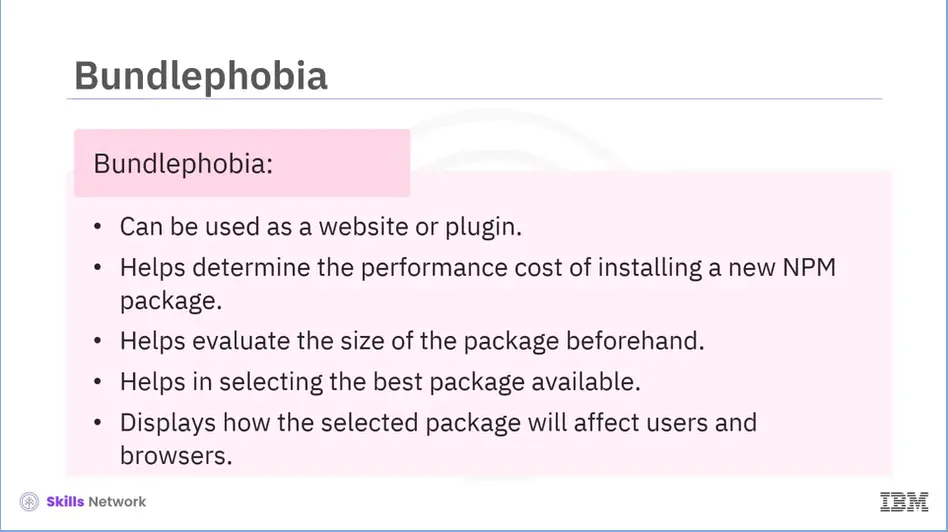{width="5.0in"
height="2.806089238845144in"}

Now, let's discuss each in detail.

One of the most popular Webpack tool that developers use is
Bundlephobia. It is a build-size tool that can be used as a website or
plugin. It offers various benefits. Bundlephobia enables you to
understand the performance cost of installing a new NPM package before
it becomes a part of your bundle. It evaluates the package size
beforehand and helps select the best option available. Bundlephobia also
displays how this package will affect users and browsers when it is used
in your application.

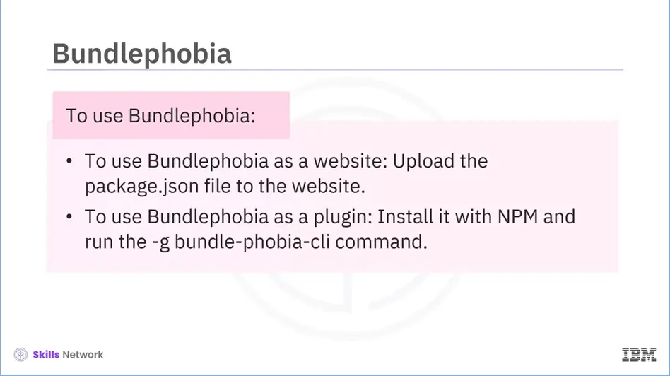{width="5.0in"
height="2.806089238845144in"}

For example, it helps determine the download and render times. To use
Bundlephobia as a website, upload the package.json file to the website.
It will give you all the details, including the file size, download
time, dependency information, and statistics for various plugin
versions. To use Bundlephobia as a plugin, install it with NPM using the
following command:

-   Npm -g bundle-phobia-cli

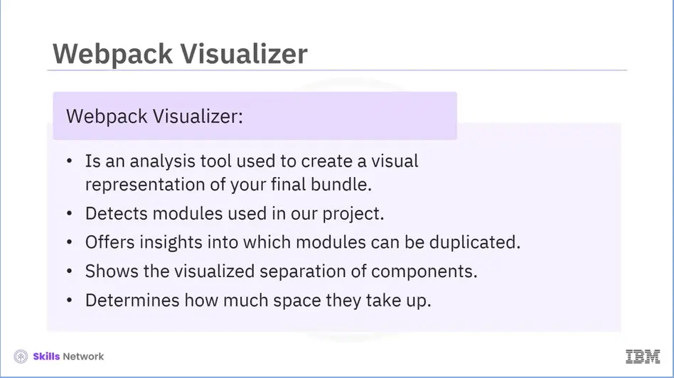{width="5.0in"
height="2.806089238845144in"}

Another popular Webpack tool is Webpack Visualizer. It is an analysis
tool used to create a visual representation of your final bundle. This
tool also detects modules used in our project and offers insights into
which modules can be duplicated. It shows the visualized separation of
components. It determines how much space they take up and their
percentage allocation to the overall amount of the chunk.

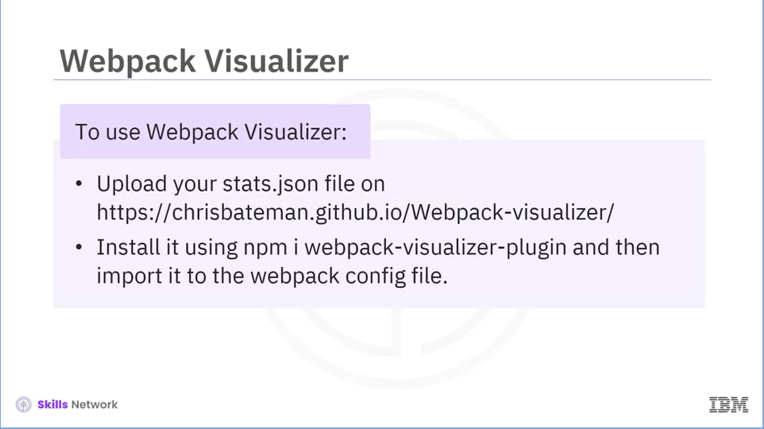{width="5.0in"
height="2.806089238845144in"}

There are two ways of using Webpack Visualizer. You can upload your
stats.json file on chrisbateman.github.io/webpack-visualizer. Or you
could just install it using 

-   npm webpack-visualizer-plugin 

and then import it to the webpack config file.

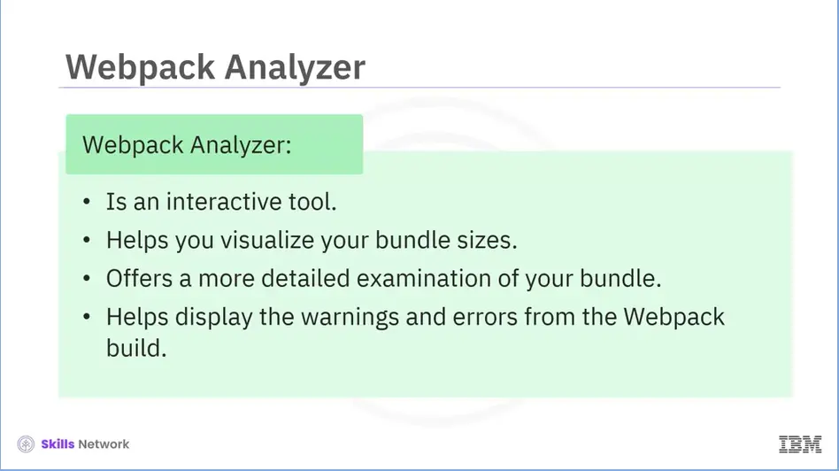{width="5.0in"
height="2.806089238845144in"}

The next popular Webpack tool we will explore is Webpack Analyzer. It is
an interactive tool that helps you visualize your bundle sizes. Webpack
Analyzer offers a more detailed examination of your bundle by generating
a dependency graph. Webpack Analyzer results display the warnings and
errors from the Webpack build with suggestions on how to enhance it.

{width="5.0in"
height="2.806089238845144in"}

To use Webpack Analyzer, generate a stat file using the Webpack ---
profile --- json \> stats.json command and upload it to the website.

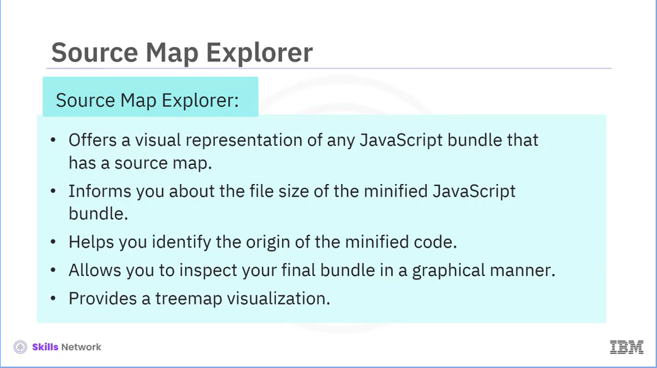{width="5.0in"
height="2.806089238845144in"}

Source Map Explorer is another popular Webpack tool that offers a visual
representation of any JavaScript bundle that has a source map. It
informs you about the file size of the minified JavaScript bundle and
helps you identify the origin of the minified code. Source Map
Explorer allows you to inspect your final bundle in a graphical manner.
It provides a treemap visualization to help you debug where all the code
is coming from.

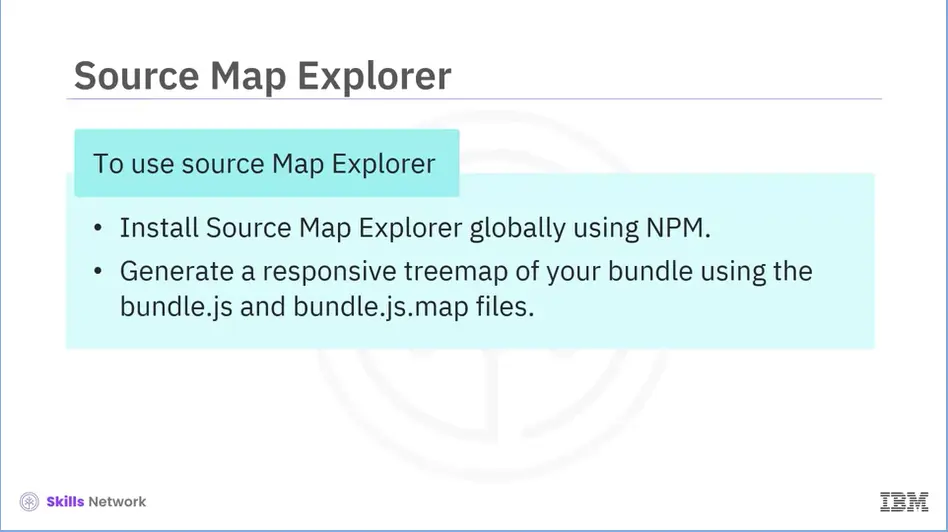{width="5.0in"
height="2.806089238845144in"}

To use Source Map Explorer: Install Source Map Explorer globally using
npm. Then, try to generate a responsive treemap of your bundle using
the bundle.js and bundle.js.map files.

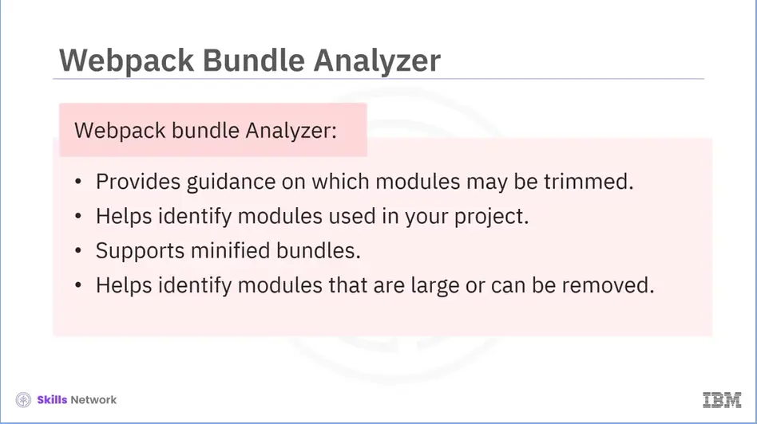{width="5.0in"
height="2.806089238845144in"}

The last Webpack tool we will explore is Webpack Bundle Analyzer. It
provides guidance on which modules may be trimmed and helps identify
modules used in your project. It also supports minified bundles. Webpack
bundle Analyzer helps to identify modules that are large or can be
removed.

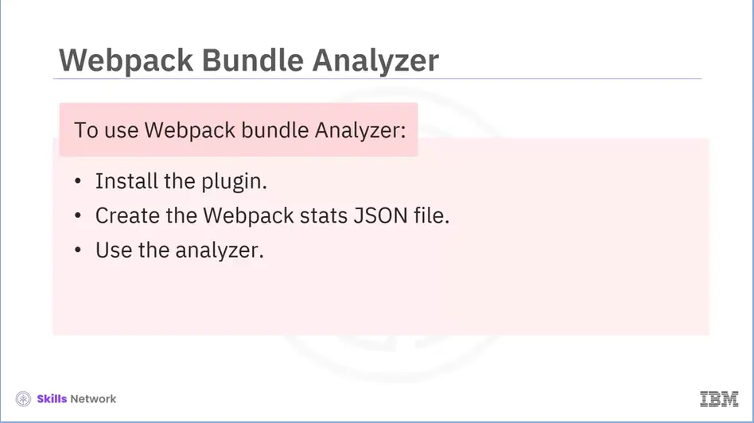{width="5.0in"
height="2.806089238845144in"}

To use this tool: Install the plugin, Create the Webpack stats JSON
file, and Use the analyzer.

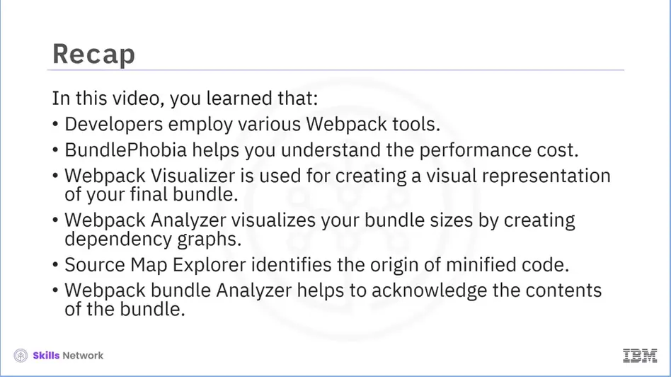{width="5.0in"
height="2.806089238845144in"}

In this module (20), you learned that:

-   Developers use different Webpack tools to reduce the bundle size for
    improving the performance of web applications,

-   BundlePhobia enables you to understand the performance cost of
    installing a package to an application,

-   Webpack visualizer is used for creating a visual representation of
    your final bundle,

-   Webpack Analyzer visualizes your bundle sizes by creating dependency
    graphs,

-   Source Map Explorer identifies the origin of minified code, and

-   Webpack Bundle Analyzer helps to acknowledge the contents of the
    bundle and discover large modules.

# 21. Using Webpack with Frontend Frameworks

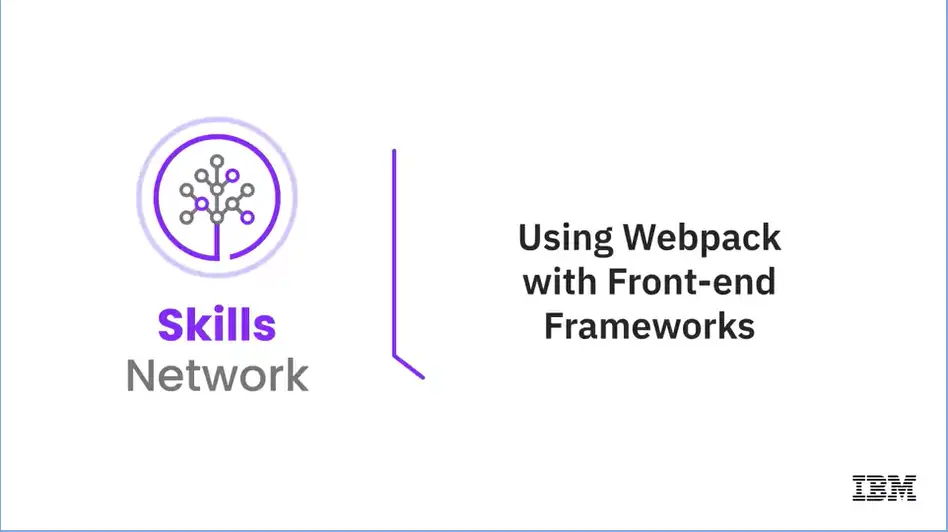{width="5.0in"
height="2.806089238845144in"}

Welcome to "Using Webpack with Frontend Frameworks.\"

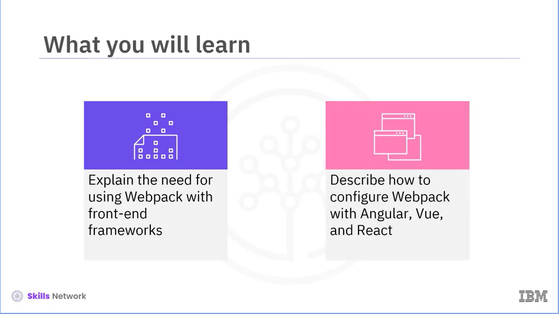{width="5.0in"
height="2.806089238845144in"}

After reading this module (21), you will be able to:

-   Explain the need for using Webpack with front-end frameworks, and

-   Describe how to configure Webpack with Angular, Vue, and React.

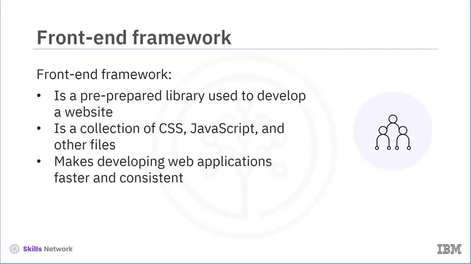{width="5.0in"
height="2.806089238845144in"}

Let's begin by understanding a front-end framework. A front-end
framework is a pre-prepared library meant to be used for the development
of a website. It is a collection of CSS, JavaScript, and other files
designed to make building web applications faster and more consistent.

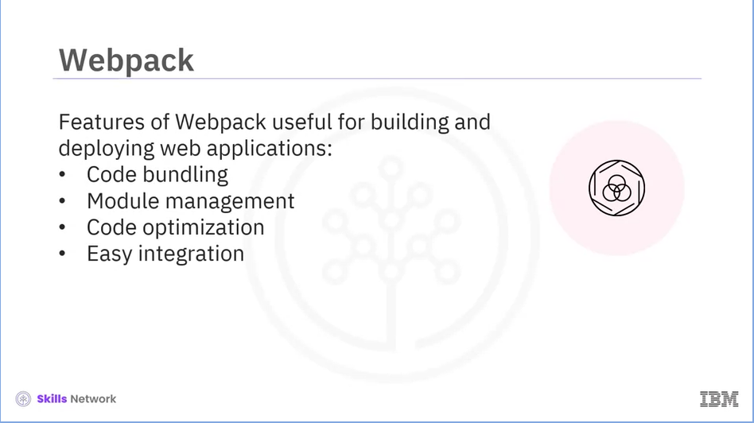{width="5.0in"
height="2.806089238845144in"}

Webpack is commonly used with frontend frameworks. It has several
features that are useful for building and deploying web applications.
Some of these features include: Code bundling, Module management, Code
optimization, and Easy integration.

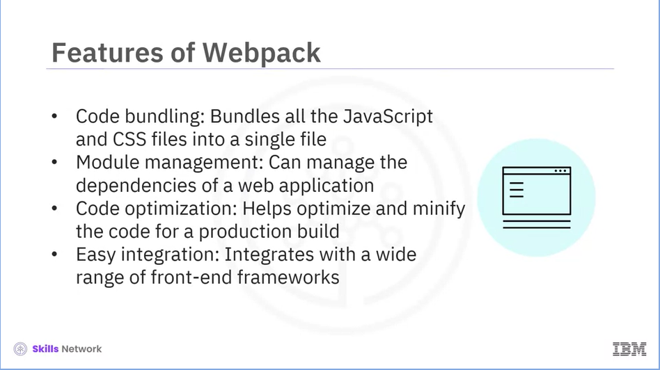{width="5.0in"
height="2.806089238845144in"}

Let's discuss each of these features in detail. The first feature is
code bundling. Webpack can bundle all JavaScript and CSS files for a web
application into a single file, making it efficient to load and run on a
browser.

The next feature is module management. Webpack can manage the
dependencies of a web application, ensuring that all the necessary
modules are included and loaded in the correct order.

Another important feature is code optimization. Webpack can be
configured to optimize and minify the code for a production build,
making it faster to load and run.

The last feature that we are going to discuss is easy integration.
Webpack can be easily integrated with a wide range of frontend
frameworks, making it a versatile tool for building web applications.
These features make the development process more efficient and the final
product robust.

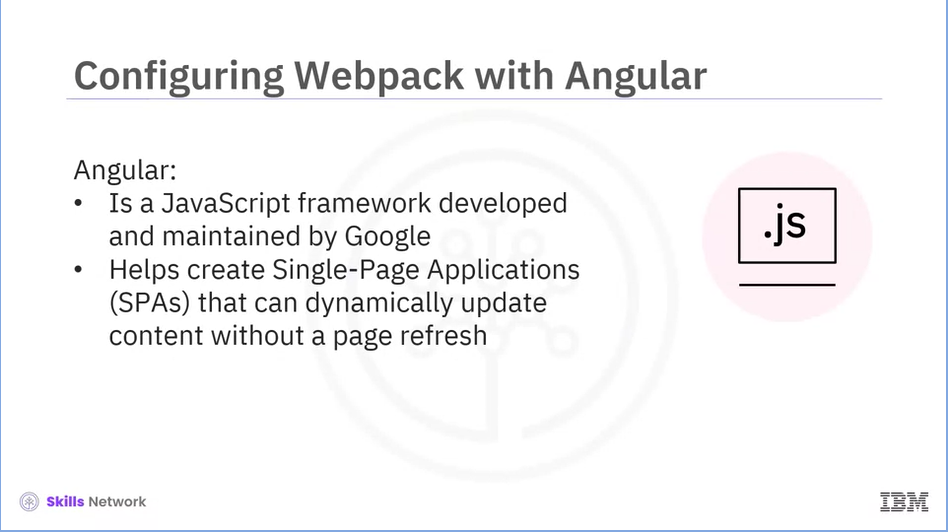{width="5.0in"
height="2.806089238845144in"}

Now, let's discuss how to configure Webpack with Angular. However,
before that, we need to understand what Angular is. Angular is a
JavaScript framework developed and maintained by Google. It is used to
create Single-Page Applications (SPAs) that can dynamically update
content without requiring a page refresh.

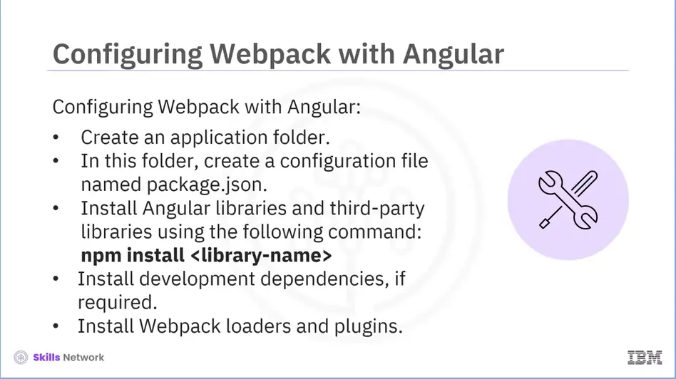{width="5.0in"
height="2.806089238845144in"}

Configuring Webpack with Angular involves a few steps. Let's explore
these steps. First, you need to create an application folder and name
it. Click to open the folder, and then create a file named package.json.
This file contains project configuration information, including package
dependencies. To install Angular libraries when configuring Webpack with
Angular, you need to use Node Package Manager (npm). Use the command as
shown here:

-   Npm install \<library name\>

Note that, like Angular libraries, dependencies can be installed when
configuring Webpack with Angular using npm. Webpack is a JavaScript
module bundler that can be extended with loaders to handle other file
types (for example, TypeScript, HTML, and CSS) and plugins to perform
other tasks, such as injecting generated JS bundles into an HTML
template (html-webpack-plugin).

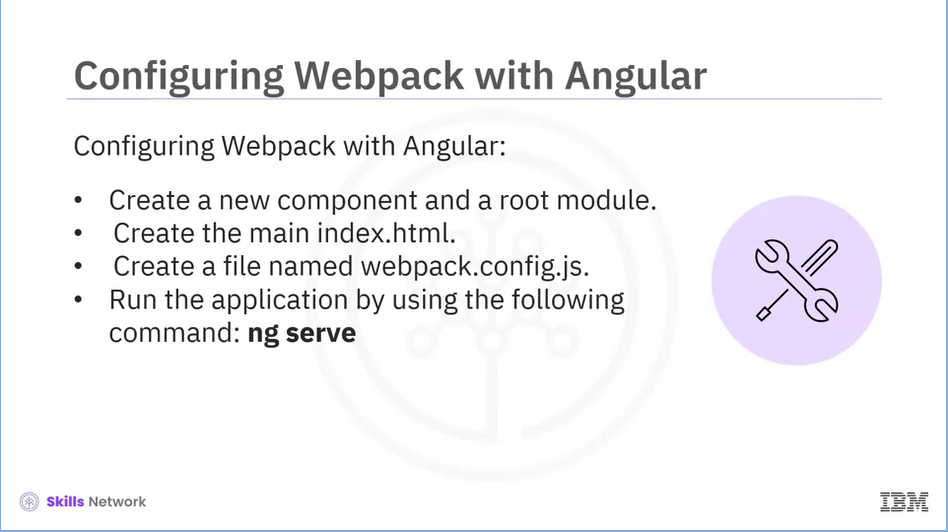{width="5.0in"
height="2.806089238845144in"}

Here are the remaining steps of configuring Webpack with Angular: Now,
create a new component and a root module to define the entry point of
your application while configuring Webpack with Angular. Note that an
entry point is used by Angular to bootstrap/launch the application\'s
root module. Create the main index.html file, which is the initial page
loaded by a browser. To ensure that the scripts are loaded and run by
the browser, Webpack groups all of the JavaScript files together and
injects them into the body of the index.html page. Next, click to open
the project folder, and then create a file named webpack.config.js. This
file specifies the configuration options used by Webpack to compile and
bundle an Angular app. Now, you can run the application. Use the
command, as shown here:

-   ng serve

\- to run the application.

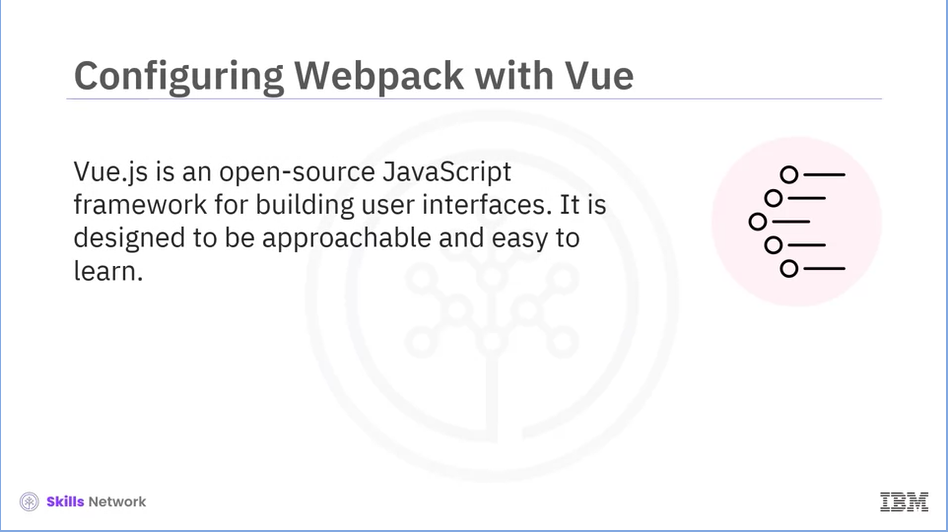{width="5.0in"
height="2.806089238845144in"}

Now we will discuss the process of configuring Webpack with Vue. Before
we proceed, let's try to understand what Vue.js is. Vue.js is an
open-source JavaScript framework for building user interfaces. It is
designed to be approachable and easy to learn.

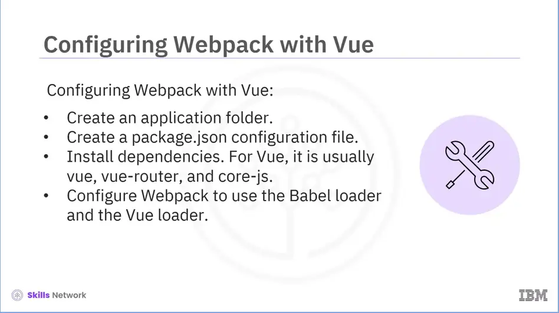{width="5.0in"
height="2.806089238845144in"}

Let's talk about the steps of configuring Webpack with Vue in detail.
First, create a new application folder. Note that all of your project
files will be stored in this folder. Now, create a package.json
configuration file. The primary point of contact between Webpack and
your code is this file. The entry point and output are specified. Next,
you need to install dependencies. For this, you can use the npm package
manager. Now, you need to configure Webpack to use the Babel loader and
the Vue loader.

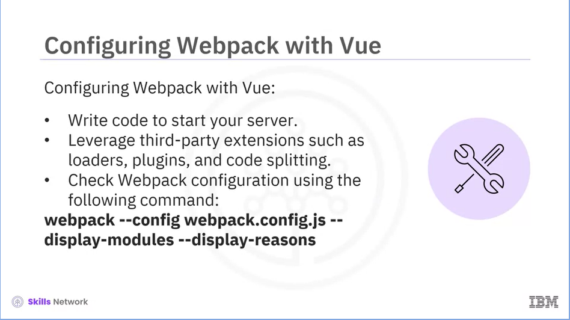{width="5.0in"
height="2.806089238845144in"}

Here are the remaining steps of configuring Webpack with Vue: Write the
code to start your server. This can be done in package.json using
webpack-dev-serve. Use third-party extensions in your Webpack
configuration, such as loaders, plugins, and code splitting. For this,
you need to install them before adding them to your webpack.config.js
file. Check your Webpack configuration. You can run the command, as
shown here, in your terminal.

-   webpack \--config webpack.config.js \--display-modules
    \--display-reasons

All the modules that Webpack is using, along with the reason why they
are included, will appear. Also, you can use webpack-validator, a tool
that will validate your Webpack configuration file and highlight any
errors or potential issues.

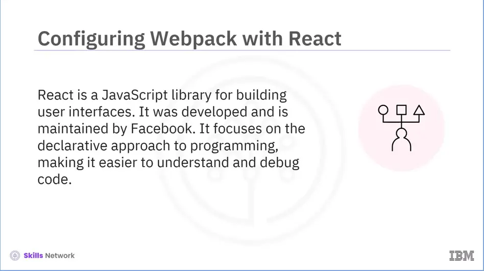{width="5.0in"
height="2.806089238845144in"}

And lastly, we will discuss the process of configuring Webpack with
React. However, before that, we need to be aware of React. React is a
JavaScript library used to build user interfaces. It was developed and
is maintained by Facebook. It focuses on the declarative approach to
programming, making it easier to understand and debug code.

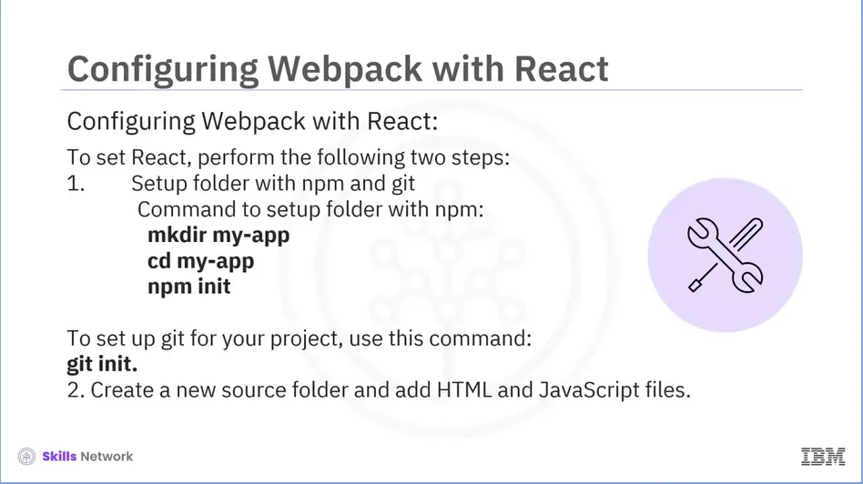{width="5.0in"
height="2.806089238845144in"}

Now let\'s explore the steps of configuring Webpack with React. The
first step in this process is setting up React. To set react, perform
the following steps:

Set up the folder with npm and git. Command to setup folder with npm:

-   mkdir my-app

-   cd my-app

-   npm init

Npm will now ask you a few brief questions about your project before
creating the package.json file in the root directory.

To set up git for your project, use this command:

-   git init.

Create a new source folder and add HTML and JavaScript files.

{width="5.0in"
height="2.806089238845144in"}

The second step of configuring Webpack with React is to install and set
up Webpack. To install Webpack to our project, use the command as shown
here.

-   npm install webpack webpack-cli webpack-dev-server \--save-devSetup
    configuration file -- webpack.config.js

This will install three packages: the
main Webpack package, webpack-cli to run Webpack commands,
and Webpack-dev-server to run React locally. Use the webpack.config.js
command to add the Webpack configuration file to the root folder.

The third step of configuring Webpack with React is to instruct Webpack
where to begin combining the JavaScript files, which means specifying
the entry point for Webpack.

The fourth step of configuring Webpack with React is to define the
output path for the bundled file after the entry point is defined.

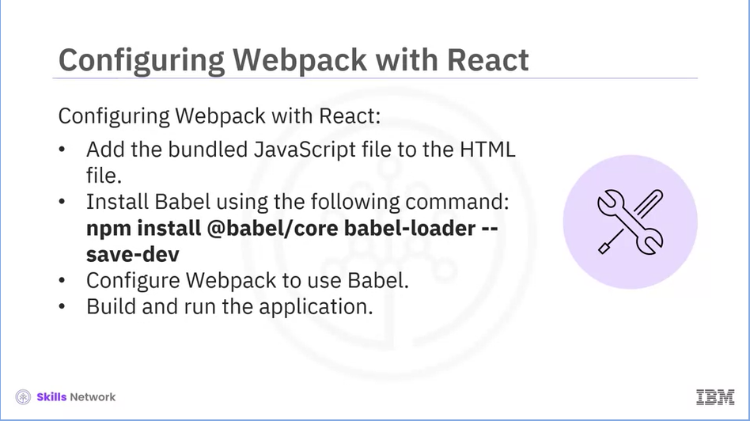{width="5.0in"
height="2.806089238845144in"}

Here are the remaining steps of configuring Webpack with React: Add the
bundled JavaScript file to the HTML file. Install Babel, which is the
core transpiler, using the command shown here Configure Webpack to use
Babel.

Now that a configuration file is created, you can build and run the
application.

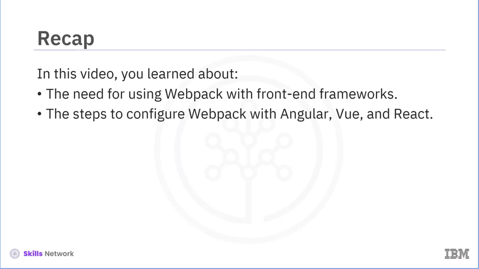{width="5.0in"
height="2.806089238845144in"}

In this module (21), you learned about;

-   The need for using Webpack with front-end frameworks,

-   The steps to configure Webpack with Angular, Vue, and React.

# Hands on Lab: Build and Deploy a website using Webpack

## Welcome to the **Build and Deploy a website using Webpack** lab! 

In this lab, you will learn how to package your web application using
Webpack. The lab is a continuation of the Fruit Marketplace.

Skills Network Labs (SN Labs) is a virtual lab environment used in this
course. Upon clicking \"Open Tool\" in accordance with IBM Skills
Network Privacy policy your Username and Email will be passed to Skills
Network Labs and will only be used for communicating important
information to enhance your learning experience.

In case you need to download the lab instructions click
[HERE](https://cf-courses-data.s3.us.cloud-object-storage.appdomain.cloud/IBMSkillsNetwork-WD0231EN-SkillsNetwork/labs/webpack.md.html)
to open in a new tab.

This course uses a third-party app, Hands on Lab: Build and Deploy a
website using Webpack, to enhance your learning experience. The app will
reference basic information like your name, email, and Coursera ID.

# 22. Webpack Best Practices

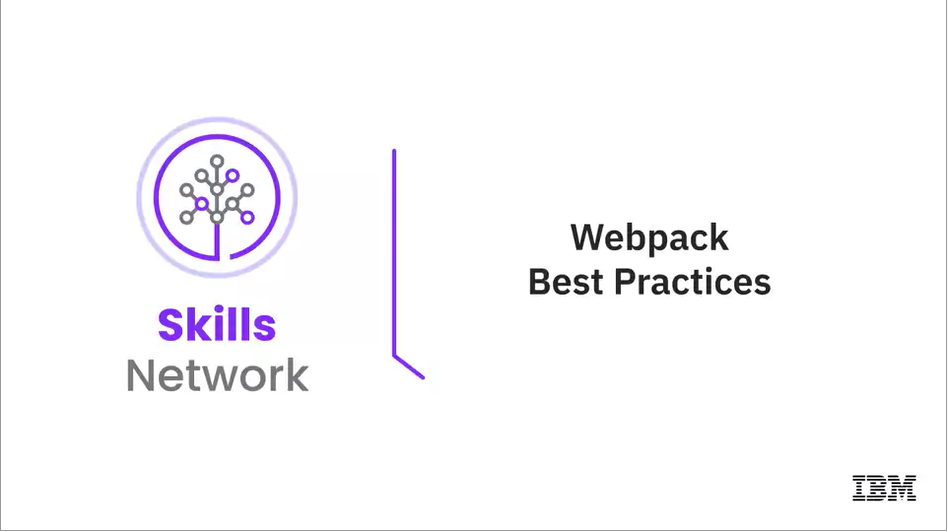{width="5.0in"
height="2.806089238845144in"}

Welcome to "Webpack Best Practices."

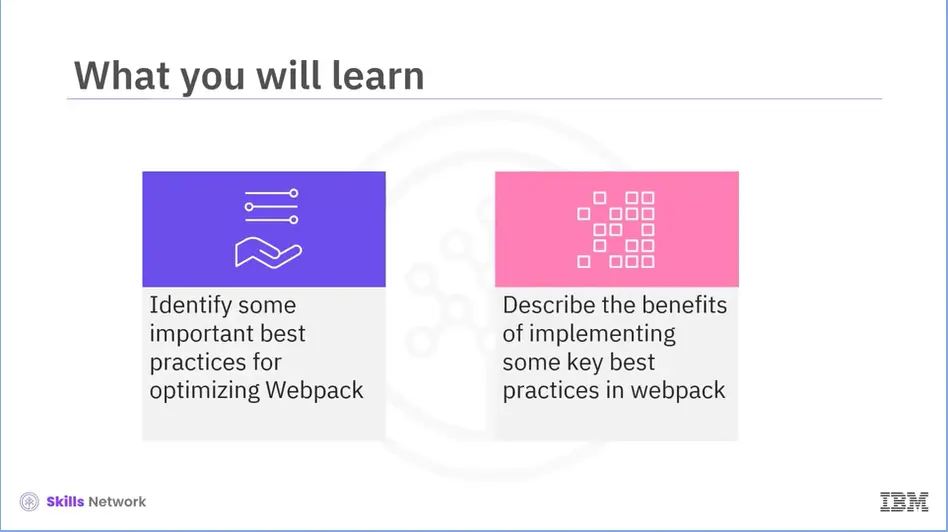{width="5.0in"
height="2.806089238845144in"}

After reading this module (22), you will be able to:

-   Identify some important best practices for optimizing Webpack, and

-   Describe the benefits of implementing some key best practices in
    Webpack.

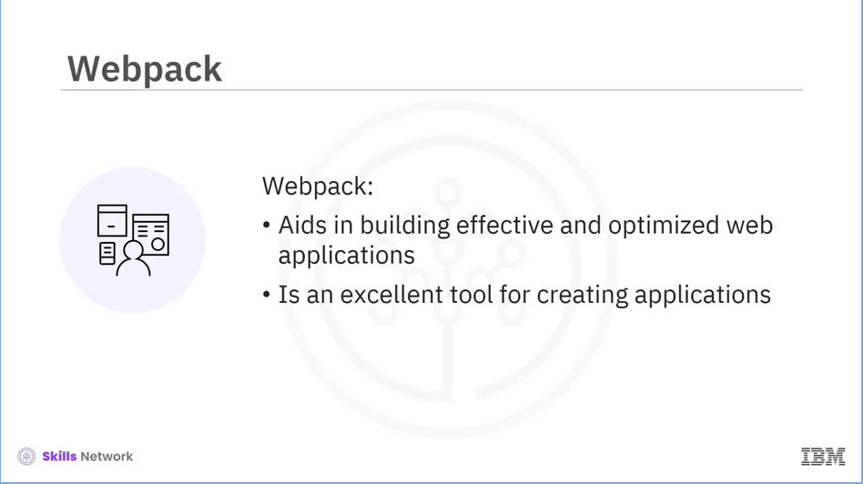{width="5.0in"
height="2.806089238845144in"}

Webpack is a widely used module bundler that aids developers in building
effective and optimized web applications. It is an excellent tool for
creating applications; however, it can be challenging to get the most
out of it.

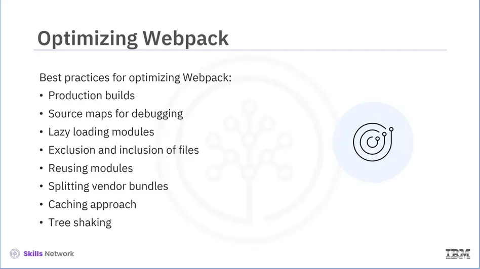{width="5.0in"
height="2.806089238845144in"}

In this module (22), we will learn about a few best practices for
optimizing Webpack to ensure that your applications are optimized and
efficient. The best practices we will explore in this session include:
Production builds, Using source maps, Lazy loading modules, Exclusion
and inclusion of files, Reusing modules, Splitting vendor bundles,
Caching approach, and Tree shaking.

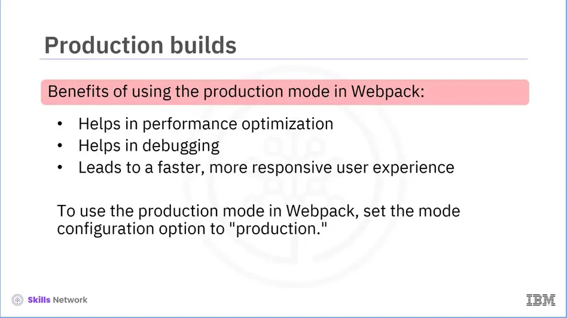{width="5.0in"
height="2.806089238845144in"}

The first best practice that we will explore is using the production
mode in Webpack. Using this mode has several benefits. It helps in
performance optimization. Webpack implements a number of performance
improvements when used in the production mode, including code
minification, tree shaking, and scope hoisting. These improvements
accelerate the loading of your application and help reduce the size of
the final output. Using the production mode also helps in debugging.
When running in the development mode, Webpack generates source maps that
can trace back errors to their original source. The optimizations
applied in the production mode can lead to a faster, more responsive
user experience, as the application loads faster and runs more
efficiently. To use the production mode in Webpack, you need to set the
mode configuration option to \"production.\"

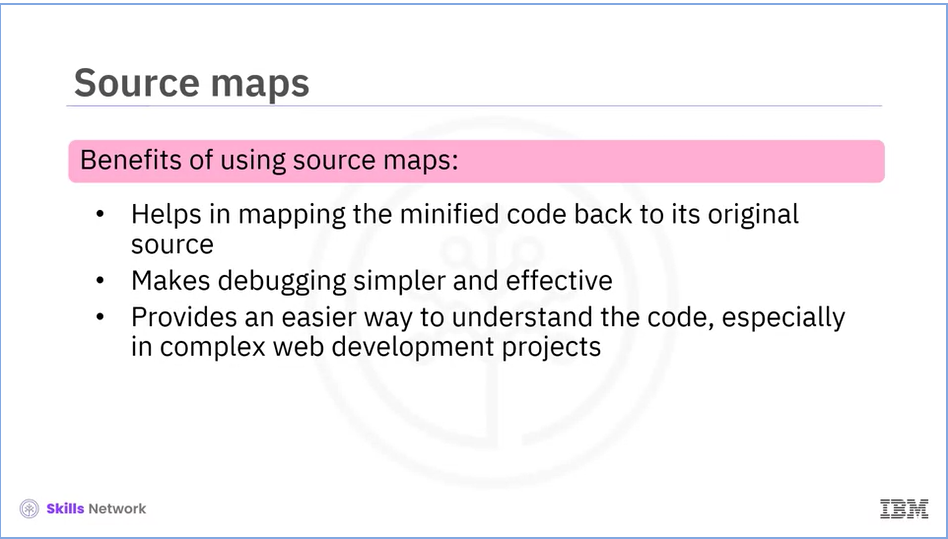{width="5.0in"
height="2.8429483814523184in"}

Another best practice related to using Webpack is the use of source
maps. Webpack combines all the code in one or more bundles. These
bundles can be difficult to debug as the code is minified, making it
hard to read and understand. Source maps are a way to map the code back
to its original source. This makes debugging simpler and effective as it
enables developers to test their code in the same manner they would if
it weren\'t bundled. Hence, source maps provide an easier way to debug
and understand the code, especially in complex web development projects.

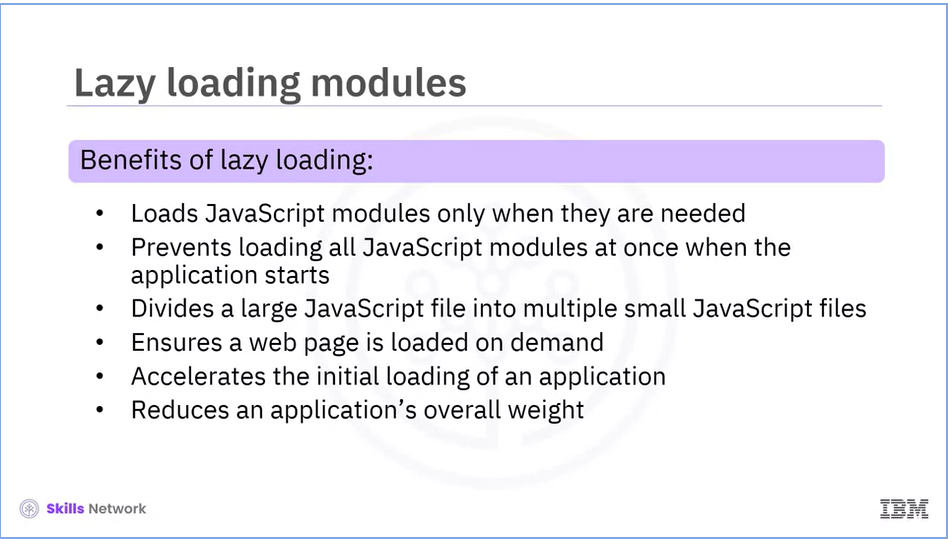{width="5.0in"
height="2.8429483814523184in"}

The third best practice is lazy loading. It is a technique of loading
JavaScript modules only when they are needed, rather than loading them
all at once when the application starts. After using the lazy-loaded
modules, a large JavaScript file is divided into multiple small
JavaScript files and the web page is loaded on demand. This accelerates
the initial loading of the application and reduces its overall weight as
some blocks may never even be loaded.

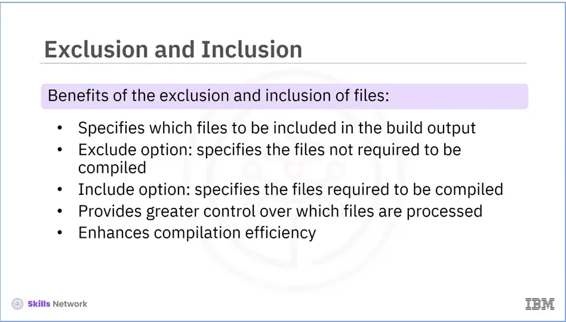{width="5.0in"
height="2.8429483814523184in"}

Now, we will discuss the exclusion and inclusion of files. In Webpack,
you can use the \"exclude\" and \"include\" options to specify which
files should be included in the build output. The \"exclude\" option
specifies the files not required to be compiled. For example: node
modules. The \"include option\" specifies the files required to be
compiled. For example: the src folder. By using the \"exclude\" and
\"include\" options in Webpack, you can have greater control over which
files are processed, which helps enhance compilation efficiency.

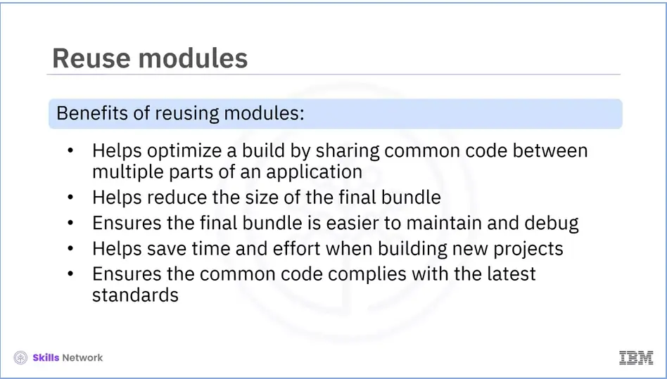{width="5.0in"
height="2.8429483814523184in"}

The fifth best practice is reusing modules. Reusing modules in Webpack
is a way to optimize your build by sharing common code between multiple
parts of your application. This can help reduce the size of the final
bundle, which makes it easier to maintain and debug. Reusing modules
also helps save time and effort when building new projects.
Additionally, by using pre-existing modules, programmers may ensure that
their code complies with the latest standards and best practices related
to improving the performance of your application.

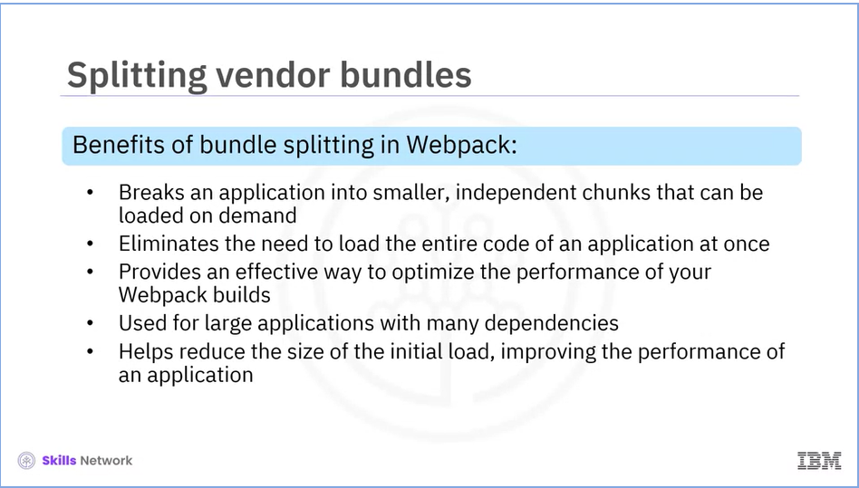{width="5.0in"
height="2.8429483814523184in"}

Next, we will discuss bundle splitting in Webpack. It is a way of
breaking your application into smaller, independent chunks that can be
loaded on demand, rather than loading the entire code of your
application at once. A chunk is a group of modules that directly
corresponds with the output bundle. Using SplitChunksPlugin, we can
split up a chunk into smaller chunks. Bundle splitting is an effective
way to optimize the performance of your Webpack builds and is
particularly useful for large applications with many dependencies. This
helps reduce the size of the initial load, improving the performance of
your application.

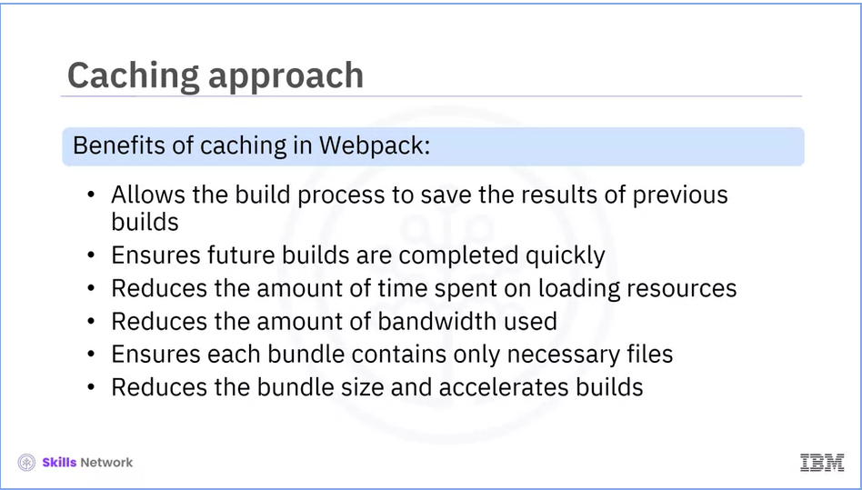{width="5.0in"
height="2.8429483814523184in"}

Another popular practice is caching. Caching in Webpack is a technique
that allows the build process to save the results of previous builds so
that future builds can be completed quickly. This helps improve
performance by reducing the amount of time spent on loading resources
and reducing the amount of bandwidth used. By employing caching
techniques, developers can ensure that each bundle contains only the
necessary files, thereby reducing the bundle size and accelerating
builds. To implement caching strategies with Webpack, developers should
use the webpack-bundle-analyzer plugin. Developers may use this plugin
to examine their bundles and determine which files are duplicated or
unnecessary. After these files are identified, developers can create an
appropriate caching strategy for them.

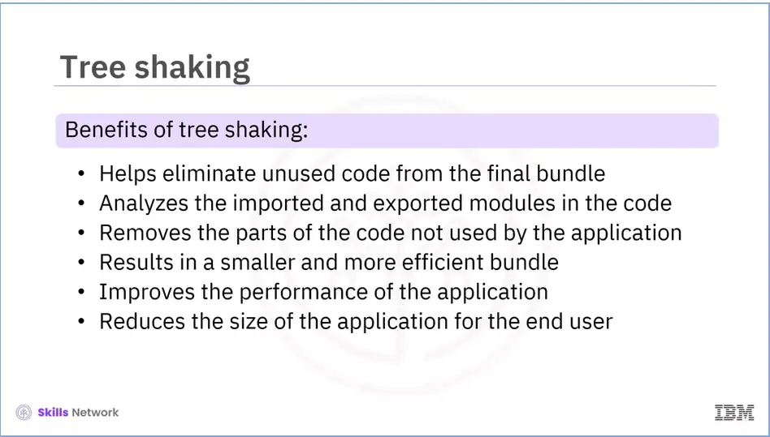{width="5.0in"
height="2.8429483814523184in"}

The last best practice to optimize Webpack that we are going to discuss
is tree shaking. It is an optimization technique used in Webpack to
eliminate unused code from the final bundle. It analyzes the imported
and exported modules in the code and removes the parts of the code not
actually used by the application. This results in a smaller and more
efficient bundle, which can improve performance and reduce the size of
the application for the end user. In Webpack5, tree shaking is enabled
by default in the production mode.

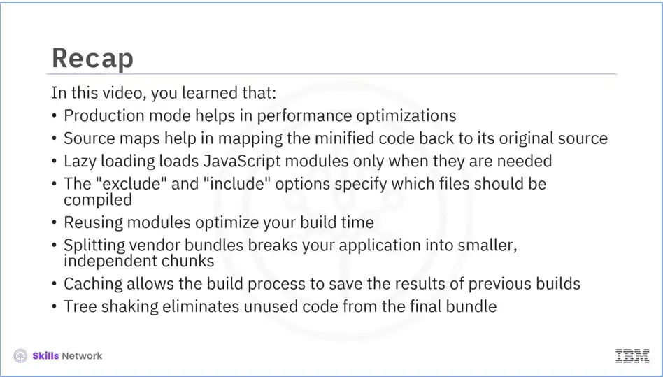{width="5.0in"
height="2.8429483814523184in"}

In this module (22), you learned that:

-   Production mode helps in Webpack performance optimization,

-   Source maps help in tracing minified code back to its original
    location,

-   Lazy loading refers to the practice of loading JavaScript modules
    only when they are required,

-   The \"exclude\" and \"include\" options control which files are
    included in the build output,

-   Reusing modules reduces build time by sharing common code across
    multiple parts of your application,

-   Splitting vendor bundles is a method of dividing your application
    into smaller, self-contained chunks,

-   Caching enables the build process to save previous build results,

-   Tree shaking removes unnecessary code from the final bundle.

# 23. Reading: HTTPS & SSL Certificates

## What is HTTPS?

Hypertext transfer protocol secure (HTTPS) is the secure version of
HTTP, which is the primary protocol used to send data between a web
browser and a website. HTTPS is encrypted in order to increase the
security of data transfer. This is particularly important when users
transmit sensitive data by logging into a bank account, email service,
or health insurance provider.

Any website, especially those that require login credentials, should use
HTTPS. In modern web browsers such as Chrome, websites that do not use
HTTPS are marked differently than those that are.

Look for a padlock in the URL bar to signify that the webpage is secure.
Web browsers take HTTPS seriously; Google Chrome and other browsers flag
all non-HTTPS websites as not secure.

## How does HTTPS work?

HTTPS uses an encryption protocol to encrypt communications. The
protocol is called Transport Layer Security (TLS), formerly known as
Secure Sockets Layer (SSL). This protocol secures communications by
using what's known as an asymmetric public key infrastructure. This type
of security system uses two different keys to encrypt communications
between two parties:

The private key - this key is controlled by the owner of a website, and
it's kept, as the reader may have speculated, private. This key lives on
a web server and is used to decrypt information encrypted by the public
key.

The public key - this key is available to everyone who wants to interact
with the server in a way that's secure. Information that's encrypted by
the public key can only be decrypted by the private key.

## How does a website start using HTTPS?

Many website hosting providers and other services will offer TLS/SSL
certificates for a fee. These certificates will often be shared amongst
many customers. More expensive certificates are available, which can be
individually registered to particular web properties.

## What is an SSL Certificate?

SSL stands for Secure Sockets Layer, and, in short, it\'s the standard
technology for keeping an internet connection secure and safeguarding
any sensitive data that is being sent between two systems, preventing
criminals from reading and modifying any information transferred,
including potential personal details. The two systems can be a server
and a client (for example, a shopping website and browser) or server to
server (for example, an application with personal identifiable
information or with payroll information).

It does this by making sure that any data transferred between users and
sites or between two systems remain impossible to read. It uses
encryption algorithms to scramble data in transit, preventing hackers
from reading it as it is sent over the connection. This information
could be anything sensitive or personal which can include credit card
numbers and other financial information, names, and addresses.

TLS (Transport Layer Security) is just an updated, more secure version
of SSL.

## How Does an SSL Certificate Work?

SSL certificates protect data transfer using two different encryption
techniques: asymmetric and symmetric.

Asymmetric encryption uses two separate keys: a public and a private
key. The public key is used to encrypt the message, which can only be
decrypted by the private key, and vice versa. On the other hand,
symmetric encryption uses one shared key, or a pair of keys, to encrypt
and decrypt the message.

To give a better understanding of how those encryption techniques work,
here's an overview of the process:

-   First, a website owner purchases an SSL certificate from a
    Certificate Authority (CA) and installs it on their site.

-   When a visitor navigates through the website, the browser and the
    web server establish an SSL connection using a method called **SSL
    handshake**.

-   During the SSL handshake, the browser asks the server for its SSL
    certificate and public key to prove its validity.

-   Once the certificate is verified, the browser and web server
    exchange private and public keys to create a symmetric session key.

-   Both parties then use this symmetric key to encrypt all
    communications. This key will remain valid for a limited time and
    only for that particular session.

# Practice Quiz: Introduction to Web Build with Webpack

# Week 3 Summary: Introduction to Automated Build Tools (Webpack)

In this module (24), you learned that:

-   Build automation is preparing the source code for production so that
    users can interact with it comfortably.

-   Webpack 5 is a command line tool that assists in handling the
    bundling of assets, modules, and dependencies into a single bundle.

-   Webpack comprises concepts that optimize its functioning.

-   Configuring Webpack tracks errors efficiently and helps in quicker
    execution.

-   Webpack comprises three main configuration modes.

-   Webpack in production mode allows many practices that are helpful at
    the time of building an application.

-   Developers use different Webpack tools to reduce the bundle size to
    improve the performance of web applications.

-   Many frontend frameworks use Webpack to build and deploy web
    applications.

-   Some best practices can be implemented to optimize Webpack.

# Graded Quiz: Introduction to Web Build with Webpack

# [Week 4:]{.mark}

# 24. JavaScript Optimization

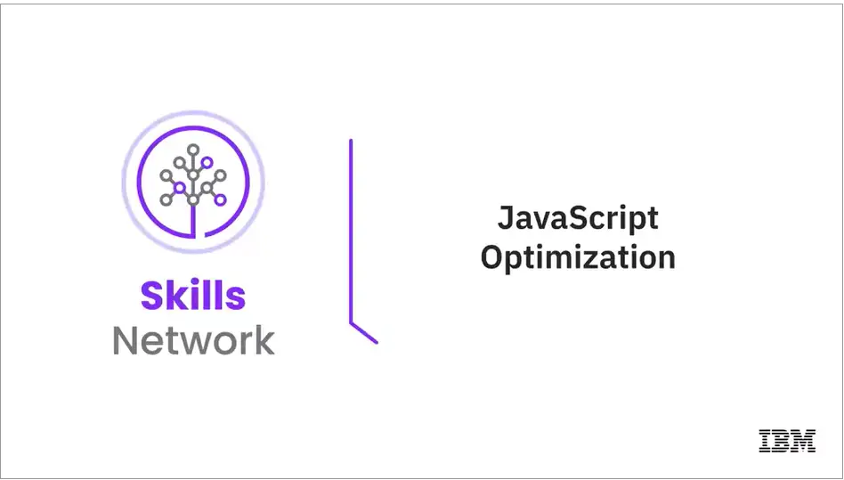{width="5.0in"
height="2.8429483814523184in"}

Welcome to JavaScript Optimization.

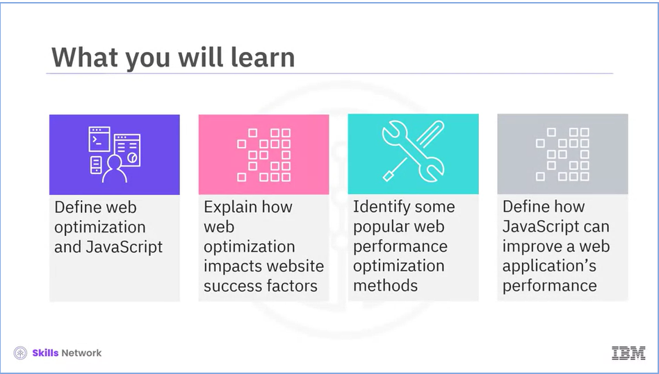{width="5.0in"
height="2.8429483814523184in"}

After reading this module (24), you will be able to: define web
optimization and JavaScript, explain how web optimization impacts
website success factors, identify some popular web performance
optimization methods, and define how JavaScript can improve a web
application's performance.

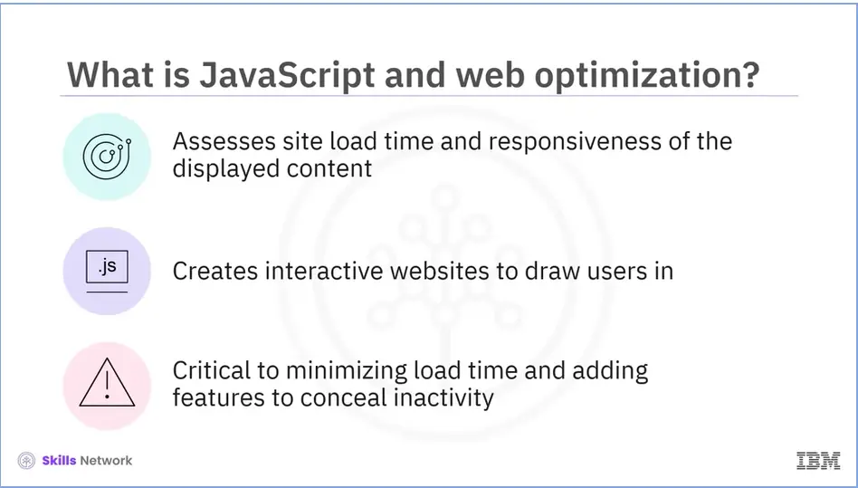{width="5.0in"
height="2.8429483814523184in"}

Web optimization determines how quickly a website loads and becomes
responsive and interactive and how smoothly the content is presented
when users interact with it. JavaScript is capable of producing highly
interactive websites that actively engage the user. However, increased
engagement levels can negatively impact a website's usability. It is
important to minimize loading and response times and add additional
features to conceal inactivity by making the experience as available and
interactive as possible.

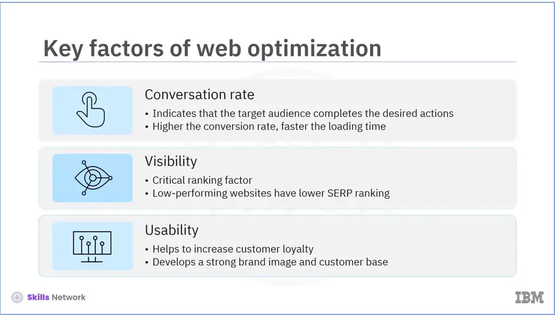{width="5.0in"
height="2.8429483814523184in"}

Web optimization impacts the crucial factors that determine website
success. The first factor is conversion rate. This metric is crucial for
a business\'s success as it indicates that the target audience completes
the actions you want them to perform, such as purchasing a product,
subscribing to a newsletter, registering for a webinar, or downloading a
step-by-step guide. The higher the conversion rate, the faster the
loading time. Another important factor is visibility. Page speed is a
critical ranking factor. A low-performing website with poor user
experience and long loading times will be penalized by search engines
and have a lower SERP ranking. The last factor is website usability,
which helps to increase or establish customer loyalty. The better the
website behaves, the happier the end users are.

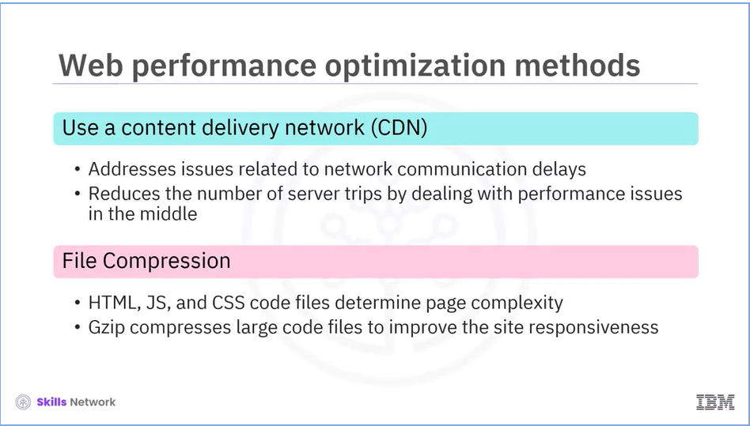{width="5.0in"
height="2.8429483814523184in"}

Let's now talk about a few web performance optimization methods.

Content delivery networks (CDNs) were created to address the issues
associated with network communication delays. A version of the content
is stored in various geographical locations by CDN. By handling the
performance middle mile, a CDN brings the user closer to resources. The
number of trips the server makes is significantly reduced, resulting in
a faster loading process.

File Compression The HTML, JS, and CSS code files are the foundation of
every website. The longer it takes to load a page, the more complex it
is. These large code files should be compressed to their original size
to improve site responsiveness. You can use GZip and other well-known
programs for data compression and decompression.

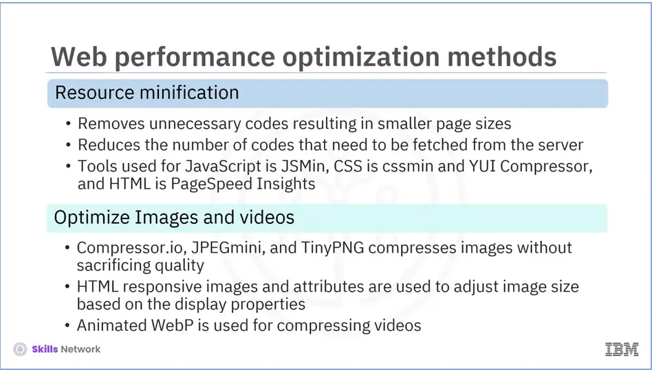{width="5.0in"
height="2.8429483814523184in"}

Resource minification Resource minification removes unnecessary code
redundancy from CSS, HTML, and JavaScript, resulting in smaller page
sizes. Reducing the amount of code that needs to be fetched from the
server speeds up front-end loading. The tool used to generate minified
codes for JavaScript is JSMin, CSS is cssmin and YUI Compressor, and for
HTML is PageSpeed Insights. Optimize Images and videos. High-resolution
images and videos significantly slow down the rendering process.
Compressing images without sacrificing quality is possible with tools
like Compressor.io, JPEGmini, and TinyPNG. HTML responsive images and
attributes can also be used as it adjusts image size based on the
display properties of the user's device. Animated WebP can be used for
videos or replaced with an HTML5 video tag.

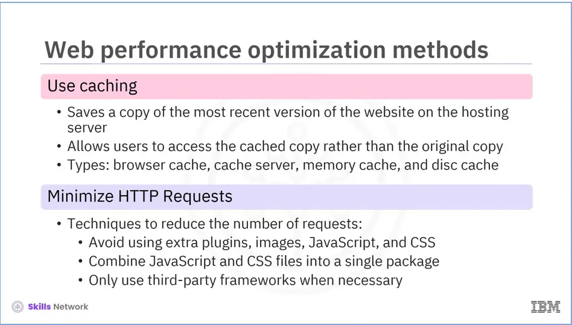{width="5.0in"
height="2.8429483814523184in"}

Use caching When a user visits a website, the elements are saved in a
temporary hard drive storage area known as a cache. Caching saves a copy
of the latest version of the website on the hosting server and allows
the user to access the cached copy rather than the original copy later.
This practice enables the pages to load faster. There are various types
of caching, such as browser cache, cache server, memory cache, and disc
cache, that help to increase delivery speed. Minimize HTTP Requests If
your website makes a lot of HTTP requests, the web pages will take
longer to load. Determine the number of HTTP requests and then use some
techniques to reduce the number of requests. Avoid using extra plugins,
images, JavaScript, and CSS. Combine your JavaScript and CSS files into
a single package. Only use third-party frameworks when necessary.

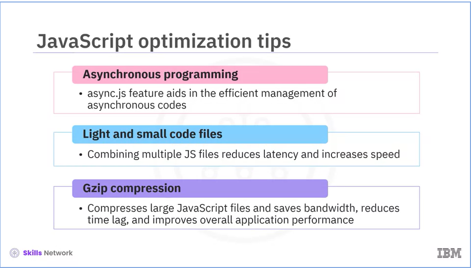{width="5.0in"
height="2.8429483814523184in"}

JavaScript is becoming a popular language for creating web applications.
Here are some important points on how JavaScript can improve the
performance of your web application. Asynchronous programming The
async.js feature of JavaScript aids in the efficient management of
asynchronous codes. As a result, async code is pushed to an event queue,
where it executes after all other code has been completed. Light and
small code files Keeping the code light and small reduces latency and
increases speed. Multiple JS files can be combined into one to improve
application performance. Gzip compression Most clients and servers use
Gzip as a compression and decompression software application. It
compresses large JavaScript files and saves bandwidth, reducing latency
and time lag and improving overall application performance.

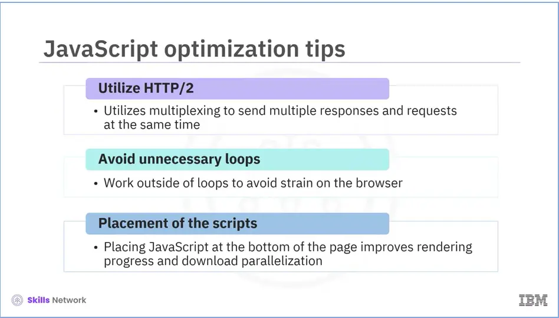{width="5.0in"
height="2.8429483814523184in"}

Utilize HTTP/2 HTTP/2 uses multiplexing, allowing multiple responses and
requests to be sent simultaneously. It improves not only JavaScript
performance but also website speed. Avoid Unnecessary Loops Unnecessary
looping is unfavorable. Try to do as much work as possible outside of
loops because the faster the loops get, the less you loop. Loops place
additional strain on the browser and slow down the entire process.
Placement of Scripts JavaScript should be placed at the bottom of the
page to improve both rendering progress and download parallelization. It
will save the total amount of code required and make the page load
faster.

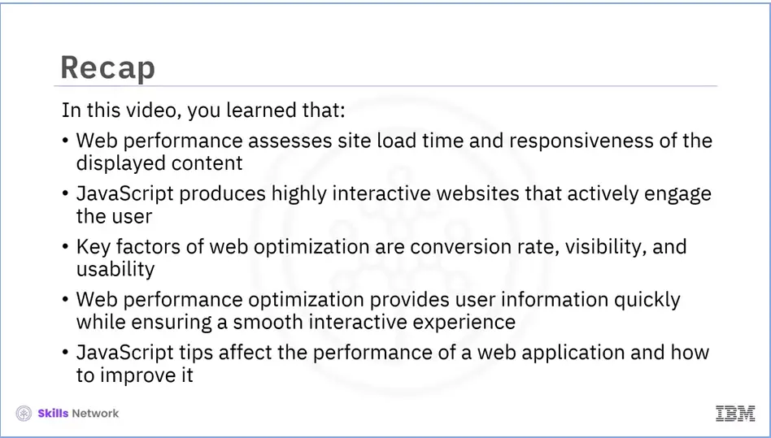{width="5.0in"
height="2.8429483814523184in"}

In this module (24), you learned that:

-   Web performance assesses site load time and responsiveness of the
    displayed content.

-   JavaScript produces highly interactive websites that actively engage
    the user.

-   Key factors of web optimization are conversion rate, visibility, and
    usability.

-   Web performance optimization provides user information quickly while
    ensuring a smooth interactive experience, and

-   JavaScript tips affect the performance of a web application and how
    to improve it.

# 25. Popular Optimization Tools

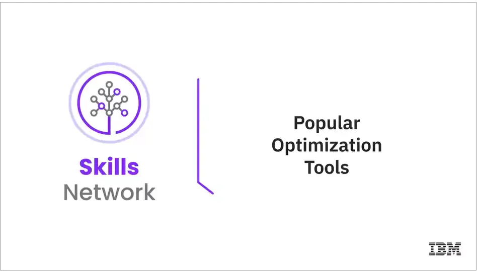{width="5.0in"
height="2.8429483814523184in"}

Welcome to Popular Optimization Tools!

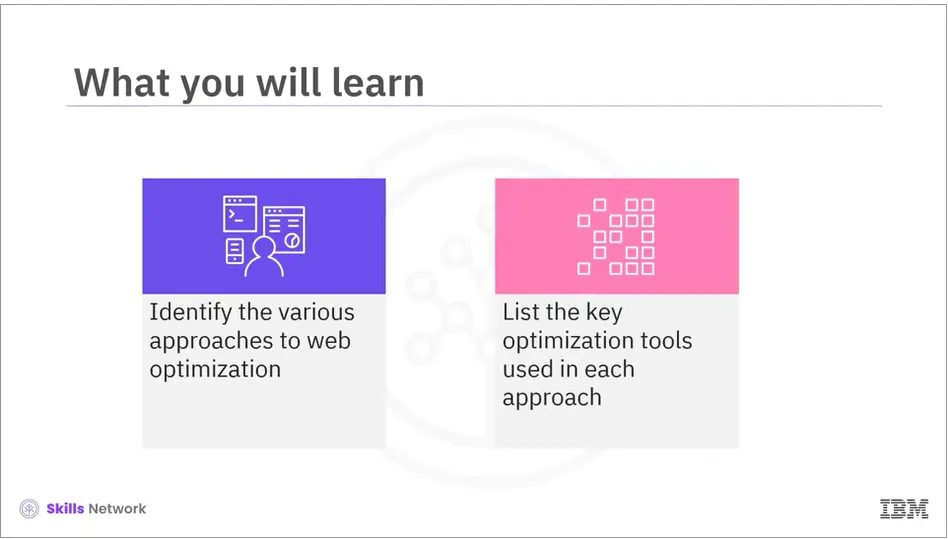{width="5.0in"
height="2.8429483814523184in"}

After reading this module (25), you'll be able to:

-   Identify the various approaches to web optimization

-   and list the key optimization tools used in each approach.

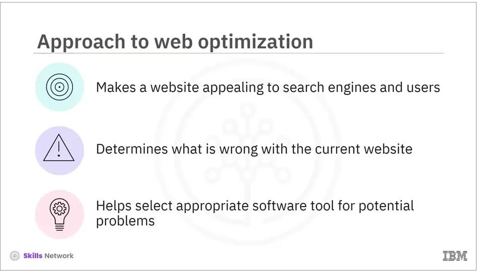{width="5.0in"
height="2.8429483814523184in"}

The goal of website optimization is to make a website as appealing to
search engines and users as possible. To achieve this, the first step is
to identify problems. Before any great optimization process begins, it
is necessary to determine what is wrong with the current website. Simply
brainstorming potential issues is not enough. Instead, we need to use
available software tools to look for potential issues.

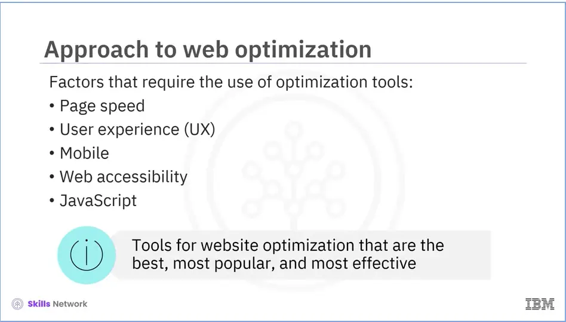{width="5.0in"
height="2.8429483814523184in"}

Some of the factors that require the use of optimization tools include:
Page speed, User experience (UX), Mobile, Web accessibility, and
JavaScript. Let's discuss some of the best, most-used, and most
productive website optimization tools you should consider adding to your
website.

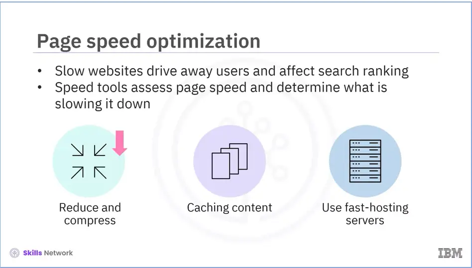{width="5.0in"
height="2.8429483814523184in"}

Let\'s start with page speed optimization tools. A slow website can
drive users away and affect search rankings. Web page speed tools do not
automatically fix your slow site. Instead, they measure the page speed
and show you what\'s slowing it down. You\'ll be able to determine how
to improve page load times by implementing certain measures. These
include: Reducing and compressing HTML, CSS, JavaScript, and images,
Caching content, and Using faster hosting servers.

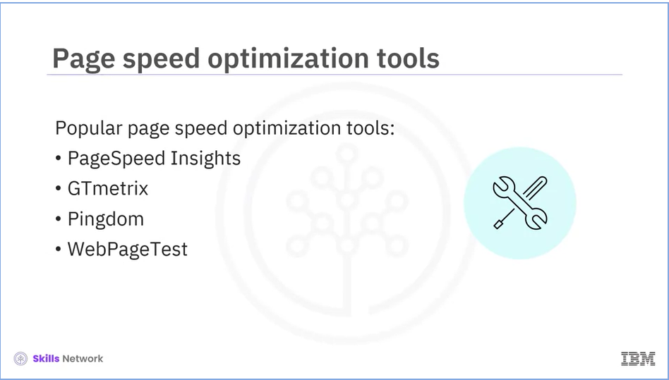{width="5.0in"
height="2.8429483814523184in"}

Some of the popular page speed optimization tools include: PageSpeed
Insights Gtmetrix Pingdom, and WebPageTest.

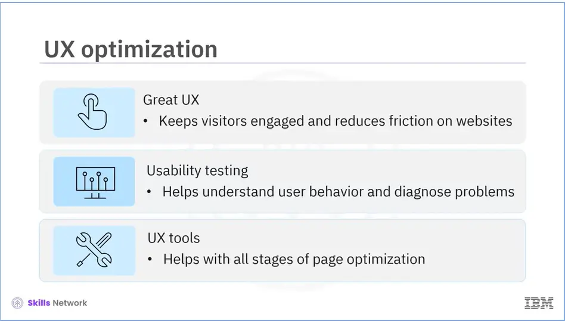{width="5.0in"
height="2.8429483814523184in"}

Next, we'll discuss user experience (UX) optimization tools. Great UX
will keep visitors happy and reduce friction on your website, resulting
in higher conversion rates and revenue. Usability testing will help you
understand user behavior and diagnose problems so you can optimize pages
and give people what they need to continue browsing and purchasing from
your website smoothly. UX tools aid in every stage of the page
optimization process, from identifying where users are getting stuck to
conducting user research.

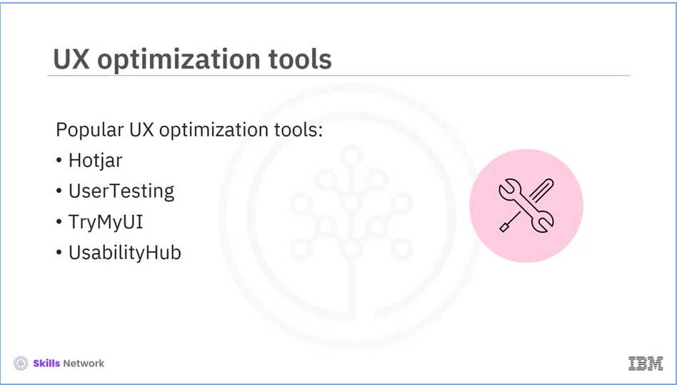{width="5.0in"
height="2.8429483814523184in"}

Some of the popular UX optimization tools include: Hotjar UserTesting
TryMyUI, and UsabilityHub.

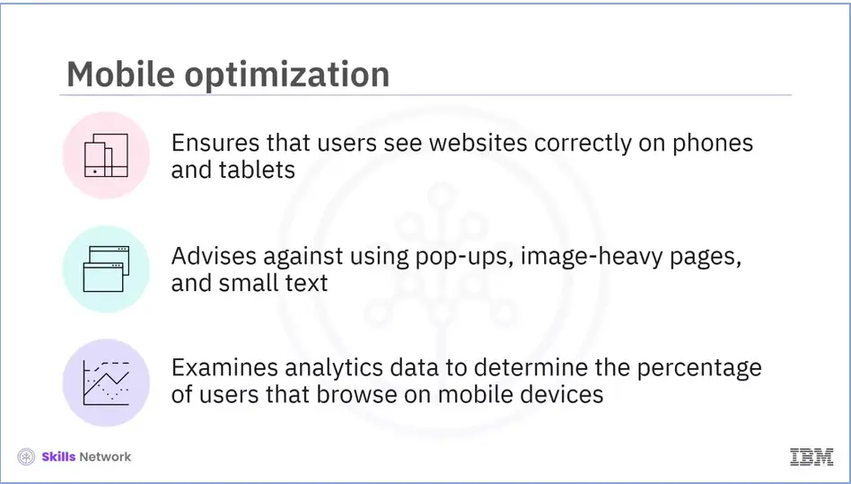{width="5.0in"
height="2.8429483814523184in"}

Let\'s look at mobile optimization tools now. Mobile-first optimization
can help you ensure that users see your site properly on smartphones and
tablets, as more people use mobile devices than desktop computers to
browse the web. Pop-ups, image-heavy pages, and small texts can make
your website difficult to navigate on smartphones. Analyze your
analytics data to determine what percentage of your users and customers
browse on mobile devices, so you can determine how important mobile
optimization is to your business.

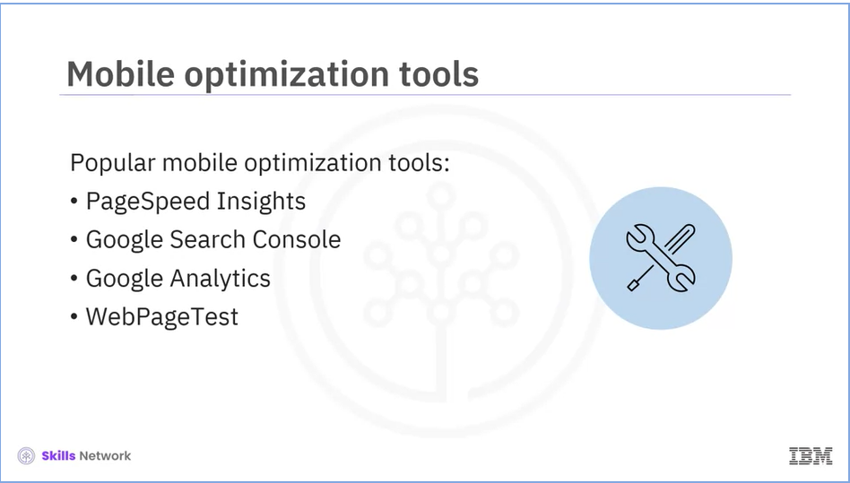{width="5.0in"
height="2.8429483814523184in"}

Some of the popular mobile optimization tools include:

PageSpeed Insights Google Search Console Google Analytics, and
WebPageTest.

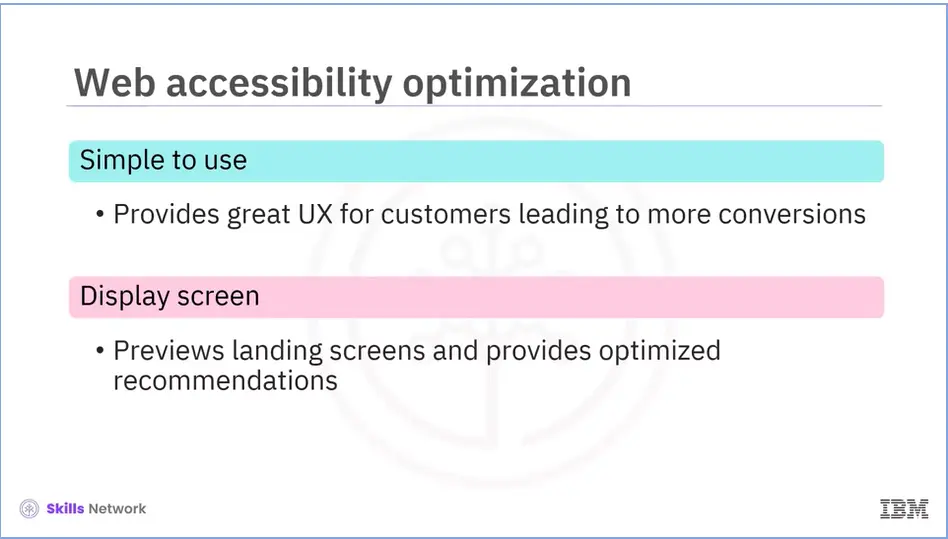{width="5.0in"
height="2.8429483814523184in"}

Next, we will discuss web accessibility optimization tools. An
accessible website is simple to use for everyone, which is a win-win
situation for both you and your visitors: great UX for them and more
satisfied customers for you. Accessibility tools can show you how your
landing pages appear on a screen reader or to people with different
impairments (for example, different types of colorblindness). The tools
can also provide optimization recommendations to make your website more
inclusive.

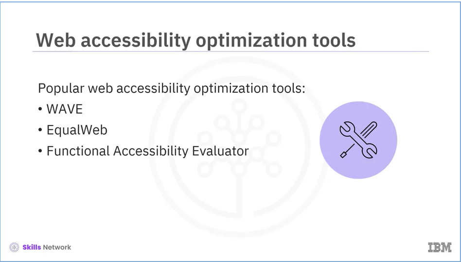{width="5.0in"
height="2.8429483814523184in"}

Some of the popular web accessibility optimization tools include: WAVE
EqualWeb, and Functional Accessibility Evaluator.

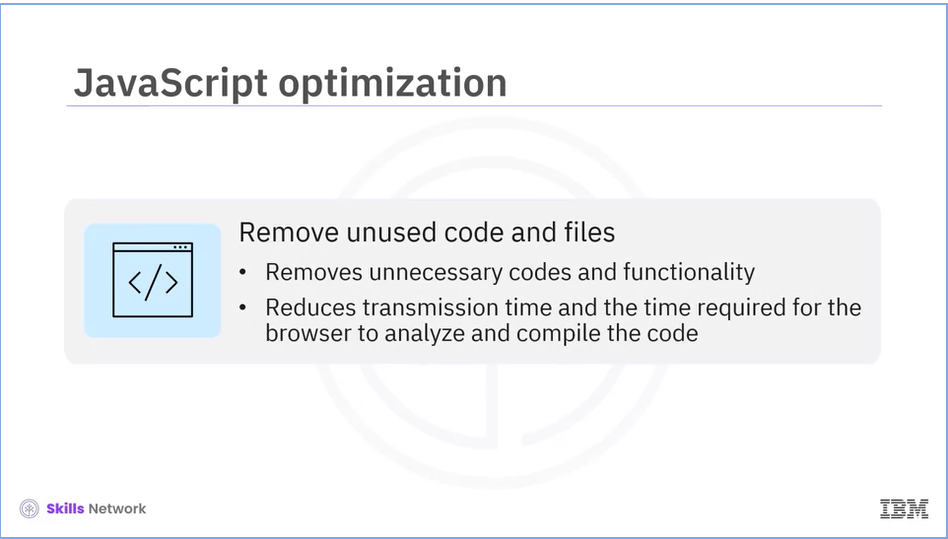{width="5.0in"
height="2.8429483814523184in"}

Finally, let's talk about JavaScript optimization tools. If it is
discovered that the functionality is not being used by users, the best
practice is to remove it along with all associated JavaScript code sets.
This will reduce not only the transmission time but also the time the
browser takes to analyze and compile the code.

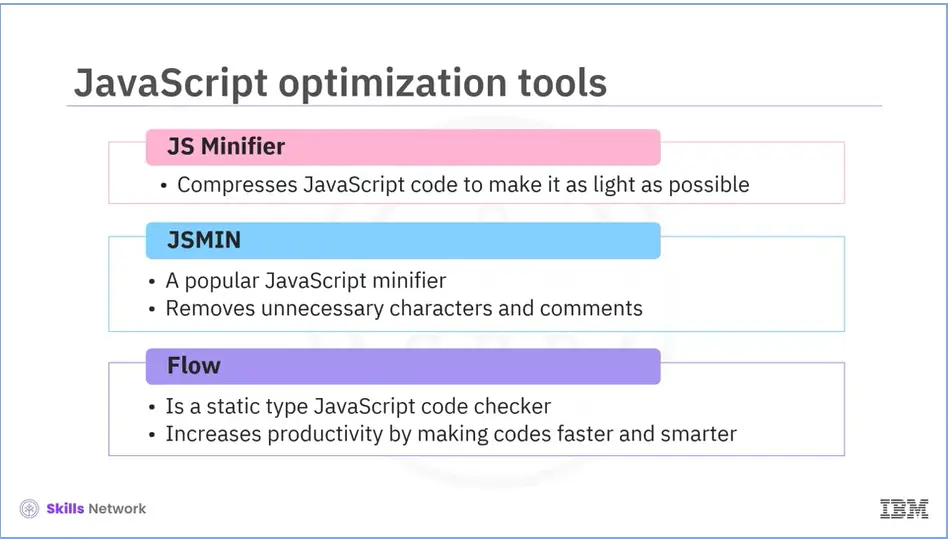{width="5.0in"
height="2.8429483814523184in"}

Some of the popular JavaScript optimization tools include: JS Minifier
is a web-based tool to compress JavaScript code to make it as light as
possible. JSMIN is a popular JavaScript minifier that removes
unnecessary characters (such as spaces and tabs) and comments, reducing
the file size of your script. Flow, which is a static type of JavaScript
code checker that works hard to increase your productivity, making your
code faster, smarter, more confident, and more broadly applicable.

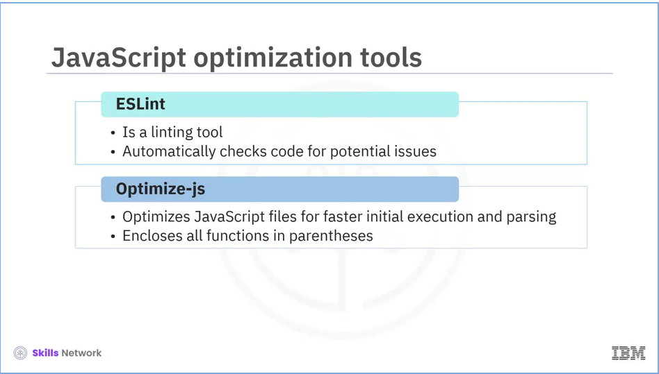{width="5.0in"
height="2.8429483814523184in"}

ESLint, which is a linting tool that helps automatically check your code
for potential problems, and Optimize-js, which optimizes a JavaScript
file for faster initial execution and parsing by enclosing all functions
that are immediately invoked or are likely to be invoked in parentheses.

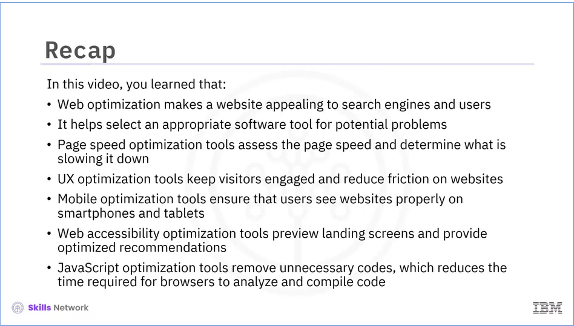{width="5.0in"
height="2.8429483814523184in"}

In this module (25), you learned that:

-   Web optimization makes a website appealing to search engines and
    users.

-   It helps select an appropriate software tool for potential problems.

-   Page speed optimization tools assess the page speed and determine
    what is slowing it down.

-   UX optimization tools keep visitors engaged and reduce friction on
    websites.

-   Mobile optimization tools ensure that users see websites properly on
    smartphones and tablets.

-   Web accessibility optimization tools preview landing screens and
    provide optimized recommendations, and

-   JavaScript optimization tools remove unnecessary codes, which
    reduces the time required for browsers to analyze and compile code.

# 26. Testing Frameworks

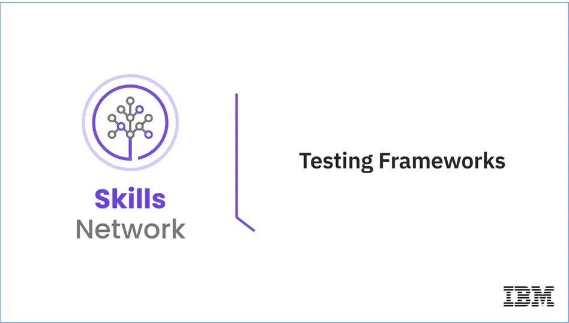{width="5.0in"
height="2.8429483814523184in"}

Welcome to Testing Frameworks.

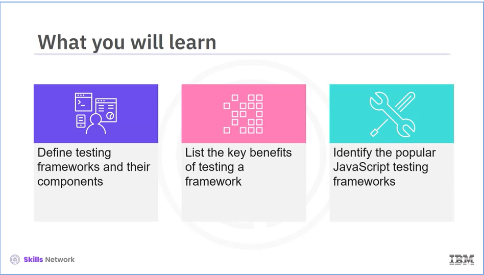{width="5.0in"
height="2.8429483814523184in"}

After reading this module (26), you will be able to:

-   Define testing frameworks and their components,

-   List the key benefits of testing a framework, and

-   Identify the popular JavaScript testing frameworks.

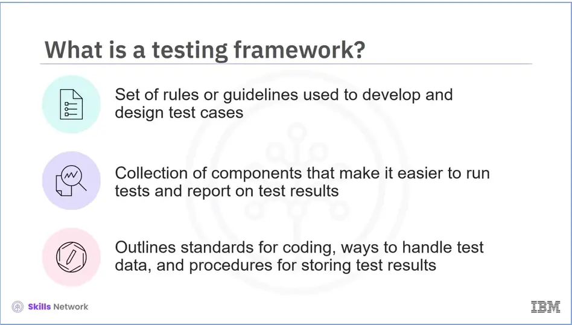{width="5.0in"
height="2.8429483814523184in"}

A testing framework is a set of rules or guidelines that can be used to
develop and design test cases. While a test automation framework is a
collection of components that make it easier to run tests and report on
test results. Coding standards, test-data handling methods, object
repositories, processes for storing test results, and information on how
to access external resources are all covered in the testing framework
guidelines.

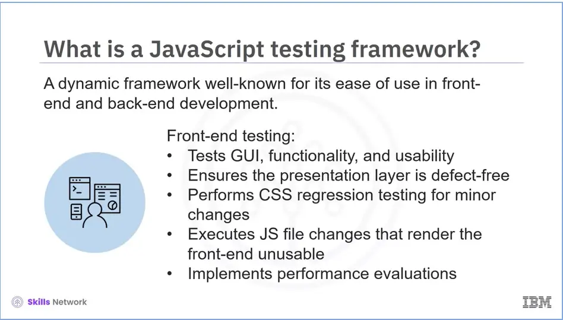{width="5.0in"
height="2.8429483814523184in"}

The JavaScript testing framework is a JS-based dynamic framework that is
well-known for its ease of use in front-end and back-end development.
Front-end testing is a method of testing the Graphical User Interface
(GUI), functionality, and usability of web applications or software. The
goal of front-end testing is to ensure that the presentation layer of
web applications or software is defect free with subsequent updates.
Front-end testing is also performed for: CSS Regression Testing for
minor CSS changes that break the front-end layout. JS file changes that
render the front-end unusable. and performance evaluations.

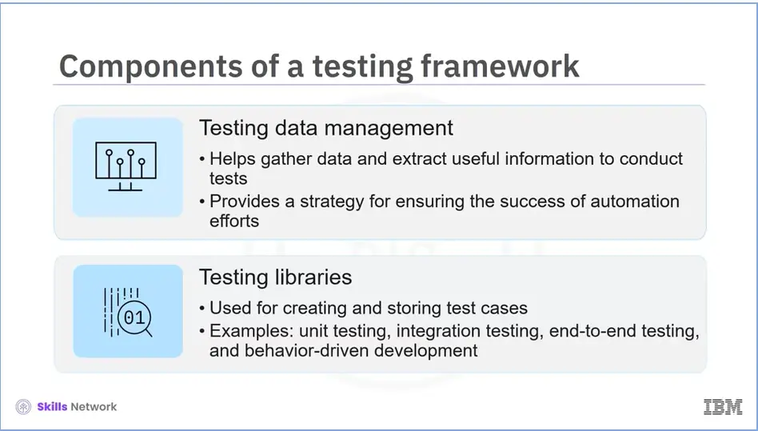{width="5.0in"
height="2.8429483814523184in"}

Let\'s now explore the various components of a testing framework. Let's
first learn about testing data management. The most
challenging aspect of software testing automation is gathering data and
extracting useful information. The availability of data to conduct tests
is typically a major issue. A strategic approach to testing data
management is required to ensure the success of automation efforts.

Next, we will learn about testing libraries. A testing library is where
test cases are created and stored. Unit testing, integration testing,
end-to-end testing, and behavior-driven development are all examples of
testing libraries.

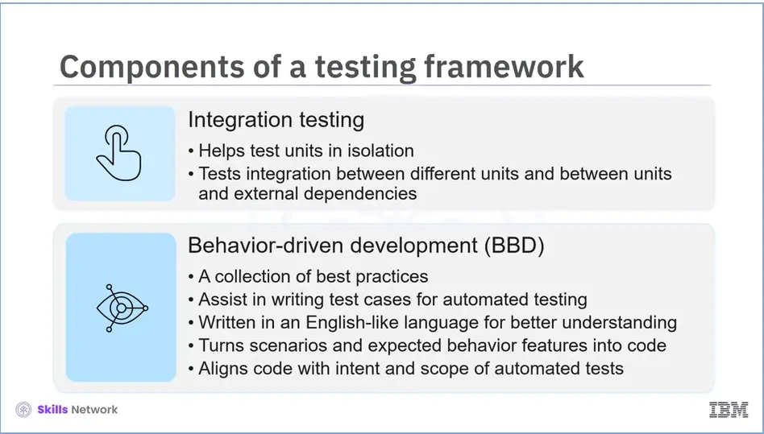{width="5.0in"
height="2.8429483814523184in"}

Following that, we will learn about Integration testing. Testing units
in isolation is valuable and necessary, but you must also test the
integrations between both units, as well as between units and external
dependencies, if you want to ensure that your application works as
intended. Finally, let's learn about behavior-driven development (BBD).
BDD is not related to development. It's a collection of best practices.
BDD enables you to write great test cases when those practices are
applied to automation testing. It\'s written in an English-like language
that everyone can understand. It helps turn scenarios and expected
behavior features into code. BDD allows code to be aligned with the
intent and scope of automated tests.

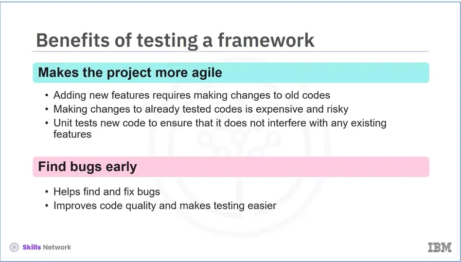{width="5.0in"
height="2.8429483814523184in"}

Let\'s look at some of the benefits of the testing framework. The first
benefit is that testing frameworks help to make the project more agile.
When you add a new feature, you may need to change the old code.
Changing previously tested code is both expensive and risky. Testing
frameworks assist you in running unit tests on new code to ensure that
it does not break any existing features. The next benefit is that it
helps find bugs early. As a developer, you can use the testing framework
to find and fix bugs on your own, which will improve code quality and
make testing easier.

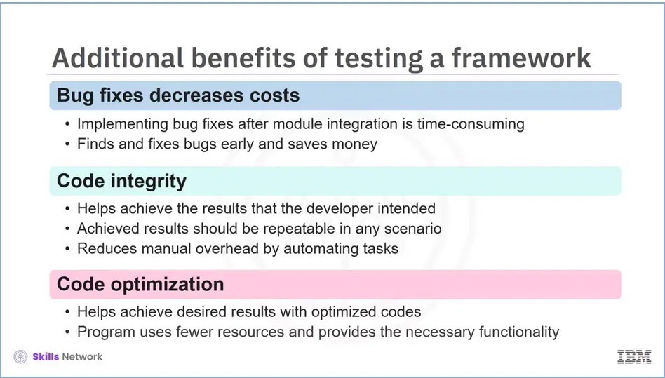{width="5.0in"
height="2.8429483814523184in"}

Next, we will discuss how it helps with code integrity. The term code
integrity refers to achieving the results that the developer intended.
The results should also be repeatable in any scenario in which the code
or program is likely to be used. By automating the task of running tests
after code changes, testing frameworks reduce manual overhead.

Lastly, we will discuss how it helps with code optimization. The best
way to achieve the desired result is to use optimized code. Testing
assists developers in optimizing their code so that their program uses
fewer resources while still providing the necessary functionality.

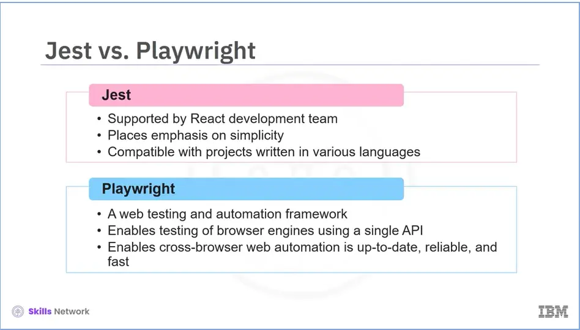{width="5.0in"
height="2.8429483814523184in"}

We will now learn about some of the popular JavaScript testing
frameworks. First, let's learn about Jest. The React development team
officially supports Jest. Jest is a JavaScript testing framework that
places an emphasis on simplicity. It is compatible with projects written
in Babel, TypeScript, Node, React, Angular, Vue, and other languages.
Next, we will learn about Playwright. Playwright is a web testing and
automation framework. It enables the testing of Chromium, Firefox, and
WebKit using a single API. Playwright is designed to enable
cross-browser web automation and automation that is always
up-to-date, reliable, and fast.

{width="5.0in"
height="2.8429483814523184in"}

The next framework is Mocha. Mocha is a feature-rich JavaScript test
framework that runs on Node.js and in the browser to make asynchronous
testing easy and fun. Mocha tests are executed sequentially, allowing
for flexible and accurate reporting while mapping undetected exceptions
to the appropriate test cases. Let's now look at Cypress. Cypress is a
JavaScript-based end-to-end testing framework built on Mocha that makes
asynchronous testing simple and easy. To pair with any JavaScript
testing framework, the Cypress testing library also employs a BDD/TDD
assertion library and a browser.

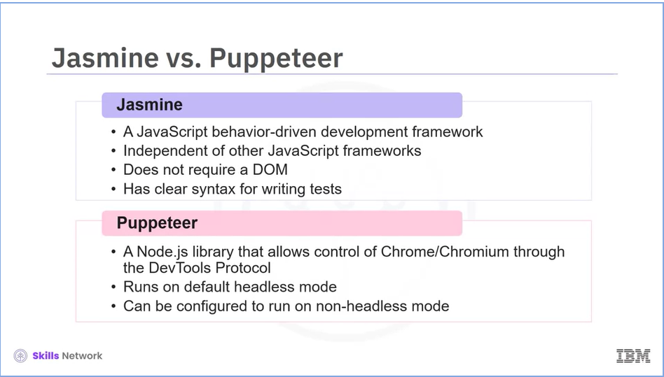{width="5.0in"
height="2.8429483814523184in"}

The next JavaScript framework that we will discuss is Jasmine. Jasmine
is a behavior-driven development framework for JavaScript code testing.
It is independent of any other JavaScript framework. It does not require
the use of a DOM. It also has a clear syntax that makes it simple to
write tests. The last framework that we will discuss is Puppeteer.
Puppeteer is a Node.js library that allows you to control
Chrome/Chromium via the DevTools Protocol. Puppeteer is designed to run
in headless mode by default, but it can also be configured to run in
full (non-headless) Chrome/Chromium mode.

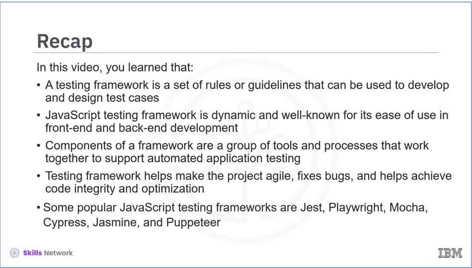{width="5.0in"
height="2.8429483814523184in"}

In this module (26), you learned that:

-   A testing framework is a set of rules or guidelines that can be used
    to develop and design test cases,

-   JavaScript testing framework is dynamic and well-known for its ease
    of use in front-end and back-end development,

-   Components of a framework are a group of tools and processes that
    work together to support automated application testing,

-   Testing framework helps make the project agile, fixes bugs, and
    helps achieve code integrity and optimization, and

-   Some popular JavaScript testing frameworks are Jest, Playwright,
    Mocha, Cypress, Jasmine, and Puppeteer.

# 27. Testing Tools -- Mocha and Jasmine

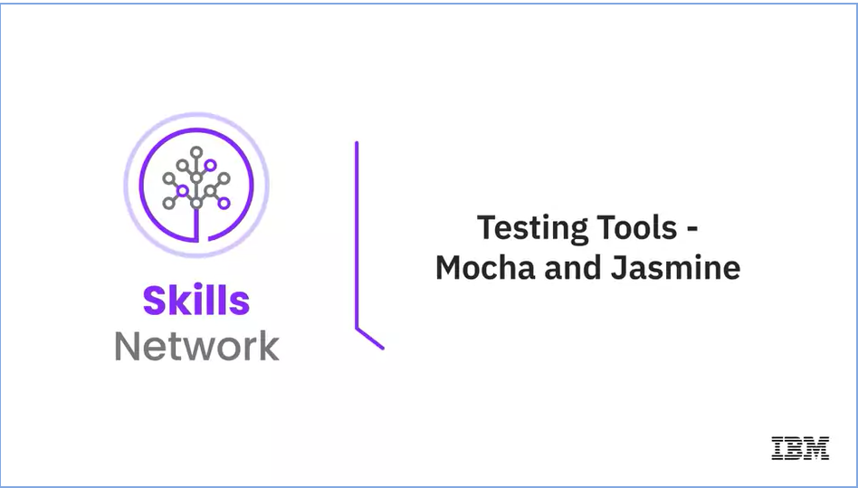{width="5.0in"
height="2.8429483814523184in"}

Welcome to \"Testing Tools -- Mocha and Jasmine.\"

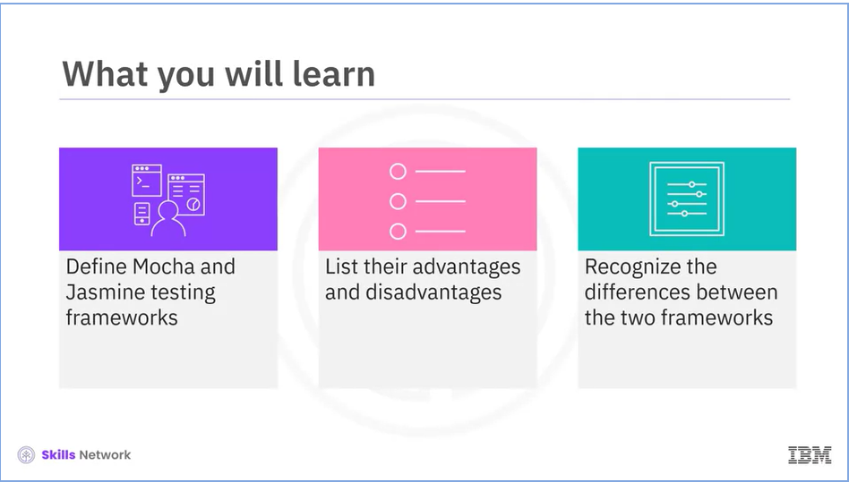{width="5.0in"
height="2.8429483814523184in"}

After reading this module (27), you'll be able to:

-   Define Mocha and Jasmine testing frameworks,

-   List their advantages and disadvantages, and

-   Recognize the differences between the two frameworks.

{width="5.0in"
height="2.8429483814523184in"}

Mocha is a NodeJS-based open-source JavaScript testing framework. It
prioritizes core features and extensibility. Mocha tests are executed
sequentially, allowing for flexible and accurate reporting while mapping
uncaught exceptions to the appropriate test cases. Mocha allows you to
write structured code to thoroughly test your applications,
categorizing them into test suites and test cases.

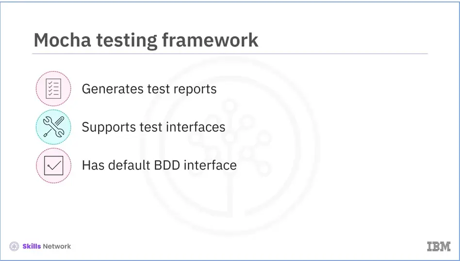{width="5.0in"
height="2.8429483814523184in"}

Mapping errors to corresponding test cases enables us to generate a test
report following the run. Mocha supports a wide range of test
interfaces, such as TSS, Exports, QUnit, and Require. The default
interface is a BDD interface, which aims to assist developers in
creating predictable and resilient to-change software rather than
error-prone software.

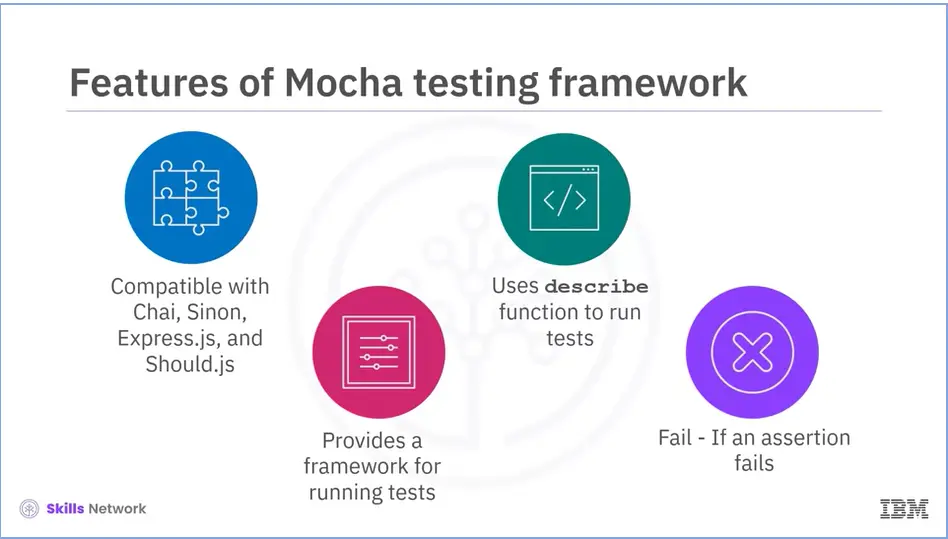{width="5.0in"
height="2.8429483814523184in"}

Mocha is a simple and adaptable framework that works with any assertion
library. The most popular assertion libraries with Mocha are Chai,
Sinon, Express.js, and Should.js. Mocha provides the framework for
running your tests, whether they are low-level Unit tests against
back-end services or JavaScript functions or full-stack tests focused on
component integration. Mocha can be used to run any type of test within
describe functions by including code and assertions to determine a pass
or fail status. Mocha will report the test as failed if an assertion
fails.

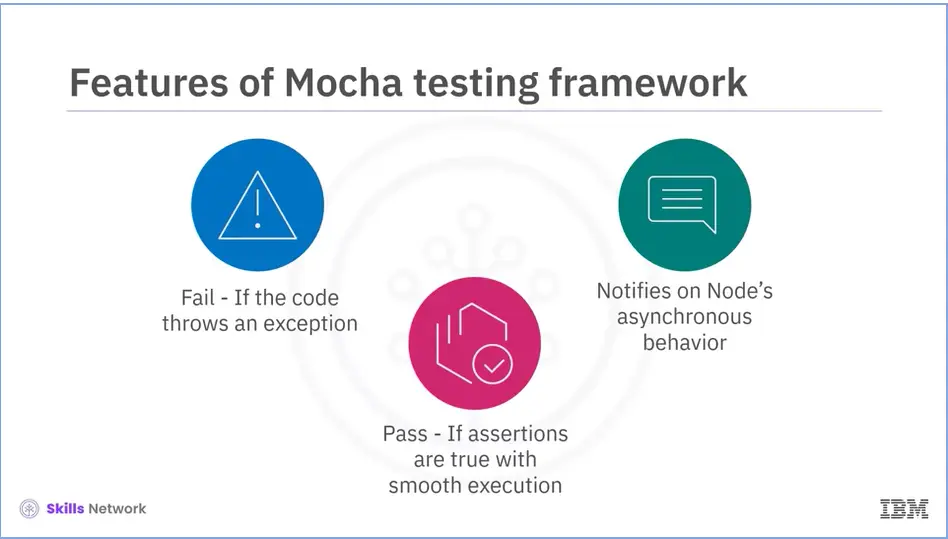{width="5.0in"
height="2.8429483814523184in"}

If a code throws an exception, it is marked as failed as well. It will
report a pass if everything runs smoothly and all assertions are valid.
Because of Node\'s asynchronous behavior, Mocha can also notify you if
your tests run too long.

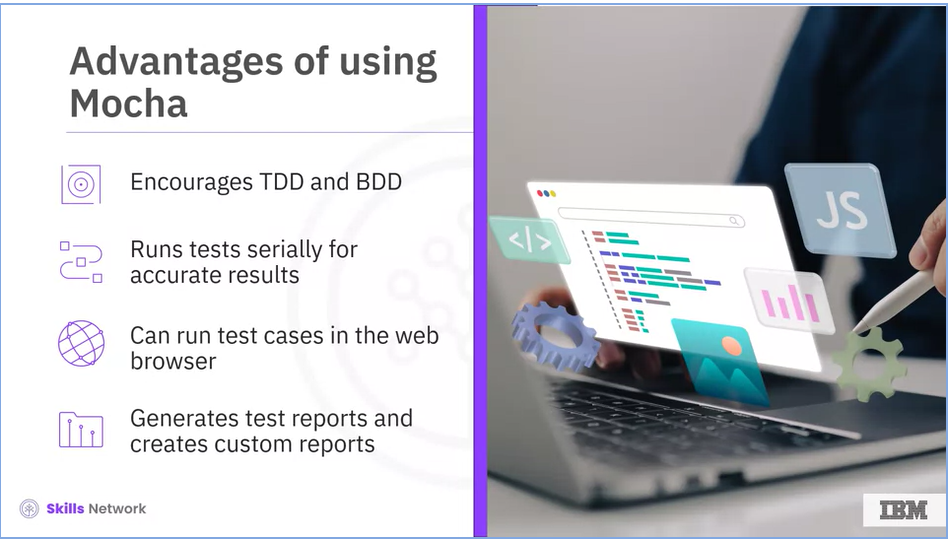{width="5.0in"
height="2.8429483814523184in"}

Let\'s take a look at some of the advantages of using the Mocha testing
framework. It encourages Test Driven Development (TDD) and Behavior
Driven Development (BDD). It runs tests serially, and the results are
always accurate. It can be configured to run test cases in the web
browser. It offers several ways to generate test reports and can even
create custom reports.

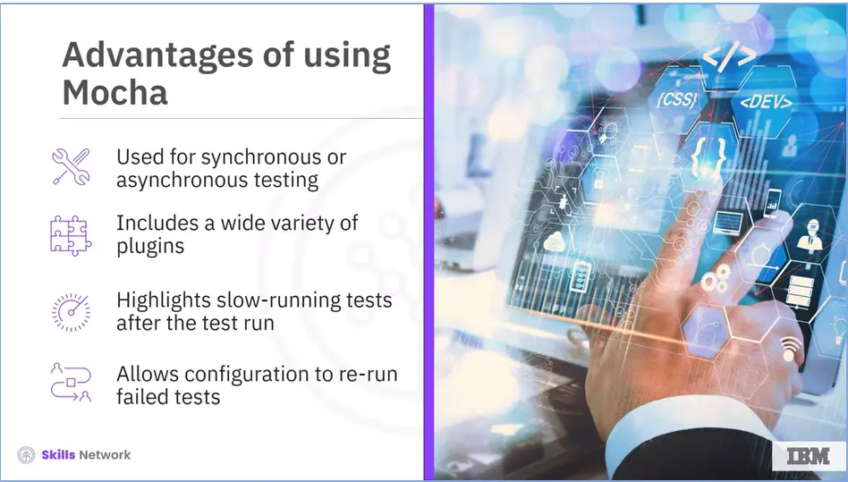{width="5.0in"
height="2.8429483814523184in"}

It can be set up for either synchronous or asynchronous testing. It
includes a wide variety of plugins that can be used to extend your
framework. Following the test run, it highlights the slow-running tests.
It supports the retry failed tests feature, which allows you to
configure re-running failed tests.

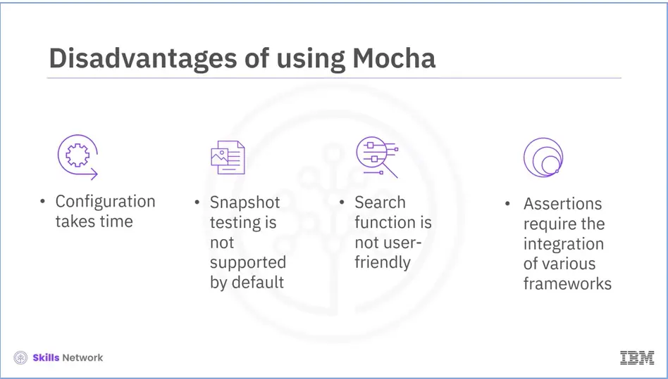{width="5.0in"
height="2.8429483814523184in"}

The following are some of Mocha\'s drawbacks. The developer must spend
time configuring the Mocha framework. Snapshot testing is not supported
by default; you must rely on external libraries. Despite having good
documentation, the search feature is not user-friendly. Since you need
to integrate different frameworks for assertions, the test scripts can
be confusing at times.

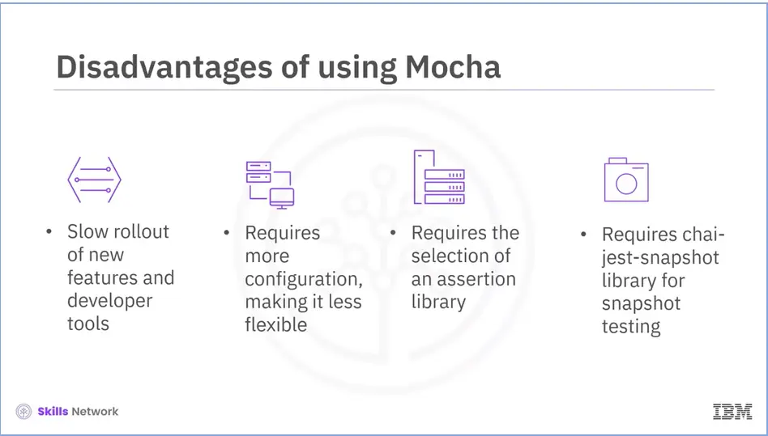{width="5.0in"
height="2.8429483814523184in"}

Mocha is slow to release new features and support developer tools. Mocha
requires more configuration than other frameworks, making it less
flexible. In the case of Mocha, if you cannot afford flexibility, you
must explicitly select an assertion library. Mocha snapshot testing can
be challenging. To do it correctly, you\'ll need to use the
chai-jest-snapshot library.

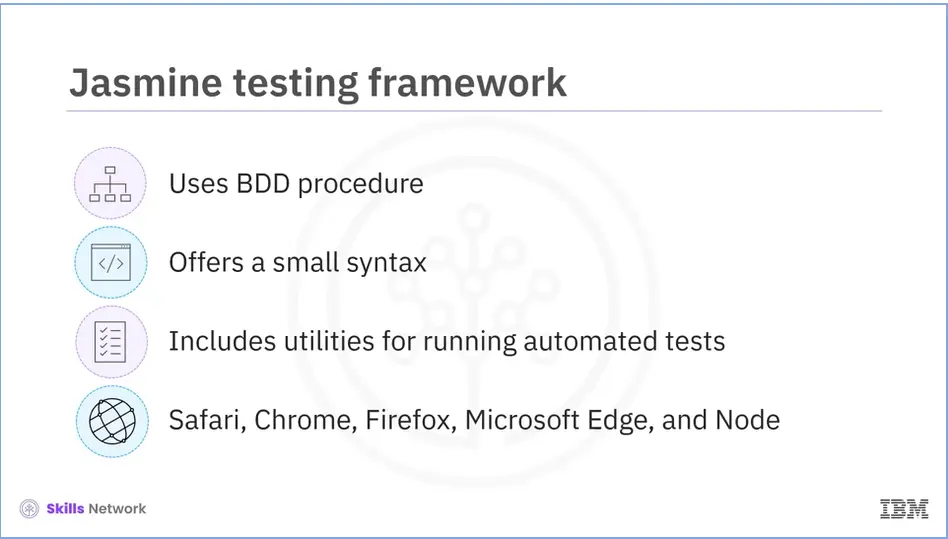{width="5.0in"
height="2.8429483814523184in"}

Jasmine is an open-source JavaScript framework that can test any
JavaScript application. Jasmine uses the BDD procedure to ensure that
each line of JavaScript code is unit tested. Instead of testing the
entire application, it offers a small syntax to test the smallest unit
of the application. It also includes utilities for running automated
tests on both synchronous and asynchronous code. Jasmine is tested in a
variety of browsers, including Safari, Chrome, Firefox, and Microsoft
Edge, as well as Node.

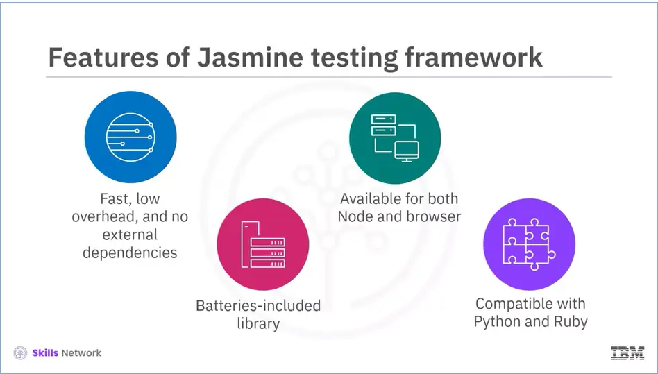{width="5.0in"
height="2.8429483814523184in"}

Jasmine has many features, including: It\'s fast, has low overhead, and
has no external dependencies. It\'s a batteries-included library with
everything you need to test your code. It is available for both Node and
browser. It is compatible with other languages, such as Python and Ruby.

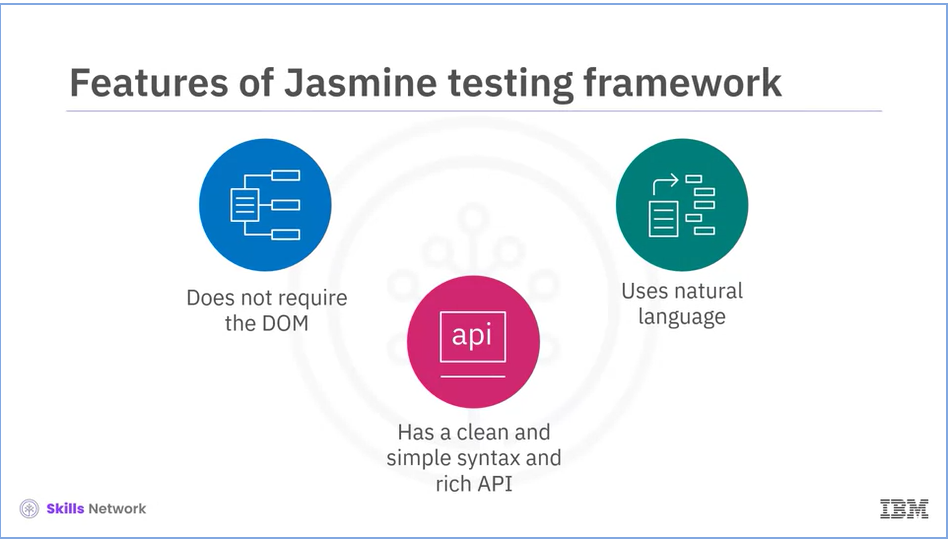{width="5.0in"
height="2.8429483814523184in"}

It does not require the DOM. It has a clean and simple syntax as well as
a rich and straightforward API. We can describe the tests and the
expected results using natural language.

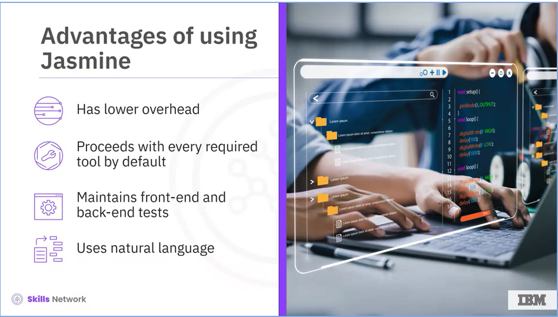{width="5.0in"
height="2.8429483814523184in"}

The following are some of the advantages of using Jasmine: It has lower
overhead due to no external dependencies. It proceeds with nearly every
required tool by default. It maintains front-end and back-end tests
similarly.

The coding is pretty similar to writing in natural language.

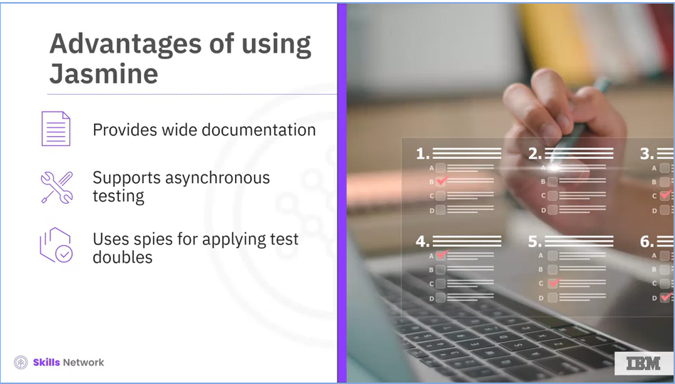{width="5.0in"
height="2.8429483814523184in"}

It provides wide documentation for use with a variety of frameworks. It
supports asynchronous testing. It marks the use of spies for applying
test doubles.

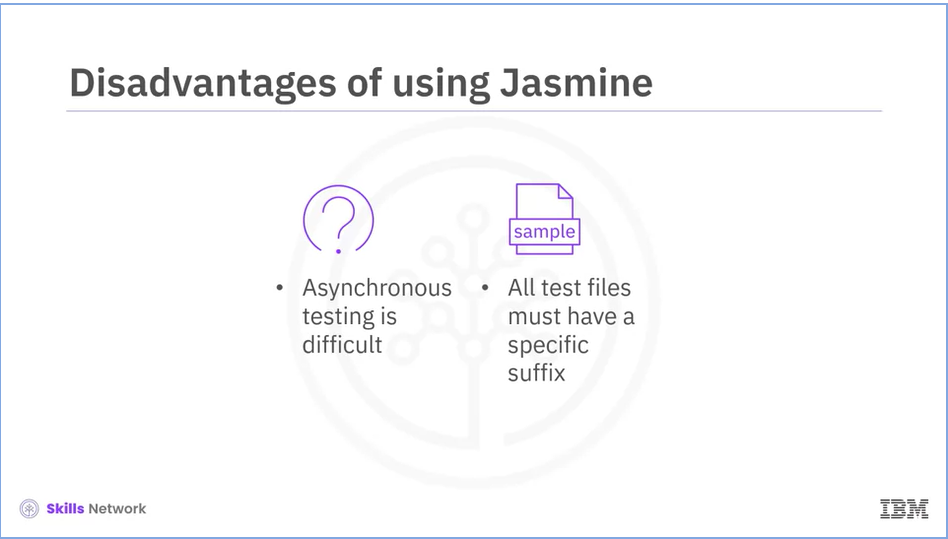{width="5.0in"
height="2.8429483814523184in"}

Now, let\'s look at the main disadvantages of using Jasmine they are:
Asynchronous testing is difficult. All test files must have a specific
suffix.

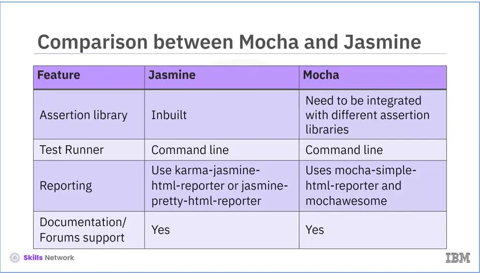{width="5.0in"
height="2.8429483814523184in"}

Now that we\'ve learned about the Mocha and Jasmine frameworks, let\'s
compare them. Jasmine includes an assertion library, whereas Mocha must
be combined with other assertion libraries. Jasmine and Mocha both have
command-line test runners. For reporting, Jasmine creates
karma-jasmine-html-reporter or jasmine-pretty-html-reporter, whereas
Mocha creates mocha-simple-html-reporter and mochawesome. Jasmine and
Mocha both have documentation and forum support.

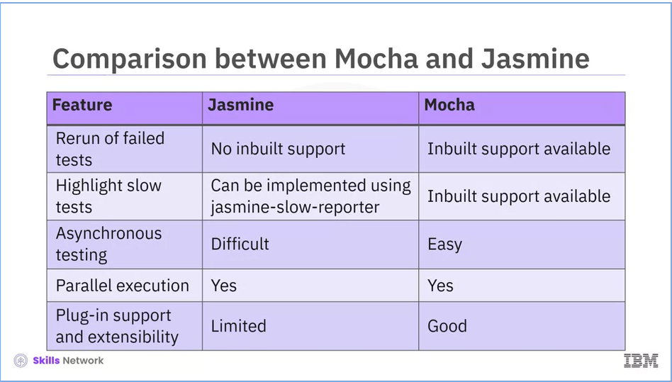{width="5.0in"
height="2.8429483814523184in"}

Jasmine does not include built-in support for rerunning a failed test,
whereas Mocha does. Slow tests can be highlighted in Jasmine using
jasmine-slow-reporter, whereas Mocha has built-in support. Asynchronous
testing is challenging in Jasmine but simple in Mocha. Jasmine and Mocha
both support parallel execution. Jasmine\'s plug-in support and
extensibility are limited, whereas Mocha\'s are good.

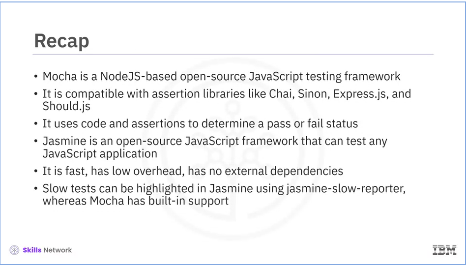{width="5.0in"
height="2.8429483814523184in"}

In this module (27), you learned that:

-   Mocha is a NodeJS-based open-source JavaScript testing framework,

-   It is compatible with assertion libraries like Chai, Sinon,
    Express.js, and Should.js,

-   It uses code and assertions to determine a pass or fail status,

-   Jasmine is an open-source JavaScript framework that can test any
    JavaScript application,

-   It is fast, has low overhead, has no external dependencies, and

-   Slow tests can be highlighted in Jasmine using
    jasmine-slow-reporter, whereas Mocha has it built-in.

# 28. Using Jasmine

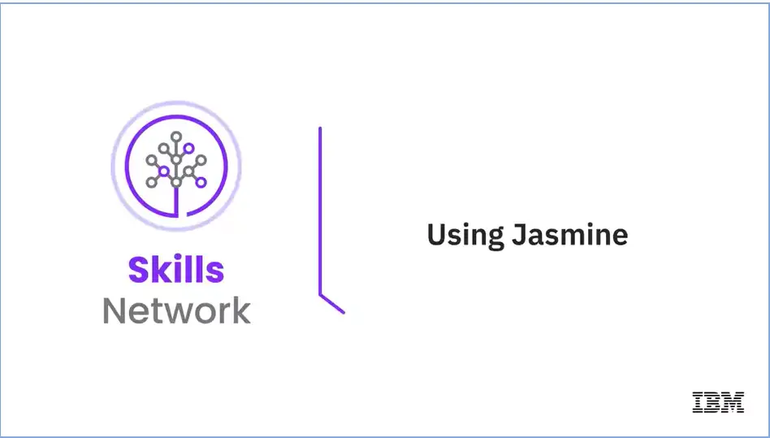{width="5.0in"
height="2.8429483814523184in"}

Welcome to Using Jasmine!

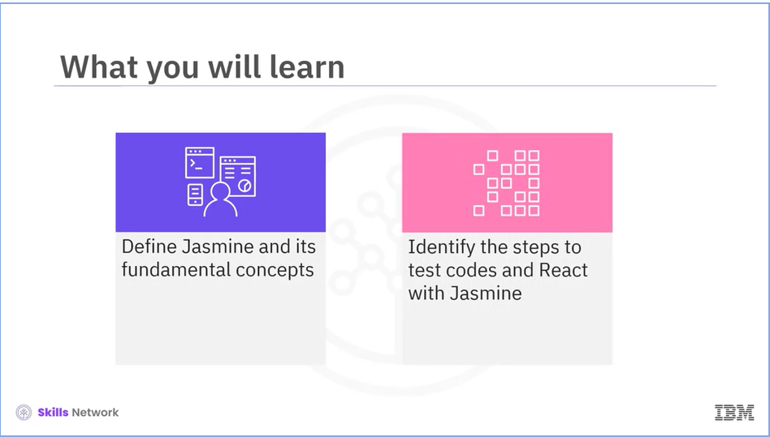{width="5.0in"
height="2.8429483814523184in"}

After reading this module (28), you will be able to:

-   Define Jasmine and its fundamental concepts, and

-   Identify the steps to test code and React with Jasmine.

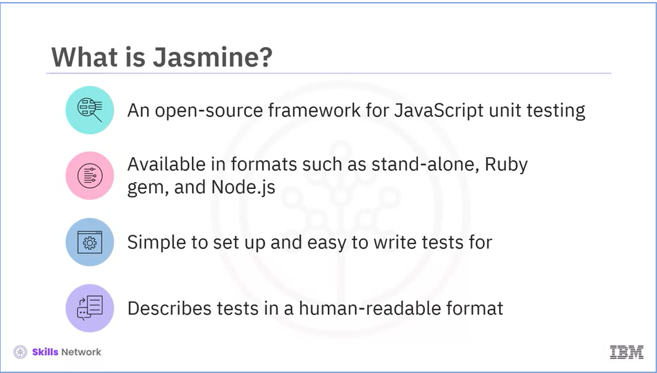{width="5.0in"
height="2.8429483814523184in"}

Jasmine is an open-source framework for unit testing JavaScript that is
readily accessible in a variety of formats, including stand-alone, ruby
gem, Node.js, and so on. It is simple to set up and easy to write tests.
JS Spec, Rspec, and Jspec have a significant impact on Jasmine. It makes
an attempt to describe tests in a human-readable format so that
non-technical people understand what is being tested.

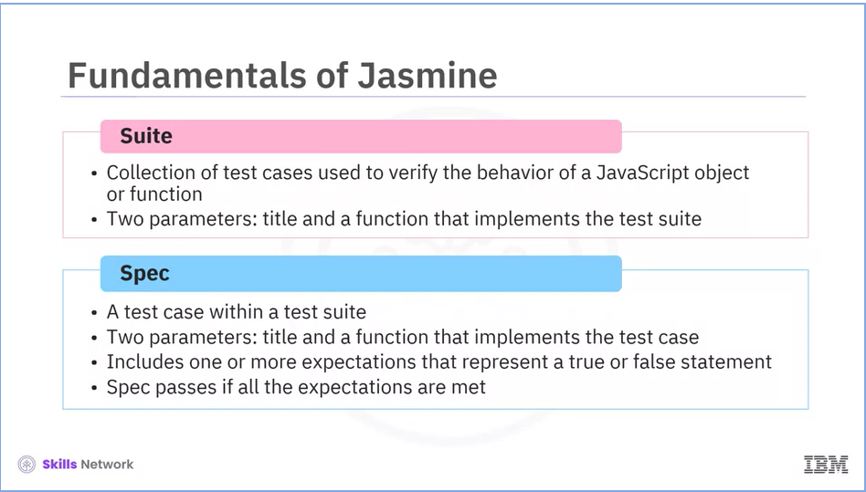{width="5.0in"
height="2.8429483814523184in"}

Let's look at the fundamental concepts of Jasmine. A Jasmine suite is a
collection of test cases that can be used to verify the behavior of a
JavaScript object or function. This starts with a call to the Jasmine
global function, which has two parameters: the first is the title of the
test suite, and the second is a function that implements the test suite.
A Jasmine spec is a test case within a test suite. This begins with a
call to the Jasmine global function with two parameters: the first is
the title of the spec, and the second is a function that implements the
test case. The spec includes one or more expectations. Each expectation
represents a statement that can be true or false. To pass the spec, all
of the expectations within the spec must be met. If one or more
expectations within a spec are incorrect, the spec fails.

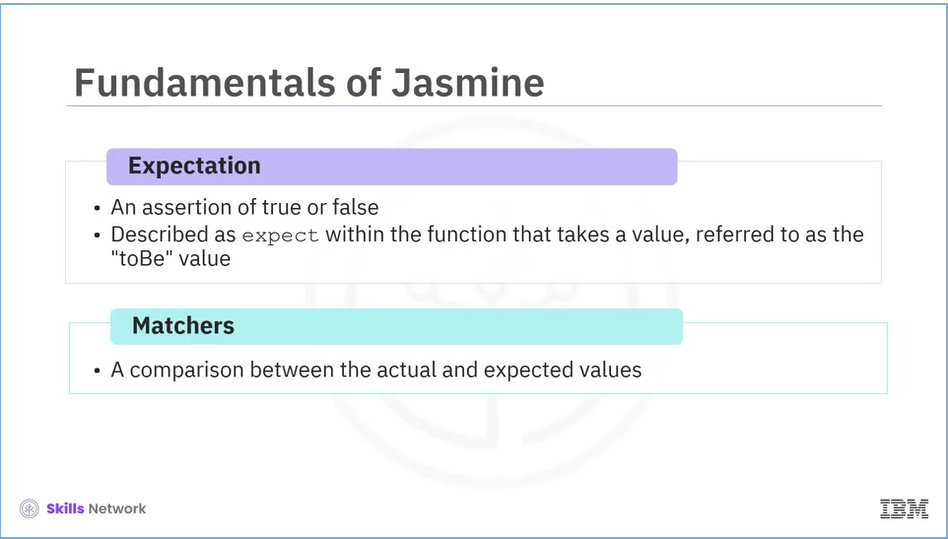{width="5.0in"
height="2.8429483814523184in"}

In Jasmine, an expectation is an assertion that is either true or false.
Expectations are described as \"expect\" within the function that takes
a value, which is referred to as the \"toBe\" value. Matchers is a
comparison between the actual value and the expected value, either if
the expectation is \"true\" or \"false."

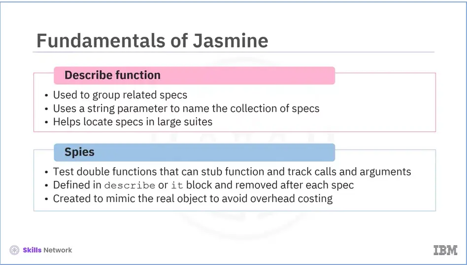{width="5.0in"
height="2.8429483814523184in"}

The describe function in Jasmine is used to group related specs. The
string parameter is used to name the collection of specs and will be
integrated with specs to form the full name of a spec. This helps in
locating specs in a large suite. Jasmine has spies, which are test
double functions. A spy can stub any function and track all calls and
arguments to it. A spy exists only in the describe or it block in which
it is defined and is removed after each spec. Spies are mocks. Mocks are
objects that are created to represent or mimic the real thing. Mocks are
required to avoid the overhead cost of creating the actual object they
represent.

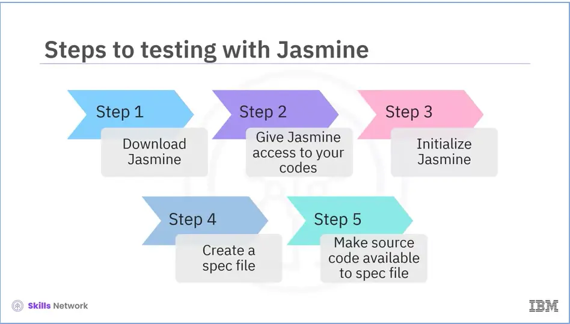{width="5.0in"
height="2.8429483814523184in"}

The steps to begin testing with Jasmine are as follows. Download Jasmine
(standalone version). Give Jasmine access to your code by manually
downloading it or using a package manager. Initialize Jasmine. Create a
spec (test) file, and Make the source code available to your spec file.

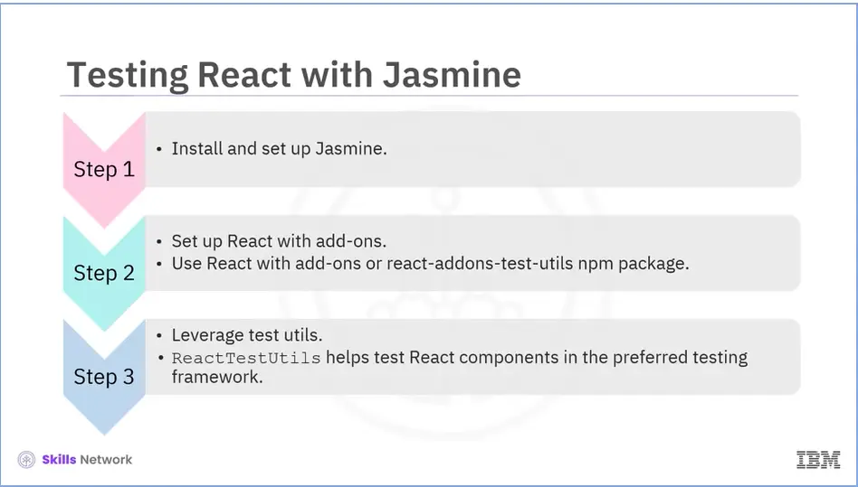{width="5.0in"
height="2.8429483814523184in"}

Let us now try to understand the steps for testing React with Jasmine.
First, install and set up Jasmine. Next, set up React with add-ons.
Depending on your React version and environment, you will either need to
use a version of React that includes add-ons or the
react-addons-test-utils npm package. In either case, the version of
React that Jasmine runs must be included in the JS bundle.

The next step is to leverage Test Utils. ReactTestUtils makes it simple
to test React components in your preferred testing framework.

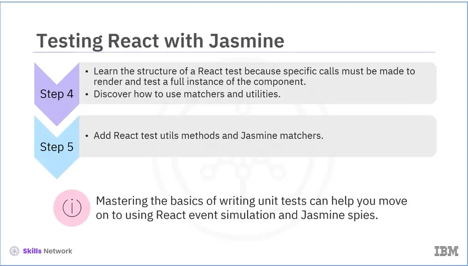{width="5.0in"
height="2.8429483814523184in"}

Then, in Jasmine, learn the structure of a React test. There is a
specific sequence of calls that must be made in order to render and test
a full instance of your component.

Discover how to use new matchers and utilities. Finally, as needed, add
new React test utils methods and Jasmine matchers. You don\'t have to be
familiar with every matcher and method in the React test utilities.

After you\'ve mastered the basics of writing unit tests, you can move on
to using React event simulation and Jasmine spies to see what happens
when users interact with your components.

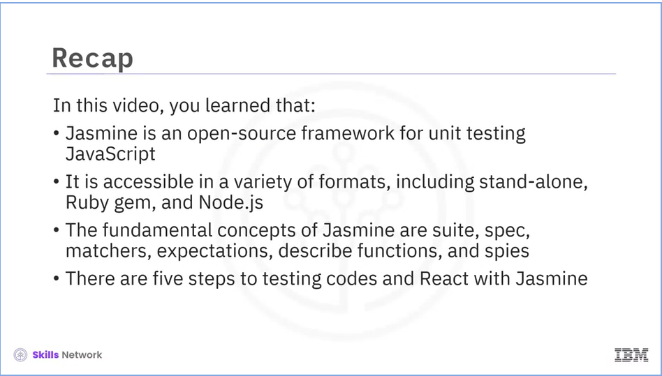{width="5.0in"
height="2.8429483814523184in"}

In this module (28), you learned that:

-   Jasmine is an open-source framework for unit testing JavaScript.

-   It is accessible in a variety of formats, including stand-alone,
    ruby gem, and Node.js.

-   The fundamental concepts of Jasmine are suite, spec, matchers,
    expectations, describe functions, and spies, and

-   There are five steps to testing codes and React with Jasmine.

# 29. Front-end Testing Best Practices

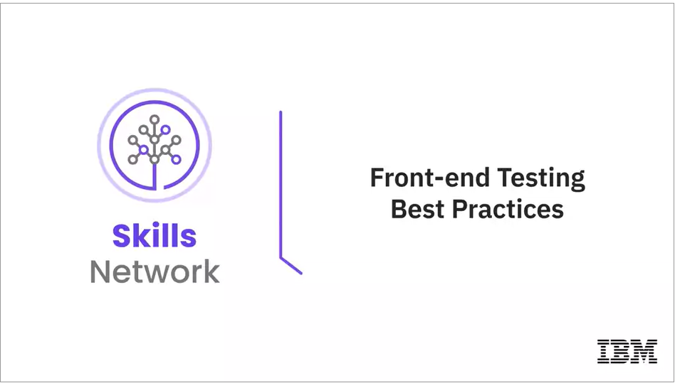{width="5.0in"
height="2.8429483814523184in"}

Welcome to \"Front-end Testing Best Practices.\"

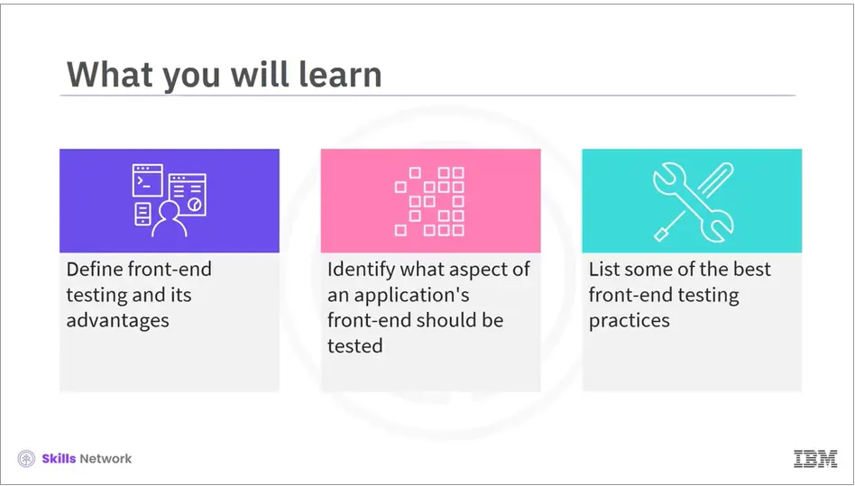{width="5.0in"
height="2.8429483814523184in"}

After reading this module (29), you will be able to:

-   define front-end testing and its advantages,

-   identify what aspect of an application\'s front end should be
    tested,

-   and list some of the best front-end testing practices.

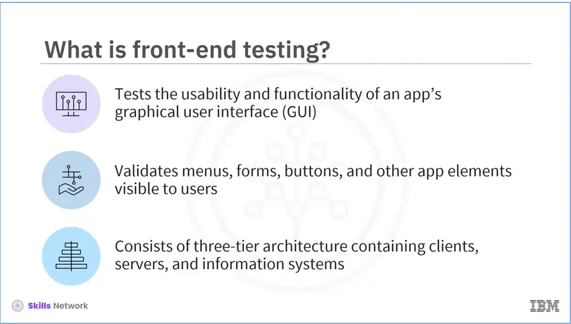{width="5.0in"
height="2.8429483814523184in"}

The front end of a program is the client-side section. Front-end testing
is the process of testing the usability and functionality of an
application\'s graphical user interface (GUI). This usually includes
validating menus, forms, buttons, and other application elements visible
to end users. Every web application is built with a three-tier
architecture. Clients, servers, and information systems or resources are
all included. The client is part of the presentation layer. This layer
is tested by front-end testers.

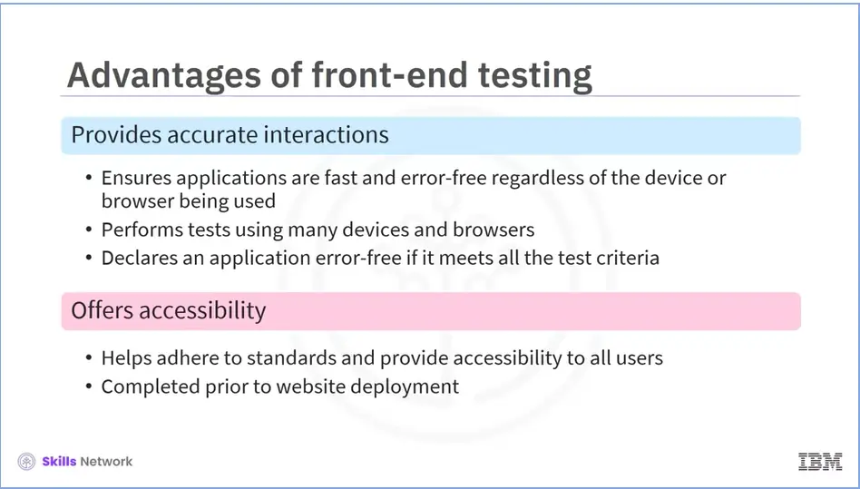{width="5.0in"
height="2.8429483814523184in"}

We will now discuss some of the advantages of using front-end testing.
First, an app should provide accurate interaction. It should be fast and
error-free, regardless of the device or browser used. Front-end testers
perform the test using a variety of devices and browsers. They declare
an app error-free only if it meets all the testing criteria. Next, your
HTML code must adhere to certain standards, and your website should be
accessible to all users, particularly those with disabilities.
Accessibility testing is a required component of front-end testing and
must be completed prior to the deployment of a website.

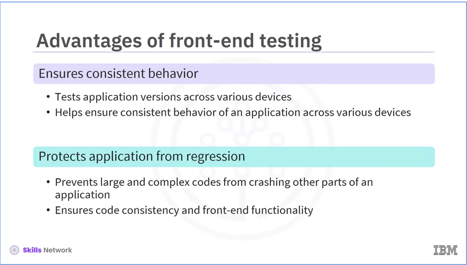{width="5.0in"
height="2.8429483814523184in"}

With the widespread use of interconnected versions of an app on
different devices such as a smartwatch, smartphone, and smart TV,
front-end testing helps ensure consistent behavior of the app across the
multitier architecture. Front-end tests also protect your app from
regression. There may be times when you write code to deploy large or
complex features, but it crashes another part of the application that
you were unaware of. Front-end testing ensures that the code is
consistent and that the front-end functionality is intact.

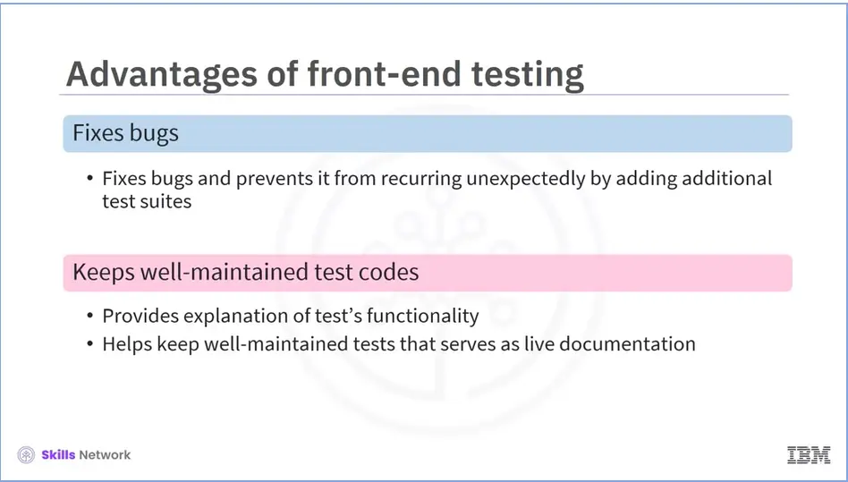{width="5.0in"
height="2.8429483814523184in"}

Next, if a bug is discovered, whether by your team or by users, you need
to fix it and prevent its recurrence unexpectedly by adding an
additional test suite through front-end testing. Finally, a thorough
explanation of the test\'s functionality is necessary when writing
tests. Front-end testing helps in keeping well-maintained tests which is
beneficial as they serve as live documentation.

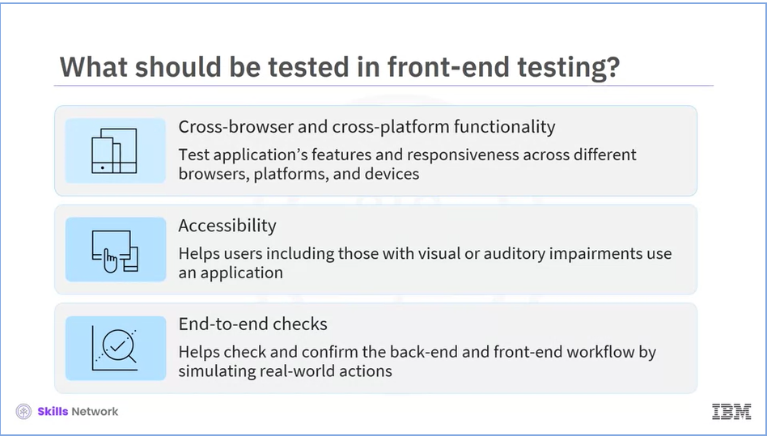{width="5.0in"
height="2.8429483814523184in"}

Let us now try to understand which aspects of an application\'s front
end you need to focus on while performing front-end testing. When
testing cross-browser and cross-platform functionality, you should look
at your app\'s features and its responsiveness across different
browsers, platforms, and devices. Accessibility checks help you
determine whether everyone, including those with visual or auditory
impairments, can use the application. End-to-end checks are required for
checking and confirming the application\'s back-end to front-end
workflow by simulating real-world actions that users are likely to take.

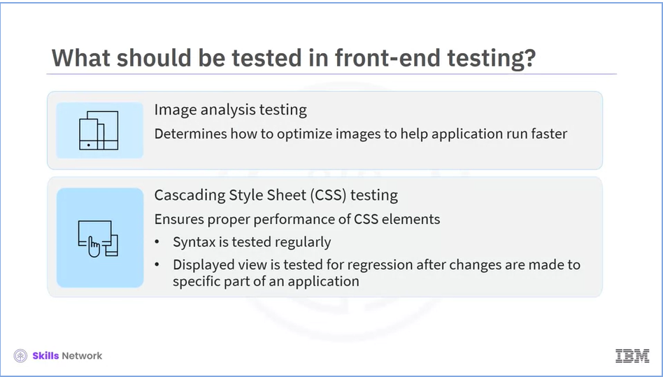{width="5.0in"
height="2.8429483814523184in"}

Image analysis testing is performed to determine where you can
optimize the images to help the app run faster. Most websites and apps
these days have a large number of images, which significantly increases
the size of the application. CSS testing ensures the performance of two
important CSS elements: syntax and display. While syntax is more of a
developer\'s day-to-day responsibility, displayed views must be tested
for regression after changes to specific parts of the app.

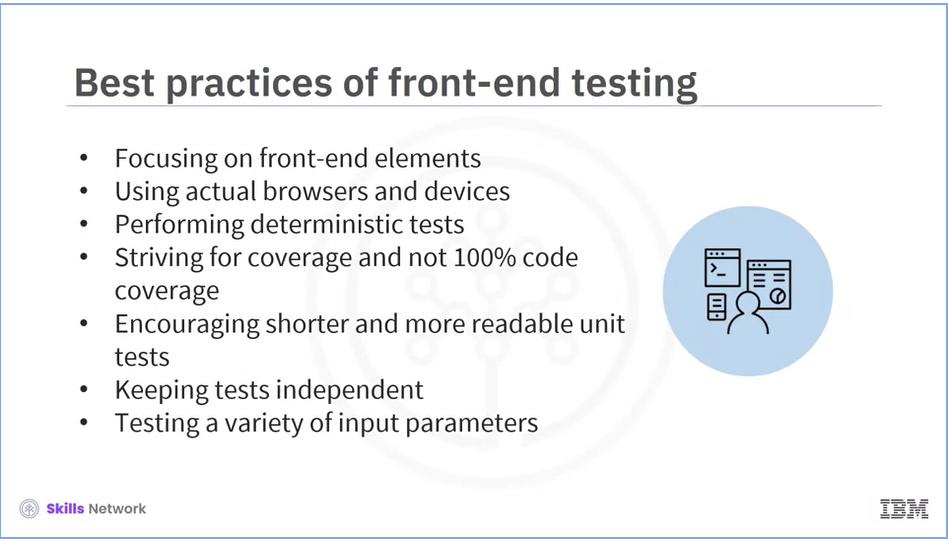{width="5.0in"
height="2.8429483814523184in"}

Now we\'ll explore some of the best front-end testing practices. These
include: Focusing on front-end elements, using actual browsers and
devices, Performing deterministic tests, striving for coverage and not
100% code coverage, Encouraging shorter and more readable unit tests,
Keeping tests independent, and Testing a variety of input parameters.

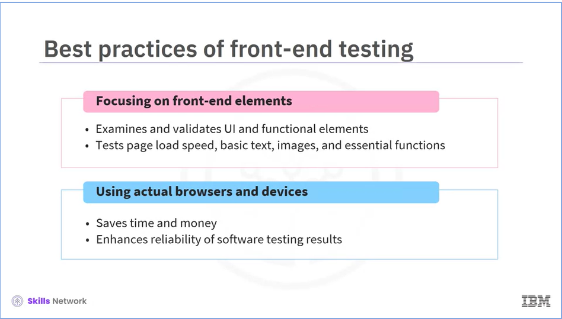{width="5.0in"
height="2.8429483814523184in"}

Let us now discuss each in detail. Focusing on front-end elements
Front-end testing involves examining and validating hundreds or
thousands of UI and functional elements. Before moving on to graphics
and pop-ups, it\'s a good idea to test the page load speed, basic text,
images, and essential functions. Using actual browsers and devices Use
real browsers and devices instead of emulators and simulators to save
time and money and enhance the reliability of your software testing
results.

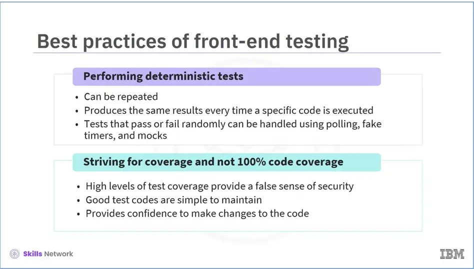{width="5.0in"
height="2.8429483814523184in"}

Performing deterministic tests Deterministic tests are the ones that can
be repeated. They produce the same results every time a specific code is
executed. A non-deterministic test passes and fails randomly.
Non-deterministic tests can be handled in a variety of ways, including
polling, fake timers, and mocks. Striving for coverage and not 100% code
coverage In theory, complete test coverage sounds like a great idea.
However, it doesn\'t work in practice. A high level of test coverage
provides a false sense of security. Good tests are simple to maintain
and provide you with the confidence to make changes to your code.

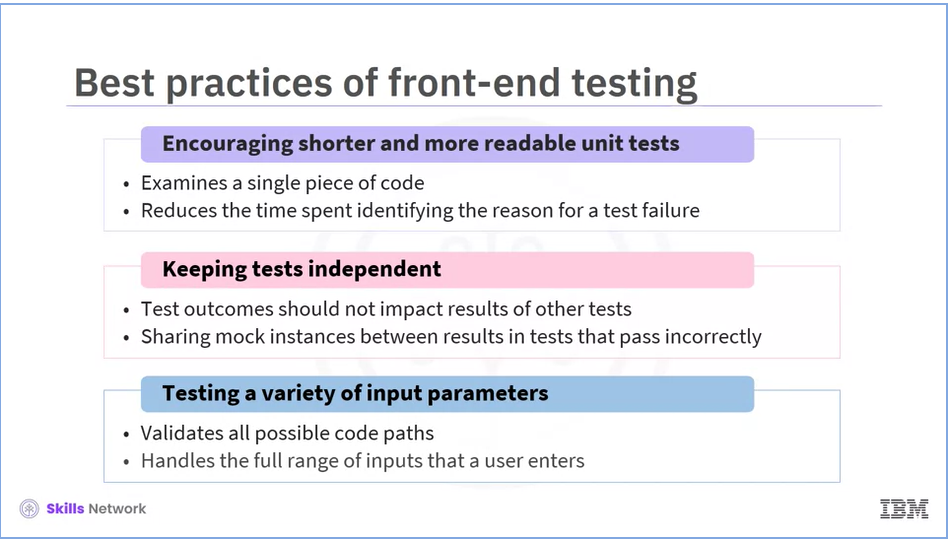{width="5.0in"
height="2.8429483814523184in"}

Encouraging shorter and more readable unit tests A unit test should only
test a single unit of code. If there is only one reason for the test to
fail, less time is spent determining the root cause of the test's
failure. Keeping tests independent the outcome of one test should have
no impact on the results of any other tests. Sharing state or mock
instances between tests may result in brittle or \"flaky\" tests that
pass incorrectly. Testing a variety of input parameters Tests should
validate all possible code paths through the code under test. You must
be confident that the deployed code can handle the full range of inputs
that a user may enter.

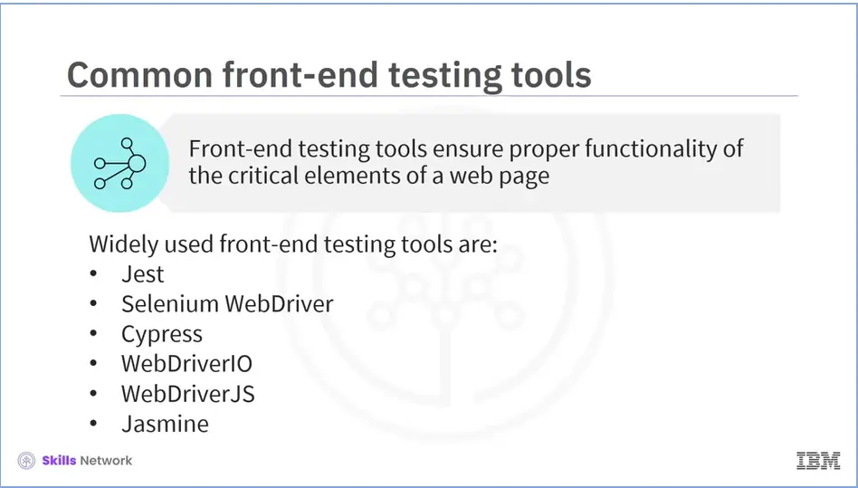{width="5.0in"
height="2.8429483814523184in"}

There are numerous vendors offering front-end testing tools, making it
difficult to decide which one to use. For your convenience, here is a
list of some of the best and most widely used front-end testing tools.
Jest, Selenium WebDriver, Cypress, WebDriverIO, WebDriverJS, and
Jasmine.

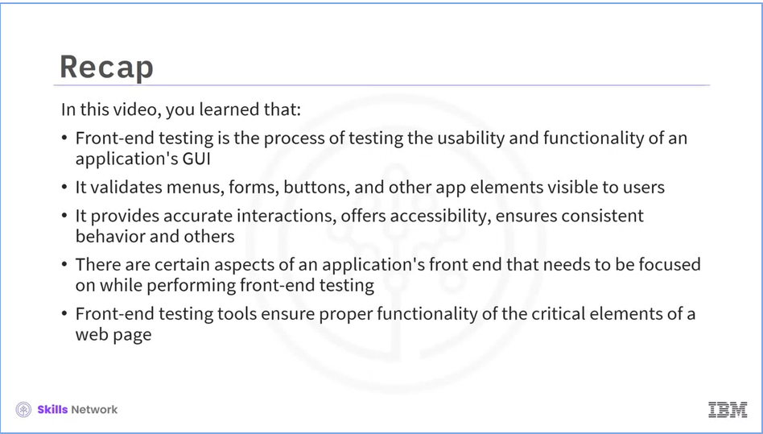{width="5.0in"
height="2.8429483814523184in"}

In this module (29), you learned that:

-   Front-end testing is the process of testing the usability and
    functionality of an application\'s GUI,

-   It validates menus, forms, buttons, and other app elements visible
    to users,

-   It provides accurate interactions, offers accessibility, ensures
    consistent behavior and others,

-   There are certain aspects of an application\'s front end that need
    to be focused on while performing front-end testing, and

-   Front-end testing tools ensure proper functionality of critical
    elements of a web page.

# Hands-on Lab: Testing a React Application using Jasmine

## Welcome to the **Testing a React Application using Jasmine** lab! 

In this lab, you will learn how to test your logic in React with
Jasmine.

Skills Network Labs (SN Labs) is a virtual lab environment used in this
course. Upon clicking \"Open Tool\" in accordance with IBM Skills
Network Privacy policy your Username and Email will be passed to Skills
Network Labs and will only be used for communicating important
information to enhance your learning experience.

In case you need to download the lab instructions click
[HERE](https://cf-courses-data.s3.us.cloud-object-storage.appdomain.cloud/IBMSkillsNetwork-WD0231EN-SkillsNetwork/labs/jasmine.md.html)
to open in a new tab.

This course uses a third-party app, Hands-on Lab: Testing a React
Application using Jasmine, to enhance your learning experience. The app
will reference basic information like your name, email, and Coursera ID.

# Practice Quiz: JavaScript Optimization and Testing Frameworks

# Week 4 Summary: Cross-Browser JavaScript Optimization and Testing Frameworks

In this module, you learned that:

-   Web optimization makes a website appealing to search engines and
    users.

-   JavaScript produces highly interactive websites that actively engage
    the user.

-   A testing framework is a set of rules or guidelines to develop and
    design test cases.

-   Testing frameworks helps make the project agile, fixes bugs, and
    helps achieve code integrity and optimization.

-   Mocha is a NodeJS-based open-source JavaScript testing framework
    that is compatible with various assertion libraries.

-   Jasmine is an open-source JavaScript framework that can test any
    JavaScript application. 

-   Jasmine is accessible in a variety of formats, including
    stand-alone, ruby gem, and Node.js.

-   Front-end testing is the process of testing the usability and
    functionality of an application\'s GUI.

-   Front-end testing tools ensure proper functionality of the critical
    elements of a web page.

# Graded Quiz: JavaScript Optimization and Testing Frameworks

# [Week 5:]{.mark}

# 30. JavaScript Debugging

{width="5.0in"
height="2.8429483814523184in"}

Welcome to "JavaScript Debugging."

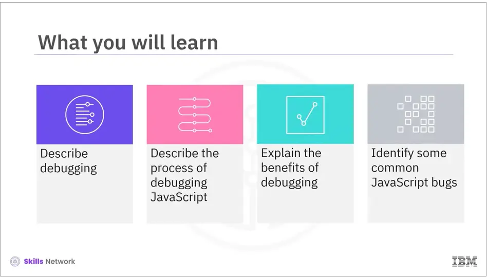{width="5.0in"
height="2.8429483814523184in"}

After reading this module (30), you will be able to:

-   Describe debugging,

-   Describe the process of debugging JavaScript,

-   Explain the benefits of debugging, and

-   Identify some common JavaScript bugs.

{width="5.0in"
height="2.8429483814523184in"}

Errors are common while writing programs. These errors or flaws are
bugs. If your JavaScript does not function the way you want it to, there
is a high possibility that you have a bug in your code. Therefore, we
use debugging, which identifies and fixes bugs in your code.

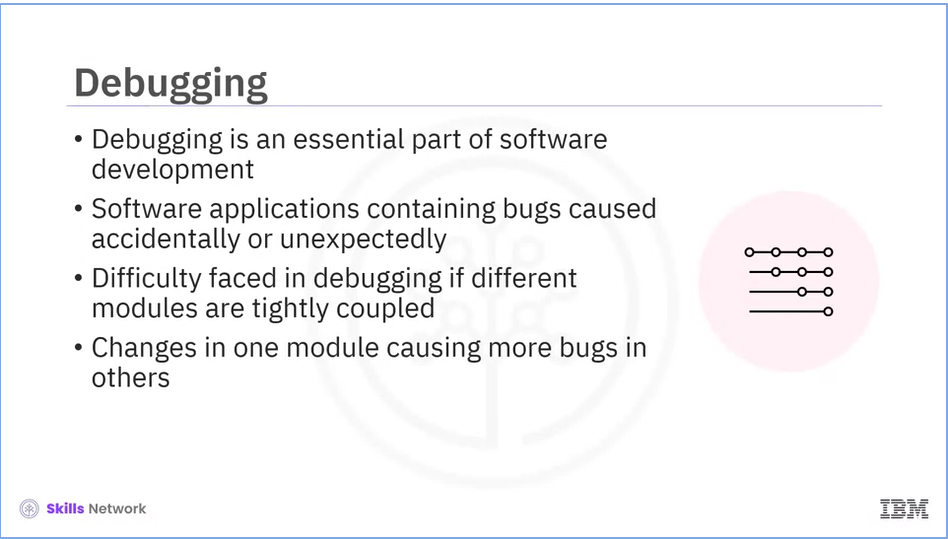{width="5.0in"
height="2.8429483814523184in"}

In computer programming and engineering, debugging is essential to
software development. It is necessary to remove bugs that occur
accidentally or unexpectedly in software applications. Tightly coupled
modules can make debugging difficult at times. In this case, changing
one module can cause more bugs to appear in another. There can be more
challenges involved in debugging such a program, than coding a single
program.

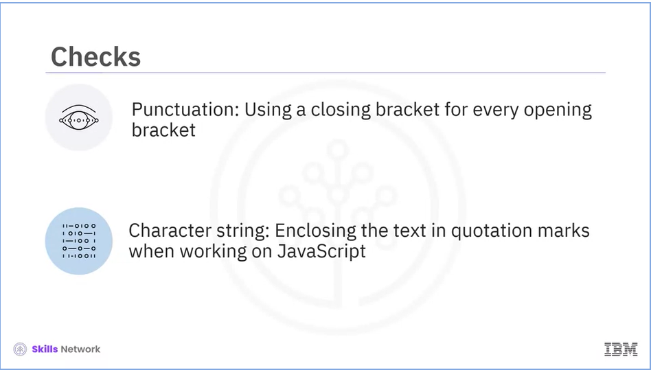{width="5.0in"
height="2.8429483814523184in"}

Let\'s try to understand why bugs occur in JavaScript. If your script
isn\'t working, first check the punctuation. Ensure there is a closing
bracket for every opening bracket. Second, check the character string.
Always enclose the text in quotation marks when working on JavaScript.
You can either use single or double quotation marks to enclose the text.

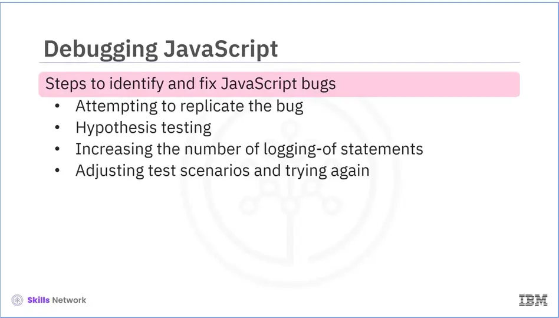{width="5.0in"
height="2.8429483814523184in"}

Now that you know why bugs occur in JavaScript and how to prevent them,
let's explore the debugging process. Debugging JavaScript in a
production environment can be challenging as the error reports are
sometimes vague, and identifying the underlying causes can be difficult.
Nevertheless, identifying and fixing bugs can be done by following a few
steps. These are:

-   Attempting to replicate the bug,

-   Hypothesis testing,

-   Increasing the number of logging-of statements, and

-   Adjusting test scenarios and trying again.

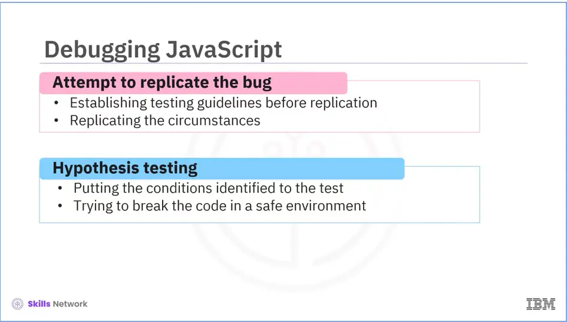{width="5.0in"
height="2.8429483814523184in"}

Let's discuss each step in detail. The first step in debugging is to
replicate the circumstances. In most programming languages, it is
facilitated by reviewing logs preceding an error. If you have access to
production logs, you must establish some testing guidelines before
replicating any circumstances of an issue. The operating system,
production database, and user accounts are all replicated in this
process. After identifying the conditions, you believe will result in
the exception or error you\'re looking for, you must put them to the
test. Development and staging environments are breakable without
affecting end users, therefore, you should always try to break your code
in a safe environment.

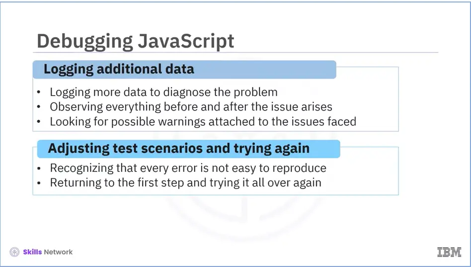{width="5.0in"
height="2.8429483814523184in"}

Next, you need to log more data to diagnose the problem. You can observe
everything before and after the issue arises. The issues you are facing
likely have possible warnings attached to them, which don\'t always
appear in the logs by default. Every error is difficult to reproduce,
and replicating them in a non-production environment can be difficult
due to time constraints or other factors. Return to the first step and
try it all over again.

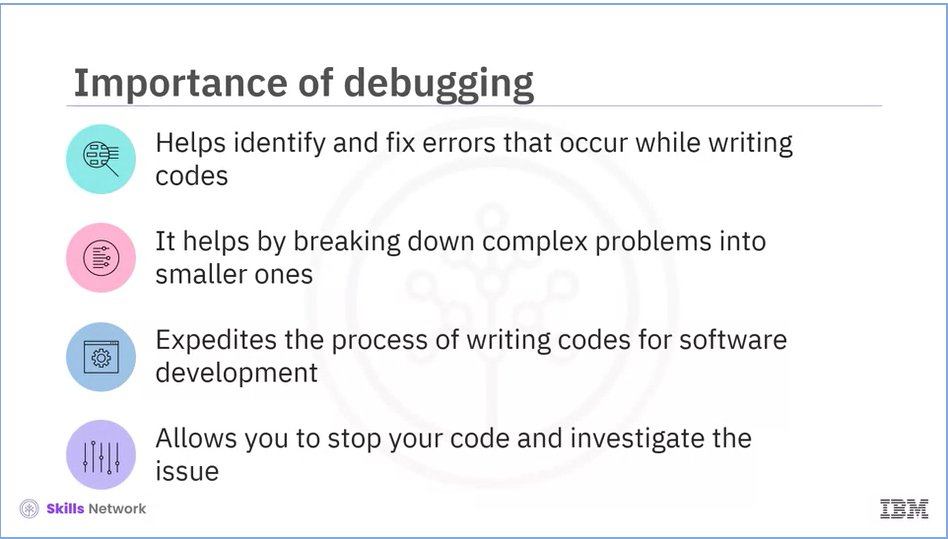{width="5.0in"
height="2.8429483814523184in"}

Now that you know how to debug JavaScript errors, let's discuss the
importance of debugging. Errors can occur while writing codes, and it is
important to fix the errors. Debugging helps by breaking down complex
problems into smaller ones and expediting the process of writing codes
for the software. While implementing the code, avoid making any
syntactic or other types of errors. The process continues in stages,
combining the code with other programming units to form a software
product. Debugging allows you to stop your code when it reaches a point
where you suspect a logic or implementation problem and investigate
whether it is doing what you expected. You can achieve the same result
by including printouts in your code.

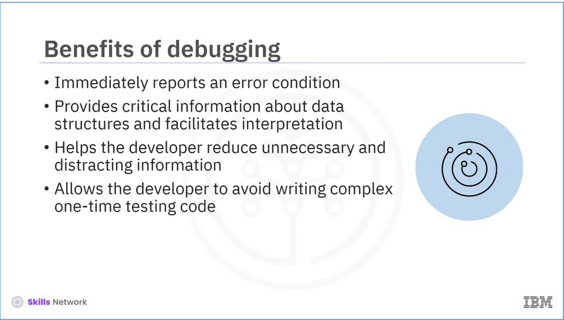{width="5.0in"
height="2.8429483814523184in"}

Debugging offers various benefits. It immediately reports an error
condition. As a result, the error is found early, ensuring the software
development process is less stressful. It provides critical information
about data structures and facilitates interpretation. It helps the
developer reduce unnecessary and distracting information. It allows the
developer to avoid writing complex one-time testing codes, saving time
and energy required for software development.

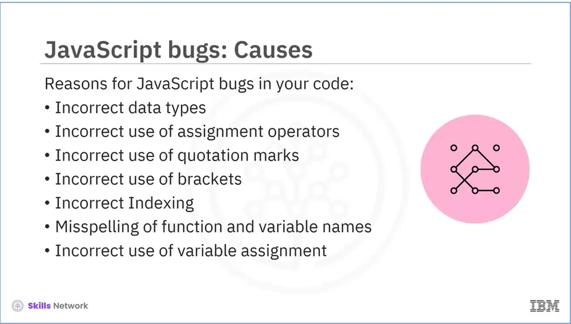{width="5.0in"
height="2.8429483814523184in"}

Let's explore some reasons for JavaScript bugs in your code. These
include: Incorrect data types, Incorrect use of assignment operators,
Incorrect use of quotation marks, Incorrect use of brackets, Incorrect
Indexing, Misspelling of function and variable names, and Incorrect use
of variable assignment. Let's discuss each reason in detail.

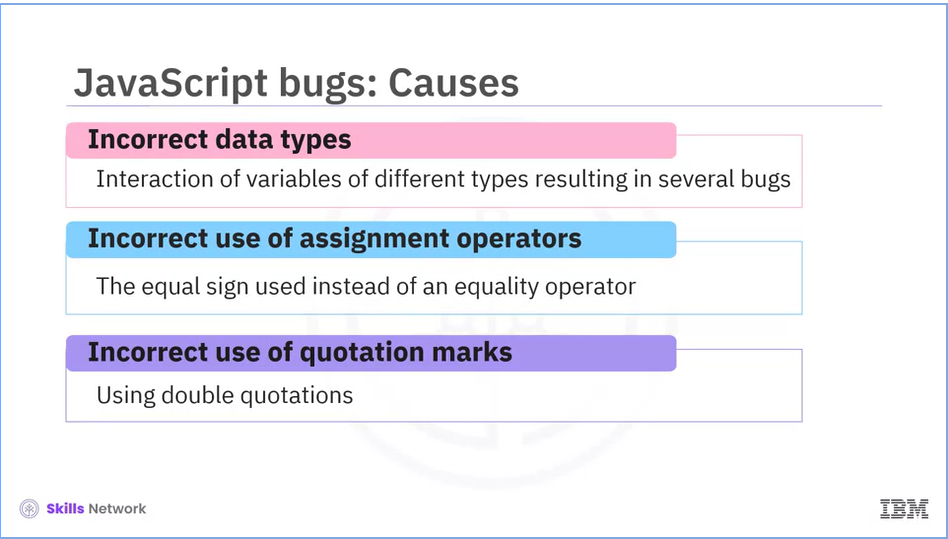{width="5.0in"
height="2.8429483814523184in"}

The interaction of variables of different types can result in many bugs
in your code. For example, if you use a string with a number. It is
important to check the places where the equal sign is used instead of an
equality operator because it is an assignment operator in JavaScript. In
contrast, the double and the triple equal signs check if values are
equal. In JavaScript, you can use different quotation marks to enclose
quotation marks within quotation marks. You may face issues if you use
double quotations.

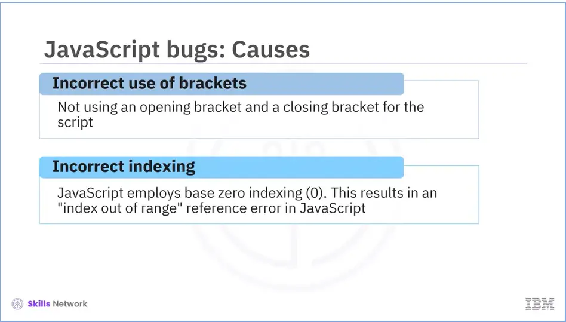{width="5.0in"
height="2.8429483814523184in"}

Another error that we see quite often is the incorrect use of brackets.
There must be an opening bracket and a closing bracket for the script.
JavaScript employs base zero indexing. You can obtain the first value of
an array by using index zero. As the result is off by one, this
frequently results in an \"index out of range\" reference error in
JavaScript.

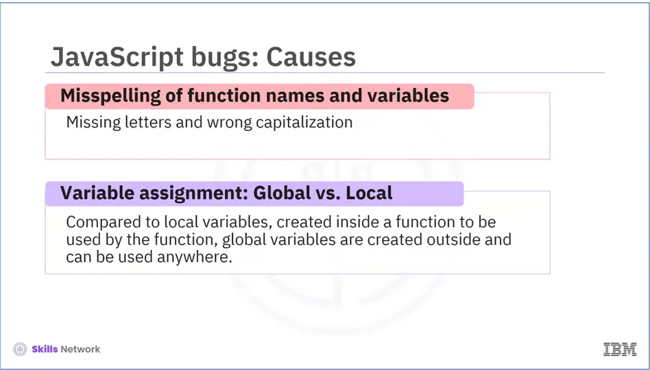{width="5.0in"
height="2.8429483814523184in"}

Missing letters and wrong capitalization also lead to bugs in the code.
Coders can use code editors to reduce misspelled function names and
variables. Global variables are created outside and can be used
everywhere, in contrast to local variables, created inside a function to
be utilized by the function. The distinction between global and local
variables is that creating global variables is outside. Its usage can be
everywhere, whereas local variables are created inside a function. Its
usage is by function.

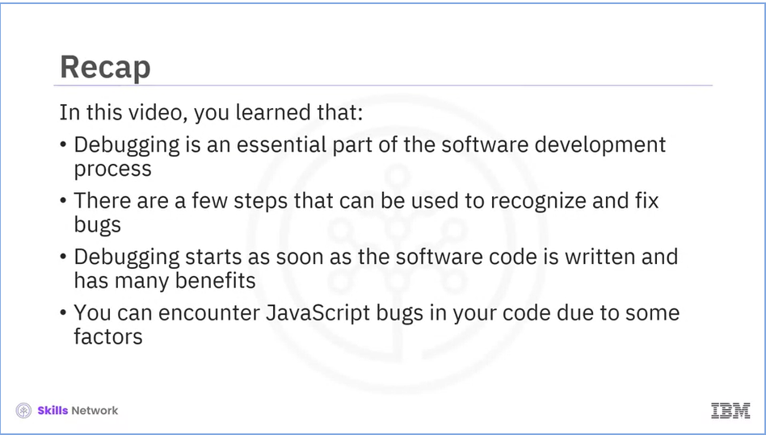{width="5.0in"
height="2.8429483814523184in"}

In this module (30), you learned about:

-   Debugging is an essential part of the software development process,

-   A few steps are used to recognize and fix bugs,

-   Debugging has many benefits, and

-   You can encounter JavaScript bugs in your code due to some factors.

# 31. Basic Debugging Concepts

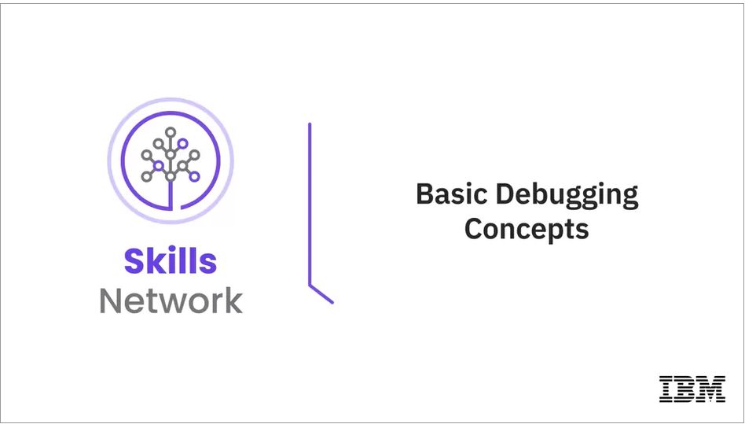{width="5.0in"
height="2.8429483814523184in"}

Welcome to "Basic Debugging Concepts."

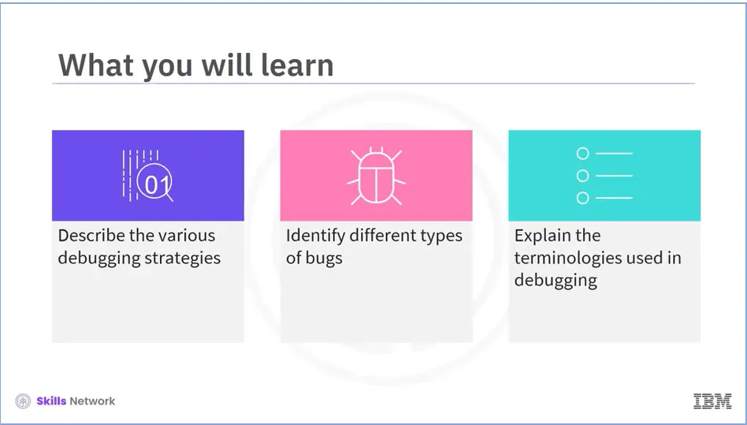{width="5.0in"
height="2.8429483814523184in"}

After reading this module (31), you will be able to:

-   Describe debugging strategies,

-   Identify the types of bugs, and

-   Explain the terminologies used in debugging.

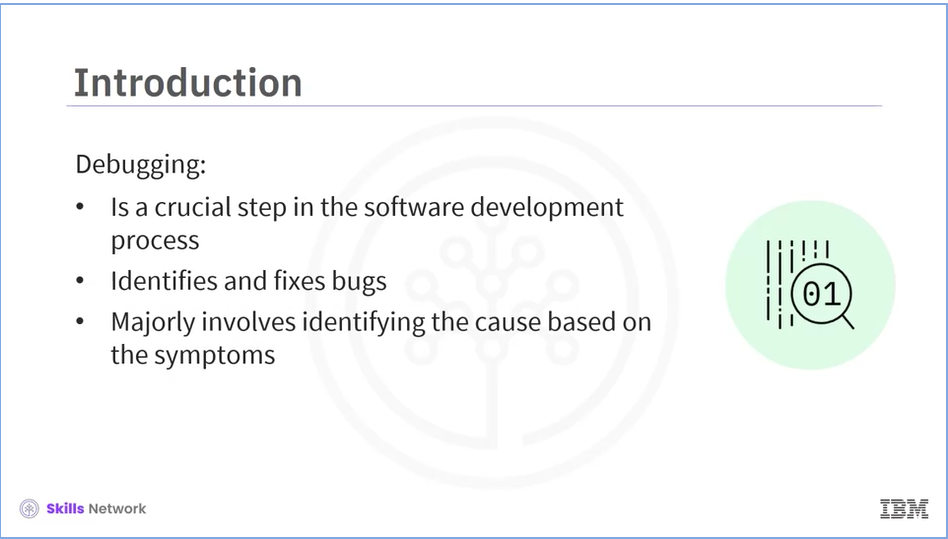{width="5.0in"
height="2.8429483814523184in"}

If your program does not generate the desired output, there is a high
possibility that your code contains errors. This is why debugging is a
crucial step in the software development process, as it identifies and
fixes bugs. A major part of the debugging process involves identifying
the cause based on the symptoms.

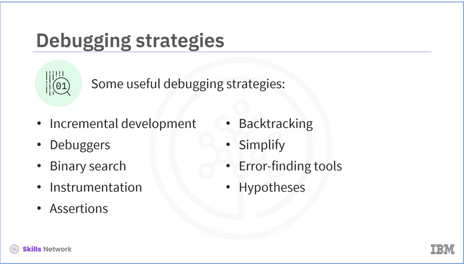{width="5.0in"
height="2.8429483814523184in"}

Different strategies can be employed to localize the error, as there is
no best method for doing it. Each strategy is suited to a different
situation; therefore, it is beneficial to be aware of these strategies.
Some of these include: Incremental development, Debuggers, Binary
search, Instrumentation, Assertions, Backtracking, Simplify,
Error-finding tools, and Hypotheses.

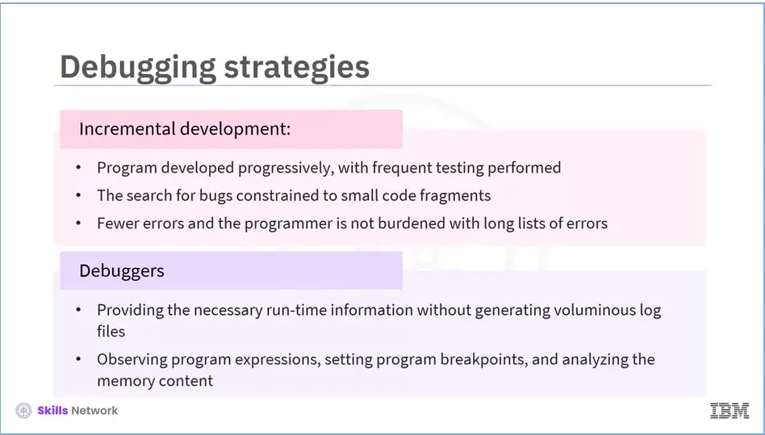{width="5.0in"
height="2.8429483814523184in"}

Let's review each of them in detail. In this strategy, the program is
developed progressively, with frequent testing performed as each new
piece of code is added. As the final chunk of code is small in
incrementally developed programs, the search for bugs is constrained to
small code fragments. As a result, there are fewer errors, and the
programmer is not burdened with long lists of errors. This strategy
involves providing all the necessary run-time information without
generating voluminous difficult-to-read log files by observing program
expressions, setting program breakpoints, and analyzing the memory
content at selected points during execution.

{width="5.0in"
height="2.8429483814523184in"}

This strategy places a check halfway through a large piece of code.

If the error does not appear at that point, the bug is in the second
half. As a result, the amount of code that must be inspected reduces by
half. The process quickly leads to the actual problem if repeated. This
strategy involves inserting print statements. Although printed
information is useful in some cases, it can be challenging to examine
when the amount of information grows significantly. In this case,
automated scripts can be used to sort through the data and provide
pertinent portions in a more concise style.

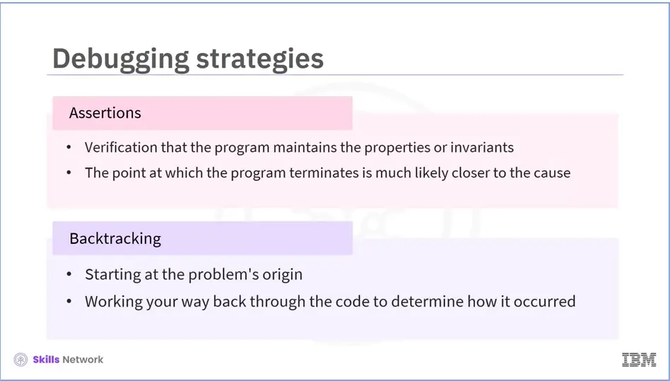{width="5.0in"
height="2.8429483814523184in"}

This strategy is used to verify that the program maintains the
properties or invariants on which your code is based. The point at which
the program terminates is likely to be much closer to the cause and a
good indicator of what the issue is, as the program terminates as soon
as an assertion fails.

The next strategy is backtracking. This involves starting at the
problem\'s origin and working your way back through the code to
determine how it occurred.

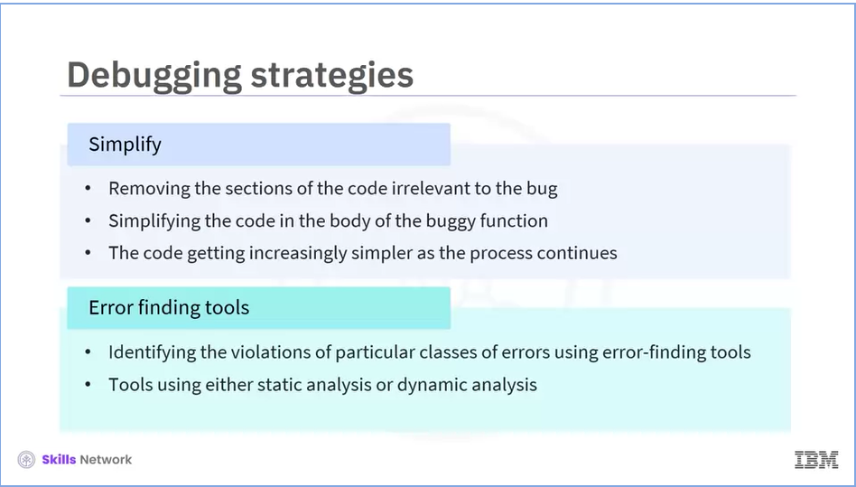{width="5.0in"
height="2.8429483814523184in"}

This strategy involves removing the sections of the code irrelevant to
the bug and simplifying the code in the body of the buggy function. As
the process continues, the code becomes increasingly simpler. The bug
will eventually be discovered. Data can also be simplified using a
similar method. If the input data is too big, continuously remove parts
of it to check if the bug still exists. Here, programmers can quickly
identify violations of particular classes of errors using error-finding
tools. For example, tools that check safety properties. Error-finding
tools use either static analysis or dynamic analysis.

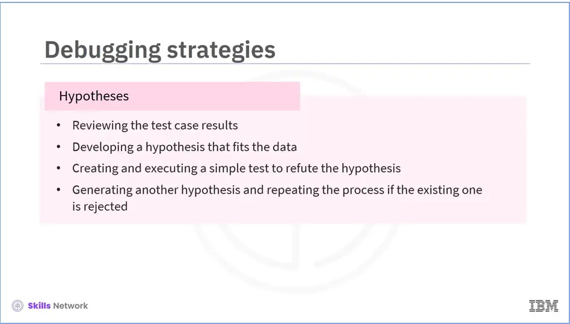{width="5.0in"
height="2.8429483814523184in"}

This strategy involves a few steps. First, review the test case results.
Next, develop a hypothesis that fits the data, and then create and
execute a simple test to refute the hypothesis. If the hypothesis is
rejected, generate another one and repeat the process. Finding the
simplest hypotheses and associated test cases is an effective strategy.

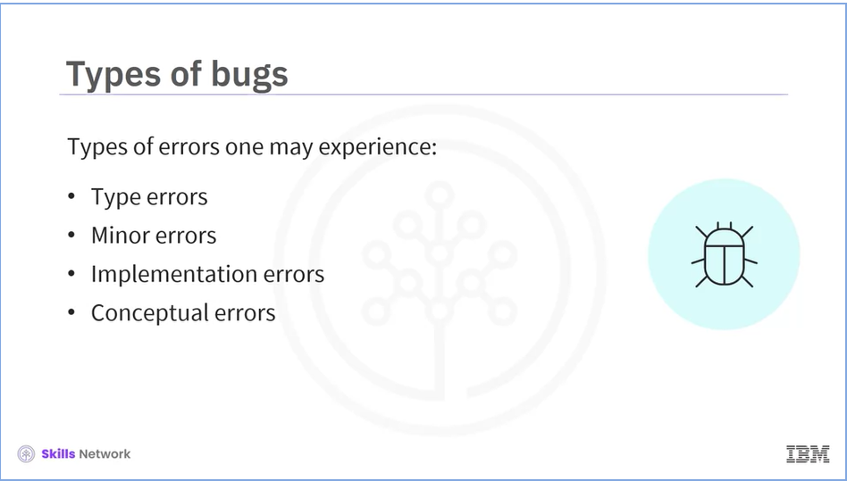{width="5.0in"
height="2.8429483814523184in"}

Let's now explore different types of bugs. A program may contain bugs
even after meticulous planning and defensive programming. There are
different types of errors that one may experience. These are: Type
errors, Minor errors, Implementation errors, and Conceptual errors.

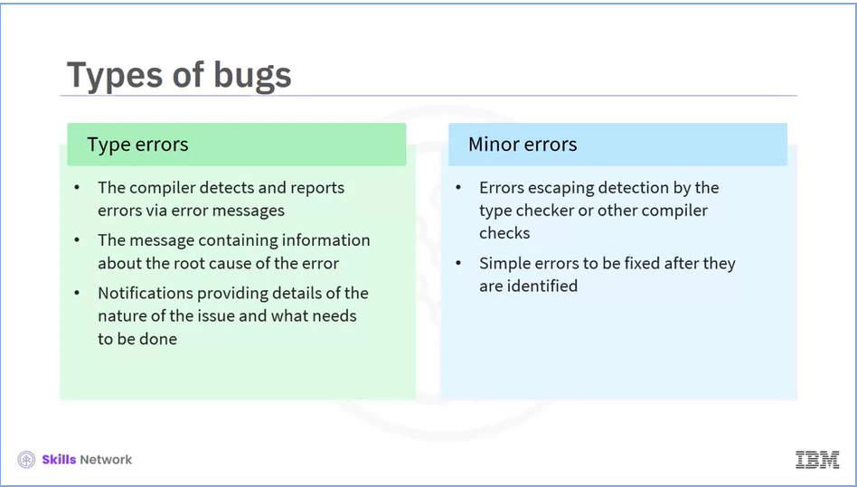{width="5.0in"
height="2.8429483814523184in"}

Let's discuss each type of error in detail. The compiler always detects
and reports such errors via error messages. An error message typically
includes information about the root cause of the error, such as the
incorrect piece of code, the line number, and an explanation. These
notifications typically provide sufficient details of the nature of the
issue and what needs to be done. Errors such as typos or other simple
errors may escape detection by the type checker or other compiler
checks. These are simple to fix after they are identified.

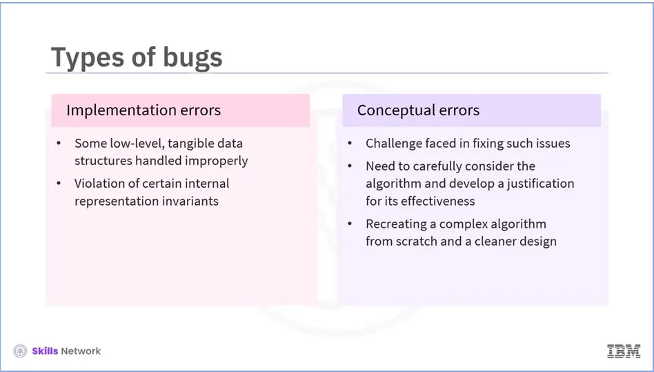{width="5.0in"
height="2.8429483814523184in"}

While a program\'s high-level algorithm may follow the correct logic,
some low-level, tangible data structures may be mishandled, violating
certain internal representation invariants. This can lead to
implementation errors. The programmer must reconsider the algorithm if
it has logical errors. Fixing such issues is more challenging,
particularly if the program only fails in a small number of corner
cases. One must carefully consider the algorithm and attempt to develop
a justification for its effectiveness. If the algorithm is too complex,
it may be better to redo it from scratch and create a cleaner design.

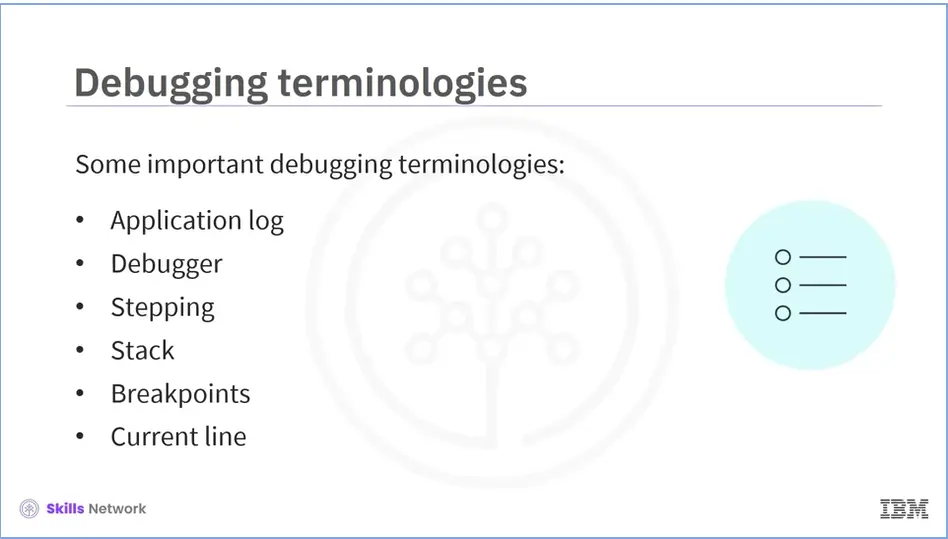{width="5.0in"
height="2.8429483814523184in"}

Let's now discuss some important terminologies used in debugging. These
are: Application log, Debugger, Stepping, Stack, Breakpoints, and
Current Line.

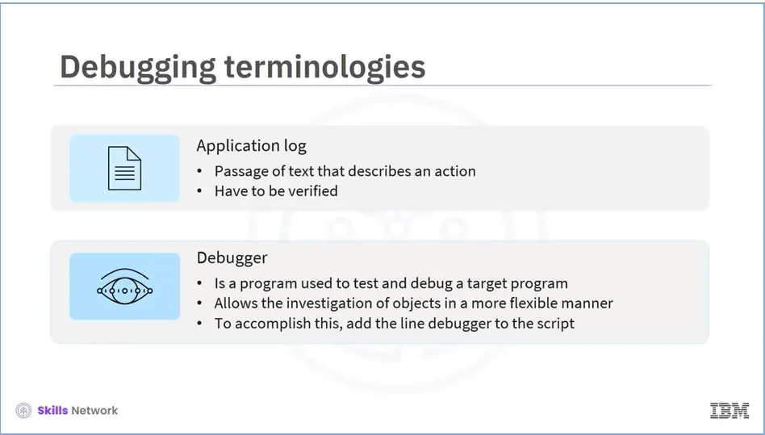{width="5.0in"
height="2.8429483814523184in"}

It's a passage of text that describes an action that occurs in an
application. Logs are important to verify what the program did right
before an issue occurred so that we can learn more about the bug. We can
use the console log in JavaScript to debug using logs. A debugger is a
program that programmers use to test and debug a target program. It
allows the investigation of objects in a more flexible manner by going
through the code line by line. To accomplish this, simply add the line
debugger to the script. The browser pauses execution on that line and
displays the source of the code currently being executed if the
developer tools console is opened. The browser will now provide
debugging methods and tools for debugging.

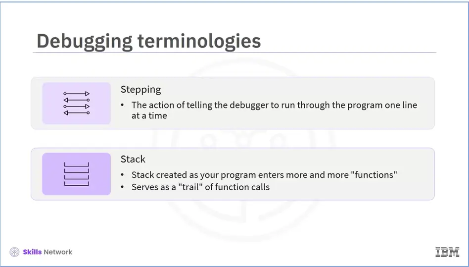{width="5.0in"
height="2.8429483814523184in"}

The action of telling the debugger to run through the program one line
at a time is called stepping. A computer program comprises of many small
steps that are integrated together. There can be a possibility that one
of these steps is incorrect. A \"stack\" of functions is created as your
program enters more and more \"functions.\" For your software, this
serves as a \"trail\" of function calls. This allows you to see how
"calling" one function affects the "current" function.

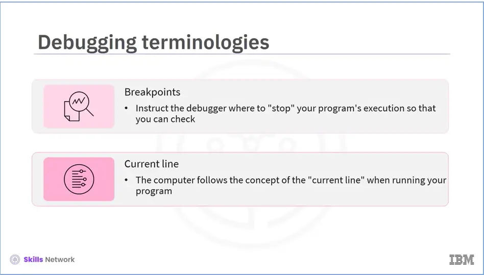{width="5.0in"
height="2.8429483814523184in"}

Breakpoints instruct the debugger where to \"stop\" your program\'s
execution so that you can see what\'s happening. This enables you to
access the proper location in your application quickly rather than going
through the entire program. Computers can only perform one task at a
time. As a result, computers follow the concept of the \"current line\"
when running your program. The control of the program typically flows
from the current line to the next line down the screen, to the following
line, and so on.

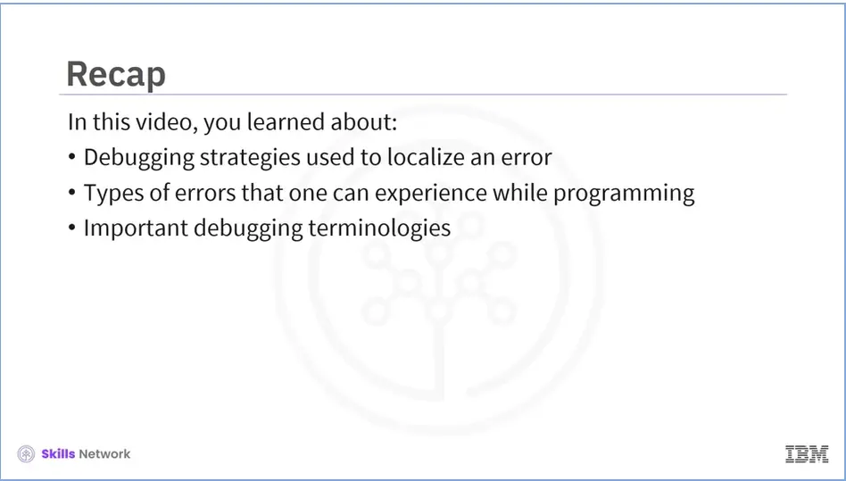{width="5.0in"
height="2.8429483814523184in"}

In this module (31), you learned about:

-   Debugging strategies used to localize an error,

-   Types of errors that one can experience while programming, and

-   Important debugging terminologies.

# 32. Introduction to Debugging Tools

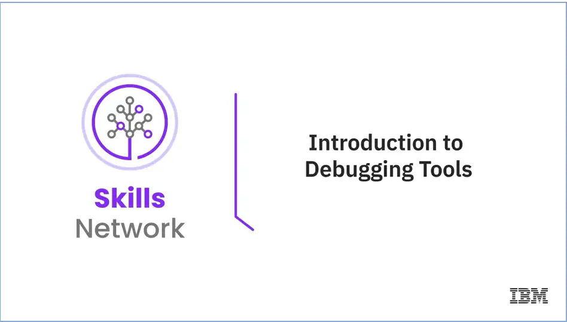{width="5.0in"
height="2.8429483814523184in"}

Welcome to "Introduction to Debugging Tools."

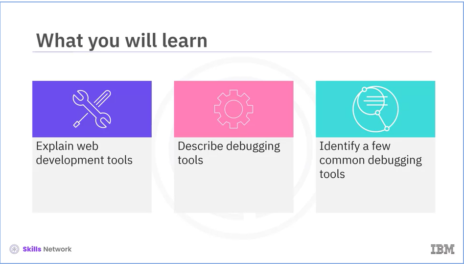{width="5.0in"
height="2.8429483814523184in"}

After reading this module (32), you will be able to:

-   Describe debugging tools, and

-   Identify a few common debugging tools.

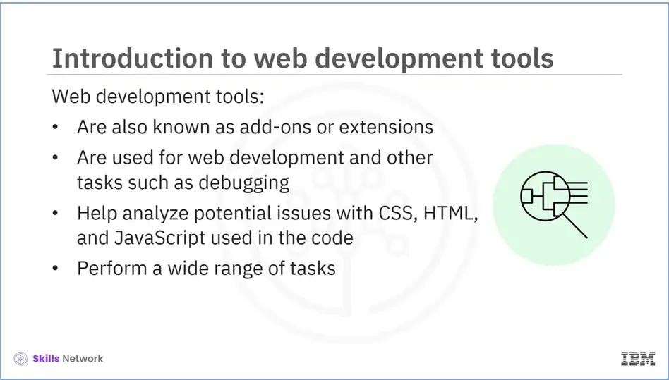{width="5.0in"
height="2.8429483814523184in"}

Browsers today are equipped with a variety of web development tools
referred to as add-ons or extensions. These are commonly used for web
development as well as a variety of other tasks, debugging being one of
the most important. These tools simplify your work by analyzing
potential issues with CSS, HTML, and JavaScript used in the code.

In this module, we will

-   Discuss some browser debugging tools which can help you not only
    debug and analyze your code but also inspect HTTP headers,

-   Gain access to other FTP source files, and

-   Assess a web page\'s accessibility.

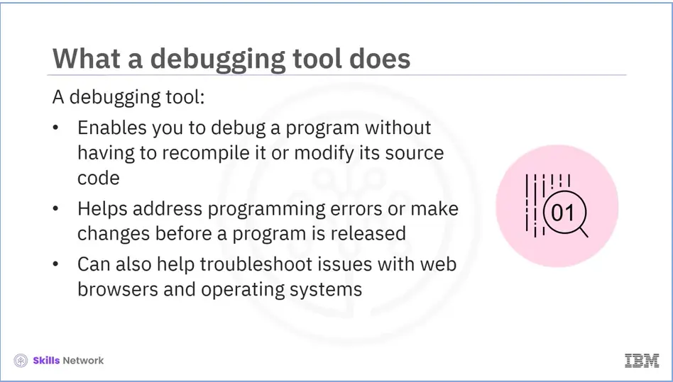{width="5.0in"
height="2.8429483814523184in"}

A debugging tool is a software program that enables you to debug a
program without having to recompile it or modify its source code.
Programmers use debugging tools to deal with programming errors or to
make changes before a program is released. These tools enable them to
attempt a fix without changing the source code. Debugging tools can also
be used for troubleshooting issues with other applications, such as web
browsers and operating systems.

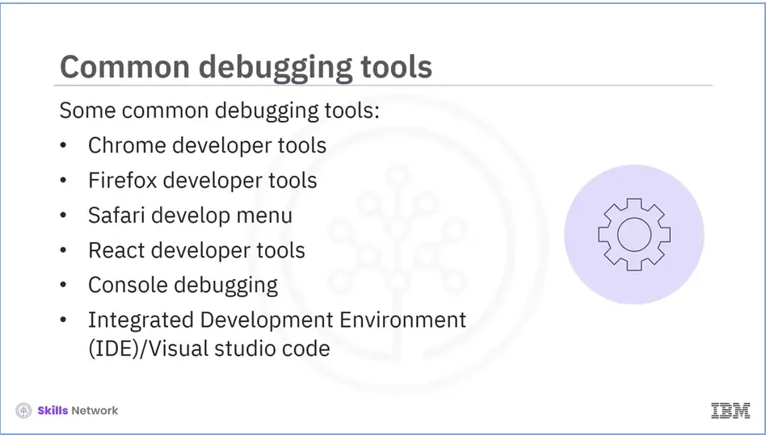{width="5.0in"
height="2.8429483814523184in"}

Some of the common debugging tools include Chrome Developer Tools,
Firefox developer tools, Safari Develop Menu, React Developer Tools,
console debugging, and Integrated Development Environment (IDE)/Visual
Studio Code.

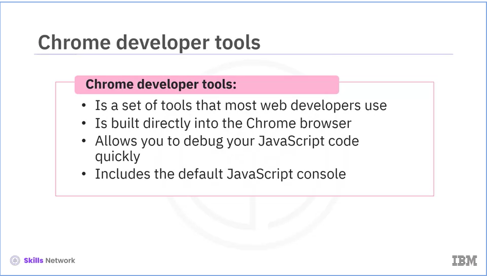{width="5.0in"
height="2.8429483814523184in"}

Let's discuss each in detail. Chrome developer tools are a set of tools
for web developers which is built directly into the Chrome browser.
Which allows you to debug your JavaScript code quickly. Many developers
rely on these tools, which are the best in the industry. The default
JavaScript console is included in Chrome developer tools, along with
tools for network and performance monitoring and security features. The
Console and Network activity tabs are where most JavaScript debugging
happens.

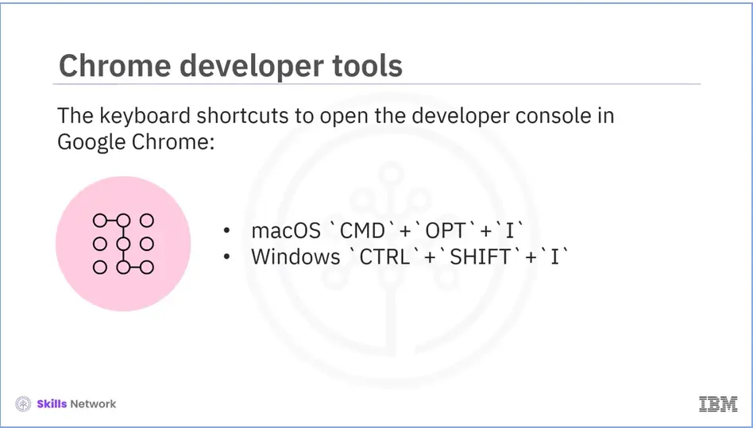{width="5.0in"
height="2.8429483814523184in"}

The keyboard shortcuts mentioned here can be used to open the developer
console in Google Chrome: macOS \`CMD\`+\`OPT\`+\`I\` Windows
\`CTRL\`+\`SHIFT\`+\`I\`

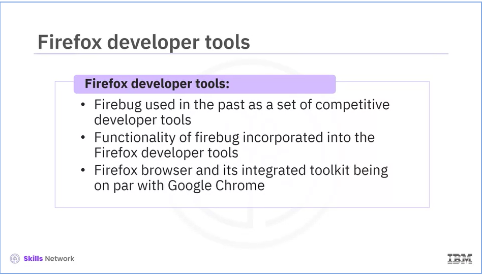{width="5.0in"
height="2.8429483814523184in"}

In the past, Firefox users relied on Firebug, an extension that provided
them with a set of competitive developer tools. The functionality of
firebug was incorporated into the Firefox Developer Tools available in
the latest versions of Firefox. This put Google Chrome and the Firefox
browser's integrated toolkit on an equal level.

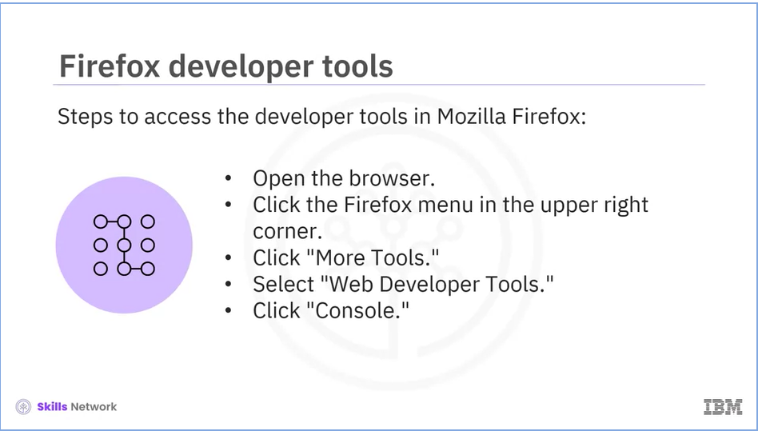{width="5.0in"
height="2.8429483814523184in"}

To access the developer tools in Mozilla Firefox, open the browser,
click the Firefox menu in the upper right corner, and click \"More
Tools.\" Next, select \"Web Developer Tools.\" Finally, click
\"Console.\"

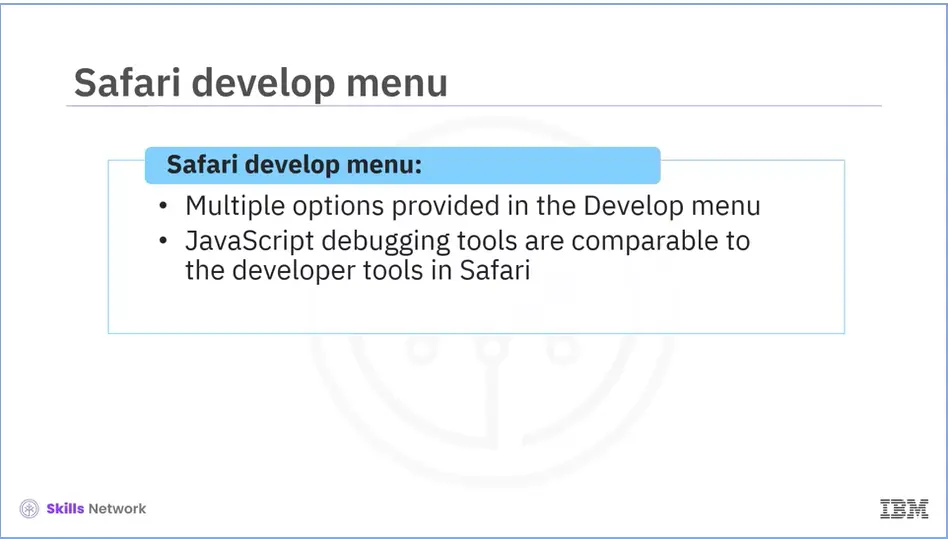{width="5.0in"
height="2.8429483814523184in"}

There are options in the Develop menu to display the JavaScript console,
a network, a debugger, a page element inspector, and a network traffic
monitor. The JavaScript debugging tools provided by Chrome are
comparable to the developer tools in Safari. All browser developer tools
are progressively getting better as they become better equipped to
fulfill developers\' demands.

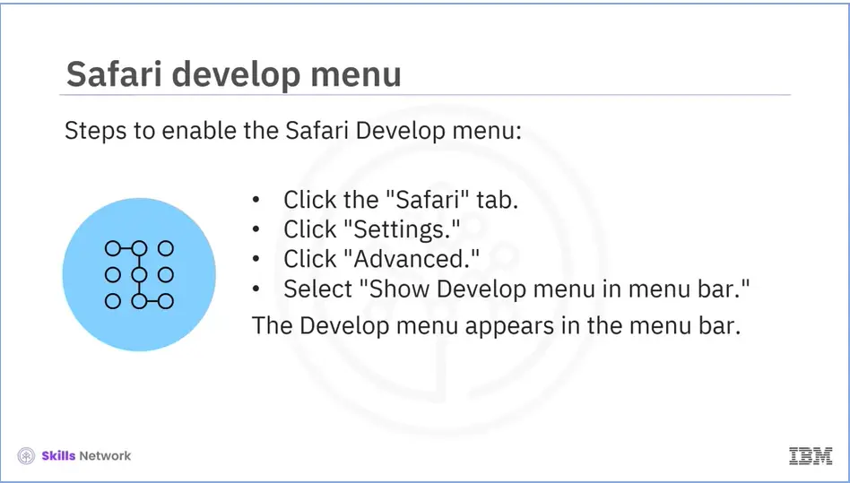{width="5.0in"
height="2.8429483814523184in"}

To utilize Safari's built-in developer tools, users must enable the
Safari Develop menu. - First click the \"Safari\" tab and then click
\"Settings.\" - Next, click \"Advanced.\" - Finally, select \"Show
Develop menu in the menu bar.\" The Develop menu will appear in the menu
bar.

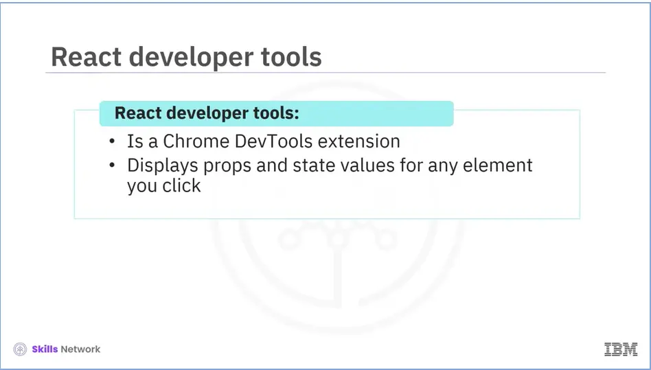{width="5.0in"
height="2.8429483814523184in"}

React Developer Tools, an extension of Chrome DevTools, is a great
source of help if you need to inspect the props or state values in your
React-built application. If you visit a website created using React
after adding the extension, a React tab will be added to the developer
console, displaying properties and state values for any element you
click.

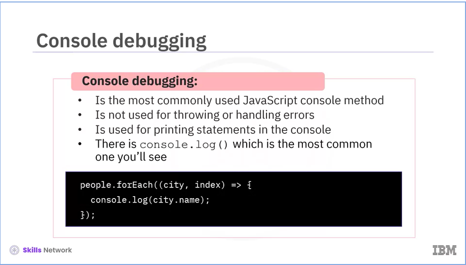{width="5.0in"
height="2.8429483814523184in"}

This is the most commonly used JavaScript console method. Error handling
or throwing are not done using this method. Instead, it is employed to
print statements in the console. There is console.log() which is the
most common one you\'ll see.

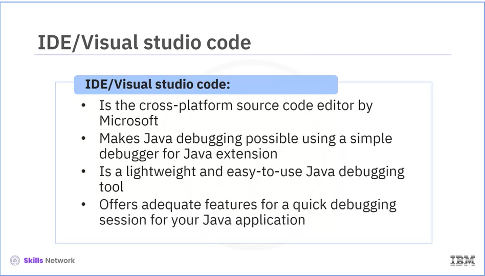{width="5.0in"
height="2.8429483814523184in"}

When debugging Java applications, you do not always need to use an IDE.
Visual Studio Code, Microsoft\'s cross-platform source code editor, also
supports Java debugging via a simple debugger for Java extensions.
Visual studio code is an excellent option if you already use it for
development and require a compact and user-friendly Java debugging tool.
Visual Studio Code provides sufficient features for a quick debugging
session of your Java application despite all the complex debugging
features that IDE's debuggers provide.

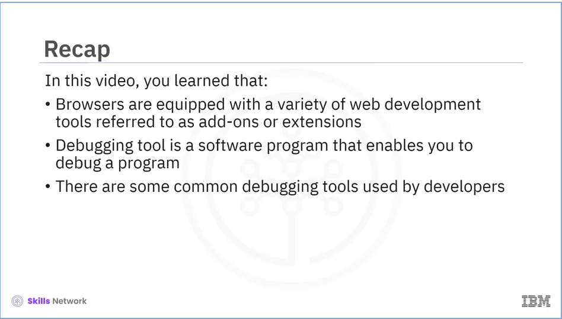{width="5.0in"
height="2.8429483814523184in"}

In this module (32), you learned that:

-   Browsers are equipped with a variety of web development tools
    referred to as add-ons or extensions,

-   Debugging tool is a software program that enables you to debug a
    program, and

-   There are some common debugging tools used by developers.

# 33. Troubleshooting with Chrome DevTools

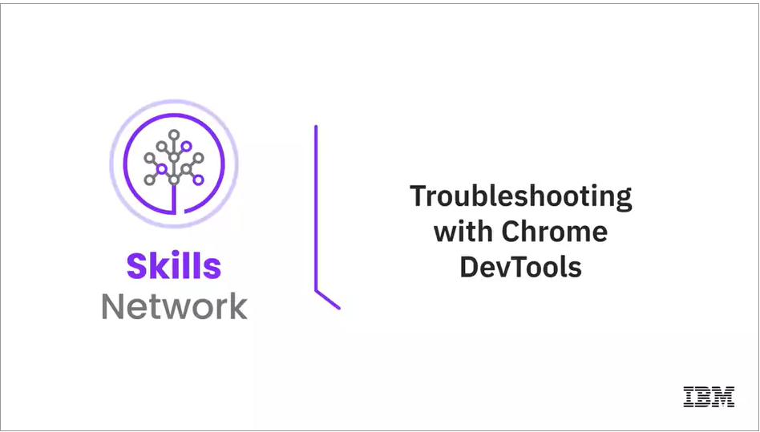{width="5.0in"
height="2.8429483814523184in"}

Welcome to Troubleshooting with Chrome DevTools!

{width="5.0in"
height="2.8429483814523184in"}

After reading this module (33), you will be able to:

-   Describe Chrome DevTools and its various panels, and

-   Determine how to access some of the panels\' features.

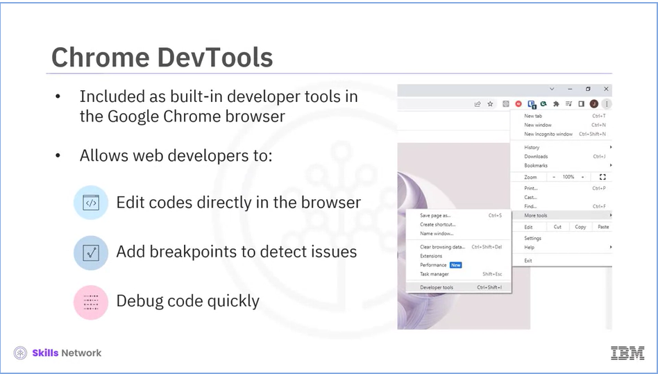{width="5.0in"
height="2.8429483814523184in"}

Explain how to use Chrome DevTools to debug HTML and CSS The Google
Chrome browser includes built-in developer tools, also known
as DevTools, that allow developers to edit code directly in the browser,
add breakpoints to detect issues, and debug their code quickly.

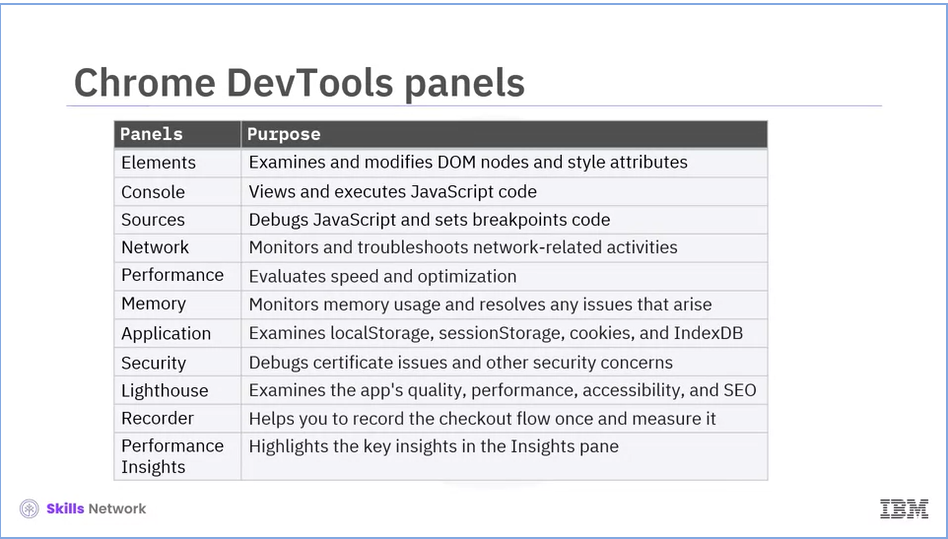{width="5.0in"
height="2.8429483814523184in"}

There are eleven panels in the DevTools UI. Here\'s a quick listing of
what each panel oversees.

Elements: Examine and modify DOM nodes and style attributes.

Console: View and execute JavaScript code.

Sources: Debug JavaScript, set breakpoints, and so on.

Network: Monitor and troubleshoot network-related activities.
Performance: Evaluate speed and optimization Memory: Monitor memory
usage and resolve any issues that arise. Application: Examine local
Storage, session Storage, cookies, Index DB, and so on. Security: Debug
certificate issues and other security concerns Lighthouse: Examine the
app\'s quality, performance, accessibility, SEO, and so on. Recorder
panel: Helps you can record the checkout flow once and measure it
regularly Performance Insights panel: Highlights the key insights in the
Insights pane, with actionable feedback on how to fix issues.

{width="5.0in"
height="2.8429483814523184in"}

Let\'s first try to understand how to access Chrome DevTools. To access
Chrome DevTools: Right-click on any website and select \"inspect." The
DevTools will open the Elements panel and highlight the selected DOM
element. To open the console panel, use the keyboard shortcut CMD +
Option + J on Mac or CTRL + SHIFT + J on Windows.

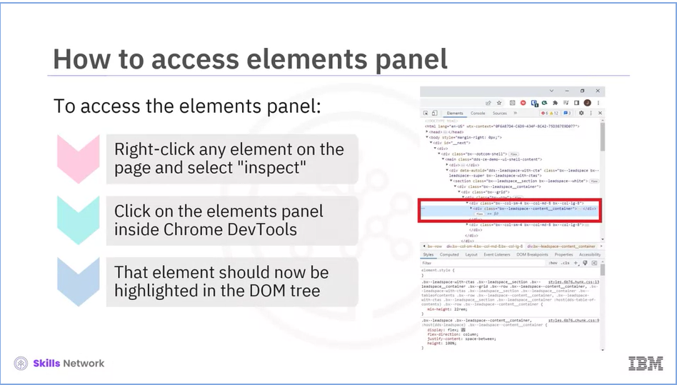{width="5.0in"
height="2.8429483814523184in"}

Let\'s now learn how to access the elements panel. To access the
elements panel: Right-click any element on the page and select
\"inspect\" or Click on the elements panel inside Chrome DevTools. That
element should now be highlighted in the DOM tree.

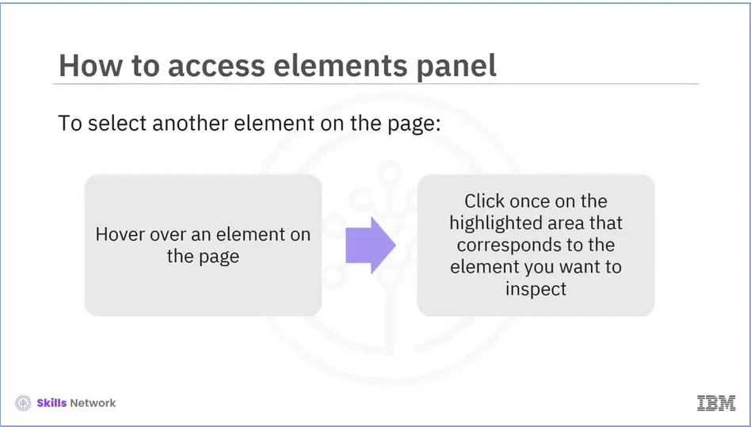{width="5.0in"
height="2.8429483814523184in"}

To select another element on the page: Hover over an element on the page
and Click once on the highlighted area that corresponds to the element
you want to inspect.

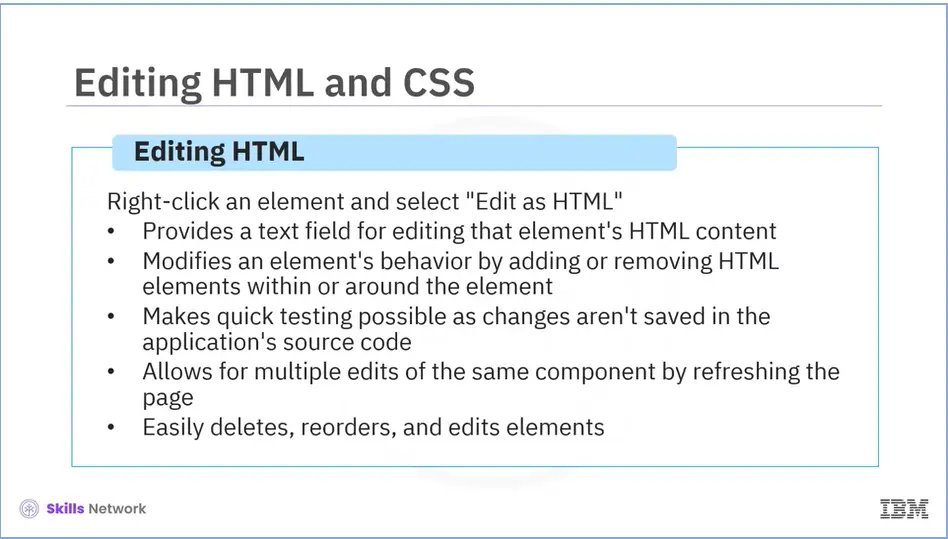{width="5.0in"
height="2.8429483814523184in"}

Now that we know how to access the Elements panel let\'s look at how to
use it to edit HTML and CSS. We will first look at how to edit HTML.
When you right-click on an element and choose \"Edit as HTML,\" you are
presented with a text field in which you can fully edit the HTML content
that comprises that element. This is useful if you want to change the
behavior of an element by adding or removing HTML elements inside or
around any element on the page.

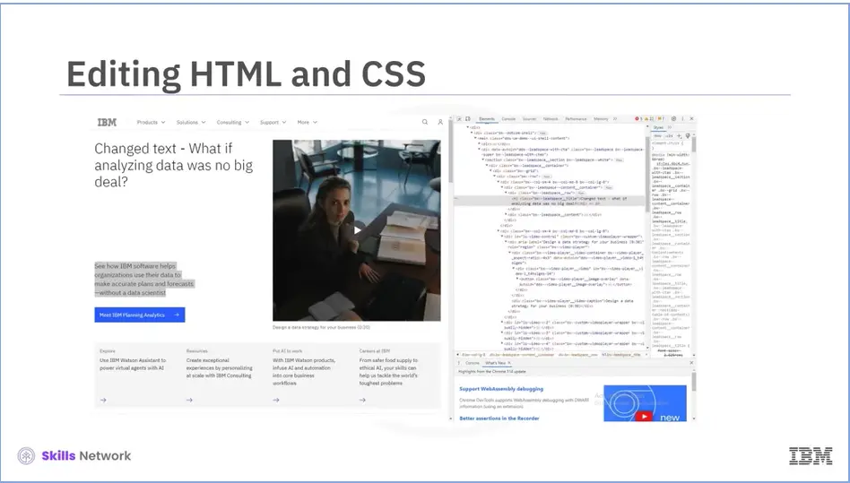{width="5.0in"
height="2.8429483814523184in"}

Since these changes aren\'t saved in your application\'s source code,
they\'re ideal for quickly testing a new HTML structure without adding
and deleting these elements in your code. Simply refreshing the page
allows you to edit the same component multiple times. You can easily
delete and reorder elements in addition to editing them.

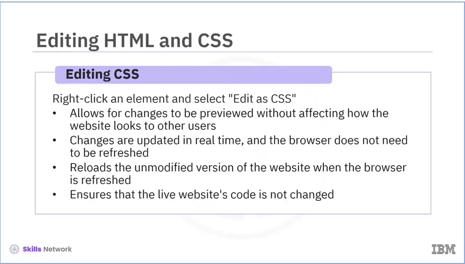{width="5.0in"
height="2.8429483814523184in"}

Let's now look at how to edit CSS. The Styles panel is useful for
debugging CSS and understanding how CSS works. The styles panel allows
you to preview changes without affecting the appearance of your website
for other visitors. It is not necessary to refresh your browser to see
the changes because they are updated in real-time.

{width="5.0in"
height="2.8429483814523184in"}

In fact, if you refresh your browser after making changes, the browser
will reload the unmodified version of your website, wiping out your
changes. Using the styles panel for live CSS testing ensures that the
actual code of your live website is not altered.

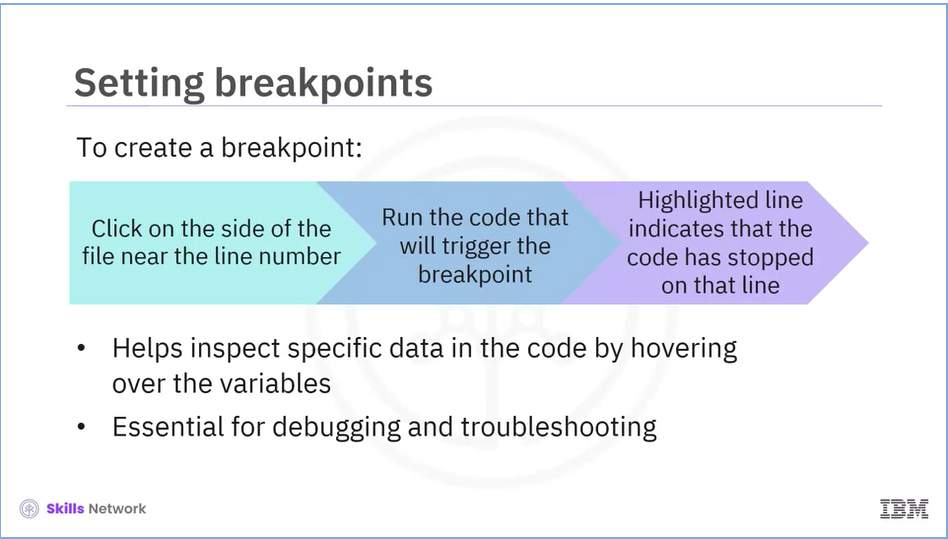{width="5.0in"
height="2.8429483814523184in"}

Let\'s now understand the process of setting a breakpoint in your codes.
To create a breakpoint: Click on the side of the file near the line
number and Run the code that will trigger the breakpoint. The
highlighted line of code indicates that the code has paused execution on
that line. So, at this point, you can inspect specific data in the code
by hovering over the variables you want to examine. This is essential
for debugging because quickly viewing your app's current state at any
point will provide you with valuable insight into how it works.

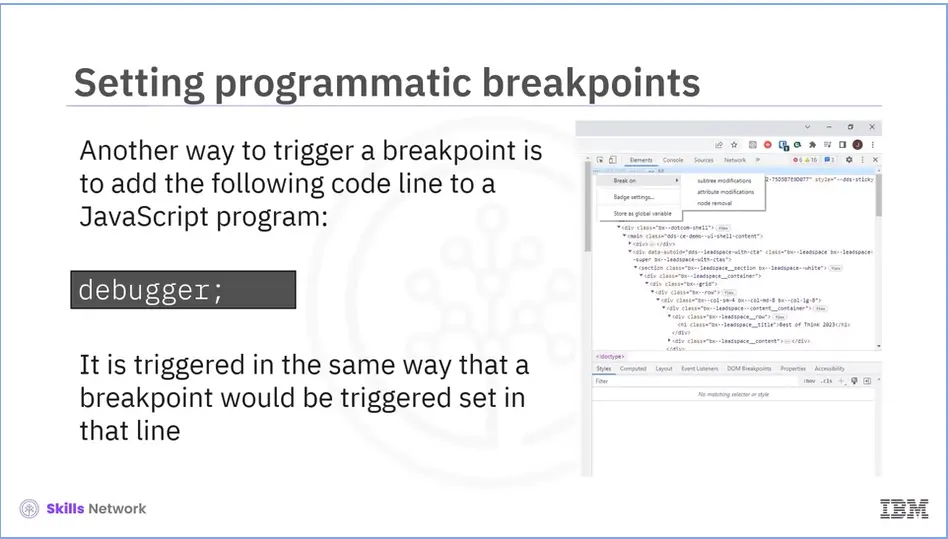{width="5.0in"
height="2.8429483814523184in"}

Another way to trigger a breakpoint is to simply add the following code
line to a Javascript program: debugger; When the code reaches this line,
the debugger is triggered in the same way that a breakpoint would be set
in that line.

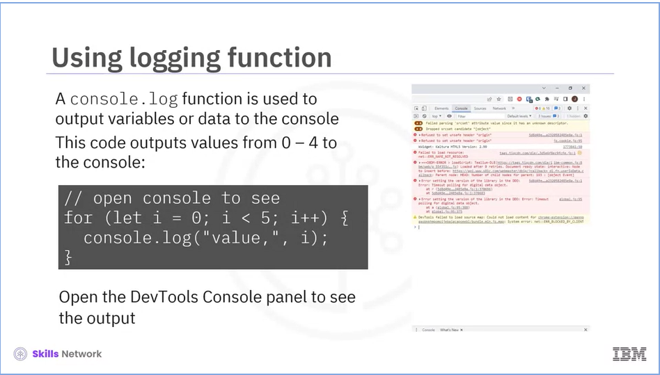{width="5.0in"
height="2.8429483814523184in"}

Let's now look at the logging function. The code has a console.log
function that can be used to output variables or data to the console.
For example, this code outputs the values from 0 to 4 to the console: //
open console to see for (let i = 0; i \< 5; i++)
{console.log(\"value,\", i); } To see the output, either open the
DevTools Console panel or press Esc while in another panel. This opens
the console at the bottom of the screen.

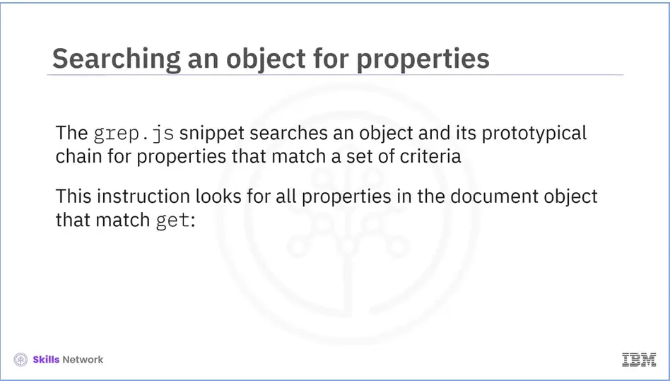{width="5.0in"
height="2.8429483814523184in"}

Let's now learn how to find properties in an object. The grep.js snippet
searches an object and its prototypical chain for properties that match
a set of criteria.

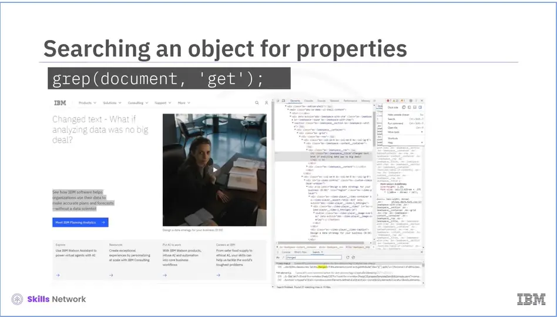{width="5.0in"
height="2.8429483814523184in"}

For example, this instruction will look for all properties in the
document object that match get: grep(document, \'get\');

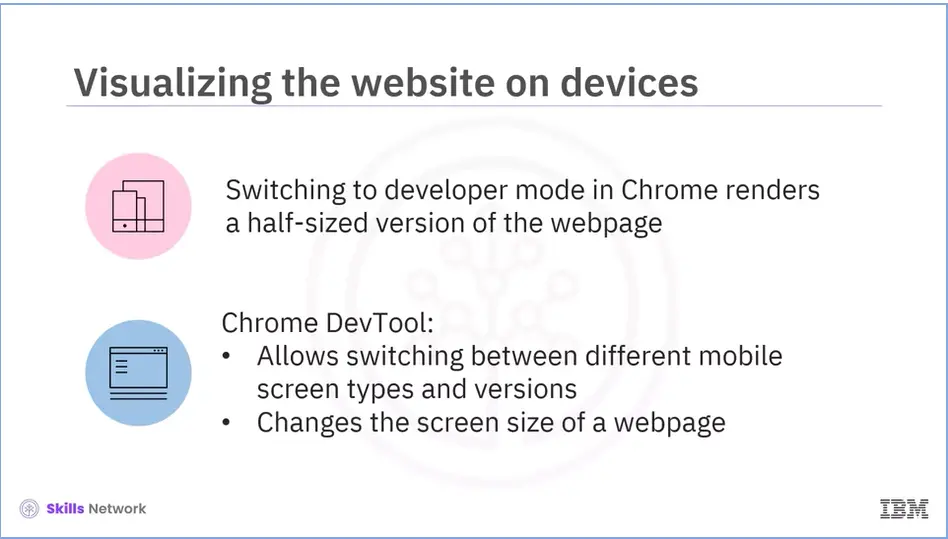{width="5.0in"
height="2.8429483814523184in"}

When you switch to developer mode in Chrome, it renders a half-sized
version of your webpage. Fortunately, Chrome DevTools allows you to
switch between different mobile screen types and versions in addition to
changing the screen size of a webpage.

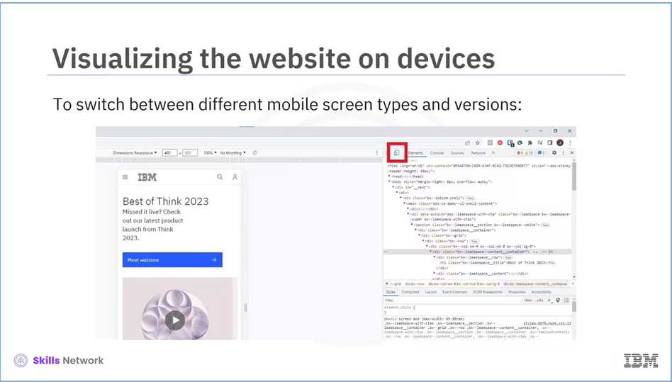{width="5.0in"
height="2.8429483814523184in"}

To access that option: First, toggle on the Inspect mode.

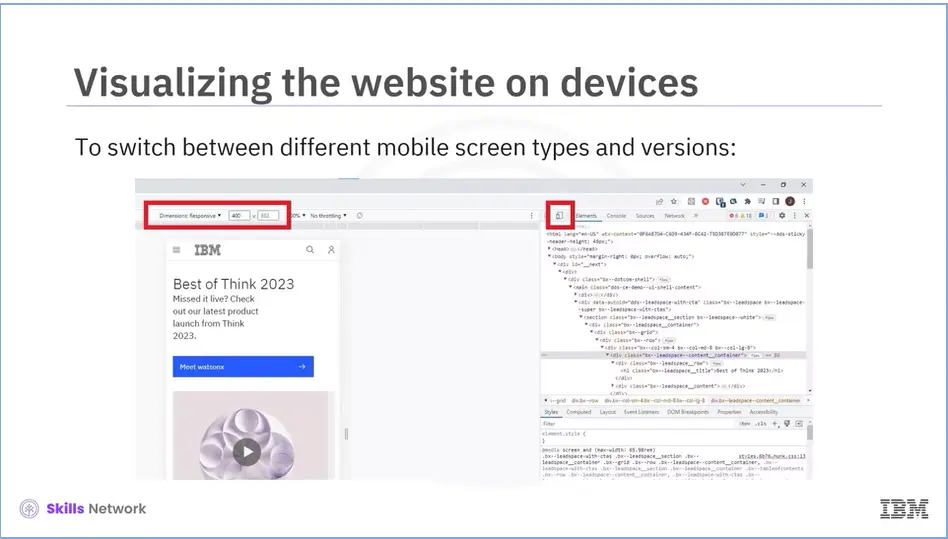{width="5.0in"
height="2.8429483814523184in"}

Next, select Responsive from the drop-down menu in the top-left corner
of the DevTools. Lastly, choose your preferred mobile device.

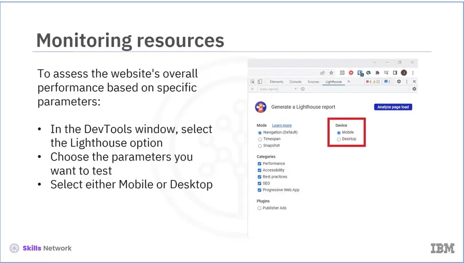{width="5.0in"
height="2.8429483814523184in"}

The webpage is then rendered and adjusted to fit the size of the mobile
device you chose. Aside from debugging JavaScript, Chrome DevTools
includes a feature that allows you to assess your website\'s overall
performance based on specific parameters. To use that feature, follow
these steps: In the DevTools window, select the Lighthouse option. Next,
choose the parameters you want to test. Select either Mobile or Desktop
to see how your website performs on different platforms.

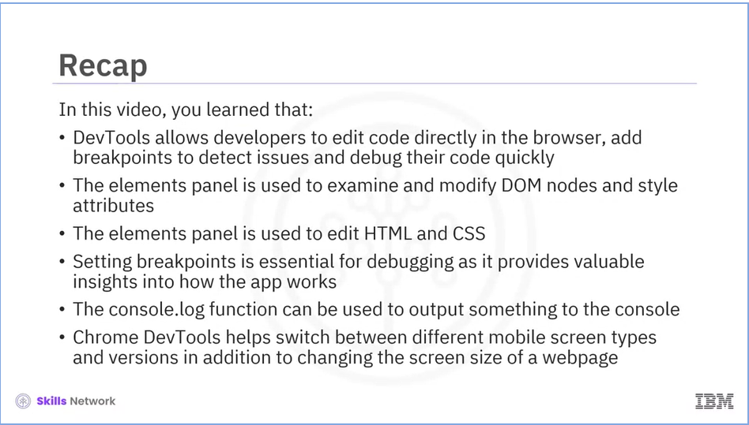{width="5.0in"
height="2.8429483814523184in"}

In this video, you learned that:

-   DevTools allows developers to edit code directly in the browser, add
    breakpoints to detect issues, and debug their code more quickly.,

-   The elements panel is used to examine and modify DOM nodes and style
    attributes,

-   The elements panel is used to edit HTML and CSS,

-   Setting breakpoints is essential for debugging as it provides
    valuable insights into how the app works,

-   The console.log function can be used to output something to the
    console, and

-   Chrome DevTools helps switch between different mobile screen types
    and versions in addition to changing the screen size of a webpage.

# 34. Monitoring your Website

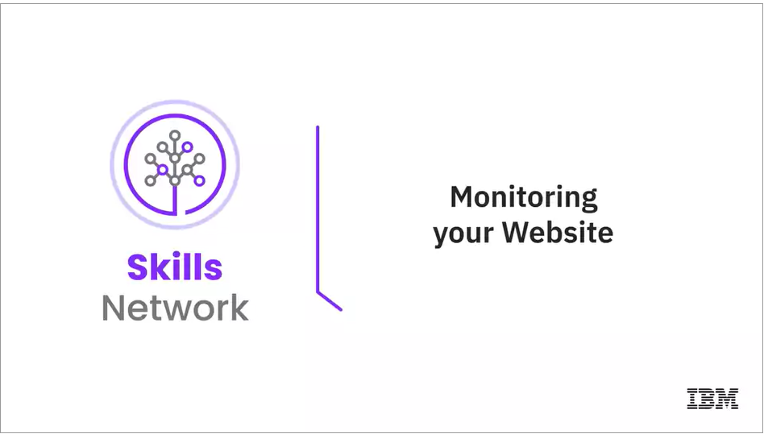{width="5.0in"
height="2.8429483814523184in"}

Welcome to "Monitoring your Website."

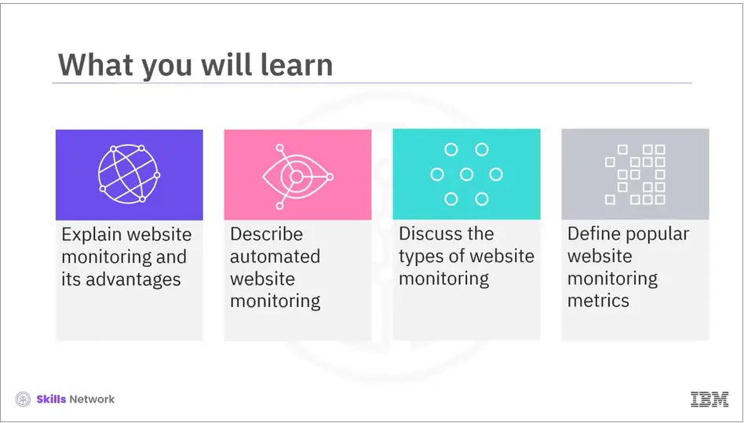{width="5.0in"
height="2.8429483814523184in"}

After reading this module (34), you will be able to:

-   Explain website monitoring and its advantages,

-   Describe automated website monitoring,

-   Discuss the types of website monitoring, and

-   Define popular website monitoring metrics.

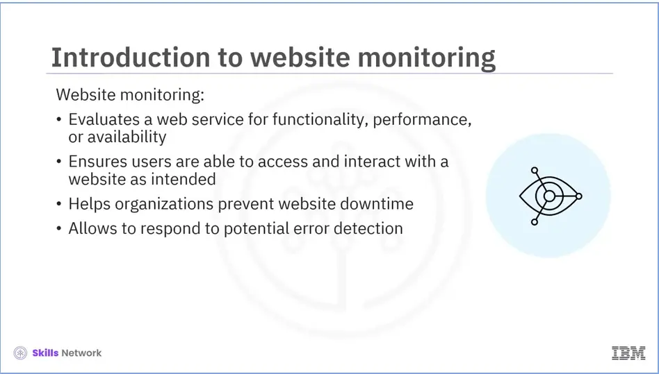{width="5.0in"
height="2.8429483814523184in"}

Website monitoring implies evaluating a website or web service for
functionality, performance, or availability. Website monitoring service
ensures that the website is operational and that users are able to
access and interact with it as intended. Continuous monitoring helps
organizations prevent downtime and proactively respond to potential
errors that could have a negative impact.

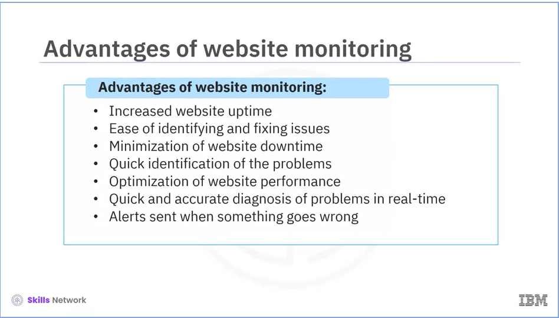{width="5.0in"
height="2.8429483814523184in"}

One of the main advantages of monitoring websites is increased website
uptime. Regular monitoring makes it easier to identify and fix issues
like server issues, network outages, and software bugs that could bring
down the website. Website monitoring helps minimize downtime by quickly
identifying the problems and taking appropriate action. Website
monitoring can also help optimize website performance by identifying and
addressing performance issues at the earliest. Quickly and accurately
diagnosing problems in real time helps websites run efficiently and
quickly. Downtime and slow-loading pages can result in lost sales and
revenue. Monitoring helps send alerts when your search, forms, or logins
go wrong. Website monitoring helps prevent these issues and keeps
revenue flowing.

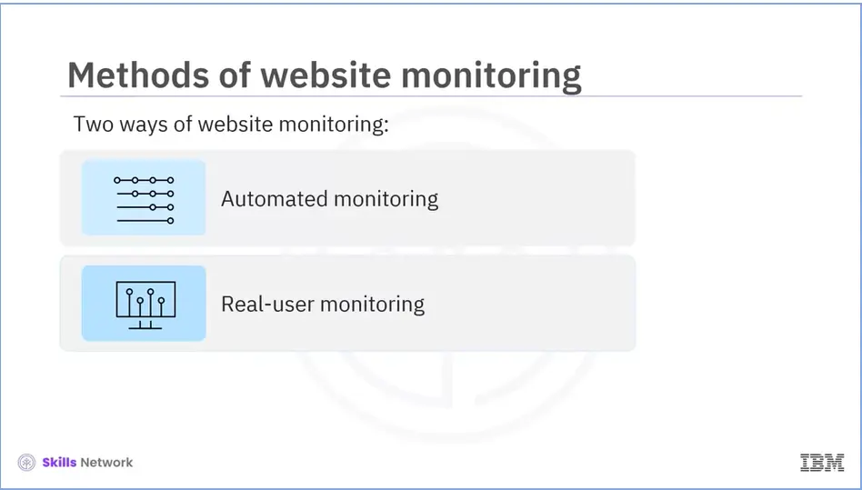{width="5.0in"
height="2.8429483814523184in"}

Website monitoring can be done in two ways: automated monitoring and
real user monitoring.

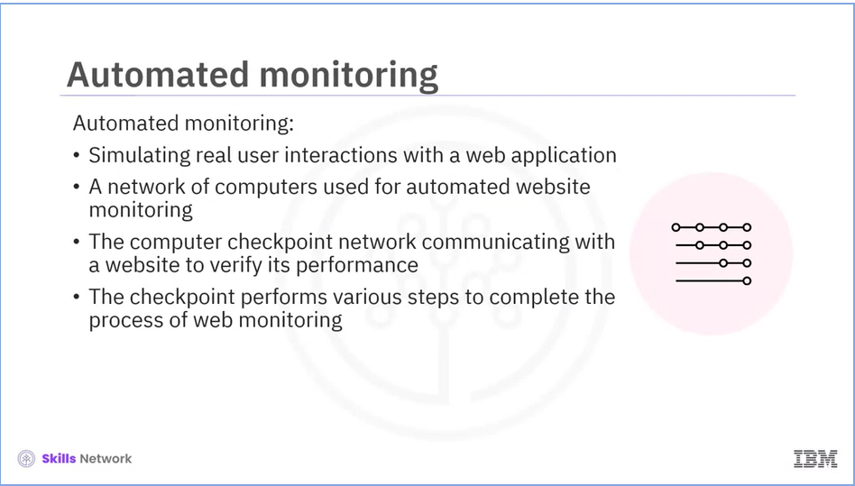{width="5.0in"
height="2.8429483814523184in"}

Let's discuss each of them in detail. Automated monitoring means
monitoring the performance and availability of a web application by
simulating real user interactions with it. A network of computers
situated close to the site\'s end users is used for automated website
monitoring. This checkpoint network communicates with a website or
service to confirm that it performs as intended. The checkpoint performs
various steps to complete the process of web monitoring.

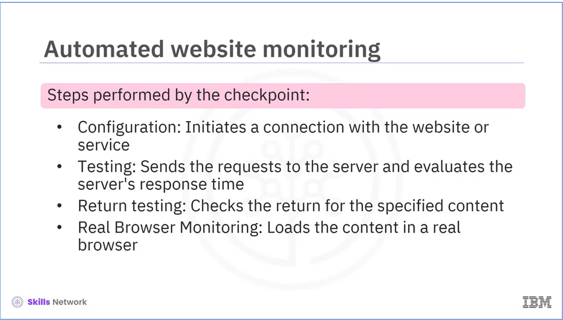{width="5.0in"
height="2.8429483814523184in"}

Let's discuss each step in detail. The first step that the checkpoint
performs is configuration. The checkpoint initiates a connection with
the website or service and checks the website at specific intervals. The
second step is testing. The checkpoint tests the website by sending
requests to the server and evaluating the server\'s response time. Other
website features are also examined by the program, including error
rates, page load times, and server resource utilization. Next, the
checkpoint checks the return for specified content. The fourth step is
Real Browser Monitoring (RBM). The checkpoint loads the content into a
real browser. RBM launches a browser and monitors a web application,
mimicking the user\'s interaction with the site.

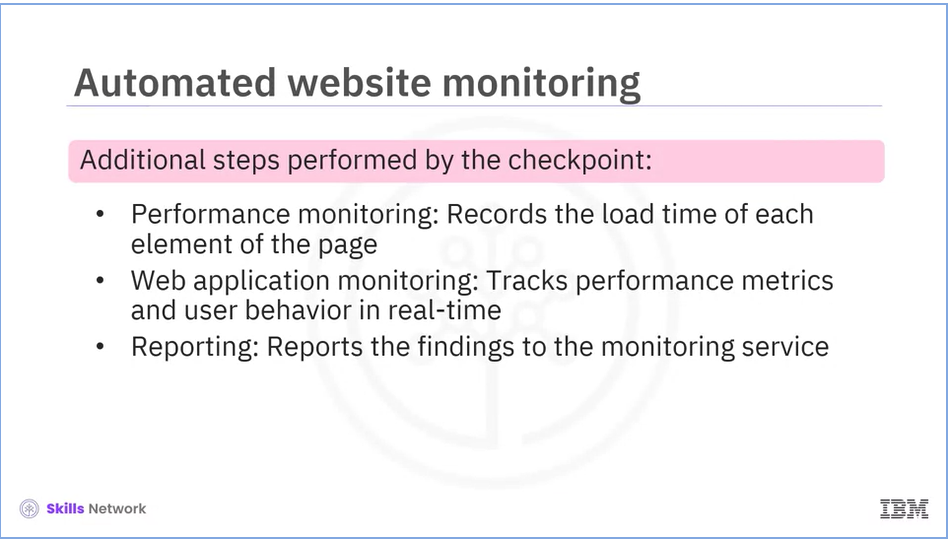{width="5.0in"
height="2.8429483814523184in"}

After real browser monitoring is completed, the checkpoint collects the
data on the website\'s performance and availability and stores it in a
database for analysis. The load time of each element of the page is
recorded when the browser loads the page. This is called performance
monitoring. After performance monitoring is completed, web application
monitoring is performed. It implies tracking various performance metrics
and user behaviors of a web application in real-time. The checkpoint
attempts to sign in, carry out a search, use a shopping cart, or even
finish a transaction while performing web application monitoring.
Finally, the checkpoint reports its findings to the monitoring service
and uses the information to resolve any issues and improve the
website\'s performance and availability.

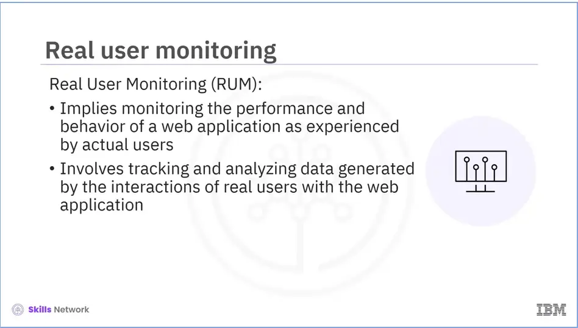{width="5.0in"
height="2.8429483814523184in"}

Let's now discuss the other way of website monitoring, which is Real
User Monitoring (RUM). It is a method of monitoring the performance and
behavior of a web application as experienced by actual users.

It involves tracking and analyzing data generated by the interactions of
real users with the web application, such as page load times, error
rates, and user actions. Script files, agents, cookies, and server-side
code track the website's performance as each site visitor accesses the
site.

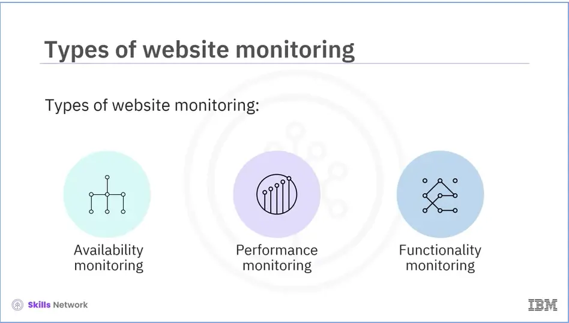{width="5.0in"
height="2.8429483814523184in"}

There are several types of website monitoring that indicate a \"larger
picture\" of the website's performance.

These include: Availability monitoring, Performance monitoring, and
Functionality monitoring.

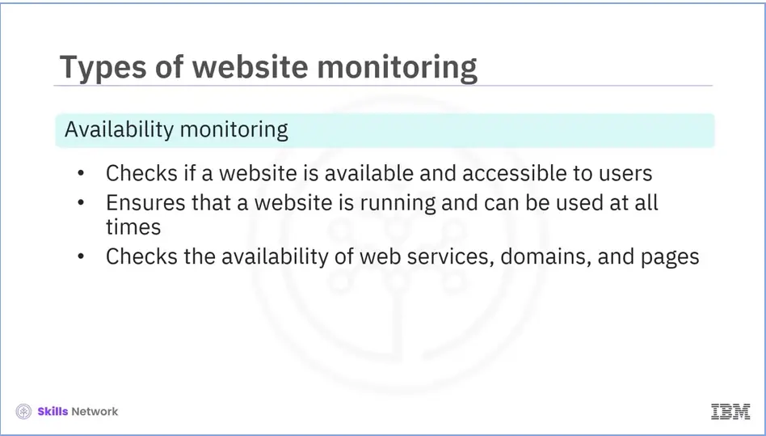{width="5.0in"
height="2.8429483814523184in"}

Let's explore each type in detail. Availability monitoring or uptime
monitoring checks if a website is available and accessible to users,
ensuring that the website is running and can always be used by users. It
checks the availability of web services, domains, and pages.

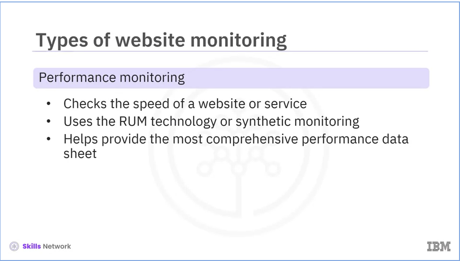{width="5.0in"
height="2.8429483814523184in"}

Performance monitoring checks the speed of a website or service. The
frontend and backend connection tracks the browser load time by
performance monitors. Performance monitors may use RUM technology or
synthetic monitoring. RUM and the Full-Page Check provide the most
comprehensive performance data set.

{width="5.0in"
height="2.8429483814523184in"}

The third type is functionality monitoring.

A web application monitor or transaction monitor tests the functionality
of a website.

Script files are used by these monitors to interact with forms, site
searches, shopping carts, and payment systems. The transaction monitors
interact with a web application in the same way as regular users, and an
alert is sent to the supporting staff in case of any error or downtime
faced.

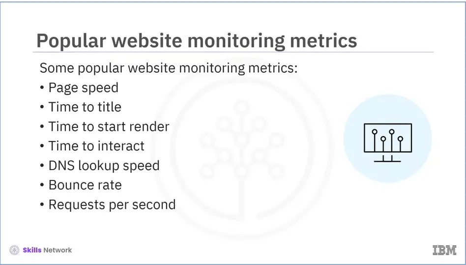{width="5.0in"
height="2.8429483814523184in"}

We will now explore some of the popular website monitoring metrics.
These include:

Page Speed, Time to Title, Time to Start Render, Time to Interact, DNS
Lookup Speed, Bounce Rate, and Requests Per Second.

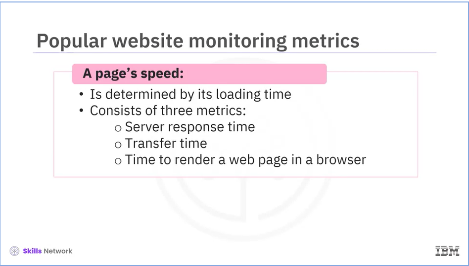{width="5.0in"
height="2.8429483814523184in"}

Let's discuss each of them. A page\'s speed is determined by its loading
time and consists of three different metrics: Server response time,
which is the time the server takes to respond and is also called time to
first byte (TTFB); Transfer time, which is the time taken to download an
HTML web page; and Time taken to render a web page in a browser.

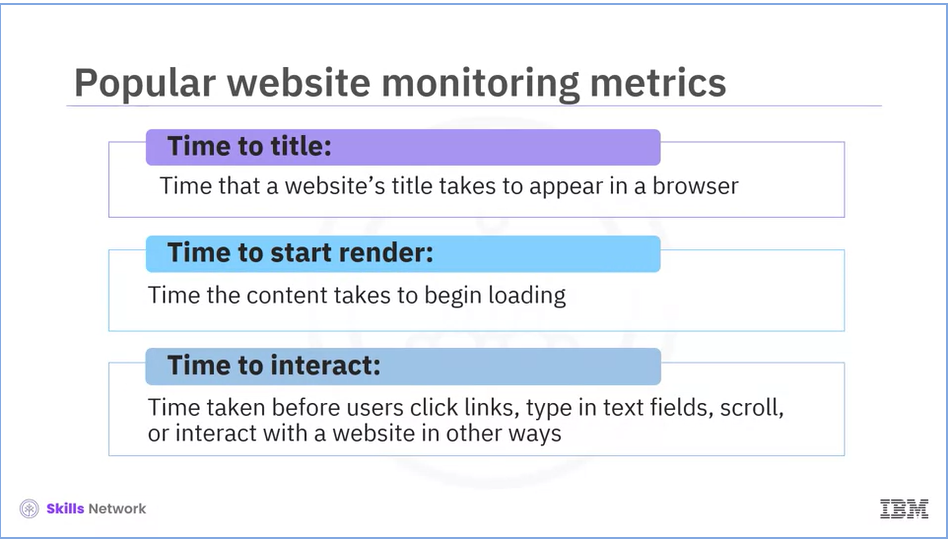{width="5.0in"
height="2.8429483814523184in"}

Time to title is the time that a website's title takes to appear in a
browser. Time to Start Render is the time the content takes to begin
loading, even if it doesn\'t fully load after an individual makes a
request. Time to Interact measures the time taken before users are able
to click links, type in text fields, scroll, or interact with a website
in other ways.

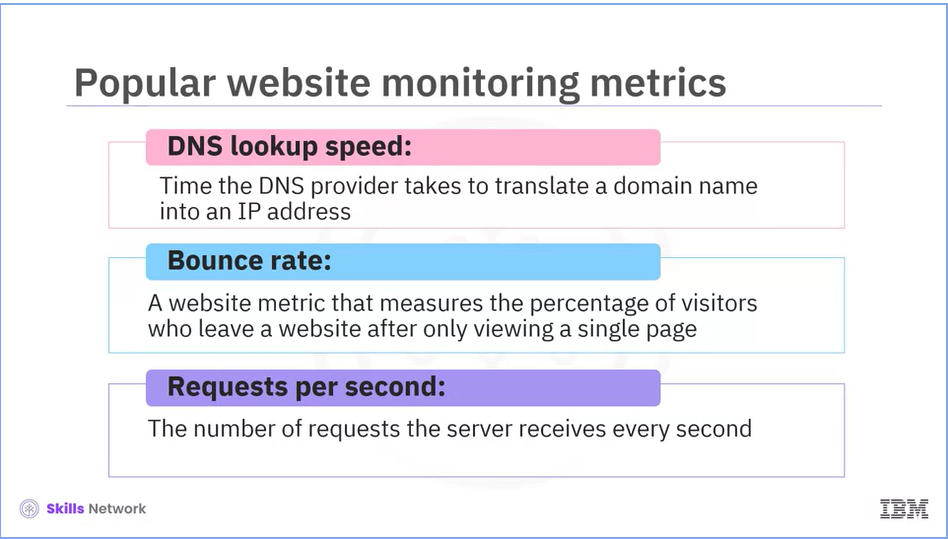{width="5.0in"
height="2.8429483814523184in"}

DNS Lookup Speed is the time the Domain Name System (DNS) provider takes
to translate a domain name into an IP address. A slow DNS provider
results in a slow DNS Lookup speed.

Bounce Rate is a website metric that measures the percentage of visitors
who leave a website after only viewing a single page. A high bounce rate
indicates that a large number of visitors are leaving the site quickly,
potentially due to a poor user experience or not finding what they were
looking for. Requests Per Second refers to the number of requests the
server receives every second. It is also referred to as "Throughput" or
"Average Load."

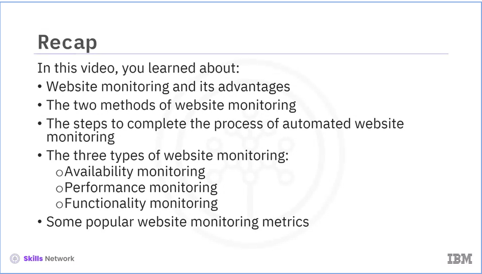{width="5.0in"
height="2.8429483814523184in"}

In this module (34), you learned about:

-   Website monitoring and its advantages,

-   The two methods of website monitoring,

-   The steps to complete the process of automated website monitoring,

-   The three types of website monitoring:

    -   availability monitoring,

    -   performance monitoring,

    -   functionality monitoring, and

-   Some popular website monitoring metrics.

# 35. Popular Monitoring Tools

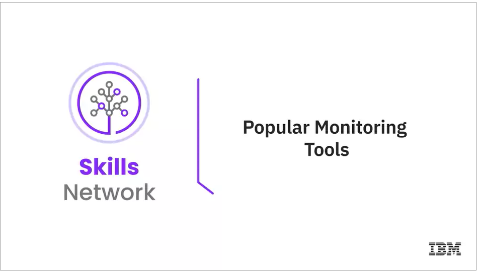{width="5.0in"
height="2.8429483814523184in"}

Welcome to Popular Monitoring Tools!

{width="5.0in"
height="2.8429483814523184in"}

After reading this module (35), you will be able to:

-   Describe how to select a website monitoring tool, and

-   Identify some of the most popular monitoring tools.

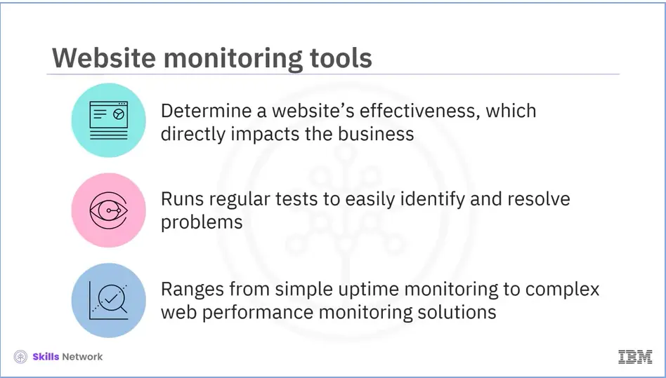{width="5.0in"
height="2.8429483814523184in"}

Your website\'s effectiveness directly impacts your business, so
choosing the best website monitoring service is essential. Monitoring
tools run regular tests and notify you when your site is down, making
identifying and resolving problems easier. There are numerous options
available, ranging from simple uptime or transaction monitoring
solutions to complex web performance monitoring solutions.

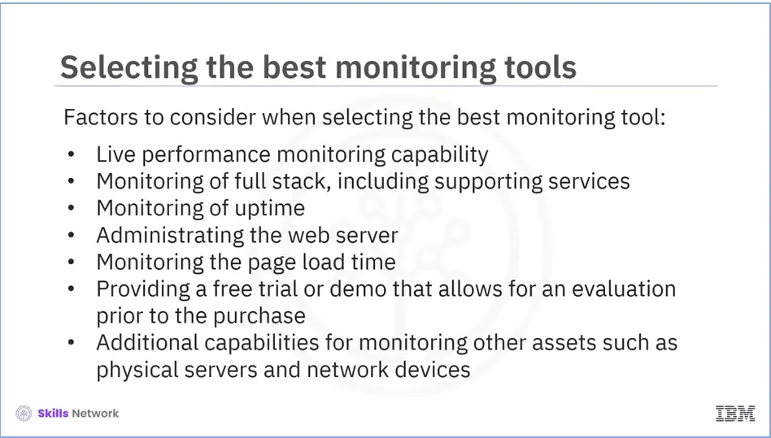{width="5.0in"
height="2.8429483814523184in"}

Certain factors need to be considered when selecting the best monitoring
tool. These include: Live performance monitoring capability, Monitoring
of full stack, including supporting services, Monitoring of uptime,
Administrating the web server, Monitoring the page load time, Providing
a free trial or demo that allows for an evaluation prior to the
purchase, and Additional capabilities for monitoring other assets, such
as physical servers and network devices.

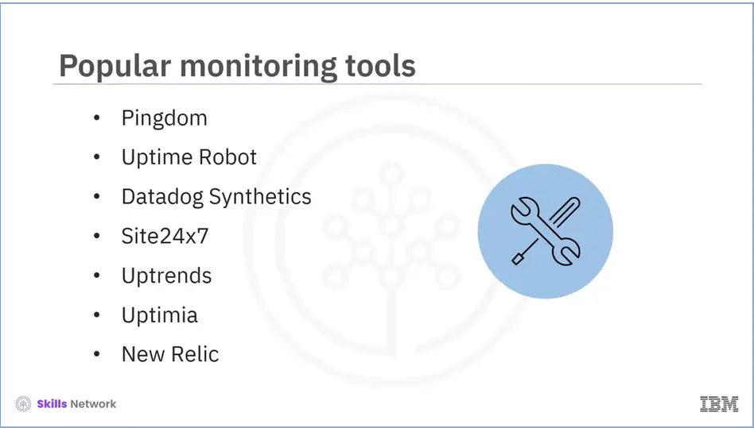{width="5.0in"
height="2.8429483814523184in"}

Let's now explore some of the most popular monitoring tools. They
include:

Pingdom, Uptime Robot, Datadog Synthetics, Site24x7, Uptrends, Uptimia,
and New Relic.

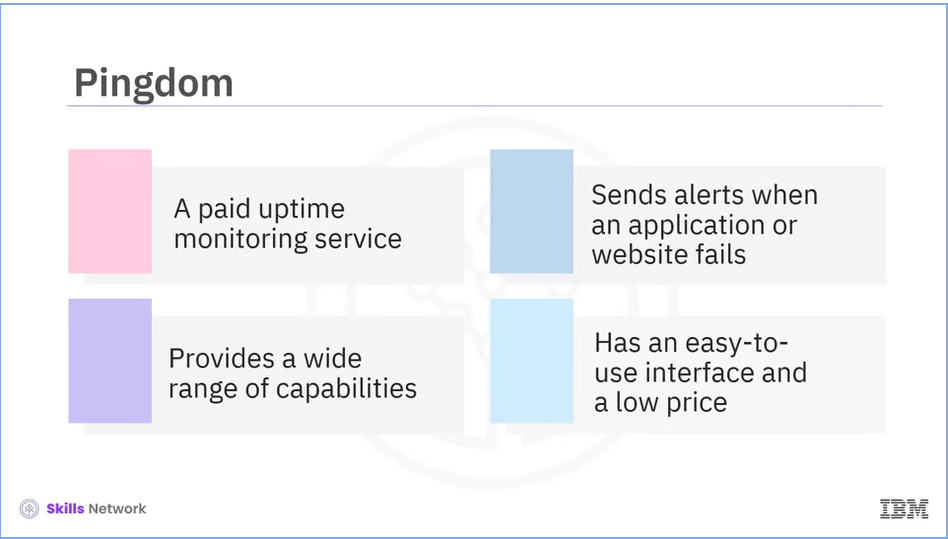{width="5.0in"
height="2.8429483814523184in"}

Let\'s discuss each in detail. Pingdom is a paid uptime monitoring
service that sends detailed alerts whenever an application or website
goes down. It provides a wide range of capabilities, including SSL
certificate monitoring and website performance monitoring, and has an
easy-to-use interface and a low price.

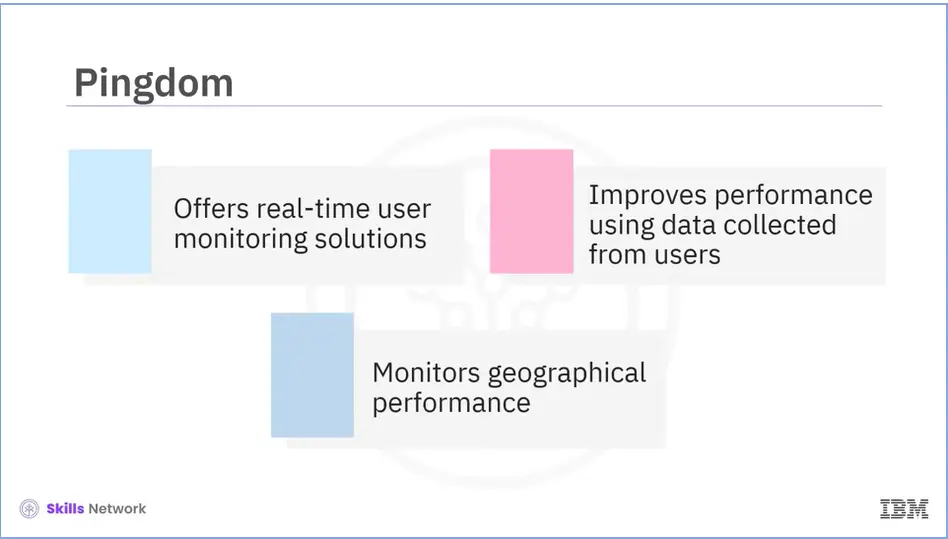{width="5.0in"
height="2.8429483814523184in"}

Pingdom offers real-time user monitoring solutions that track real-time
visits to your website and allows you to improve your performance using
data collected from actual people. Geographical performance is also
monitored to ensure that your website performs optimally regardless of
where users access it.

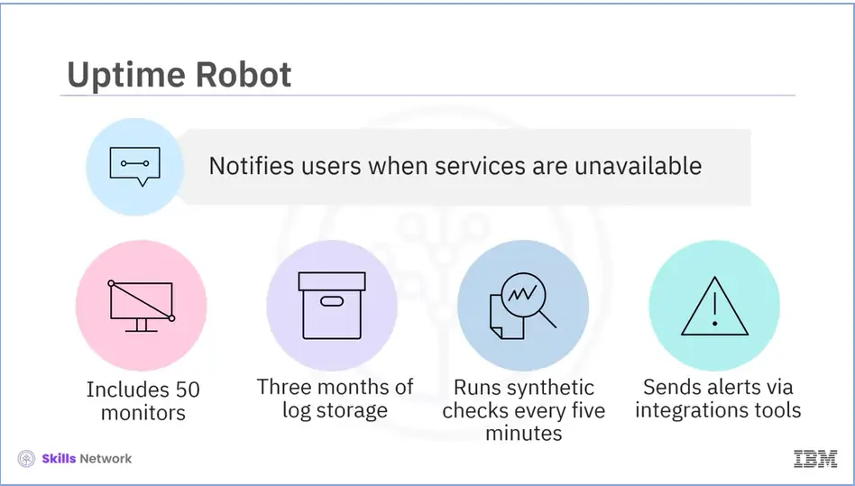{width="5.0in"
height="2.8429483814523184in"}

Uptime Robot is the best option if you are looking for a simple tool
that will notify you when your services are down. The free account
includes 50 monitors, which is sufficient for most small websites or web
apps, and 3 months of log storage. It can run synthetic checks on your
website and APIs every 5 minutes from 12 locations worldwide and sends
alerts via various integrations with tools such as Slack, Pagerduty,
OpsGenie, Telegram, and VictorOps.

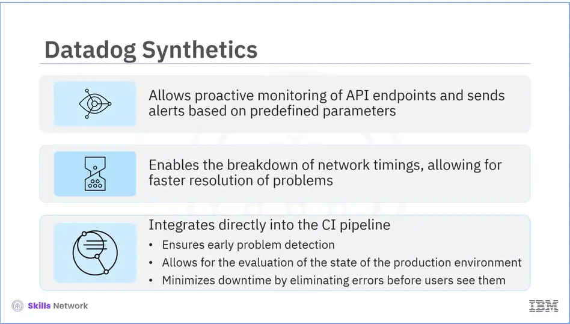{width="5.0in"
height="2.8429483814523184in"}

Datadog Synthetics tests allow you to proactively monitor your API
endpoints and send alerts based on predefined parameters. You\'ll be
able to break down network timings, allowing you to find the underlying
cause of your problems faster. These tests can be integrated directly
into your CI pipeline to ensure early problem detection, allowing you to
evaluate the state of your production environment after each deployment
and minimize downtime by eliminating errors before your users see them.

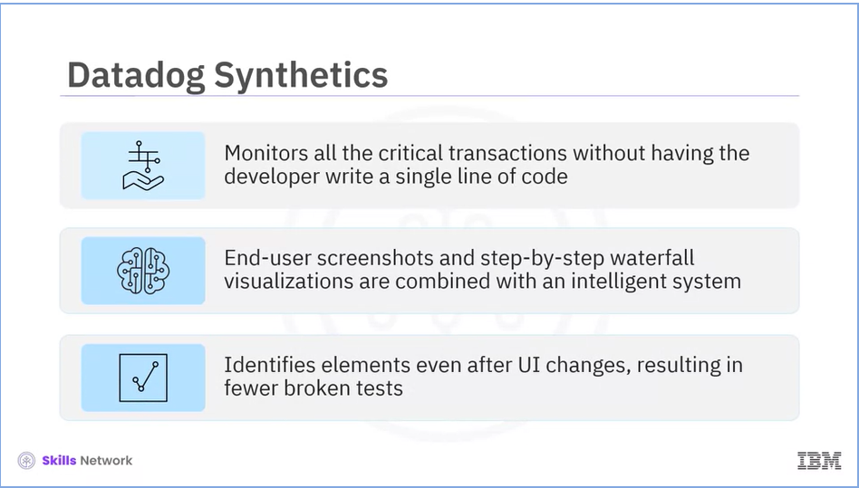{width="5.0in"
height="2.8429483814523184in"}

With Datadog Synthetics, you can monitor all of your critical
transactions without writing a single line of code using the web
recorder.

End-user screenshots and step-by-step waterfall visualizations are
combined with an intelligent system that identifies elements even after
UI changes, resulting in fewer broken tests.

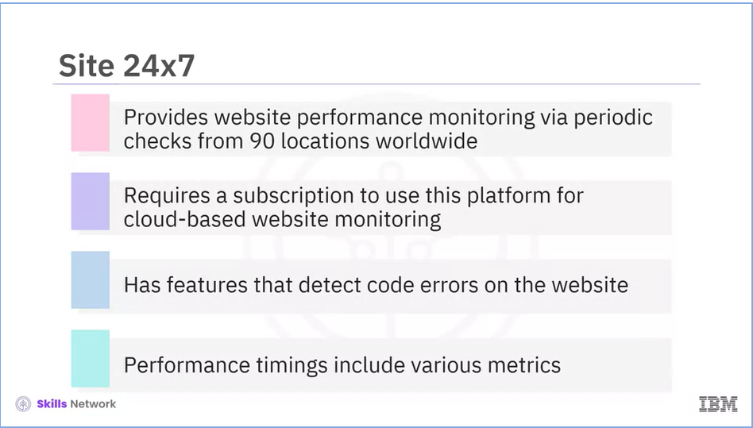{width="5.0in"
height="2.8429483814523184in"}

Site 24x7 provides website performance monitoring via periodic checks
from 90 locations worldwide. A subscription is required to use this
platform for cloud-based website monitoring. A Domain Expiry Monitor, an
SSL/TLS Certificate Monitor, and a Website Defacement Monitor detect
errors in your website\'s code. DNS fetches, connection establishment
times, first-byte time, download time, and SSL handshake time are all
included in performance timings.

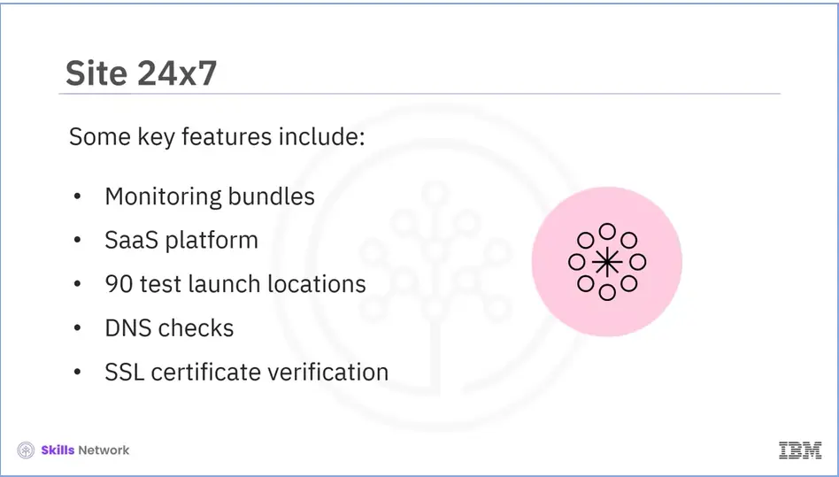{width="5.0in"
height="2.8429483814523184in"}

Some of the features include: Monitoring bundles, SaaS platform, 90 test
launch locations, DNS checks, and SSL certificate verification.

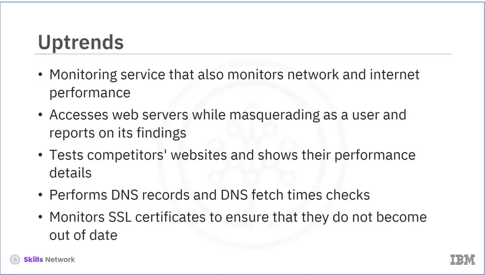{width="5.0in"
height="2.8429483814523184in"}

Uptrends is a website monitoring service that also monitors network and
internet performance. As a remote server, it can access your web
servers while masquerading as a user and report on its findings. It can
even test your competitors\' websites and tell you how theirs performs
compared to yours. DNS records and DNS fetch times are some other checks
performed by Uptime. It also monitors SSL certificates to ensure that
they do not become outdated.

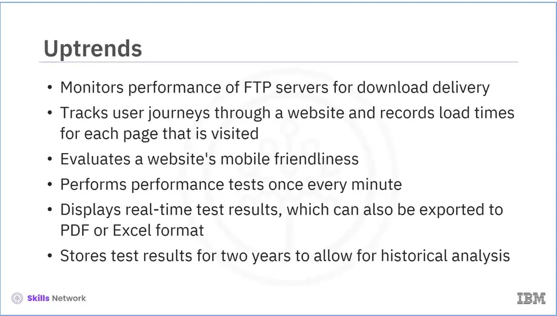{width="5.0in"
height="2.8429483814523184in"}

It also monitors the performance of FTP servers for download delivery.
The monitor also tracks user journeys through a site and records load
times for each page visited. It will also evaluate your site\'s mobile
friendliness.

Performance tests are performed once every minute. The monitor\'s
console displays real-time test results, which can also be exported to a
PDF or Excel format. Uptrends stores test results for two years to allow
for historical analysis.

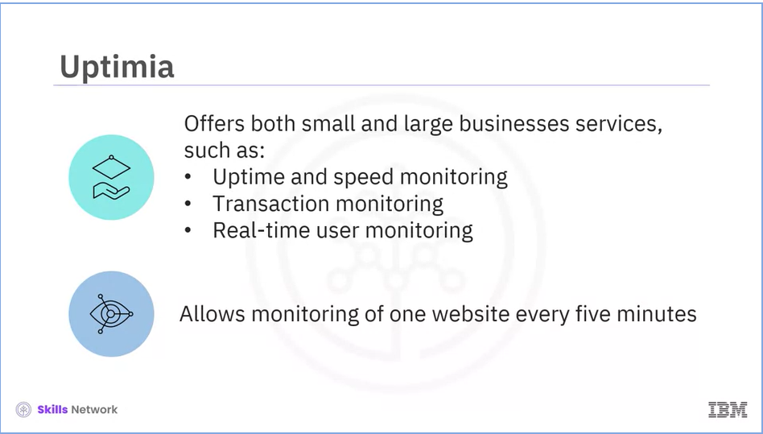{width="5.0in"
height="2.8429483814523184in"}

Uptimia provides monitoring services for both small and large
businesses, including uptime and speed monitoring, transaction
monitoring, and real-time user monitoring. The company provides a
free-forever plan that allows you to monitor one website in five-minute
increments. The free plan only includes uptime monitoring.

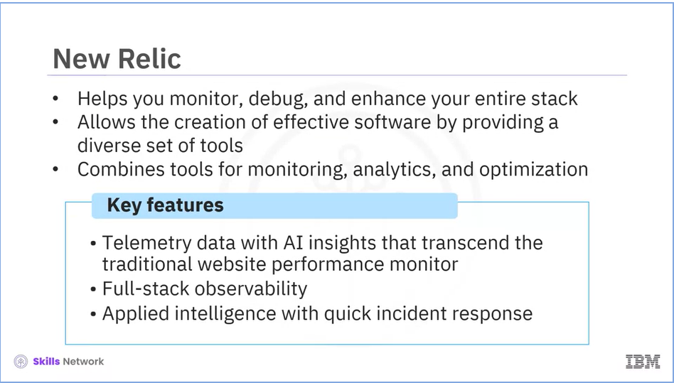{width="5.0in"
height="2.8429483814523184in"}

New Relic is an observability platform that helps you in monitoring,
debugging, and enhancing your stack. It enables developers to create
more effective software by providing a diverse set of tools. It combines
tools for monitoring, analytics, and optimization. Key features include:

-   Telemetry data with AI insights that transcend the traditional
    website performance monitor,

-   Full-stack observability, and

-   Applied intelligence with quick incident response.

{width="5.0in"
height="2.8429483814523184in"}

In this module (35), you learned that:

-   Monitoring tools run regular tests and send notifications when a
    website is down, making identifying and resolving problems easier,

-   Some monitoring tools provide these features:

-   Monitoring service that sends detailed alerts whenever an
    application or website goes down,

-   Running synthetic checks on websites and APIs every few minutes from
    various locations worldwide,

-   Allows the monitoring of API endpoints proactively and sends alerts
    based on predefined parameters, and

-   Allows developers to create effective software by providing a
    diverse set of tools.

## Hands on Lab: Troubleshooting Common Errors with Chrome Dev Tools

## Welcome to the **Troubleshooting Common Errors with Chrome Dev Tools** lab!

In this lab, you will learn how to use Chrome DevTools by working
directly in the Elements, Console, and Sources panels.

**PRE-REQUISITE**: This labs requires the Chrome Web Browser.

Skills Network Labs (SN Labs) is a virtual lab environment used in this
course. Upon clicking \"Open Tool\" in accordance with IBM Skills
Network Privacy policy your Username and Email will be passed to Skills
Network Labs and will only be used for communicating important
information to enhance your learning experience.

In case you need to download the lab instructions click
[HERE](https://cf-courses-data.s3.us.cloud-object-storage.appdomain.cloud/IBMSkillsNetwork-WD0231EN-SkillsNetwork/labs/Chrome_DevTools.md.html)
to open in a new tab.

This course uses a third-party app, Hands on Lab: Troubleshooting Common
Errors with Chrome Dev Tools, to enhance your learning experience. The
app will reference basic information like your name, email, and Coursera
ID.

## Practice Quiz: Debugging and Monitoring Websites

# Week 5 Summary: Debugging and Troubleshooting

In week 5, you learned that:

-   Debugging is an integral part of the software development process
    that involves identifying the cause based on the symptoms.

-   Debugging begins when the software code is written and has numerous
    advantages.

-   Browsers include various web development tools known as add-ons or
    extensions.

-   A debugging tool is software that allows you to debug a program.

-   Chrome DevTools enables developers to edit code directly in the
    browser, add breakpoints to detect problems, and quickly debug their
    code.

-   It also allows you to switch between different mobile screen types
    and versions and change the size of a webpage\'s screen.

-   Website monitoring assesses a web service\'s functionality,
    performance, and availability.

-   Monitoring tools perform regular tests and send alerts when a
    website is unavailable, making identifying and resolving issues
    easier.

-   By providing various tools, monitoring tools enable developers to
    create compelling software.

## Graded Quiz: Debugging and Troubleshooting

# [Week 6:]{.mark}

# 36. Interest Rate Calculator

Welcome to the hands- on lab for **Interest Rate Calculator**.

Skills Network Labs (SN Labs) is a virtual lab environment used in this
course.  Upon clicking \"Open Tool\" in accordance with IBM Skills
Network Privacy policy, your Username and Email will be passed to Skills
Network Labs and will only be used for communicating important
information to enhance your learning experience.

In case you are having issues with the Lab environment, you can view the
lab by clicking this
[link](https://cf-courses-data.s3.us.cloud-object-storage.appdomain.cloud/IBMSkillsNetwork-WD0231EN-SkillsNetwork/labs/FinalProject/02-Instructions.md.html).

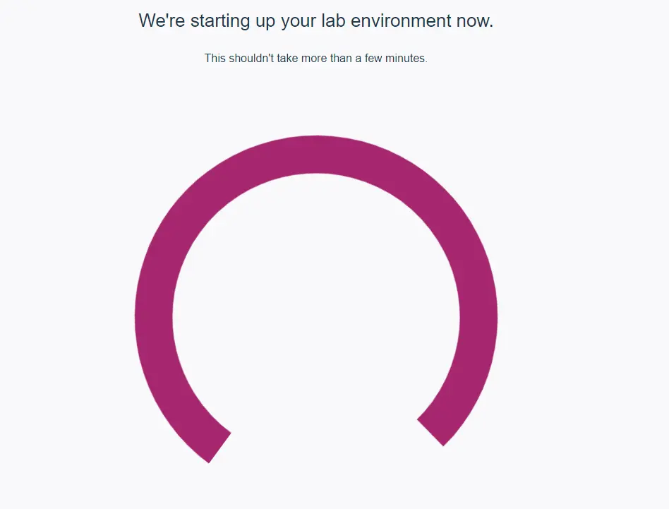{width="3.0in"
height="2.2817311898512687in"}

This course uses a third-party app, Final Project: Interest Rate
Calculator, to enhance your learning experience. The app will reference
basic information like your name, email, and Coursera ID.

# Peer-graded Assignment: Final Submission and Evaluation

There are 10 points for nine tasks in this final project. Your peers who
will grade your final assignment are also completing this assignment
within the same session. You need to complete the following and submit
your responses for peer review.

This guided final project is divided into three parts: (1) Fix the
existing errors, where you first start with the code provided and fix
the deliberate errors in HTML and JavaScript. (2) To save yourself from
testing every code change manually, you will then make your business
logic in JavaScript testable with the help of Jasmine. Write test specs,
fix your logic, and do unit tests every time you make a change. (3)
Finally, in the last part, you will improve on Search Engine
Optimization and enhance your deployment package with the help of
Webpack.

You will need to submit screenshots when requested.

*To take a screenshot in Windows, use the snipping tool by going to the
start menu and opening the snipping tool. Click "New," then click and
drag over the area of the screen you want to screenshot. Save the file
as a .png or a .jpg file.*

*Click shift+command+4, then click and drag over the area of the screen
you want to screenshot on MacOS. The file will be saved to your
desktop.*

*To upload the file, click upload file, navigate to the file, or drag
and drop the file icon onto the window.*

## Review criteria

1.  Show favicon working, upload a screenshot of your browser tab and
    save it as 01-favicon-visible as a .png file or a .jpg file (see
    instructions above on how to take a screenshot.) (1 pt)

2.  Show missing CSS referenced correctly, once added to the html,
    upload a screenshot of the output showing CSS working; by means of
    correct colors and layout and save it as 02-css-working. (1 pt)

3.  Show how missing JavaScript reference error displayed in Chrome
    DevTools and upload a screenshot of the same and save it as
    03-calculate-missing. (1 pt)

4.  Show how to use Chrome DevTools' debugging capability, show how you
    "pause on exceptions" and save it as 04-pause-on-exception. (1 pt)

5.  Show "Watch" on a variable in your code, upload a screenshot showing
    \`p\` added in Watch and save it as 05-watch-on-p. (1 pt)

6.  Show Jasmine is initialized and will work, show in terminal "no spec
    found," upload a screenshot of it and save it as 06-no-spec. (1 pt)

7.  Introduce two unit tests as instructed, show both of them pass in
    Jasmine; upload a screenshot of Jasmine output and save it as
    07-both-tests-passed. (1 pt)

8.  Show Webpack is generating the expected output in your "dist"
    directory, upload a screenshot of it from Cloud IDE and save it as
    08-dist-directory. (1 pt)

9.  Show achieving the goal state, upload a screenshot of your final
    solution along with source, and save it as 09-final-output. (2 pts)

<!-- July 14, 2023 3:09pm -->
